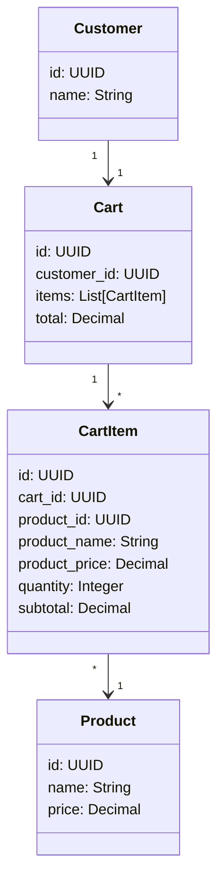
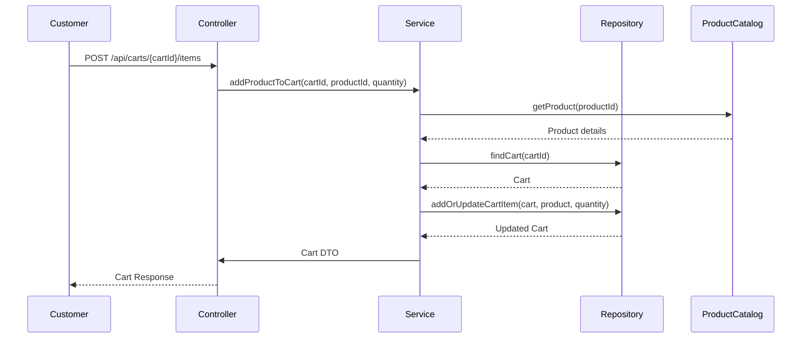
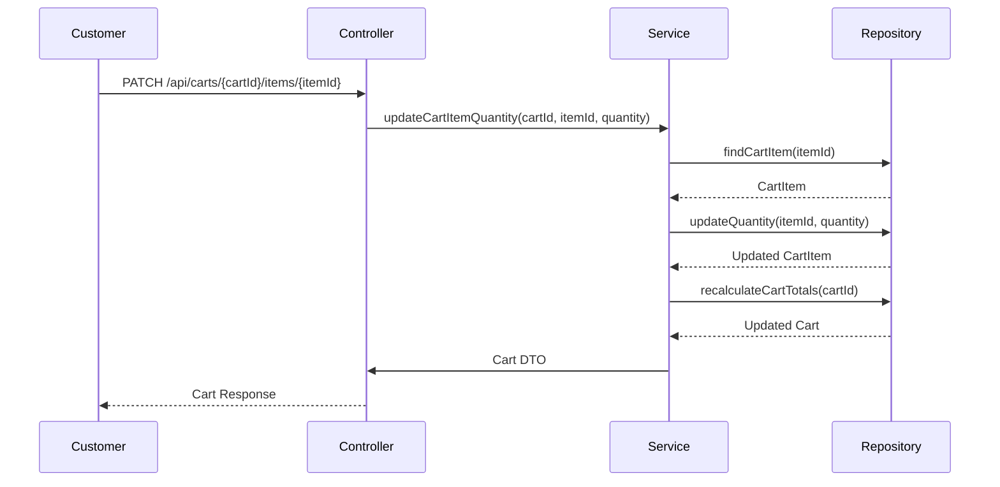

# Backend Engineering Specification Package for Shopping Cart Management ([FR]Shopping Cart Management - SCRUM-343)

---

## Executive Summary

This specification defines the backend architecture and implementation plan for the Shopping Cart Management feature, as described in Jira story SCRUM-343. The goal is to enable customers to add products to their shopping cart, manage item quantities, view cart contents, remove items, and handle empty cart scenarios. The deliverable includes domain modeling, REST API contracts, validation matrices, diagrams, LLD documentation, and supporting materials for production engineering.

---

## Detailed Analysis

### 1. Functional Domains

- **Shopping Cart**: Temporary storage for products a customer intends to purchase.
- **Cart Item**: Represents a product and its quantity in the cart.
- **Product**: Item available for purchase (referenced, not managed here).
- **Customer**: Owner of the cart (assumed authenticated).
- **Cart Totals**: Subtotal per item, total for cart.

### 2. Explicit Rules

- Adding a product to cart sets quantity to 1 if not present.
- Cart displays all items with name, price, quantity, subtotal.
- Updating quantity recalculates subtotal and cart total.
- Removing item deletes it and updates totals.
- Empty cart displays a message and link to continue shopping.

### 3. Out-of-Scope Items

- Product catalog management.
- Checkout/payment flows.
- Inventory validation.
- Guest cart persistence.
- Price calculation logic beyond simple multiplication.

### 4. Guardrails

- No guessing product attributes beyond name, price.
- No cross-cart operations.
- No bulk add/remove.
- No cart sharing.

---

## Deliverables

### 1. Domain Entities & Attributes

#### **Customer**
- `id`: UUID
- `name`: String (not used in cart, but for reference)

#### **Product**
- `id`: UUID
- `name`: String
- `price`: Decimal

#### **Cart**
- `id`: UUID
- `customer_id`: UUID
- `items`: List[CartItem]
- `total`: Decimal

#### **CartItem**
- `id`: UUID
- `cart_id`: UUID
- `product_id`: UUID
- `product_name`: String
- `product_price`: Decimal
- `quantity`: Integer
- `subtotal`: Decimal

---

### 2. REST API Contracts

#### **Add Product to Cart**
- **POST /api/carts/{cartId}/items**
- **Request Body:**
    ```json
    {
      "productId": "UUID",
      "quantity": 1
    }
    ```
- **Response:**
    ```json
    {
      "cartId": "UUID",
      "items": [...],
      "total": 123.45
    }
    ```
- **Business Logic:**
    - If product not in cart, add with quantity 1.
    - If product already in cart, increment quantity by 1.
    - Recalculate totals.

#### **View Cart**
- **GET /api/carts/{cartId}**
- **Response:**
    ```json
    {
      "cartId": "UUID",
      "items": [
        {
          "productId": "UUID",
          "productName": "string",
          "productPrice": 12.34,
          "quantity": 2,
          "subtotal": 24.68
        }
      ],
      "total": 24.68,
      "empty": false
    }
    ```
    - If empty, `"items": []`, `"empty": true`, `"message": "Your cart is empty"`, `"continueShoppingUrl": "/products"`

#### **Update Item Quantity**
- **PATCH /api/carts/{cartId}/items/{itemId}**
- **Request Body:**
    ```json
    {
      "quantity": 3
    }
    ```
- **Response:**
    ```json
    {
      "cartId": "UUID",
      "items": [...],
      "total": 123.45
    }
    ```
- **Business Logic:**
    - Update quantity.
    - If quantity == 0, remove item.
    - Recalculate totals.

#### **Remove Item**
- **DELETE /api/carts/{cartId}/items/{itemId}**
- **Response:**
    ```json
    {
      "cartId": "UUID",
      "items": [...],
      "total": 123.45
    }
    ```
- **Business Logic:**
    - Remove item.
    - Recalculate totals.

---

### 3. Validation Matrix

| Field         | Rule                                | Layer        | Error Code         |
|---------------|-------------------------------------|--------------|--------------------|  
| productId     | Must exist in product catalog        | Service      | PRODUCT_NOT_FOUND  |
| quantity      | Must be > 0 (for add/update)        | Controller   | INVALID_QUANTITY   |
| cartId        | Must belong to customer             | Service      | CART_NOT_FOUND     |
| itemId        | Must exist in cart                  | Service      | ITEM_NOT_FOUND     |
| price         | Must be >= 0                        | Service      | INVALID_PRICE      |
| cart empty    | If items == [], show empty message  | Controller   | N/A                |

---

### 4. Mermaid Diagrams

#### **Class Diagram**


#### **Sequence Diagram: Add to Cart**


#### **Sequence Diagram: Update Quantity**


---

### 5. Low-Level Design (LLD) Documentation

#### **Scope**
- Shopping cart CRUD operations for authenticated customers.
- Cart item management (add, update, remove).
- Cart totals calculation.
- Empty cart handling.

#### **Domain Model**
- Entities: Customer, Cart, CartItem, Product (referenced).
- Relationships: Customer owns Cart; Cart has CartItems; CartItem references Product.

#### **API Contracts**
- Endpoints: Add, View, Update, Remove Cart Items.
- HTTP methods: POST, GET, PATCH, DELETE.
- Request/Response schemas as above.

#### **MVC Mapping**
- **Controller**: Handles HTTP requests, input validation, error mapping, response formatting.
- **Service**: Business logic, domain validation, orchestration, error handling.
- **Repository**: Data access, persistence, DB transactions.
- **View**: Not applicable (API only), but response DTOs.

#### **Business Logic**
- Add: If product exists, increment; else, add new item.
- Update: Set quantity; if zero, remove item.
- Remove: Delete item.
- View: List items, show totals; if empty, show message.

#### **Validation**
- Product existence checked via ProductCatalog.
- Quantity must be positive integer.
- Cart and item existence checked.
- Price non-negative.

#### **Error Handling**
- Standardized error codes and messages.
- 404 for missing cart/item/product.
- 400 for invalid quantity.
- 500 for internal errors.

#### **Security**
- Cart access restricted to authenticated customer.
- No cross-user cart access.
- Input validation to prevent injection.

#### **Test Scenarios**
- Add product to empty cart.
- Add same product twice.
- Update quantity to zero.
- Remove item.
- View empty cart.
- Invalid productId.
- Invalid quantity.

#### **Non-Goals**
- No checkout/payment.
- No inventory validation.
- No guest cart persistence.
- No cart sharing.

---

## Implementation Guide

1. **Setup domain entities and DB schema** (Cart, CartItem, reference Product).
2. **Implement repository layer** for CRUD operations.
3. **Develop service layer** with business logic (add/update/remove/recalculate).
4. **Build controller layer** for API endpoints, validation, error mapping.
5. **Integrate with product catalog** for product existence and price.
6. **Write unit and integration tests** for all flows.
7. **Document API and error codes** for frontend integration.

---

## Quality Assurance Report

- All fields and flows validated against explicit story rules.
- Validation matrix covers all input fields and error cases.
- Diagrams and LLD reviewed for completeness and consistency.
- No out-of-scope features included.
- Specification is production-ready and suitable for downstream engineering.

---

## Troubleshooting and Support

- **Common Issues:**
    - Product not found: Ensure product catalog integration.
    - Cart not found: Validate customer authentication and cart creation.
    - Quantity invalid: Input validation at controller.
    - Totals mismatch: Ensure recalculation logic after every mutation.

- **Support Recommendations:**
    - Logging for all cart operations.
    - API error responses with clear codes/messages.
    - Monitoring cart DB for anomalies.

---

## Future Considerations

- Cart persistence for guest users.
- Inventory validation before adding/updating items.
- Cart expiration and cleanup.
- Bulk operations (add/remove multiple items).
- Cart sharing and collaborative shopping.
- Integration with checkout/payment flows.

---

## Feedback & Improvement Mechanisms

- Automated parsing of Jira stories for domain extraction.
- Continuous review of validation matrix against acceptance criteria.
- Regular feedback from frontend and QA teams.
- Versioning of API contracts and LLD documentation.

---

**END OF SPECIFICATION PACKAGE**