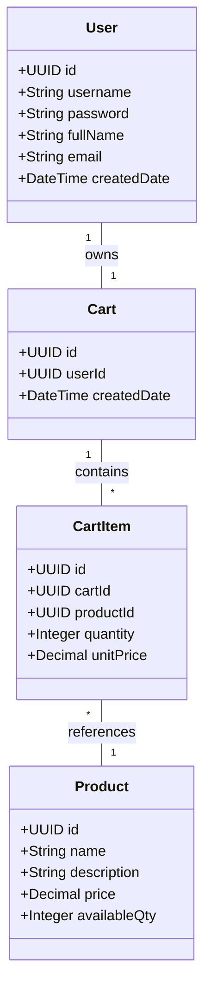
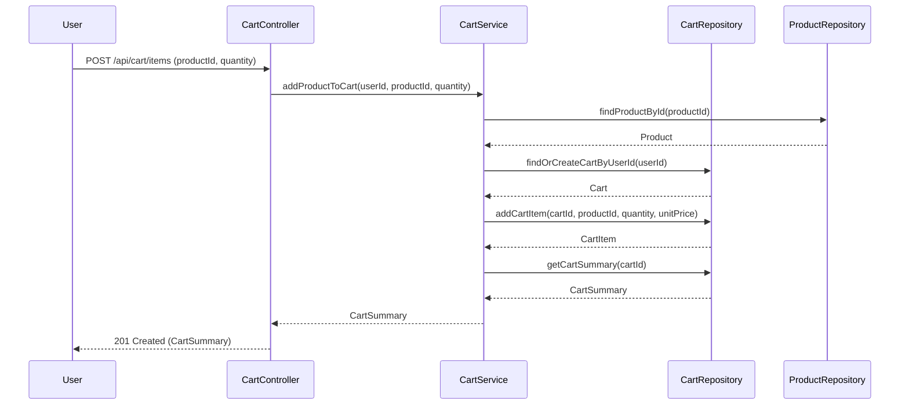
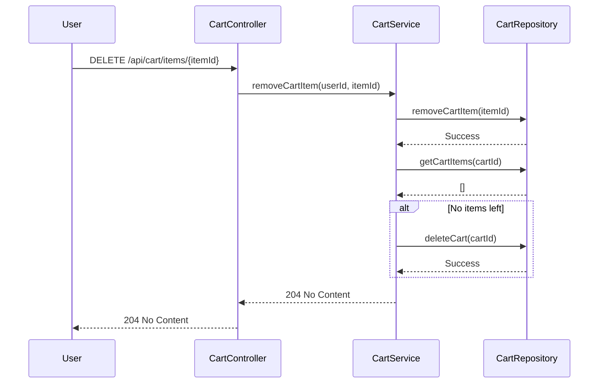

# Backend Engineering Specification Package: Shopping Cart System (SCRUM-96)

---

## Executive Summary

This specification details the backend engineering requirements and design for the Shopping Cart System as described in Jira Story SCRUM-96. The system is to be implemented using Java Spring Boot (MVC architecture), exposing RESTful APIs, and persisting data in a relational database. It covers user management, product search, and shopping cart operations, with strict enforcement of business rules and data integrity at both service and database levels. Out-of-scope features (checkout, payments, inventory locking, admin, password changes) are explicitly excluded.

---

## Detailed Analysis

### Functional Domains

1. **User Management**
   - Sign-Up, Sign-In, Profile View/Update
   - Stateless login; no DB session data
   - Username uniqueness; immutable after creation

2. **Product Catalog**
   - Case-insensitive keyword search
   - Product must exist to be searchable

3. **Shopping Cart Management**
   - Lazy cart creation (on first add)
   - Add/update/remove products; quantity > 0
   - Auto-delete empty cart (last item removed)
   - Cart cleanup on logout
   - One active cart per user; cart belongs to one user

### Explicit Rules & Constraints

- **User:** Unique username, must exist before cart ops, username immutable
- **Cart:** One active per user, cannot exist without items, belongs to one user
- **Cart Item:** Belongs to one cart, product must exist, quantity > 0
- **Product:** Must exist, price immutable, searchable only if exists
- **System:** No cart for seed users, stateless login, APIs reflect DB outcomes

### Out-of-Scope

- Checkout, payments, inventory reservation, admin management, password reset/change, user roles/permissions, cart persistence across sessions

---

## Deliverables

### 1. Domain Entities

#### User
| Field         | Type      | Constraints                |
|---------------|-----------|----------------------------|
| id            | UUID      | PK                         |
| username      | String    | Unique, immutable          |
| password      | String    | Hashed                     |
| fullName      | String    |                            |
| email         | String    |                            |
| createdDate   | DateTime  |                            |

#### Product
| Field         | Type      | Constraints                |
|---------------|-----------|----------------------------|
| id            | UUID      | PK                         |
| name          | String    |                            |
| description   | String    |                            |
| price         | Decimal   | Immutable via API          |
| availableQty  | Integer   | >= 0                       |

#### Cart
| Field         | Type      | Constraints                |
|---------------|-----------|----------------------------|
| id            | UUID      | PK                         |
| userId        | UUID      | FK → User, unique per user |
| createdDate   | DateTime  |                            |

#### CartItem
| Field         | Type      | Constraints                |
|---------------|-----------|----------------------------|
| id            | UUID      | PK                         |
| cartId        | UUID      | FK → Cart                  |
| productId     | UUID      | FK → Product               |
| quantity      | Integer   | > 0                        |
| unitPrice     | Decimal   | Immutable                  |

---

### 2. API Contracts

#### User APIs

- **POST /api/users/signup**
  - Request: `{ "username": "...", "password": "...", "fullName": "...", "email": "..." }`
  - Response: `201 Created` with user details
  - Errors: `409 UsernameExists`, `400 ValidationError`

- **POST /api/users/login**
  - Request: `{ "username": "...", "password": "..." }`
  - Response: `200 OK` with user details
  - Errors: `401 InvalidCredentials`, `404 UserNotFound`

- **GET /api/users/me**
  - Auth required
  - Response: `200 OK` with `{ "username", "fullName", "email", "createdDate" }`
  - Errors: `401 Unauthorized`

- **PUT /api/users/me**
  - Request: `{ "fullName": "...", "email": "..." }`
  - Response: `200 OK` with updated details
  - Errors: `400 ValidationError`, `401 Unauthorized`

#### Product APIs

- **GET /api/products/search?keyword=...**
  - Response: `200 OK` with `[ { "id", "name", "description", "price", "availableQty" } ]`
  - Errors: `400 ValidationError`

#### Cart APIs

- **POST /api/cart/items**
  - Request: `{ "productId": "...", "quantity": ... }`
  - Response: `201 Created` with cart summary
  - Errors: `400 ValidationError`, `404 ProductNotFound`, `401 Unauthorized`

- **PUT /api/cart/items/{itemId}**
  - Request: `{ "quantity": ... }`
  - Response: `200 OK` with cart summary
  - Errors: `400 ValidationError`, `404 CartItemNotFound`, `401 Unauthorized`

- **DELETE /api/cart/items/{itemId}**
  - Response: `200 OK` with cart summary or `204 No Content` if cart deleted
  - Errors: `404 CartItemNotFound`, `401 Unauthorized`

- **GET /api/cart**
  - Response: `200 OK` with cart items, per-item totals, grand total
  - Errors: `404 CartNotFound`, `401 Unauthorized`

- **POST /api/logout**
  - Response: `200 OK`
  - Effect: Deletes cart and items for user

---

### 3. Validation Matrix

| Field            | Rule/Constraint                  | Layer(s)         | Error Code           |
|------------------|----------------------------------|------------------|----------------------|
| username         | Unique, immutable                | DB, Service      | 409, 400             |
| password         | Required, hash on store          | Service          | 400                  |
| fullName         | Required                         | Service          | 400                  |
| email            | Required, valid format           | Service          | 400                  |
| productId        | Must exist                       | Service, DB      | 404                  |
| quantity         | > 0                              | Service, DB      | 400                  |
| cartId           | Must exist, one per user         | Service, DB      | 404, 409             |
| cartItemId       | Must exist                       | Service, DB      | 404                  |
| availableQty     | >= 0                             | DB               | 400                  |
| unitPrice        | Immutable                        | Service, DB      | 400                  |

---

### 4. Mermaid Diagrams

#### Class Diagram

#### Sequence Diagram: Add Product to Cart

#### Sequence Diagram: Remove Last Item (Auto-Delete Cart)

---

### 5. LLD (Low-Level Design) Section

#### Scope

- User registration, authentication, profile management
- Product catalog search
- Shopping cart lifecycle: creation, update, removal, cleanup

#### Domain Model

- See domain entities above

#### API Contracts

- See API contracts above

#### MVC Layer Mapping

- **Controller:** Handles HTTP requests, input validation, error mapping
- **Service:** Implements business logic, enforces rules, orchestrates repository calls
- **Repository:** Data access, DB constraints, entity persistence

#### Business Logic Flows

- **Sign-Up:** Validate uniqueness, hash password, persist user
- **Login:** Validate credentials, stateless, return user details
- **Product Search:** Case-insensitive, only existing products
- **Add to Cart:** Create cart if missing, validate product/quantity, persist item
- **Update Cart Item:** Validate quantity, update item
- **Remove Cart Item:** Remove item, auto-delete cart if empty
- **View Cart:** Aggregate items, compute totals
- **Logout:** Delete cart and items

#### Validation & Error Handling

- All fields validated at controller/service
- DB constraints for uniqueness, FK, non-null, quantity > 0
- Errors mapped to HTTP codes (400, 401, 404, 409)

#### Security

- Passwords hashed
- Stateless authentication (JWT or similar, not persisted in DB)
- No session data stored at DB level

#### Test Scenarios

- User sign-up with duplicate username
- Login with invalid credentials
- Add product to cart with invalid productId/quantity
- Remove last cart item (cart auto-deletes)
- Logout (cart cleanup)
- Product search (case-insensitive)
- Update profile (username immutable)

#### Non-Goals

- No checkout, payment, inventory reservation, admin, password reset/change, roles/permissions, cart persistence across sessions

---

## Implementation Guide

1. **Set up Spring Boot project with MVC structure**
2. **Define JPA entities for User, Product, Cart, CartItem**
3. **Implement repositories with DB constraints (unique, FK, quantity > 0)**
4. **Develop controllers for each API, mapping requests/responses**
5. **Build services enforcing all business rules and orchestrating DB ops**
6. **Configure stateless authentication (JWT)**
7. **Write integration tests for all flows and edge cases**
8. **Document error codes and validation logic**

---

## Quality Assurance Report

- All domain entities mapped directly from requirements
- API contracts strictly follow functional scope
- Validation matrix covers all fields and rules
- Mermaid diagrams visualize class and flow relationships
- LLD details all business logic, error handling, and security
- No out-of-scope features included
- Assumptions documented (e.g., stateless auth via JWT, password hashing)

---

## Troubleshooting and Support

- **Common Issues:**
  - Duplicate username: returns 409
  - Invalid product/quantity: returns 400/404
  - Cart not found: returns 404
  - Logout fails to delete cart: check DB constraints and service logic

- **Support Recommendations:**
  - Log all validation failures with error codes
  - Monitor DB for orphaned carts/items (should not occur)
  - Automated tests for cart lifecycle and cleanup

---

## Future Considerations

- Extend for checkout, payments, inventory locking
- Add admin/product management features
- Support password reset/change
- Implement user roles/permissions
- Enable cart persistence across sessions (if business needs change)
- Integrate feedback mechanism for continuous improvement of requirements parsing

---

**End of Specification Package**