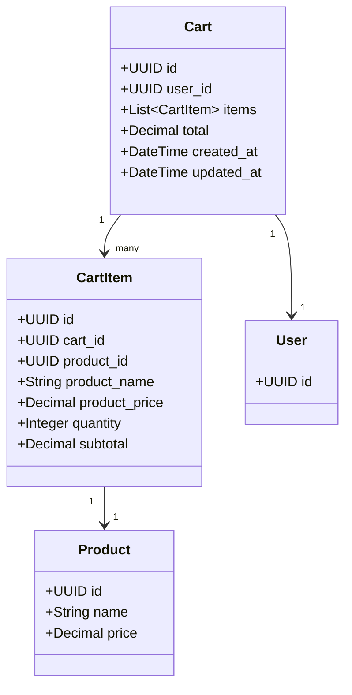
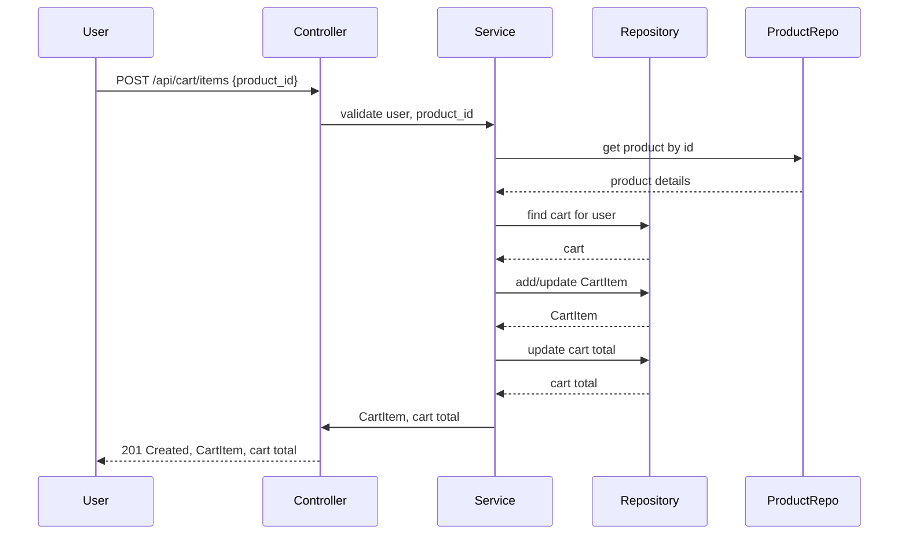
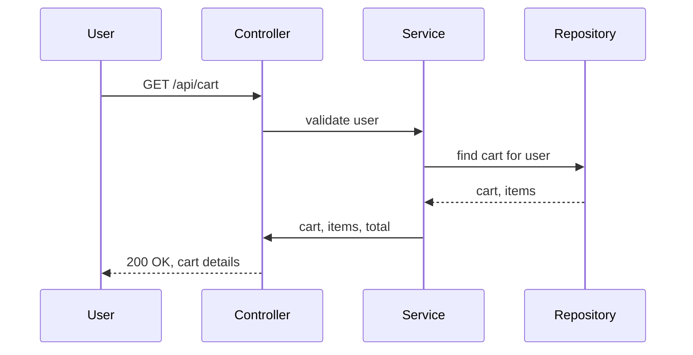
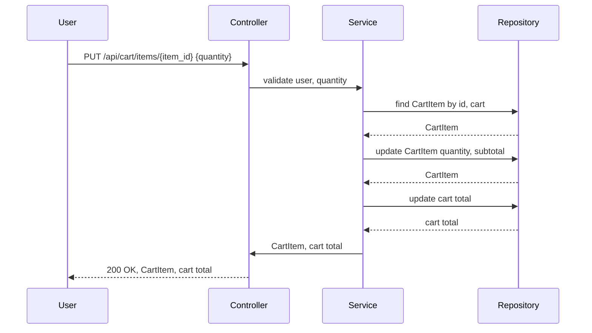
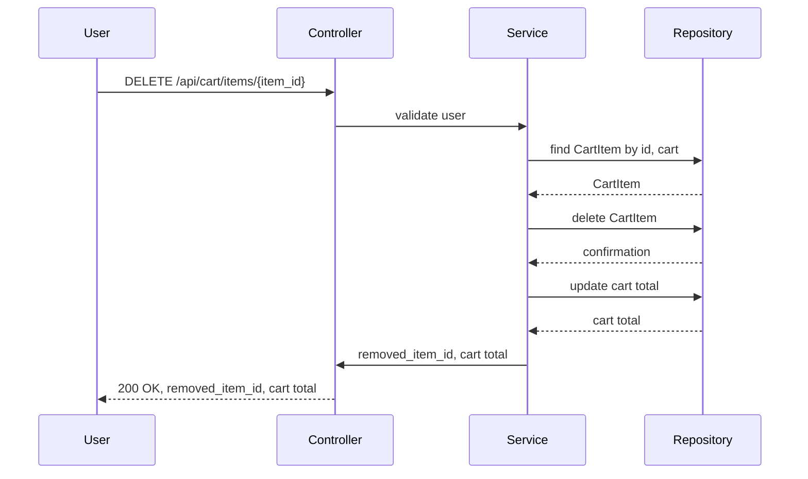

# 1. EXECUTIVE SUMMARY

This specification details the backend engineering requirements for SCRUM-343: Shopping Cart Management. The goal is to enable customers to add products to a shopping cart, manage item quantities, remove items, and view cart contents, preparing for checkout. The deliverables include domain modeling, REST API contracts, validation matrices, diagrams, LLD documentation, implementation guide, QA report, troubleshooting, and future considerations. All outputs are structured for downstream engineering and QA use.

---

# 2. DETAILED ANALYSIS

## Functional Domains Identification

- Shopping Cart Management
- Product Management (read-only, as per story)
- Cart Item Management
- Cart Totals Calculation

## Explicit Rules Extraction

- Adding a product to cart sets quantity to 1 if not present.
- Cart displays all items with name, price, quantity, subtotal.
- Updating item quantity recalculates subtotal and cart total.
- Removing an item updates cart totals.
- Empty cart displays a specific message and link.

## Out-of-Scope Items

- Checkout process (payment, address, etc.)
- Product creation/editing
- Inventory management
- User authentication (assumed present, not specified)
- Promotions, discounts, taxes

## Guardrails

- Only products available in catalog can be added.
- Quantity must be >= 1 when updating.
- Cart must be associated with a customer (user).
- Cart operations must be atomic and consistent.

## Domain Entities and Attributes Mapping

### Entities:

- Cart
- CartItem
- Product (referenced, read-only)
- User (referenced, assumed)

### Attributes:

#### Cart
- id: UUID
- user_id: UUID
- items: List[CartItem]
- total: Decimal
- created_at: DateTime
- updated_at: DateTime

#### CartItem
- id: UUID
- cart_id: UUID
- product_id: UUID
- product_name: String
- product_price: Decimal
- quantity: Integer
- subtotal: Decimal

#### Product (referenced)
- id: UUID
- name: String
- price: Decimal

#### User (referenced)
- id: UUID

## REST API Identification

### Endpoints:

1. `POST /api/cart/items`
   - Add product to cart

2. `GET /api/cart`
   - Retrieve cart contents

3. `PUT /api/cart/items/{item_id}`
   - Update item quantity

4. `DELETE /api/cart/items/{item_id}`
   - Remove item from cart

### Business Logic:

- Add: If item exists, increment quantity; else, add with quantity 1.
- Update: Set new quantity, recalculate subtotal and total.
- Remove: Delete item, recalculate total.
- Get: Return cart items, totals, empty cart message if applicable.

## Validations, Error Cases, and Database Effects Documentation

### Validations:

- Product must exist.
- Quantity must be >= 1.
- Item must belong to user's cart.
- Cart must exist for user.

### Error Cases:

- Product not found (404)
- Invalid quantity (400)
- Item not in cart (404)
- Unauthorized access (401)

### Database Effects:

- Add: Insert/update CartItem, update Cart total.
- Update: Update CartItem quantity/subtotal, update Cart total.
- Remove: Delete CartItem, update Cart total.
- Get: Read Cart and CartItems.

---

# 3. DELIVERABLES

## Domain Entities with Complete Attributes

### Cart

| Attribute   | Type     | Description                  |
|-------------|----------|------------------------------|
| id          | UUID     | Unique cart identifier       |
| user_id     | UUID     | Owner user identifier        |
| items       | List     | List of CartItem entities    |
| total       | Decimal  | Sum of item subtotals        |
| created_at  | DateTime | Cart creation timestamp      |
| updated_at  | DateTime | Cart last update timestamp   |

### CartItem

| Attribute      | Type     | Description                     |
|----------------|----------|---------------------------------|
| id             | UUID     | Unique cart item identifier     |
| cart_id        | UUID     | Associated cart identifier      |
| product_id     | UUID     | Product reference               |
| product_name   | String   | Product name (snapshot)         |
| product_price  | Decimal  | Product price (snapshot)        |
| quantity       | Integer  | Quantity of product             |
| subtotal       | Decimal  | product_price * quantity        |

### Product (referenced)

| Attribute   | Type     | Description                  |
|-------------|----------|------------------------------|
| id          | UUID     | Unique product identifier    |
| name        | String   | Product name                 |
| price       | Decimal  | Product price                |

### User (referenced)

| Attribute   | Type     | Description                  |
|-------------|----------|------------------------------|
| id          | UUID     | Unique user identifier       |

---

## API Contracts with Full Specifications

### 1. Add Product to Cart

**POST /api/cart/items**

**Request:**
```json
{
  "product_id": "UUID"
}
```

**Response:**
- 201 Created
```json
{
  "item": {
    "id": "UUID",
    "product_id": "UUID",
    "product_name": "string",
    "product_price": 99.99,
    "quantity": 1,
    "subtotal": 99.99
  },
  "cart_total": 199.98
}
```
- 404 Product not found
- 400 Product already in cart (optional: increment instead)

---

### 2. Retrieve Cart Contents

**GET /api/cart**

**Response:**
- 200 OK
```json
{
  "cart": {
    "id": "UUID",
    "user_id": "UUID",
    "items": [
      {
        "id": "UUID",
        "product_id": "UUID",
        "product_name": "string",
        "product_price": 99.99,
        "quantity": 2,
        "subtotal": 199.98
      }
    ],
    "total": 199.98
  }
}
```
- 200 OK (empty cart)
```json
{
  "cart": {
    "id": "UUID",
    "user_id": "UUID",
    "items": [],
    "total": 0.00,
    "empty_message": "Your cart is empty",
    "continue_shopping_url": "/products"
  }
}
```

---

### 3. Update Item Quantity

**PUT /api/cart/items/{item_id}**

**Request:**
```json
{
  "quantity": 3
}
```

**Response:**
- 200 OK
```json
{
  "item": {
    "id": "UUID",
    "product_id": "UUID",
    "product_name": "string",
    "product_price": 99.99,
    "quantity": 3,
    "subtotal": 299.97
  },
  "cart_total": 399.96
}
```
- 400 Invalid quantity
- 404 Item not found

---

### 4. Remove Item from Cart

**DELETE /api/cart/items/{item_id}**

**Response:**
- 200 OK
```json
{
  "removed_item_id": "UUID",
  "cart_total": 99.99
}
```
- 404 Item not found

---

## Validation Matrix Table

| Field         | Rule                          | Layer        | Error Code      |
|---------------|-------------------------------|--------------|-----------------||
| product_id    | Must exist in catalog         | Service      | 404_PRODUCT     |
| quantity      | Must be integer >= 1          | Controller   | 400_QUANTITY    |
| item_id       | Must belong to user's cart    | Service      | 404_ITEM        |
| user_id       | Must be authenticated         | Controller   | 401_UNAUTHORIZED|
| cart_id       | Must exist for user           | Service      | 404_CART        |

---

## Mermaid Class Diagram



---

## Mermaid Sequence Diagrams for All Flows

### Add Product to Cart



---

### Retrieve Cart Contents



---

### Update Item Quantity



---

### Remove Item from Cart



---

# 4. COMPLETE LLD DOCUMENTATION

## Layered Architecture (MVC)

### Controller Layer

- Receives HTTP requests
- Validates input (user, product_id, quantity)
- Maps requests to service methods
- Handles error responses

### Service Layer

- Implements business logic:
    - Add item: check product, cart, update/increment quantity
    - Update quantity: validate, recalculate subtotal/total
    - Remove item: validate, update cart
    - Get cart: aggregate items, totals, empty message
- Handles domain validations
- Maps domain entities to DTOs

### Repository Layer

- Data access for Cart, CartItem
- CRUD operations
- Transactional updates for cart totals

### View Layer

- Not applicable for backend; API responses only

---

## Business Logic Sequencing

- Add: Validate product, find cart, add/increment item, recalculate total
- Update: Validate item, update quantity, recalculate subtotal/total
- Remove: Validate item, delete, recalculate total
- Get: Retrieve cart, items, calculate totals

---

## Validation Mapping

- Controller: user authentication, input format
- Service: domain rules (product existence, item ownership, quantity)
- Repository: referential integrity

---

## Controller Responsibilities

- Route requests
- Input validation
- Error handling
- Response formatting

---

## Service Methods

- `addItemToCart(user_id, product_id)`
- `getCart(user_id)`
- `updateCartItemQuantity(user_id, item_id, quantity)`
- `removeCartItem(user_id, item_id)`

---

## Repository Interactions

- `findCartByUserId(user_id)`
- `findCartItemById(item_id)`
- `addOrUpdateCartItem(cart_id, product_id, quantity)`
- `updateCartItemQuantity(item_id, quantity)`
- `deleteCartItem(item_id)`
- `updateCartTotal(cart_id)`

---

## Error Handling

- 400: Invalid input (quantity, product_id)
- 401: Unauthorized user
- 404: Product/item/cart not found
- 500: Internal server error

---

## Database Effects

- Add: INSERT/UPDATE CartItem, UPDATE Cart total
- Update: UPDATE CartItem, UPDATE Cart total
- Remove: DELETE CartItem, UPDATE Cart total
- Get: SELECT Cart, CartItems

---

# 5. QUALITY ASSURANCE REPORT

## Test Cases

- Add product to cart: success, product not found, already in cart
- Retrieve cart: with items, empty cart
- Update quantity: valid, invalid quantity, item not found
- Remove item: valid, item not found
- Cart totals: correct calculation after each operation
- Security: only owner can access cart/items

## Edge Cases

- Add same product multiple times
- Update quantity to 1 (minimum)
- Remove last item (cart becomes empty)
- Large cart (performance)

## QA Recommendations

- Automated API tests for all flows
- Database integrity checks after operations
- Error response validation

---

# 6. TROUBLESHOOTING AND SUPPORT

## Common Issues

- Product not found: Check product catalog sync
- Cart not found: Ensure cart is auto-created for user
- Item not found: Validate item_id and cart ownership
- Totals incorrect: Check subtotal and cart total recalculation logic

## Support Guidance

- Log all cart operations with user_id, cart_id, item_id
- Provide clear error messages in API responses
- Monitor for high cart operation latency

---

# 7. FUTURE CONSIDERATIONS

- Support for guest carts (session-based)
- Multi-currency pricing
- Promotions, discounts, coupons
- Inventory checks before adding/updating items
- Cart persistence across devices
- Cart expiration/cleanup policies
- Integration with checkout/payment APIs

---

**This backend engineering specification package is complete, production-ready, and structured for downstream engineering, QA, and code generation. All deliverables are included as per requirements.**