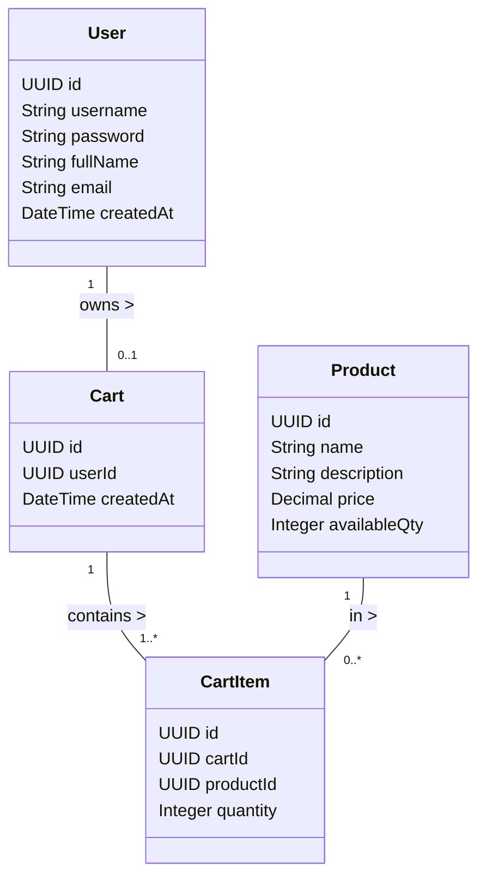
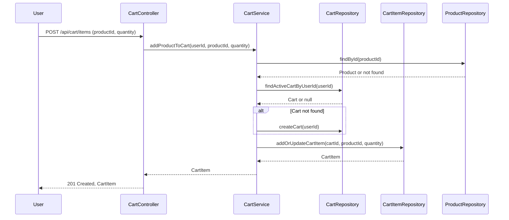

# Backend Engineering Specification Package: Shopping Cart System (SCRUM-96)

---

## Executive Summary

This document details the backend engineering specification for a Shopping Cart System as described in Jira story SCRUM-96. The system is to be implemented using Java Spring Boot (MVC architecture), exposing RESTful APIs and persisting data in a relational database. The scope covers user management, product search, and shopping cart operations, with strict enforcement of business rules and data integrity at both service and database levels. The system is stateless at login, and carts do not persist across logout. Checkout, payments, inventory locking, admin management, and password changes are explicitly out of scope.

---

## Detailed Analysis

### Functional Domains

1. **User Management**
   - Sign-Up, Sign-In, Profile View/Update
   - Username uniqueness, stateless authentication, no password change

2. **Product Catalog**
   - Keyword-based product search
   - Read-only product data for users

3. **Shopping Cart Management**
   - Lazy cart creation, add/update/remove items, view cart
   - One active cart per user, auto-delete empty carts, cart cleanup on logout

### Explicit Rules & Guardrails

- **User**
  - Username unique, must exist before cart ops
  - No session data at DB level
- **Cart**
  - One active cart per user, belongs to one user
  - No cart without items, auto-delete when empty
  - Cart deleted on logout
- **Cart Item**
  - Belongs to one cart, product must exist, quantity > 0
- **Product**
  - Must exist, price immutable via user actions
- **System**
  - No carts for seed users by default
  - All business rules verifiable via DB state
  - APIs reflect DB outcomes

### Out of Scope

- Checkout/Orders, Payments, Inventory reservation, Admin product management, Password reset/change, User roles & permissions, Cart persistence across sessions

---

## Deliverables

### 1. Domain Entities & Attributes

#### User

| Field        | Type      | Constraints                  |
|--------------|-----------|-----------------------------||
| id           | UUID      | PK, auto-generated          |
| username     | String    | Unique, not null, immutable |
| password     | String    | Hashed, not null            |
| fullName     | String    | Not null                    |
| email        | String    | Not null, valid email       |
| createdAt    | DateTime  | Not null, auto-set          |

#### Product

| Field        | Type      | Constraints                  |
|--------------|-----------|-----------------------------||
| id           | UUID      | PK, auto-generated          |
| name         | String    | Not null                    |
| description  | String    |                             |
| price        | Decimal   | Not null, >= 0              |
| availableQty | Integer   | Not null, >= 0              |

#### Cart

| Field        | Type      | Constraints                  |
|--------------|-----------|-----------------------------||
| id           | UUID      | PK, auto-generated          |
| userId       | UUID      | FK to User, unique, not null|
| createdAt    | DateTime  | Not null, auto-set          |

#### CartItem

| Field        | Type      | Constraints                  |
|--------------|-----------|-----------------------------||
| id           | UUID      | PK, auto-generated          |
| cartId       | UUID      | FK to Cart, not null        |
| productId    | UUID      | FK to Product, not null     |
| quantity     | Integer   | Not null, > 0               |

---

### 2. REST API Contracts

#### User Management

| Endpoint                | Method | Request Body / Params                | Response                   | Business Logic / Notes      |
|-------------------------|--------|--------------------------------------|----------------------------|----------------------------|
| /api/users/signup       | POST   | username, password, fullName, email  | 201 Created, user details  | Username unique, hash pwd  |
| /api/users/signin       | POST   | username, password                   | 200 OK, user details       | Stateless, no session      |
| /api/users/me           | GET    | Auth token                           | 200 OK, user profile       | Auth required              |
| /api/users/me           | PUT    | fullName, email                      | 200 OK, updated profile    | Username immutable         |

#### Product Catalog

| Endpoint                | Method | Request Body / Params                | Response                   | Business Logic / Notes      |
|-------------------------|--------|--------------------------------------|----------------------------|----------------------------|
| /api/products/search    | GET    | query (keyword)                      | 200 OK, product list       | Case-insensitive search    |

#### Shopping Cart

| Endpoint                        | Method | Request Body / Params                | Response                   | Business Logic / Notes      |
|----------------------------------|--------|--------------------------------------|----------------------------|----------------------------|
| /api/cart                       | GET    | Auth token                           | 200 OK, cart details       | Create cart if missing? No |
| /api/cart/items                  | POST   | productId, quantity                  | 201 Created, cart item     | Lazy cart creation         |
| /api/cart/items/{itemId}         | PUT    | quantity                             | 200 OK, updated item       | Quantity > 0               |
| /api/cart/items/{itemId}         | DELETE |                                      | 204 No Content             | Remove item, auto-delete cart if last item |
| /api/cart                       | DELETE |                                      | 204 No Content             | Delete cart and all items  |
| /api/users/logout                | POST   |                                      | 204 No Content             | Delete cart on logout      |

---

### 3. Validation Matrix

| Operation           | Field         | Validation Rule                                 | Error Code / Message                |
|---------------------|--------------|-------------------------------------------------|-------------------------------------|
| Sign-Up             | username     | Not null, unique, regex                         | 409/400 Username exists/invalid     |
|                     | password     | Not null, min length                            | 400 Invalid password                |
|                     | email        | Not null, valid email                           | 400 Invalid email                   |
| Sign-In             | username/pwd | Must match existing user                        | 401 Invalid credentials             |
| Update Profile      | fullName     | Not null                                        | 400 Invalid name                    |
|                     | email        | Not null, valid email                           | 400 Invalid email                   |
| Product Search      | query        | Not null, min length                            | 400 Invalid query                   |
| Add Cart Item       | productId    | Exists, not null                                | 404 Product not found               |
|                     | quantity     | > 0, integer                                    | 400 Invalid quantity                |
| Update Cart Item    | quantity     | > 0, integer                                    | 400 Invalid quantity                |
| Remove Cart Item    | itemId       | Exists, belongs to user's cart                  | 404 Item not found                  |
| View Cart           | -            | User must exist, cart may not exist             | 404 User not found                  |
| Logout              | -            | User must exist                                 | 404 User not found                  |

---

### 4. Mermaid Diagrams

#### Class Diagram

#### Sequence Diagram: Add Product to Cart

---

### 5. Low-Level Design (LLD) Documentation

#### MVC Layering

- **Controller Layer**: Handles HTTP requests, validates input, invokes service methods, formats responses.
- **Service Layer**: Implements business logic, enforces all domain rules, coordinates repositories.
- **Repository Layer**: CRUD operations, enforces DB-level constraints, maps entities.

#### Controller Responsibilities

- **UserController**: Sign-up, sign-in, profile view/update, logout (cart cleanup)
- **ProductController**: Product search
- **CartController**: View cart, add/update/remove items, delete cart

#### Service Methods

- **UserService**
  - registerUser()
  - authenticateUser()
  - getUserProfile()
  - updateUserProfile()
- **ProductService**
  - searchProducts()
- **CartService**
  - getCartByUser()
  - addProductToCart()
  - updateCartItemQuantity()
  - removeCartItem()
  - deleteCart()
  - cleanupCartOnLogout()

#### Repository Interactions

- **UserRepository**: findByUsername, save, update
- **ProductRepository**: searchByKeyword, findById
- **CartRepository**: findByUserId, save, delete
- **CartItemRepository**: findByCartId, save, update, delete

#### Validations & Error Handling

- All input validated at controller and service layers
- DB constraints for uniqueness, foreign keys, not null, quantity > 0
- Error codes: 400 (bad input), 401 (unauthenticated), 403 (forbidden), 404 (not found), 409 (conflict)

#### Database Effects

- User sign-up: insert user
- Sign-in: no DB change
- Add to cart: insert/update cart and cart item
- Update item: update cart item quantity
- Remove item: delete cart item, delete cart if last item
- Logout: delete cart and all items

#### Cart Lifecycle

- No cart by default
- Cart created on first add
- Only one active cart per user
- Cart auto-deleted if empty or on logout

---

## Implementation Guide

1. **Database Schema**
   - Define tables for users, products, carts, cart_items
   - Enforce constraints: unique username, FK relations, quantity > 0

2. **Spring Boot Setup**
   - Configure MVC, JPA/Hibernate, REST controllers
   - Implement JWT or token-based stateless authentication

3. **Controllers**
   - Map endpoints, validate input, handle exceptions

4. **Services**
   - Implement business logic per domain rules, coordinate repositories

5. **Repositories**
   - JPA interfaces for CRUD, custom queries for search

6. **Validation**
   - Use annotations and custom validators for input
   - Service-level checks for business rules

7. **Testing**
   - Unit and integration tests for all APIs, including edge/error cases

8. **Documentation**
   - Swagger/OpenAPI for API contracts

---

## Quality Assurance Report

- **Completeness**: All requirements from Jira story mapped to entities, APIs, and rules
- **Consistency**: No out-of-scope features included, all business rules enforced at both code and DB
- **Testability**: APIs and DB state fully testable for all acceptance criteria
- **Maintainability**: MVC layering, clear separation of concerns, extensible for future features

---

## Troubleshooting and Support

- **Common Issues**
  - Duplicate username: 409 Conflict
  - Invalid credentials: 401 Unauthorized
  - Cart not found: 404 Not Found
  - Product not found: 404 Not Found
  - Invalid quantity: 400 Bad Request

- **Support**
  - Centralized exception handler for API errors
  - Logging for all critical operations
  - Health checks for DB and API endpoints

---

## Future Considerations

- **Scalability**: Consider caching for product search, sharding for cart data
- **Extensibility**: Modularize services for future checkout, payment, inventory features
- **Security**: Enhance authentication (OAuth2), rate limiting, audit logging
- **Monitoring**: Integrate with monitoring/alerting tools for uptime and error tracking
- **API Versioning**: Plan for backward-compatible changes

---

## Feedback & Improvement Mechanisms

- **API Usage Metrics**: Track endpoint usage and error rates
- **User Feedback**: Collect feedback on API usability and error clarity
- **Continuous Integration**: Automated tests and code quality checks
- **Code Reviews**: Enforce coding standards and architectural guidelines

---

**End of Backend Engineering Specification Package for Shopping Cart System (SCRUM-96)**