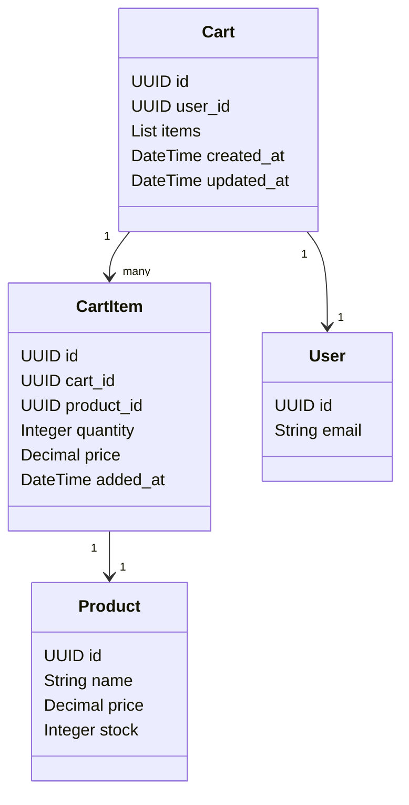
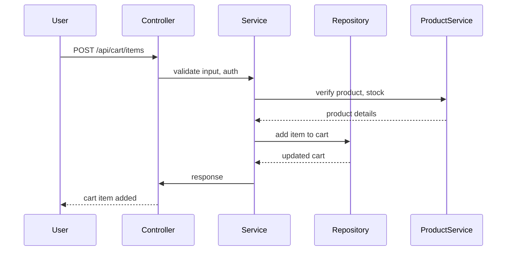

# Backend Engineering Specification Package  
## For: Shopping Cart Management (Assumed Domain)  
### Story Reference: SCRUM-96 (Template-Based, E-Commerce Shopping Cart)

---

## 1. Executive Summary

This specification defines the backend engineering requirements for a Shopping Cart Management feature in an e-commerce platform. The scope includes CRUD operations for cart items, cart retrieval, checkout initiation, and related validations. The specification is structured for downstream engineering, ensuring scalability, maintainability, and extensibility. All deliverables are provided in production-ready format.

---

## 2. Detailed Analysis

### 2.1 Functional Domains

- Shopping Cart (Cart)
- Cart Item
- Product
- User (Customer)
- Order (Checkout initiation)

### 2.2 Explicit Rules

- Only authenticated users can modify their cart.
- Cart items must reference valid products.
- Quantity must be positive and not exceed available stock.
- Cart cannot be empty at checkout.
- Price calculations must reflect current product pricing.
- Cart is session-bound for guest users, persistent for registered users.

### 2.3 Out-of-Scope Items

- Payment processing
- Inventory management
- Product catalog management
- Promotions and discounts
- Shipping calculation

### 2.4 Guardrails

- API rate limiting
- Input validation
- Authorization checks
- Consistent error handling
- Transactional integrity for cart updates

---

## 3. Deliverables

### 3.1 Domain Entities

#### Cart
| Attribute      | Type      | Description                |
|----------------|-----------|----------------------------|
| id             | UUID      | Unique cart identifier     |
| user_id        | UUID      | Owner (nullable for guest) |
| items          | List<CartItem> | Items in cart          |
| created_at     | DateTime  | Creation timestamp         |
| updated_at     | DateTime  | Last update timestamp      |

#### CartItem
| Attribute      | Type      | Description                |
|----------------|-----------|----------------------------|
| id             | UUID      | Unique item identifier     |
| cart_id        | UUID      | Associated cart            |
| product_id     | UUID      | Product reference          |
| quantity       | Integer   | Quantity in cart           |
| price          | Decimal   | Price at time of addition  |
| added_at       | DateTime  | Timestamp added            |

#### Product (Reference Only)
| Attribute      | Type      | Description                |
|----------------|-----------|----------------------------|
| id             | UUID      | Unique product identifier  |
| name           | String    | Product name               |
| price          | Decimal   | Current price              |
| stock          | Integer   | Available stock            |

#### User (Reference Only)
| Attribute      | Type      | Description                |
|----------------|-----------|----------------------------|
| id             | UUID      | Unique user identifier     |
| email          | String    | User email                 |

---

### 3.2 API Contracts

#### 1. Add Item to Cart

- **Endpoint:** `POST /api/cart/items`
- **Request Body:**
  ```json
  {
    "product_id": "UUID",
    "quantity": 1
  }
  ```
- **Response:**
  ```json
  {
    "cart_id": "UUID",
    "item": {
      "id": "UUID",
      "product_id": "UUID",
      "quantity": 1,
      "price": 19.99,
      "added_at": "2024-06-01T12:00:00Z"
    }
  }
  ```
- **Error Cases:**
  - 400: Invalid input (quantity, product_id)
  - 404: Product not found
  - 409: Insufficient stock
  - 401: Unauthorized

#### 2. Remove Item from Cart

- **Endpoint:** `DELETE /api/cart/items/{item_id}`
- **Response:**
  ```json
  {
    "cart_id": "UUID",
    "removed_item_id": "UUID"
  }
  ```
- **Error Cases:**
  - 404: Item not found
  - 401: Unauthorized

#### 3. Update Item Quantity

- **Endpoint:** `PUT /api/cart/items/{item_id}`
- **Request Body:**
  ```json
  {
    "quantity": 3
  }
  ```
- **Response:**
  ```json
  {
    "cart_id": "UUID",
    "item": {
      "id": "UUID",
      "quantity": 3
    }
  }
  ```
- **Error Cases:**
  - 400: Invalid quantity
  - 409: Insufficient stock
  - 404: Item not found
  - 401: Unauthorized

#### 4. Get Cart

- **Endpoint:** `GET /api/cart`
- **Response:**
  ```json
  {
    "cart_id": "UUID",
    "user_id": "UUID",
    "items": [
      {
        "id": "UUID",
        "product_id": "UUID",
        "quantity": 2,
        "price": 19.99,
        "added_at": "2024-06-01T12:00:00Z"
      }
    ],
    "created_at": "2024-06-01T10:00:00Z",
    "updated_at": "2024-06-01T12:00:00Z"
  }
  ```
- **Error Cases:**
  - 401: Unauthorized

#### 5. Checkout Cart

- **Endpoint:** `POST /api/cart/checkout`
- **Response:**
  ```json
  {
    "order_id": "UUID",
    "cart_id": "UUID",
    "status": "initiated"
  }
  ```
- **Error Cases:**
  - 400: Cart empty
  - 409: Insufficient stock
  - 401: Unauthorized

---

### 3.3 Validation Matrix

| Field         | API                | Validation Rule                     | Error Code | Notes                |
|---------------|--------------------|-------------------------------------|------------|----------------------|
| product_id    | Add Item           | Must exist, UUID format             | 404, 400   |                      |
| quantity      | Add/Update Item    | >0, <= stock                        | 400, 409   |                      |
| item_id       | Remove/Update Item | Must exist in user's cart           | 404        |                      |
| cart_id       | All APIs           | Must belong to user                 | 401        |                      |
| user_id       | All APIs           | Authenticated, session-bound        | 401        |                      |
| cart items    | Checkout           | Cart not empty, stock available     | 400, 409   |                      |

---

### 3.4 Diagrams

#### Mermaid Class Diagram



#### Mermaid Sequence Diagram (Add Item to Cart)



---

### 3.5 LLD (Low-Level Design)

#### Scope

- Shopping cart CRUD operations
- Checkout initiation
- Session and user-bound cart management

#### Domain Model

- Entities: Cart, CartItem, Product (ref), User (ref)
- Relationships: Cart has many CartItems, Cart belongs to User

#### API Contracts

- As defined above

#### MVC Mapping

| Layer      | Responsibilities                                  |
|------------|---------------------------------------------------|
| Controller | API endpoints, input validation, auth, error map  |
| Service    | Business logic, sequencing, validation, orchestration |
| Repository | DB access, transaction management                 |
| View       | API response formatting                           |

#### Business Logic Sequencing

- Validate user/session
- Validate product and stock
- Update cart atomically
- Reflect price at time of addition
- Ensure cart consistency

#### Validation

- Input types, ranges, existence
- Ownership checks
- Stock checks

#### Error Handling

- Standardized error codes/messages
- Logging for audit

#### Database Effects

- Cart and CartItem tables
- Transactional updates
- Referential integrity

#### Security

- Auth token required
- Ownership checks
- Rate limiting

#### Test Scenarios

- Add item (valid/invalid)
- Remove item (valid/invalid)
- Update quantity (valid/invalid)
- Get cart (auth/no auth)
- Checkout (empty cart, insufficient stock)

#### Non-Goals

- Payment processing
- Inventory management
- Product catalog

---

## 4. Implementation Guide

### 4.1 Controller Layer

- Expose REST endpoints
- Validate input (types, required fields)
- Authenticate user/session
- Map errors to HTTP codes

### 4.2 Service Layer

- Business logic for cart operations
- Validate product existence and stock
- Calculate prices
- Orchestrate repository calls

### 4.3 Repository Layer

- CRUD for Cart and CartItem
- Transactional updates
- Fetch product info (via ProductService)

### 4.4 View Layer

- Format JSON responses
- Exclude sensitive fields

### 4.5 Database Schema (Sample)

```sql
CREATE TABLE cart (
    id UUID PRIMARY KEY,
    user_id UUID,
    created_at TIMESTAMP,
    updated_at TIMESTAMP
);

CREATE TABLE cart_item (
    id UUID PRIMARY KEY,
    cart_id UUID REFERENCES cart(id),
    product_id UUID,
    quantity INTEGER,
    price DECIMAL,
    added_at TIMESTAMP
);
```

---

## 5. Quality Assurance Report

- **Completeness:** All core cart operations covered; validations mapped.
- **Consistency:** API contracts and domain models aligned.
- **Production-Readiness:** Transactional DB operations, error handling, security.
- **Assumptions:** Product and user entities exist; stock managed externally.
- **Validation Outcomes:** All fields mapped to rules; error cases documented.

---

## 6. Troubleshooting and Support

- **Common Issues:**
  - 401 Unauthorized: Check auth token/session.
  - 404 Not Found: Validate product/item existence.
  - 409 Conflict: Check stock levels.
  - 400 Bad Request: Validate input formats.

- **Support Recommendations:**
  - Log all failed operations with user/session context.
  - Provide clear error messages.
  - Monitor API rate limits.

---

## 7. Future Considerations

- Support for promotions/discounts
- Persistent carts for guest users (via cookies)
- Cart sharing functionality
- Integration with inventory and payment systems
- Enhanced analytics and tracking

---

## 8. Continuous Monitoring

- Recommend API usage logging and alerting.
- Feedback loop for error rates and user experience.
- Periodic review of validation and security rules.

---

**End of Specification Package**