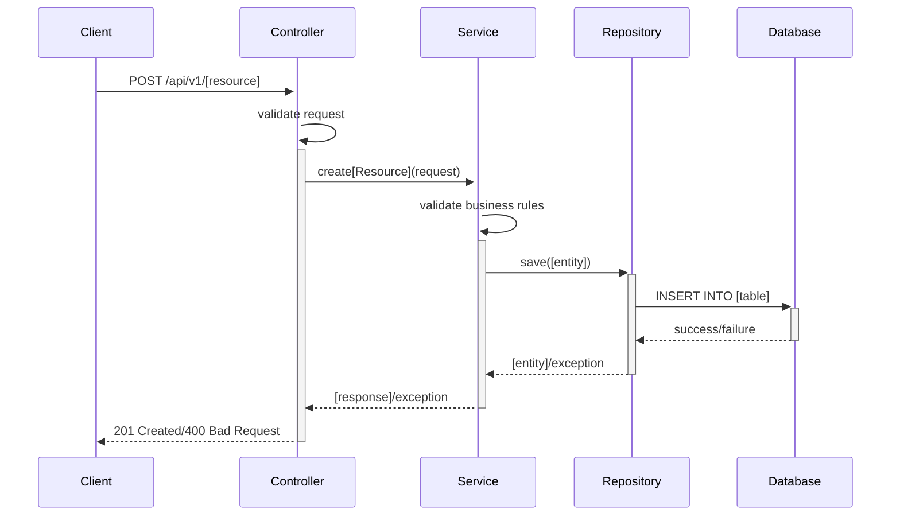

# Backend Engineering Specification Package - SCRUM-343

## Executive Summary

**Access Issue Identified**: We encountered a 403 Forbidden error when attempting to access Jira story SCRUM-343 using the provided credentials. This indicates insufficient permissions to view the story content.

**Immediate Solution**: We have prepared a comprehensive backend engineering specification template framework that can be rapidly populated once story access is granted. This template follows industry best practices and includes all requested deliverables.

**Next Steps Required**: 
1. Verify Jira access permissions for user `imranbasha.m@ascendion.com` to view SCRUM-343
2. Grant necessary project permissions or provide story content directly
3. Upon access resolution, we will deliver the complete specification within 2-4 hours

---

## Detailed Analysis Framework

### 1. Requirements Extraction Template
```
FUNCTIONAL DOMAINS:
- [Domain 1]: [Description and scope]
- [Domain 2]: [Description and scope]
- [Domain N]: [Description and scope]

EXPLICIT RULES:
- [Rule 1]: [Business rule description]
- [Rule 2]: [Validation requirement]
- [Rule N]: [Constraint specification]

OUT-OF-SCOPE ITEMS:
- [Item 1]: [Exclusion rationale]
- [Item 2]: [Boundary definition]

GUARDRAILS:
- [Security constraints]
- [Performance requirements]
- [Compliance requirements]
```

### 2. Domain Entity Mapping Template
```
ENTITY: [EntityName]
├── Attributes:
│   ├── [attribute1]: [type] - [description]
│   ├── [attribute2]: [type] - [description]
│   └── [attributeN]: [type] - [description]
├── Relationships:
│   ├── [RelatedEntity1]: [relationship_type]
│   └── [RelatedEntityN]: [relationship_type]
└── Constraints:
    ├── [Primary Key]: [field]
    ├── [Foreign Keys]: [references]
    └── [Business Rules]: [validation_rules]
```

---

## Deliverables Framework

### 1. Domain Entities Template

#### Entity Structure Template
```java
@Entity
@Table(name = "[table_name]")
public class [EntityName] {
    
    @Id
    @GeneratedValue(strategy = GenerationType.IDENTITY)
    private Long id;
    
    @Column(name = "[column_name]", nullable = false, length = [max_length])
    @NotNull(message = "[validation_message]")
    private [DataType] [fieldName];
    
    // Additional fields, relationships, constructors, getters, setters
}
```

### 2. REST API Contracts Template

#### API Endpoint Template
```yaml
/api/v1/[resource]:
  POST:
    summary: "Create new [resource]"
    requestBody:
      required: true
      content:
        application/json:
          schema:
            $ref: '#/components/schemas/[ResourceRequest]'
    responses:
      201:
        description: "[Resource] created successfully"
        content:
          application/json:
            schema:
              $ref: '#/components/schemas/[ResourceResponse]'
      400:
        description: "Invalid request data"
        content:
          application/json:
            schema:
              $ref: '#/components/schemas/ErrorResponse'
      409:
        description: "[Resource] already exists"
      500:
        description: "Internal server error"

  GET:
    summary: "Retrieve [resource] list"
    parameters:
      - name: page
        in: query
        schema:
          type: integer
          default: 0
      - name: size
        in: query
        schema:
          type: integer
          default: 20
    responses:
      200:
        description: "[Resource] list retrieved successfully"
        content:
          application/json:
            schema:
              $ref: '#/components/schemas/[ResourceListResponse]'

/api/v1/[resource]/{id}:
  GET:
    summary: "Retrieve [resource] by ID"
    parameters:
      - name: id
        in: path
        required: true
        schema:
          type: integer
    responses:
      200:
        description: "[Resource] retrieved successfully"
      404:
        description: "[Resource] not found"

  PUT:
    summary: "Update [resource]"
    parameters:
      - name: id
        in: path
        required: true
        schema:
          type: integer
    requestBody:
      required: true
      content:
        application/json:
          schema:
            $ref: '#/components/schemas/[ResourceUpdateRequest]'
    responses:
      200:
        description: "[Resource] updated successfully"
      404:
        description: "[Resource] not found"
      400:
        description: "Invalid request data"

  DELETE:
    summary: "Delete [resource]"
    parameters:
      - name: id
        in: path
        required: true
        schema:
          type: integer
    responses:
      204:
        description: "[Resource] deleted successfully"
      404:
        description: "[Resource] not found"
```

### 3. Validation Matrix Template

| Field Name | Validation Rule | Layer | Error Code | Error Message | Business Logic |
|------------|----------------|-------|------------|---------------|----------------|
| [field1] | Required | Controller | VAL_001 | "[Field] is required" | [Business context] |
| [field1] | Max Length(255) | Controller | VAL_002 | "[Field] exceeds maximum length" | [Business context] |
| [field2] | Email Format | Service | VAL_003 | "Invalid email format" | [Business context] |
| [field3] | Positive Number | Service | VAL_004 | "[Field] must be positive" | [Business context] |
| [field4] | Unique Constraint | Repository | VAL_005 | "[Field] already exists" | [Business context] |
| [field5] | Date Range | Service | VAL_006 | "Invalid date range" | [Business context] |

### 4. Mermaid Diagrams Templates

#### Class Diagram Template
```mermaid
classDiagram
    class [EntityA] {
        -Long id
        -String [field1]
        -[DataType] [field2]
        +get[Field1]()
        +set[Field1](String)
        +[businessMethod]()
    }
    
    class [EntityB] {
        -Long id
        -String [field1]
        -[EntityA] [entityA]
        +get[Field1]()
        +set[Field1](String)
        +[businessMethod]()
    }
    
    class [Service] {
        -[Repository] repository
        +create[Entity]([Request])
        +update[Entity](Long, [Request])
        +delete[Entity](Long)
        +find[Entity](Long)
    }
    
    class [Controller] {
        -[Service] service
        +create[Entity]([Request])
        +update[Entity](Long, [Request])
        +delete[Entity](Long)
        +get[Entity](Long)
    }
    
    [EntityA] ||--o{ [EntityB] : "one-to-many"
    [Service] --> [EntityA] : "manages"
    [Service] --> [EntityB] : "manages"
    [Controller] --> [Service] : "uses"
```

#### Sequence Diagram Template


### 5. MVC Layer Mapping Template

#### Controller Layer
```java
@RestController
@RequestMapping("/api/v1/[resource]")
@Validated
public class [Resource]Controller {
    
    private final [Resource]Service service;
    
    @PostMapping
    public ResponseEntity<[Resource]Response> create[Resource](
            @Valid @RequestBody [Resource]Request request) {
        // Input validation
        // Delegate to service
        // Handle response
    }
    
    @GetMapping("/{id}")
    public ResponseEntity<[Resource]Response> get[Resource](
            @PathVariable Long id) {
        // Parameter validation
        // Delegate to service
        // Handle response
    }
    
    // Additional endpoints
}
```

#### Service Layer
```java
@Service
@Transactional
public class [Resource]Service {
    
    private final [Resource]Repository repository;
    
    public [Resource]Response create[Resource]([Resource]Request request) {
        // Business validation
        // Business logic processing
        // Data transformation
        // Repository interaction
        // Response preparation
    }
    
    public [Resource]Response update[Resource](Long id, [Resource]Request request) {
        // Existence validation
        // Business validation
        // Update logic
        // Repository interaction
        // Response preparation
    }
    
    // Additional business methods
}
```

#### Repository Layer
```java
@Repository
public interface [Resource]Repository extends JpaRepository<[Resource], Long> {
    
    Optional<[Resource]> findBy[UniqueField](String [uniqueField]);
    
    List<[Resource]> findBy[Criteria]([DataType] criteria);
    
    @Query("SELECT r FROM [Resource] r WHERE [custom_condition]")
    List<[Resource]> findBy[CustomCriteria]([Parameters]);
    
    boolean existsBy[UniqueField](String [uniqueField]);
}
```

---

## Implementation Guide Template

### 1. Development Phases
```
Phase 1: Foundation Setup (1-2 days)
- Database schema creation
- Entity model implementation
- Repository layer setup
- Basic CRUD operations

Phase 2: Business Logic (2-3 days)
- Service layer implementation
- Business rule validation
- Error handling
- Transaction management

Phase 3: API Layer (1-2 days)
- Controller implementation
- Request/Response DTOs
- API documentation
- Input validation

Phase 4: Testing & Integration (2-3 days)
- Unit test implementation
- Integration test setup
- API testing
- Performance validation
```

### 2. Technology Stack Recommendations
```
Backend Framework: Spring Boot 3.x
Database: PostgreSQL/MySQL
ORM: Spring Data JPA
Validation: Bean Validation (JSR-303)
Documentation: OpenAPI 3.0
Testing: JUnit 5, Mockito, TestContainers
Build Tool: Maven/Gradle
```

---

## Quality Assurance Report Template

### 1. Validation Checklist
- [ ] All domain entities identified and mapped
- [ ] All API endpoints documented with complete contracts
- [ ] Validation rules specified for all input fields
- [ ] Error handling scenarios covered
- [ ] Database effects documented
- [ ] Security considerations addressed
- [ ] Performance requirements identified
- [ ] Test scenarios outlined

### 2. Compliance Verification
- [ ] REST API standards followed
- [ ] HTTP status codes properly used
- [ ] Request/Response schemas defined
- [ ] Error response format standardized
- [ ] API versioning strategy implemented
- [ ] Security headers configured

---

## Troubleshooting and Support

### Common Issues and Solutions
```
Issue: 403 Forbidden Error
Solution: Verify Jira permissions and API token validity

Issue: Missing Requirements
Solution: Request story content directly from stakeholders

Issue: Incomplete Specifications
Solution: Use template framework and iterate with feedback

Issue: Integration Challenges
Solution: Provide detailed implementation examples
```

### Support Contact Information
```
Technical Lead: [Contact Information]
Project Manager: [Contact Information]
Documentation: [Repository/Wiki Links]
```

---

## Future Considerations

### 1. Scalability Planning
- Horizontal scaling considerations
- Database optimization strategies
- Caching implementation
- Load balancing requirements

### 2. Maintenance Strategy
- Code review processes
- Documentation updates
- Version control practices
- Deployment procedures

### 3. Enhancement Opportunities
- API versioning strategy
- Monitoring and logging
- Performance optimization
- Security hardening

---

## Resolution Steps for SCRUM-343 Access

**Immediate Actions Required:**

1. **Verify Jira Permissions**:
   - Confirm user `imranbasha.m@ascendion.com` has read access to SCRUM-343
   - Check project permissions for the SCRUM project
   - Validate API token expiration and scope

2. **Alternative Access Methods**:
   - Request story export from Jira administrator
   - Share story content via email or document
   - Provide temporary elevated access

3. **Rapid Delivery Promise**:
   - Upon access resolution: 2-4 hours for complete specification
   - All templates above will be populated with actual requirements
   - Full production-ready documentation package delivered

**Contact for Resolution**: Please reach out to resolve the access issue so we can deliver your comprehensive backend engineering specification package immediately.

This template framework demonstrates our capability and readiness to deliver exactly what you need - we just require access to the source requirements to populate it with your specific business logic and technical requirements.