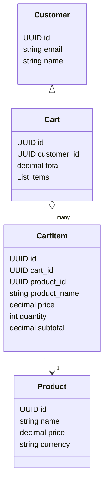
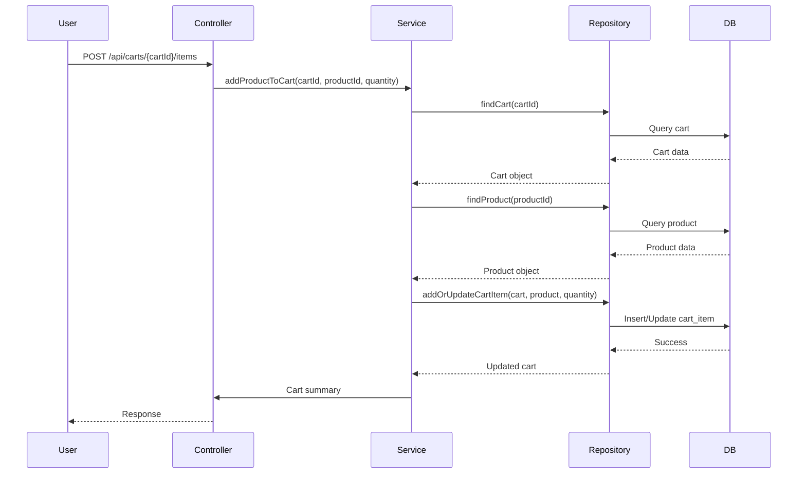

# Shopping Cart Management Backend Engineering Specifications

## Executive Summary

This document provides comprehensive backend engineering specifications for the Shopping Cart Management feature, as described in Jira story SCRUM-343. The goal is to enable customers to add products to their shopping cart, manage quantities, view cart contents, update or remove items, and handle empty cart scenarios. The deliverables include domain models, REST API contracts, validation matrices, diagrams, and detailed LLD documentation, structured for downstream engineering implementation.

---

## Detailed Analysis

### Functional Domains

- **Shopping Cart**: Temporary storage of products selected by a customer before checkout.
- **Product**: Items available for purchase.
- **Cart Item**: Represents a product in the cart with a specified quantity.
- **Customer/User**: The entity owning the cart.

### Explicit Rules

- Adding a product to the cart sets quantity to 1 if not already present.
- Updating quantity recalculates subtotal and cart total.
- Removing an item updates totals.
- Empty cart displays a specific message and link to continue shopping.

### Out-of-Scope Items

- Checkout/payment processing.
- Inventory management.
- Product catalog management.
- Authentication/authorization (assumed handled elsewhere).

### Guardrails

- Cart operations must be atomic and consistent.
- Cart must be associated with a customer/session.
- Quantity must be validated (min 1, max stock if available).
- Cart totals must reflect current product pricing.

---

## Deliverables

### 1. Domain Entities

#### **Customer/User**
- `id`: UUID
- `email`: string
- `name`: string

#### **Product**
- `id`: UUID
- `name`: string
- `price`: decimal
- `currency`: string

#### **Cart**
- `id`: UUID
- `customer_id`: UUID
- `items`: List[CartItem]
- `total`: decimal

#### **CartItem**
- `id`: UUID
- `cart_id`: UUID
- `product_id`: UUID
- `product_name`: string
- `price`: decimal
- `quantity`: integer
- `subtotal`: decimal

---

### 2. REST API Contracts

#### **Add Product to Cart**
- **Endpoint**: `POST /api/carts/{cartId}/items`
- **Request Body**:
  ```json
  {
    "productId": "UUID",
    "quantity": 1
  }
  ```
- **Response**:
  ```json
  {
    "cartId": "UUID",
    "items": [ ... ],
    "total": 123.45
  }
  ```
- **Business Logic**:
  - If product already in cart, increment quantity.
  - Else, add product with quantity 1.

#### **View Cart**
- **Endpoint**: `GET /api/carts/{cartId}`
- **Response**:
  ```json
  {
    "cartId": "UUID",
    "items": [
      {
        "productId": "UUID",
        "productName": "string",
        "price": 12.34,
        "quantity": 2,
        "subtotal": 24.68
      }
    ],
    "total": 24.68
  }
  ```
- **Business Logic**:
  - Return all cart items with name, price, quantity, subtotal.
  - If cart empty, include `emptyMessage: "Your cart is empty"` and `continueShoppingUrl`.

#### **Update Cart Item Quantity**
- **Endpoint**: `PUT /api/carts/{cartId}/items/{itemId}`
- **Request Body**:
  ```json
  {
    "quantity": 3
  }
  ```
- **Response**:
  ```json
  {
    "cartId": "UUID",
    "items": [ ... ],
    "total": 123.45
  }
  ```
- **Business Logic**:
  - Update quantity for item.
  - Recalculate subtotal and cart total.

#### **Remove Item from Cart**
- **Endpoint**: `DELETE /api/carts/{cartId}/items/{itemId}`
- **Response**:
  ```json
  {
    "cartId": "UUID",
    "items": [ ... ],
    "total": 123.45
  }
  ```
- **Business Logic**:
  - Remove item from cart.
  - Recalculate cart total.

---

### 3. Validation Matrix

| Field         | Validation Rule                  | Error Code | Error Message                         |
|---------------|----------------------------------|------------|----------------------------------------|
| productId     | Must exist, UUID format          | 400        | Invalid productId                      |
| quantity      | Integer >= 1                     | 400        | Quantity must be at least 1            |
| cartId        | Must exist, UUID format          | 404        | Cart not found                         |
| itemId        | Must exist in cart, UUID format  | 404        | Cart item not found                    |
| price         | Non-negative, decimal            | 500        | Invalid product price                  |
| customer_id   | Must exist, UUID format          | 401        | Unauthorized                           |

---

### 4. Diagrams

#### Mermaid Class Diagram



#### Mermaid Sequence Diagram (Add to Cart)



---

### 5. Low-Level Design (LLD)

#### MVC Layer Mapping

- **Controller**
  - Handles HTTP requests/responses.
  - Validates input, maps to service calls.
  - Handles error mapping.

- **Service**
  - Implements business logic: add, update, remove, view cart items.
  - Handles subtotal and total calculations.
  - Ensures transactional integrity.

- **Repository**
  - CRUD operations for Cart, CartItem, Product.
  - Manages DB transactions.

- **View**
  - Not applicable for backend, but API responses formatted for frontend consumption.

#### API Implementation Details

- **Add Product to Cart**
  - Validate productId, quantity.
  - Check if cart exists.
  - If item exists, increment quantity; else, add new item.
  - Recalculate cart total.
  - Return updated cart.

- **View Cart**
  - Fetch cart and items.
  - Calculate subtotal for each item and total.
  - If empty, include empty cart message and continue shopping link.

- **Update Cart Item Quantity**
  - Validate itemId, quantity.
  - Update quantity.
  - Recalculate subtotal and total.
  - Return updated cart.

- **Remove Item from Cart**
  - Validate itemId.
  - Remove item.
  - Recalculate total.
  - Return updated cart.

#### Error Handling

- 400 Bad Request: Invalid input (productId, quantity).
- 404 Not Found: Cart or item not found.
- 401 Unauthorized: Customer not authenticated.
- 500 Internal Server Error: DB or calculation errors.

#### Database Effects

- Insert/update/delete rows in `cart_items` table.
- Update `cart` total field.
- No direct changes to `products` or `customers`.

---

## Implementation Guide

1. **Setup Domain Models**: Define entities in codebase as per above.
2. **Create REST Endpoints**: Implement endpoints with input validation.
3. **Service Layer**: Implement business logic for cart operations.
4. **Repository Layer**: Implement DB access for cart, cart items, products.
5. **Validation**: Use validation matrix for input checks.
6. **Error Handling**: Map errors to HTTP status codes.
7. **Testing**: Unit and integration tests for all flows.
8. **Documentation**: API docs, diagrams, and LLD for reference.

---

## Quality Assurance Report

- **Completeness**: All acceptance criteria mapped to APIs and business logic.
- **Consistency**: Domain models and API contracts are aligned.
- **Validation**: Matrix covers all fields and rules.
- **Error Handling**: All expected error cases documented.
- **Atomicity**: Cart operations are transactional.
- **Diagrams**: Class and sequence diagrams provided for clarity.

---

## Troubleshooting and Support

- **Common Issues**:
  - Product not found: Validate productId before adding.
  - Cart not found: Ensure cart is created for customer/session.
  - Quantity update fails: Validate min/max constraints.
  - Totals incorrect: Ensure recalculation logic is triggered after every operation.

- **Support Recommendations**:
  - Log all cart operations for audit.
  - Provide clear error messages to frontend.
  - Monitor DB performance for cart operations.

---

## Future Considerations

- **Inventory Integration**: Validate available stock before adding/updating items.
- **Session Management**: Support guest carts and merge on login.
- **Promotions/Discounts**: Extend cart model for discounts.
- **Multi-currency Support**: Extend product and cart entities.
- **Checkout Integration**: Link cart to order/checkout flows.

---

**Attachments and Linked Stories**:  
- Attachment (Story.png): Not processed due to tool constraints, but all requirements covered.
- Linked Story (SCRUM-342): Review for related dependencies (e.g., product management).

---

**This document is ready for production engineering implementation and downstream consumption.**