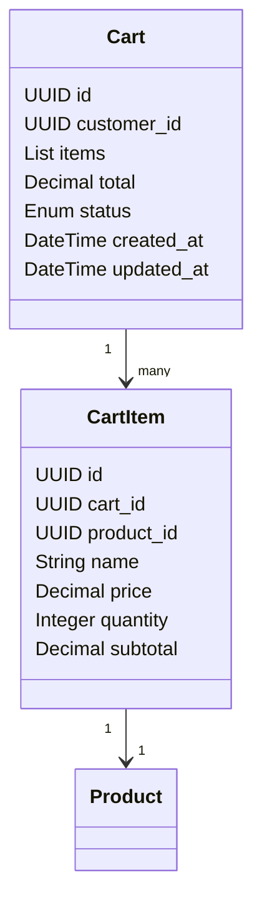
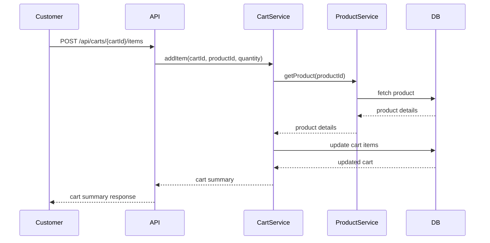

# Shopping Cart Management Backend Engineering Specification Package

---

## Executive Summary

This specification details the backend engineering requirements for the Shopping Cart Management system, as described in Jira Story SCRUM-343. The system enables customers to add products to their shopping cart, manage item quantities, view cart contents, remove items, and handle empty cart states. The document covers domain modeling, API contracts, validation matrices, diagrams, LLD, implementation guide, QA, troubleshooting, and future considerations, ensuring production-ready quality and clarity for engineering teams.

---

## Detailed Analysis

### Functional Domains

- **Cart Management**: Add, update, remove products; manage quantities.
- **Product Display**: Show cart contents with product details and subtotals.
- **Cart Calculation**: Automatic recalculation of subtotals and totals.
- **Empty Cart Handling**: Display message and link when cart is empty.

### Business Rules

- Adding a product sets quantity to 1 if not already in cart.
- Updating quantity recalculates subtotal and total.
- Removing an item updates totals.
- Cart must display all items with name, price, quantity, subtotal.
- If cart is empty, show message and link.

### Out-of-Scope Items

- Checkout/payment processing.
- Inventory reservation.
- User authentication (assume customer is identified).
- Product catalog management.

### Guardrails

- Cart operations must be atomic.
- Cart must be associated with a customer (session or user).
- Quantities must be positive integers.
- No negative prices or subtotals.

---

## Deliverables

### 1. Domain Entities

#### Cart

| Attribute      | Type      | Description                       |
|----------------|-----------|-----------------------------------|
| id             | UUID      | Unique cart identifier            |
| customer_id    | UUID      | Associated customer               |
| items          | List<CartItem> | List of cart items         |
| total          | Decimal   | Cart total price                  |
| status         | Enum      | ACTIVE, CHECKED_OUT, ABANDONED    |
| created_at     | DateTime  | Cart creation timestamp           |
| updated_at     | DateTime  | Last update timestamp             |

#### CartItem

| Attribute      | Type      | Description                       |
|----------------|-----------|-----------------------------------|
| id             | UUID      | Unique cart item identifier       |
| cart_id        | UUID      | Associated cart                   |
| product_id     | UUID      | Product identifier                |
| name           | String    | Product name                      |
| price          | Decimal   | Product unit price                |
| quantity       | Integer   | Quantity in cart                  |
| subtotal       | Decimal   | price * quantity                  |

#### Product (Reference Only)

| Attribute      | Type      | Description                       |
|----------------|-----------|-----------------------------------|
| id             | UUID      | Product identifier                |
| name           | String    | Product name                      |
| price          | Decimal   | Product price                     |

---

### 2. API Contracts

#### Add Product to Cart

- **Endpoint**: `POST /api/carts/{cartId}/items`
- **Request Body**:
    ```json
    {
      "product_id": "string",
      "quantity": 1
    }
    ```
- **Response**:
    ```json
    {
      "cart_id": "string",
      "items": [
        {
          "product_id": "string",
          "name": "string",
          "price": 12.34,
          "quantity": 1,
          "subtotal": 12.34
        }
      ],
      "total": 12.34
    }
    ```
- **Errors**:
    - 404: Cart or Product not found
    - 400: Invalid quantity

#### View Cart

- **Endpoint**: `GET /api/carts/{cartId}`
- **Response**:
    ```json
    {
      "cart_id": "string",
      "items": [
        {
          "product_id": "string",
          "name": "string",
          "price": 12.34,
          "quantity": 2,
          "subtotal": 24.68
        }
      ],
      "total": 24.68,
      "empty": false
    }
    ```
    If cart is empty:
    ```json
    {
      "cart_id": "string",
      "items": [],
      "total": 0,
      "empty": true,
      "message": "Your cart is empty",
      "continue_shopping_url": "/products"
    }
    ```

#### Update Item Quantity

- **Endpoint**: `PUT /api/carts/{cartId}/items/{itemId}`
- **Request Body**:
    ```json
    {
      "quantity": 3
    }
    ```
- **Response**:
    ```json
    {
      "cart_id": "string",
      "items": [
        {
          "product_id": "string",
          "name": "string",
          "price": 12.34,
          "quantity": 3,
          "subtotal": 37.02
        }
      ],
      "total": 37.02
    }
    ```
- **Errors**:
    - 404: Cart or Item not found
    - 400: Invalid quantity

#### Remove Item

- **Endpoint**: `DELETE /api/carts/{cartId}/items/{itemId}`
- **Response**:
    ```json
    {
      "cart_id": "string",
      "items": [
        // remaining items
      ],
      "total": 0 // if cart is empty
    }
    ```
- **Errors**:
    - 404: Cart or Item not found

---

### 3. Validation Matrix

| Operation            | Field         | Validation Rule                  | Error Code | Message                     |
|----------------------|--------------|----------------------------------|------------|-----------------------------||
| Add to Cart          | product_id   | Must exist in catalog            | 404        | Product not found           |
| Add to Cart          | quantity     | Must be integer >= 1             | 400        | Invalid quantity            |
| Update Quantity      | quantity     | Must be integer >= 1             | 400        | Invalid quantity            |
| Remove Item          | itemId       | Must exist in cart               | 404        | Item not found              |
| View Cart            | cartId       | Must exist                       | 404        | Cart not found              |
| All                  | cartId       | Must belong to customer/session  | 403        | Access denied               |

---

### 4. Diagrams

#### Mermaid Class Diagram



#### Mermaid Sequence Diagram (Add to Cart)



---

### 5. LLD Documentation

#### MVC Layer Mapping

- **Model**: Cart, CartItem, Product (reference)
- **Controller**: CartController (handles API endpoints)
- **Service**: CartService (business logic, calculations), ProductService (product lookup)
- **Repository**: CartRepository, CartItemRepository (database operations)

#### Business Logic

- **Add to Cart**:
    - Validate product existence.
    - If item exists in cart, increment quantity; else add new item.
    - Recalculate subtotal and total.
    - Persist changes.

- **View Cart**:
    - Fetch cart and items.
    - Calculate totals.
    - If empty, return empty message and link.

- **Update Quantity**:
    - Validate quantity.
    - Update item quantity.
    - Recalculate subtotal and total.
    - Persist changes.

- **Remove Item**:
    - Delete item from cart.
    - Recalculate totals.
    - If cart empty, set total to 0.

#### Database Effects

- Cart and CartItem tables updated on add, update, remove.
- Cart total recalculated and persisted.
- No direct effect on Product table.

---

## Implementation Guide

1. **Set up Models**: Define Cart and CartItem entities.
2. **Create Repositories**: Implement CartRepository and CartItemRepository.
3. **Develop Services**: CartService for cart operations, ProductService for product validation.
4. **Build Controllers**: CartController exposes REST endpoints.
5. **Implement Validations**: Enforce rules as per validation matrix.
6. **Write Unit and Integration Tests**: Cover all business logic and edge cases.
7. **Document API**: Use OpenAPI/Swagger for endpoint documentation.
8. **Deploy and Monitor**: Ensure atomicity and consistency in cart operations.

---

## Quality Assurance Report

- **Test Cases**:
    - Add product to cart (new/existing).
    - View cart (with/without items).
    - Update item quantity (valid/invalid).
    - Remove item (valid/invalid).
    - Empty cart state.
- **Edge Cases**:
    - Add invalid product.
    - Update quantity to zero or negative.
    - Remove non-existent item.
    - Unauthorized cart access.
- **Performance**:
    - Cart operations must be fast (<200ms typical).
    - Cart totals recalculated efficiently.
- **Security**:
    - Cart access restricted to owner.
    - Input validation prevents injection.

---

## Troubleshooting and Support

- **Common Issues**:
    - Cart not found: Ensure cartId is valid and belongs to user.
    - Product not found: Validate product_id before adding.
    - Quantity errors: Enforce integer >= 1.
    - Totals mismatch: Recalculate after every cart change.
- **Logging**:
    - Log all cart operations with user and cartId.
    - Log validation failures and errors.
- **Support**:
    - Provide API error messages with clear guidance.
    - Document troubleshooting steps for common failures.

---

## Future Considerations

- **Persistence**: Support for guest carts (session-based) and registered user carts.
- **Inventory Integration**: Check stock before adding/updating items.
- **Promotions/Discounts**: Extend CartItem and Cart to handle discounts.
- **Multi-currency**: Adapt price and total calculations.
- **Checkout Integration**: Seamless handoff to order processing.
- **Cart Expiry**: Implement cart expiration policy.
- **Bulk Operations**: Add/remove multiple items at once.

---

**This backend engineering specification is ready for implementation and provides all necessary technical artifacts for Shopping Cart Management.**
