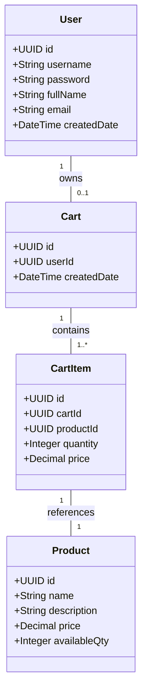
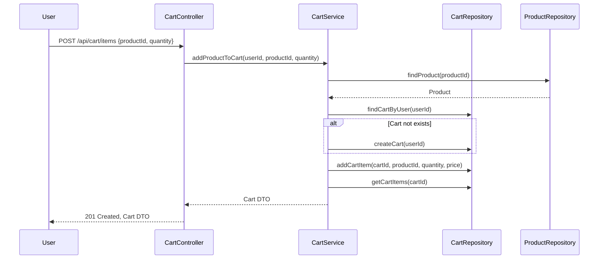
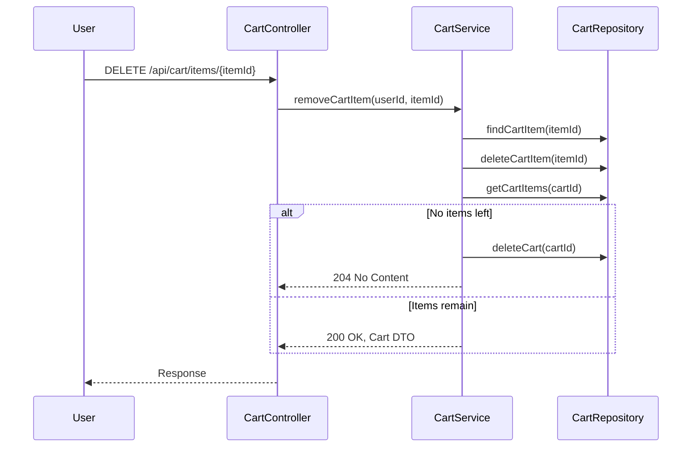

# Backend Engineering Specification Package: Shopping Cart System (SCRUM-96)

---

## Executive Summary

This specification details the backend architecture and implementation plan for a shopping cart system in Java Spring Boot (MVC). The system supports user management, product search, and cart operations, with strict enforcement of business rules and database validation. APIs are RESTful, data is persisted in a relational database, and the cart lifecycle is tightly controlled. Out-of-scope features (checkout, payments, inventory locking, admin, password changes) are explicitly excluded. This document provides domain models, API contracts, validation matrices, diagrams, LLD, and all supporting materials for production engineering.

---

## Detailed Analysis

### 1. Functional Domains

- **User Management**: Sign-Up, Sign-In, View Profile, Update Profile
- **Product Catalog**: Product Search
- **Shopping Cart**: Lazy Cart Creation, Add/Update/Remove Cart Item, View Cart, Auto-Delete Empty Cart, Cart Cleanup on Logout

### 2. Explicit Rules & Guardrails

- **User**: Unique username, must exist before cart ops, username immutable, password changes out of scope
- **Product**: Must exist, price immutable, searchable by keyword (case-insensitive)
- **Cart**: One active cart per user, cart belongs to one user, no cart without items, auto-delete empty cart, delete cart on logout, cart not persisted across sessions
- **Cart Item**: Belongs to one cart, product must exist, quantity > 0

### 3. Out-of-Scope Items

- Checkout/Orders, Payments, Inventory reservation, Admin product management, Password reset/change, User roles & permissions, Cart persistence across sessions

### 4. MVC Layer Mapping

- **Controller**: API endpoints, request/response mapping, error handling
- **Service**: Business logic, validation, cart lifecycle, cleanup
- **Repository**: DB access, constraints, FK enforcement
- **View**: API response models

---

## Deliverables

### A. Domain Entities & Attributes

#### 1. User

| Field         | Type      | Constraints                |
|---------------|-----------|----------------------------|
| id            | UUID      | PK                         |
| username      | String    | Unique, immutable, required|
| password      | String    | Required                   |
| fullName      | String    | Required                   |
| email         | String    | Required, valid email      |
| createdDate   | DateTime  | Auto-generated             |

#### 2. Product

| Field         | Type      | Constraints                |
|---------------|-----------|----------------------------|
| id            | UUID      | PK                         |
| name          | String    | Required                   |
| description   | String    | Optional                   |
| price         | Decimal   | Required, immutable        |
| availableQty  | Integer   | Required                   |

#### 3. Cart

| Field         | Type      | Constraints                |
|---------------|-----------|----------------------------|
| id            | UUID      | PK                         |
| userId        | UUID      | FK to User, required       |
| createdDate   | DateTime  | Auto-generated             |

#### 4. CartItem

| Field         | Type      | Constraints                |
|---------------|-----------|----------------------------|
| id            | UUID      | PK                         |
| cartId        | UUID      | FK to Cart, required       |
| productId     | UUID      | FK to Product, required    |
| quantity      | Integer   | Required, > 0              |
| price         | Decimal   | Snapshot of product price  |

---

### B. REST API Contracts

#### 1. User Management

**POST /api/users/signup**
- Request: `{ "username": "...", "password": "...", "fullName": "...", "email": "..." }`
- Response: `201 Created`, `{ "id": "...", "username": "...", "fullName": "...", "email": "...", "createdDate": "..." }`
- Errors: `409 UsernameExists`, `400 ValidationError`

**POST /api/users/signin**
- Request: `{ "username": "...", "password": "..." }`
- Response: `200 OK`, `{ "id": "...", "username": "...", "fullName": "...", "email": "...", "createdDate": "..." }`
- Errors: `401 InvalidCredentials`, `404 UserNotFound`

**GET /api/users/profile**
- Auth required
- Response: `200 OK`, `{ "username": "...", "fullName": "...", "email": "...", "createdDate": "..." }`
- Errors: `401 Unauthorized`

**PUT /api/users/profile**
- Auth required
- Request: `{ "fullName": "...", "email": "..." }`
- Response: `200 OK`, `{ "username": "...", "fullName": "...", "email": "...", "createdDate": "..." }`
- Errors: `400 ValidationError`, `401 Unauthorized`

#### 2. Product Catalog

**GET /api/products/search?keyword=...**
- Response: `200 OK`, `[ { "id": "...", "name": "...", "description": "...", "price": "...", "availableQty": ... } ]`
- Errors: `400 ValidationError`

#### 3. Shopping Cart

**POST /api/cart/items**
- Request: `{ "productId": "...", "quantity": ... }`
- Response: `201 Created`, `{ "cartId": "...", "items": [ ... ], "grandTotal": ... }`
- Errors: `400 ValidationError`, `404 ProductNotFound`, `401 Unauthorized`

**PUT /api/cart/items/{itemId}**
- Request: `{ "quantity": ... }`
- Response: `200 OK`, `{ "cartId": "...", "items": [ ... ], "grandTotal": ... }`
- Errors: `400 ValidationError`, `404 CartItemNotFound`, `401 Unauthorized`

**DELETE /api/cart/items/{itemId}**
- Response: `200 OK`, `{ "cartId": "...", "items": [ ... ], "grandTotal": ... }` (if items remain)
- If last item removed: `204 No Content` (cart deleted)
- Errors: `404 CartItemNotFound`, `401 Unauthorized`

**GET /api/cart**
- Response: `200 OK`, `{ "cartId": "...", "items": [ { "itemId": "...", "productId": "...", "name": "...", "quantity": ..., "price": ..., "total": ... } ], "grandTotal": ... }`
- If no cart: `404 CartNotFound`
- Errors: `401 Unauthorized`

**POST /api/logout**
- Response: `200 OK`
- Effect: Cart and items deleted from DB
- Errors: `401 Unauthorized`

---

### C. Validation Matrix

| Field         | Rule/Constraint             | Layer(s)        | Error Code         |
|---------------|----------------------------|-----------------|--------------------|n| username      | Unique, required           | DB, Service     | UsernameExists, ValidationError |
| password      | Required                   | Service         | ValidationError    |
| fullName      | Required                   | Service         | ValidationError    |
| email         | Required, valid format     | Service         | ValidationError    |
| productId     | Exists                     | Service, DB     | ProductNotFound    |
| quantity      | > 0                        | Service, DB     | ValidationError    |
| cartId        | Exists, belongs to user    | Service, DB     | CartNotFound       |
| itemId        | Exists in cart             | Service, DB     | CartItemNotFound   |
| cart          | Only one per user          | DB, Service     | ValidationError    |
| cart          | Auto-delete if empty       | Service, DB     | N/A                |
| cart          | Delete on logout           | Service, DB     | N/A                |

---

### D. Mermaid Diagrams

#### 1. Class Diagram

#### 2. Sequence Diagram: Add Product to Cart

#### 3. Sequence Diagram: Remove Last Item (Auto-Delete Cart)

---

### E. Low-Level Design (LLD) Documentation

#### 1. Scope

- Implement backend for user, product, and cart management
- Enforce all business rules at service and DB layers
- No session persistence at DB level
- Out-of-scope features strictly excluded

#### 2. Domain Model

- See class diagram and entity tables above

#### 3. API Contracts

- See REST API section above

#### 4. MVC Mapping

- **Controller**: Maps endpoints, validates input, handles errors
- **Service**: Business logic, validation, cart lifecycle, cleanup
- **Repository**: JPA/Hibernate, DB constraints, FK enforcement
- **View**: DTOs for API responses

#### 5. Business Logic Sequencing

- **Add to Cart**: Validate user, product, quantity; create cart if missing; add item; return cart
- **Update Item**: Validate item, quantity; update; if quantity zero, remove item
- **Remove Item**: Remove item; if last item, auto-delete cart
- **Logout**: Delete cart and items for user
- **Product Search**: Case-insensitive keyword search

#### 6. Validation & Error Handling

- All input validated at controller/service
- DB constraints for uniqueness, FK, quantity
- Error codes mapped to validation matrix

#### 7. Security

- Stateless authentication (e.g., JWT)
- No password change/reset endpoints
- No session data in DB

#### 8. Test Scenarios

- Sign-up with duplicate username
- Sign-in with wrong password
- Add product to cart (cart auto-creation)
- Remove last item (cart auto-deletion)
- Logout (cart cleanup)
- Product search (case-insensitive)
- Update profile (username immutable)
- Try out-of-scope endpoints (should fail)

#### 9. Non-Goals

- No checkout, payments, inventory locking, admin, password changes, cart persistence across sessions

---

## Implementation Guide

1. **Setup Spring Boot Project**: Entities, Repositories, Services, Controllers
2. **Define Entities**: User, Product, Cart, CartItem
3. **Configure DB Constraints**: Unique username, FK relations, quantity > 0
4. **Implement Controllers**: Map endpoints, validate input
5. **Implement Services**: Cart lifecycle, business rules, cleanup logic
6. **Implement Repositories**: JPA interfaces, custom queries for search
7. **Configure Security**: Stateless JWT auth
8. **Write Tests**: Unit, integration, negative cases
9. **Document APIs**: Swagger/OpenAPI

---

## Quality Assurance Report

- **Validation Coverage**: All fields mapped, constraints enforced at service and DB
- **Rule Enforcement**: Cart lifecycle, auto-deletion, cleanup on logout, uniqueness, FK
- **Error Handling**: All error cases mapped to codes, responses standardized
- **Out-of-Scope Guardrails**: No endpoints/logic for excluded features
- **Consistency**: Domain models, APIs, and DB schema aligned
- **Scalability**: Stateless design, clean separation of concerns
- **Extensibility**: Entities and APIs structured for future features

---

## Troubleshooting & Support

- **Common Issues**:
    - Duplicate username: Returns 409
    - Invalid credentials: Returns 401
    - Cart not found: Returns 404
    - Product not found: Returns 404
    - Quantity invalid: Returns 400

- **Debugging Tips**:
    - Check DB constraints for uniqueness/FK errors
    - Validate JWT tokens for auth issues
    - Ensure cart cleanup logic triggers on logout and last item removal

---

## Future Considerations

- **Feedback Mechanisms**: Add API usage logging, error tracking, and automated validation reports
- **Extensibility**: Prepare for future features (checkout, payments, inventory) by modularizing service layer
- **Security Enhancements**: Add password reset/change, roles/permissions if scope expands
- **Performance**: Optimize product search queries, cache product catalog
- **Monitoring**: Integrate with APM tools for real-time health checks

---

# END OF SPECIFICATION PACKAGE

This document is production-ready and suitable for direct engineering implementation, code generation, and QA planning. All requirements, constraints, and business rules are explicitly mapped and validated against the original Jira story.