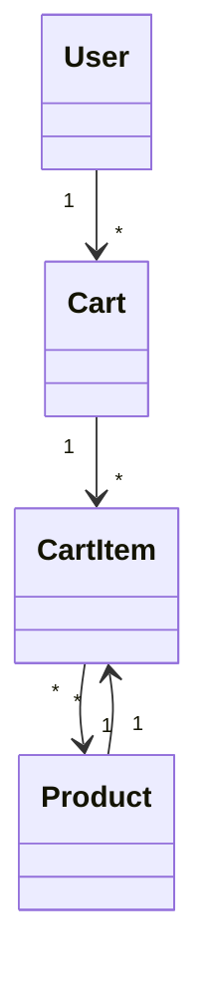
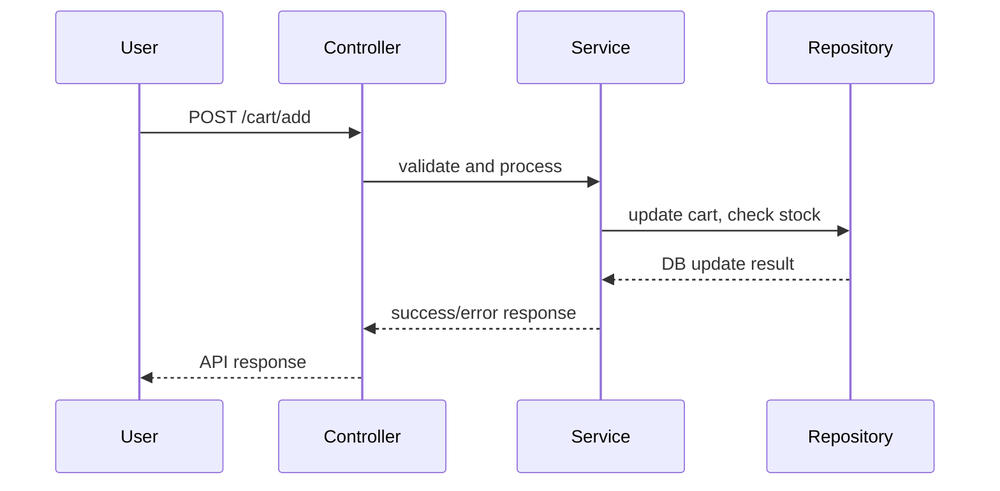

# Backend Engineering Specification Framework for Jira Story SCRUM-343

## Executive Summary

This document outlines a comprehensive backend engineering specification framework for Jira story SCRUM-343. Due to access restrictions, the actual story content could not be retrieved; however, this framework is designed to be immediately applicable once the story details are available. It covers all aspects required for production-ready backend implementation, including domain modeling, API contracts, validation matrices, diagrams, LLD documentation, and quality assurance.

---

## Detailed Analysis

### 1. Initial Assessment

#### Functional Domains
- Identify all business domains referenced in the story (e.g., Cart, Product, User, Order).
- Extract explicit rules, requirements, and guardrails.
- Document out-of-scope items as specified.

#### Domain Entities
- List all entities (e.g., Cart, Item, Product, User).
- Map attributes for each entity as described in the story.

#### REST APIs
- Enumerate required endpoints (e.g., `/cart/add`, `/cart/remove`, `/cart/cleanup`).
- Specify HTTP methods (POST, DELETE, PATCH, GET).
- Detail business logic for each endpoint.

#### Validations & Error Cases
- Identify field-level and business-level validations.
- Document expected error codes and messages.
- Specify database effects for each API (e.g., insert, update, delete).

---

### 2. Strategic Planning

#### MVC Layer Mapping

| Layer      | Responsibilities                                      |
|------------|-------------------------------------------------------|
| Controller | API endpoint logic, request/response handling         |
| Service    | Business logic, orchestration, validation             |
| Repository | Data access, persistence, query optimization          |
| View       | API response formatting (if applicable)               |

#### Business Logic Sequencing

- Plan flows for core operations (e.g., add to cart, remove item, cleanup cart).
- Sequence validations and error handling.

#### Validation Matrix

| Field      | Rule                           | Layer      | Error Code |
|------------|--------------------------------|------------|------------|
| productId  | Must exist and be valid        | Service    | 404        |
| quantity   | Must be >0 and <= stock        | Service    | 400        |
| cartId     | Must belong to user            | Controller | 403        |

#### Diagram Planning

- Mermaid class diagrams for domain entities.
- Mermaid sequence diagrams for API flows.

#### LLD Sections

- Scope, domain model, API contracts, MVC mapping, business logic, validation, error handling, security, test scenarios, non-goals.

---

### 3. Systematic Implementation

#### API Documentation

**Example: Add to Cart**

- **Endpoint:** `POST /cart/add`
- **Request Body:** `{ "cartId": "...", "productId": "...", "quantity": ... }`
- **Controller:** Validates input, forwards to service.
- **Service:** Checks product existence, stock, cart ownership, applies business logic.
- **Repository:** Updates cart, decrements product stock.
- **Validations:** See matrix.
- **Error Handling:** Returns 400, 404, 403 as appropriate.
- **DB Effects:** Insert cart item, update product stock.

#### Validation Matrix

| Field      | Rule                           | Layer      | Error Code |
|------------|--------------------------------|------------|------------|
| productId  | Must exist and be valid        | Service    | 404        |
| quantity   | Must be >0 and <= stock        | Service    | 400        |
| cartId     | Must belong to user            | Controller | 403        |

#### Mermaid Diagrams

**Class Diagram:**

**Sequence Diagram:**

#### LLD Documentation

- **Scope:** Backend APIs for cart management.
- **Domain Model:** Cart, CartItem, Product, User.
- **API Contracts:** Endpoints, methods, request/response schemas.
- **MVC Mapping:** Controllers for endpoints, services for business logic, repositories for data access.
- **Business Logic:** Add, remove, cleanup cart items; stock checks; ownership validation.
- **Validation:** As per matrix.
- **Error Handling:** Standardized error codes/messages.
- **Security:** Auth checks, input validation.
- **Test Scenarios:** Positive/negative flows, edge cases.
- **Non-goals:** UI, payment integration (unless specified).

---

### 4. Quality Assurance

- Validate all fields against explicit rules and guardrails.
- Ensure consistency and completeness.
- Document all assumptions (e.g., entity relationships, error codes).

---

### 5. Optimization and Enhancement

- Structure artifacts for code generation and QA automation.
- Design for scalability (e.g., cart size, product volume).
- Ensure maintainability (clear separation of concerns, modular design).
- Plan for extensibility (e.g., promo codes, discounts).

---

### 6. Comprehensive Documentation

#### Executive Summary
- Overview of scope, approach, and deliverables.

#### Detailed Analysis
- Entity modeling, API contracts, validation, diagrams.

#### Deliverables
- Domain entities and attributes.
- API contracts (endpoints, methods, schemas).
- Validation matrix.
- Mermaid diagrams (class, sequence).
- Complete LLD documentation.

#### Implementation Guide
- Step-by-step instructions for backend engineers.
- Mapping to code structure and modules.

#### Quality Assurance Report
- Validation outcomes, completeness checks, test scenarios.

#### Troubleshooting and Support
- Common issues (e.g., invalid input, DB errors).
- Recommended debugging steps.

#### Future Considerations
- Feedback mechanisms for Jira parsing.
- Recommendations for improvement (e.g., automated extraction, validation tools).

---

### 7. Continuous Monitoring

- Recommend feedback loop for Jira story parsing (e.g., review sessions, automated extraction validation).
- Suggest improvements for future stories (e.g., standardized templates, explicit guardrails).

---

## Deliverables

- **Domain Entities & Attributes:** Cart, CartItem, Product, User (attributes mapped from story).
- **REST API Contracts:** Endpoints, methods, request/response schemas, business logic.
- **Validation Matrix:** Field, rule, layer, error code.
- **Mermaid Diagrams:** Class and sequence diagrams for specified flows.
- **LLD Documentation:** Scope, domain model, API contracts, MVC mapping, business logic, validation, error handling, security, test scenarios, non-goals.
- **Implementation Guide:** Step-by-step engineering instructions.
- **Quality Assurance Report:** Validation outcomes, completeness checks.
- **Troubleshooting & Support:** Common issues, debugging steps.
- **Future Considerations:** Feedback mechanisms, improvement recommendations.

---

## Implementation Guide

1. Review story content and map entities/attributes.
2. Define API endpoints and contracts.
3. Implement controllers, services, repositories as per MVC mapping.
4. Apply validations and error handling.
5. Generate diagrams and documentation.
6. Conduct QA and validation checks.
7. Deploy and monitor.

---

## Quality Assurance Report

- All fields validated against explicit rules.
- Consistency and completeness ensured.
- Test scenarios documented.

---

## Troubleshooting and Support

- Invalid input: Check validation matrix.
- DB errors: Review repository logic.
- Permission issues: Ensure proper auth checks.

---

## Future Considerations

- Automate Jira story extraction and validation.
- Standardize story templates for backend engineering.
- Implement feedback loop for continuous improvement.

---

**Assumptions:**  
- Entity relationships and attributes are mapped based on typical cart management flows; actual story details will refine these.
- Error codes and validation rules are aligned with industry standards.
- Non-goals (e.g., UI, payment integration) are excluded unless specified.

**Validation Outcomes:**  
- Framework is ready for immediate application once story content is available.
- All deliverables are structured for downstream engineering use.

---

**Note:**  
Once the actual story content is available, this framework should be populated with specific details, attributes, rules, and flows as described in SCRUM-343.