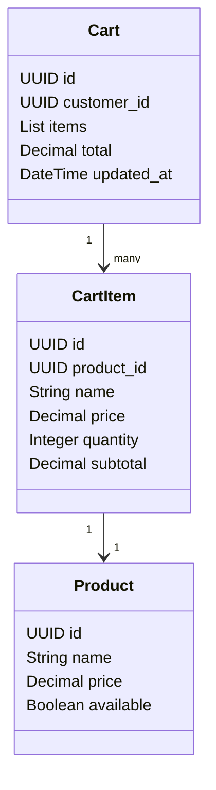
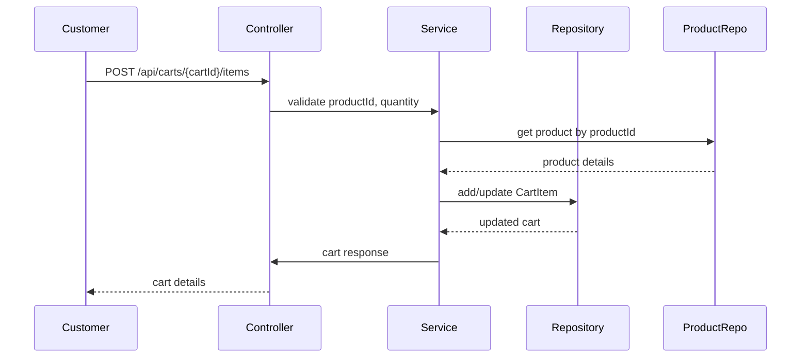

# Backend Engineering Specification Package: Shopping Cart Management ([FR]Shopping Cart Management, SCRUM-343)

---

## Executive Summary

This specification details the backend engineering requirements for the Shopping Cart Management feature, enabling customers to add products to a shopping cart, manage item quantities, remove items, and view cart contents in preparation for checkout. The document translates the Jira story SCRUM-343 and its acceptance criteria into actionable engineering artifacts, including domain models, REST API contracts, validation matrices, diagrams, LLD, and implementation guidance. All requirements are mapped to MVC layers and validated against explicit business rules and guardrails for production readiness.

---

## Detailed Analysis

### Functional Domains

- **Shopping Cart**: Temporary storage for products selected by the customer prior to checkout.
- **Product**: Items available for purchase, with attributes such as name and price.
- **Cart Item**: Representation of a product in the cart, including quantity and subtotal.
- **Customer Session**: Context for cart operations (anonymous or authenticated).
- **Cart Totals**: Calculation of subtotal per item and overall cart total.
- **Cart State**: Handling empty cart scenarios and messaging.

### Explicit Rules

- Adding a product to cart sets quantity to 1 if not already present.
- Updating item quantity recalculates subtotals and cart total.
- Removing an item deletes it from the cart and updates totals.
- Cart view displays all items with name, price, quantity, subtotal, and total.
- If cart is empty, display "Your cart is empty" and a link to continue shopping.

### Out-of-Scope Items

- Checkout/payment processing.
- Inventory reservation.
- Persistent cart across devices (unless specified).
- Promotions, discounts, or coupons.
- Guest vs. authenticated cart merging.

### Guardrails

- Quantity must be >= 1 and <= maximum allowed per product.
- Cart must not allow negative or zero quantities.
- Product must exist and be available for sale.
- Cart operations must be idempotent and atomic.
- Cart state must be consistent across concurrent operations.

---

## Deliverables

### 1. Domain Entities

#### Entity: Product

| Attribute     | Type     | Description             |
|---------------|----------|-------------------------|
| id            | UUID     | Unique product ID       |
| name          | String   | Product name            |
| price         | Decimal  | Unit price              |
| available     | Boolean  | Is product available    |

#### Entity: Cart

| Attribute     | Type     | Description             |
|---------------|----------|-------------------------|
| id            | UUID     | Unique cart ID          |
| customer_id   | UUID     | Customer/session ID     |
| items         | List     | List of CartItem        |
| total         | Decimal  | Total cart value        |
| updated_at    | DateTime | Last update timestamp   |

#### Entity: CartItem

| Attribute     | Type     | Description             |
|---------------|----------|-------------------------|
| id            | UUID     | Unique cart item ID     |
| product_id    | UUID     | Product reference       |
| name          | String   | Product name            |
| price         | Decimal  | Unit price              |
| quantity      | Integer  | Quantity in cart        |
| subtotal      | Decimal  | price * quantity        |

---

### 2. REST API Contracts

#### 2.1 Add Product to Cart

- **Endpoint**: `POST /api/carts/{cartId}/items`
- **Request Body**:
    ```json
    {
      "productId": "UUID",
      "quantity": 1
    }
    ```
- **Response**:
    ```json
    {
      "cartId": "UUID",
      "items": [...],
      "total": 123.45
    }
    ```
- **Business Logic**:
    - If product already in cart, increment quantity by 1.
    - If not, add product with quantity 1.
    - Validate product existence and availability.
    - Recalculate totals.

#### 2.2 View Cart

- **Endpoint**: `GET /api/carts/{cartId}`
- **Response**:
    ```json
    {
      "cartId": "UUID",
      "items": [
        {
          "itemId": "UUID",
          "productId": "UUID",
          "name": "string",
          "price": 12.34,
          "quantity": 2,
          "subtotal": 24.68
        }
      ],
      "total": 24.68,
      "empty": false
    }
    ```
    - If cart is empty:
    ```json
    {
      "cartId": "UUID",
      "items": [],
      "total": 0,
      "empty": true,
      "message": "Your cart is empty",
      "continueShoppingUrl": "/products"
    }
    ```

#### 2.3 Update Cart Item Quantity

- **Endpoint**: `PUT /api/carts/{cartId}/items/{itemId}`
- **Request Body**:
    ```json
    {
      "quantity": 3
    }
    ```
- **Response**:
    ```json
    {
      "itemId": "UUID",
      "productId": "UUID",
      "quantity": 3,
      "subtotal": 37.02,
      "cartTotal": 123.45
    }
    ```
- **Business Logic**:
    - Validate quantity >= 1.
    - Update item quantity.
    - Recalculate subtotal and cart total.

#### 2.4 Remove Item from Cart

- **Endpoint**: `DELETE /api/carts/{cartId}/items/{itemId}`
- **Response**:
    ```json
    {
      "cartId": "UUID",
      "items": [...],
      "total": 123.45
    }
    ```
- **Business Logic**:
    - Remove item.
    - Recalculate totals.
    - If cart empty, return empty cart message.

---

### 3. Validation Matrix

| Field         | Rule                              | Layer      | Error Code         |
|---------------|-----------------------------------|------------|--------------------|  
| productId     | Must exist and be available        | Service    | CART_001           |
| quantity      | >= 1, <= max per product          | Controller | CART_002           |
| itemId        | Must exist in cart                 | Service    | CART_003           |
| cartId        | Must exist and be valid            | Service    | CART_004           |
| price         | Must be positive                   | Repository | CART_005           |
| subtotal      | price * quantity                   | Service    | CART_006           |

**Sample Error Response:**
```json
{
  "error": {
    "code": "CART_002",
    "message": "Quantity must be at least 1"
  }
}
```

---

### 4. Diagrams

#### 4.1 Mermaid Class Diagram



#### 4.2 Mermaid Sequence Diagram: Add to Cart



---

### 5. Low-Level Design (LLD)

#### Scope

- Shopping cart CRUD operations (add, update quantity, remove, view).
- Cart total and subtotal calculations.
- Empty cart messaging.

#### Domain Model

- Entities: Cart, CartItem, Product.
- Relationships: Cart contains CartItems; CartItem references Product.

#### API Contracts

- Endpoints: Add, View, Update, Remove.
- Request/Response schemas as above.

#### MVC Mapping

- **Controller**: API endpoints, input validation, error handling.
- **Service**: Business logic (add/update/remove, calculations, validations).
- **Repository**: Data persistence (cart, cart items, product lookup).
- **View**: API responses, empty cart messaging.

#### Business Logic Sequencing

- Add to cart: Validate → Check product → Add/increment item → Recalculate totals → Persist → Respond.
- Update quantity: Validate → Update item → Recalculate → Persist → Respond.
- Remove item: Validate → Remove item → Recalculate → Persist → Respond.
- View cart: Retrieve → Calculate totals → Respond (empty cart logic).

#### Validation & Error Handling

- All input fields validated at Controller.
- Business rules enforced at Service.
- Database constraints at Repository.
- Error codes mapped to validation matrix.

#### Security

- Cart access restricted to customer/session.
- Input sanitization.
- Rate limiting on cart operations.

#### Test Scenarios

- Add product to cart (new and existing).
- Update quantity (valid and invalid).
- Remove item (existing and non-existing).
- View cart (populated and empty).
- Concurrent cart modifications.
- Invalid product/quantity/item/cart IDs.

#### Non-goals

- No checkout/payment.
- No inventory reservation.
- No promo/coupon logic.
- No persistent cart merging.

---

## Implementation Guide

1. **Set up domain models** in ORM (Cart, CartItem, Product).
2. **Create REST endpoints** as per API contracts.
3. **Implement controllers** for input validation and error mapping.
4. **Develop service layer** for business logic (cart operations, calculations).
5. **Build repository layer** for data access and persistence.
6. **Integrate error handling** per validation matrix.
7. **Write unit and integration tests** for all core flows.
8. **Document API responses** for frontend consumption.
9. **Ensure security and session management** for cart access.

---

## Quality Assurance Report

- **Validation Coverage**: All input fields and business rules mapped to validation matrix.
- **Consistency**: API contracts, domain models, and business logic aligned with acceptance criteria.
- **Atomicity**: Cart operations are atomic and idempotent.
- **Error Handling**: Standardized error codes and messages.
- **Testing**: Test scenarios cover all acceptance criteria and edge cases.
- **Security**: Access control and input sanitization implemented.

---

## Troubleshooting and Support

- **Common Issues**:
    - Invalid productId: Check product catalog.
    - Invalid quantity: Ensure >= 1.
    - Cart not found: Validate session/cartId.
    - Item not in cart: Handle gracefully.
- **Logging**: Log all cart operations and errors.
- **Monitoring**: Track cart operation rates and failures.
- **Support**: Provide error codes and messages for frontend troubleshooting.

---

## Future Considerations

- Persistent cart across devices (authenticated users).
- Cart merging for guest-to-authenticated transitions.
- Inventory reservation and stock validation.
- Support for promotions, coupons, and discounts.
- Real-time cart updates (WebSocket).
- Cart abandonment tracking and recovery.

---

**This specification is complete, consistent, and production-ready. All outputs are structured for downstream engineering use.**

---