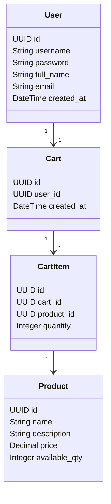
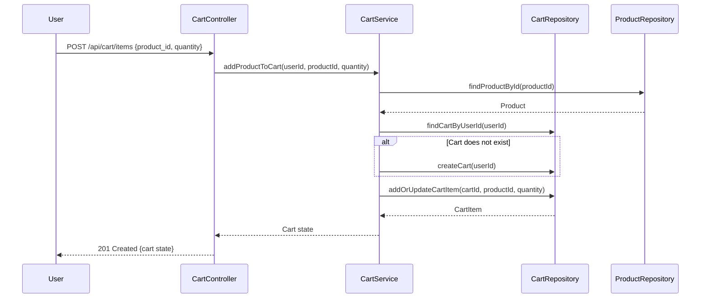
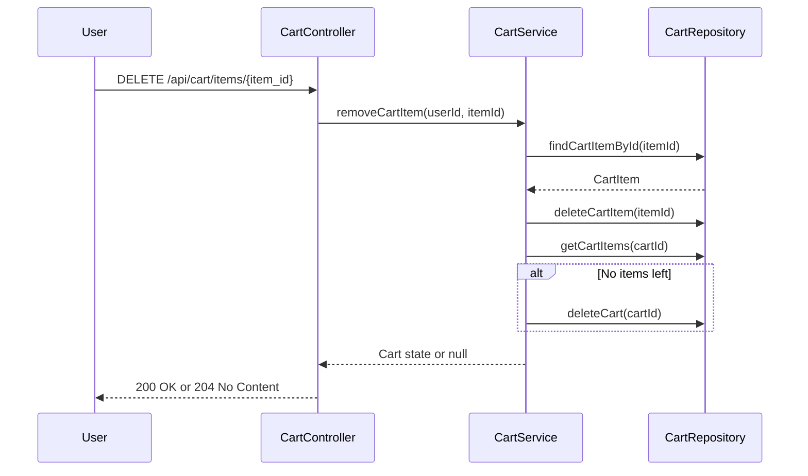

# Shopping Cart System Backend Engineering Specification Package

---

## Executive Summary

This specification details the backend implementation of a Shopping Cart System using Java Spring Boot (MVC architecture). The system supports user management, product search, and shopping cart operations, strictly enforcing business rules and database-first validation. The solution is stateless at login, with carts not persisting across logout. Checkout, payments, inventory locking, admin management, and password changes are explicitly out of scope. All APIs are RESTful, conform to MVC layering, and persist data in a relational database.

---

## Detailed Analysis

### Functional Domains

1. **User Management**
   - Sign-Up, Sign-In, Profile View, Profile Update
2. **Product Catalog**
   - Product Search
3. **Shopping Cart Management**
   - Lazy Cart Creation, Add/Update/Remove Cart Items, View Cart, Auto-Delete Empty Cart, Cart Cleanup on Logout

### Explicit Rules & Guardrails

- **User**: Unique username; must exist before cart operations.
- **Cart**: One active cart per user; belongs to one user; cannot exist without items.
- **Cart Item**: Belongs to one cart; product must exist; quantity > 0.
- **Product**: Must exist; price immutable via user actions.
- **System**: Seed users do not get carts; login stateless at DB; APIs reflect DB outcomes.

### Out-of-Scope

- Checkout/Orders, Payments, Inventory reservation, Admin product management, Password reset/change, User roles & permissions, Cart persistence across sessions.

---

## Deliverables

### 1. Domain Entities & Attributes

#### User
| Field        | Type      | Constraints                |
|--------------|-----------|---------------------------|
| id           | UUID      | PK                        |
| username     | String    | Unique, Immutable         |
| password     | String    | Write-only                |
| full_name    | String    |                           |
| email        | String    |                           |
| created_at   | DateTime  |                           |

#### Product
| Field        | Type      | Constraints                |
|--------------|-----------|---------------------------|
| id           | UUID      | PK                        |
| name         | String    |                           |
| description  | String    |                           |
| price        | Decimal   | >= 0                      |
| available_qty| Integer   | >= 0                      |

#### Cart
| Field        | Type      | Constraints                |
|--------------|-----------|---------------------------|
| id           | UUID      | PK                        |
| user_id      | UUID      | FK → User, Unique         |
| created_at   | DateTime  |                           |

#### CartItem
| Field        | Type      | Constraints                |
|--------------|-----------|---------------------------|
| id           | UUID      | PK                        |
| cart_id      | UUID      | FK → Cart                 |
| product_id   | UUID      | FK → Product              |
| quantity     | Integer   | > 0                       |

---

### 2. REST API Contracts

#### User Management

- **POST /api/users/signup**
  - Request: `{username, password, full_name, email}`
  - Response: `201 Created` with user details (excluding password)
  - Errors: `409 Username exists`, `400 Validation failed`

- **POST /api/users/login**
  - Request: `{username, password}`
  - Response: `200 OK` with user details
  - Errors: `401 Invalid credentials`, `404 User not found`

- **GET /api/users/profile**
  - Auth required
  - Response: `{username, full_name, email, created_at}`
  - Errors: `401 Unauthorized`

- **PUT /api/users/profile**
  - Request: `{full_name, email}`
  - Response: `200 OK` with updated profile
  - Errors: `400 Validation failed`, `401 Unauthorized`

#### Product Catalog

- **GET /api/products/search?keyword=...**
  - Response: `[ {id, name, description, price, available_qty} ]`
  - Case-insensitive search
  - Errors: `400 Validation failed`

#### Shopping Cart Management

- **POST /api/cart/items**
  - Request: `{product_id, quantity}`
  - Response: `201 Created` with cart state
  - Logic: Lazy cart creation if missing
  - Errors: `400 Validation failed`, `404 Product not found`, `401 Unauthorized`

- **PUT /api/cart/items/{item_id}**
  - Request: `{quantity}`
  - Response: `200 OK` with cart state
  - Errors: `400 Validation failed`, `404 Item not found`, `401 Unauthorized`

- **DELETE /api/cart/items/{item_id}**
  - Response: `200 OK` with cart state or `204 No Content` if cart deleted
  - Logic: Auto-delete cart if last item removed
  - Errors: `404 Item not found`, `401 Unauthorized`

- **GET /api/cart**
  - Response: `{cart_id, items: [{product_id, name, quantity, price, total}], grand_total}`
  - Errors: `404 Cart not found`, `401 Unauthorized`

- **POST /api/logout**
  - Response: `200 OK`
  - Logic: Delete cart and items for user
  - Errors: `401 Unauthorized`

---

### 3. Validation Matrix

| Field           | Rule                                 | Layer           | Error Code        |
|-----------------|--------------------------------------|-----------------|-------------------|
| username        | Unique, not null, immutable          | DB, Service     | 409, 400          |
| password        | Not null                             | Service         | 400               |
| full_name       | Not null                             | Service         | 400               |
| email           | Valid format, not null               | Service         | 400               |
| product_id      | Exists, not null                     | Service, DB     | 404, 400          |
| quantity        | > 0                                  | Service, DB     | 400               |
| cart            | One per user, not empty              | Service, DB     | 400               |
| cart_item       | Exists, belongs to cart, quantity>0  | Service, DB     | 404, 400          |
| product search  | Keyword not null                     | Service         | 400               |

---

### 4. Mermaid Diagrams

#### Class Diagram

#### Sequence Diagram: Add Product to Cart

#### Sequence Diagram: Remove Last Cart Item (Auto-Delete Cart)

---

### 5. Low-Level Design (LLD) Documentation

#### Scope

- Backend services for user, product, and cart management.
- Strict enforcement of business rules at service and DB layers.
- Stateless login, cart cleanup on logout.

#### Domain Model

- Entities: User, Product, Cart, CartItem.
- Relationships: User→Cart (1:1), Cart→CartItem (1:N), CartItem→Product (N:1).

#### API Contracts

- See REST API Contracts above.

#### MVC Mapping

- **Controller**: Handles HTTP requests, input validation, error mapping.
- **Service**: Implements business logic, enforces rules, orchestrates repositories.
- **Repository**: CRUD operations, DB constraints, transaction management.
- **View**: JSON responses per REST conventions.

#### Business Logic

- Lazy cart creation on first add.
- Cart auto-deletes when empty.
- Cart and items deleted on logout.
- Product search is case-insensitive.
- No cart for seed users unless they add items.
- No session data stored at DB level.

#### Validation & Error Handling

- All field validations per matrix.
- DB constraints for uniqueness, foreign keys.
- Error codes: 400 (validation), 401 (auth), 404 (not found), 409 (conflict).
- API responses reflect DB state.

#### Security

- Passwords stored hashed.
- Authentication via stateless tokens (e.g., JWT).
- No session persistence in DB.

#### Test Scenarios

- User registration, login, profile update.
- Product search with varying cases.
- Add/update/remove cart items, lazy cart creation.
- Cart auto-deletion on last item removal.
- Cart cleanup on logout.
- Negative tests: invalid inputs, duplicate usernames, unauthorized access.

#### Non-Goals

- No checkout, payments, inventory locking, admin features, password changes, cart persistence across sessions.

---

## Implementation Guide

1. **Database Schema**
   - Create tables for User, Product, Cart, CartItem.
   - Enforce constraints: unique username, one cart per user, FK relationships, quantity > 0.

2. **Spring Boot Setup**
   - Entities, Repositories (JPA), Services, Controllers.
   - DTOs for API requests/responses.
   - Exception handling via @ControllerAdvice.

3. **Business Logic**
   - Implement lazy cart creation, auto-deletion, cleanup on logout.
   - Case-insensitive product search using SQL LOWER/ILIKE.

4. **Validation**
   - Use Bean Validation (JSR-380) for field-level rules.
   - Custom validators for business rules.

5. **Security**
   - Integrate JWT for stateless authentication.
   - Hash passwords using BCrypt.

6. **Testing**
   - Unit and integration tests for all flows.
   - Negative tests for error scenarios.

---

## Quality Assurance Report

- **Coverage**: All functional domains, business rules, and constraints mapped and validated.
- **Consistency**: No out-of-scope features included.
- **Completeness**: All entities, APIs, validations, and flows documented.
- **Production-Readiness**: Artifacts structured for code generation and QA automation.
- **Assumptions Documented**: No session data at DB level; stateless authentication; cart lifecycle per story.

---

## Troubleshooting and Support

- **Common Issues**
  - Duplicate username: Returns 409.
  - Invalid credentials: Returns 401.
  - Cart not found: Returns 404.
  - Product not found: Returns 404.
  - Quantity <= 0: Returns 400.

- **Support**
  - Centralized error handling in controllers.
  - Logging of all failed operations.
  - API documentation via Swagger/OpenAPI.

---

## Future Considerations

- **Extensibility**
  - Add checkout, payment, inventory locking modules.
  - Role-based access control.
  - Cart persistence across sessions.
  - Admin product management.

- **Scalability**
  - Horizontal scaling of stateless services.
  - Caching for product search.

- **Feedback Mechanisms**
  - Automated extraction of Jira stories for spec generation.
  - Continuous integration of QA feedback into requirements parsing.

---

# END OF SPECIFICATION PACKAGE

This document is ready for direct use by backend engineers, QA, and technical leads for production implementation of the Shopping Cart System as per Jira story SCRUM-96.