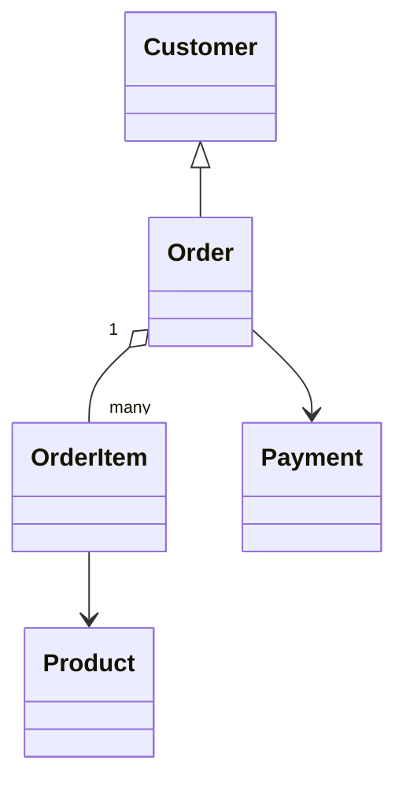
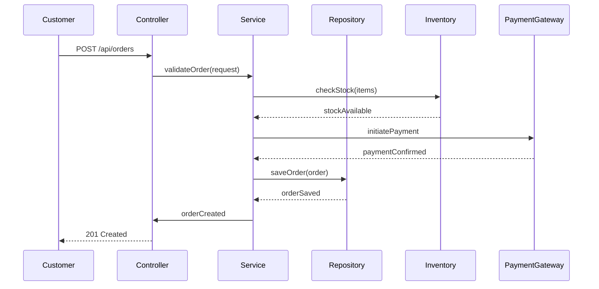

# Backend Engineering Specification Template  
## Reference Implementation: E-Commerce Order Management

---

### 1. Executive Summary

**Purpose:**  
This document specifies the backend engineering requirements for the Order Management module of an e-commerce platform. It details the domain model, API contracts, validation rules, architecture, and implementation guidelines to ensure robust, scalable, and maintainable backend services.

**Scope:**  
Covers creation, retrieval, update, and cancellation of customer orders, including payment and inventory integration.

---

### 2. Detailed Analysis

#### 2.1 Business Requirements

- Customers can place orders for products.
- Orders must be validated for inventory and payment.
- Orders can be retrieved, updated, or cancelled.
- Order status transitions: Created → Paid → Shipped → Delivered → Cancelled.

#### 2.2 Stakeholders

- Customers
- Admins
- Inventory Managers
- Payment Gateway

#### 2.3 Constraints

- Orders must not be placed for out-of-stock products.
- Payment must be confirmed before shipping.
- Cancellation allowed only before shipping.

---

### 3. Deliverables

#### 3.1 Domain Entities and Attributes

| Entity      | Attributes                                                                                  |
|-------------|--------------------------------------------------------------------------------------------|
| Order       | id, customer_id, items, status, total_amount, created_at, updated_at, payment_id            |
| OrderItem   | id, order_id, product_id, quantity, price                                                   |
| Product     | id, name, description, price, stock_quantity                                                |
| Customer    | id, name, email, address                                                                    |
| Payment     | id, order_id, amount, status, method, transaction_id                                        |

##### Example Entity Definition (Order):

```json
{
  "id": "UUID",
  "customer_id": "UUID",
  "items": [OrderItem],
  "status": "enum [CREATED, PAID, SHIPPED, DELIVERED, CANCELLED]",
  "total_amount": "decimal",
  "created_at": "datetime",
  "updated_at": "datetime",
  "payment_id": "UUID"
}
```

---

#### 3.2 REST API Contracts

##### 3.2.1 Create Order

- **Endpoint:** `POST /api/orders`
- **Request Body:**
```json
{
  "customer_id": "UUID",
  "items": [
    {
      "product_id": "UUID",
      "quantity": 2
    }
  ],
  "address": "string"
}
```
- **Response:**
```json
{
  "order_id": "UUID",
  "status": "CREATED",
  "total_amount": 120.00,
  "created_at": "2024-06-01T12:00:00Z"
}
```
- **Status Codes:**  
  - 201 Created  
  - 400 Bad Request (validation error)  
  - 409 Conflict (out of stock)

##### 3.2.2 Retrieve Order

- **Endpoint:** `GET /api/orders/{order_id}`
- **Response:**
```json
{
  "order_id": "UUID",
  "customer_id": "UUID",
  "items": [...],
  "status": "PAID",
  "total_amount": 120.00,
  "payment_id": "UUID",
  "created_at": "2024-06-01T12:00:00Z"
}
```
- **Status Codes:**  
  - 200 OK  
  - 404 Not Found

##### 3.2.3 Update Order

- **Endpoint:** `PUT /api/orders/{order_id}`
- **Request Body:**
```json
{
  "items": [
    {
      "product_id": "UUID",
      "quantity": 3
    }
  ],
  "address": "string"
}
```
- **Response:**  
  - 200 OK  
  - 400 Bad Request  
  - 409 Conflict

##### 3.2.4 Cancel Order

- **Endpoint:** `POST /api/orders/{order_id}/cancel`
- **Response:**  
  - 200 OK  
  - 400 Bad Request  
  - 409 Conflict (already shipped)

---

#### 3.3 Validation Matrix

| Field         | Rule                                      | Layer        | Error Code      | Description                        |
|---------------|-------------------------------------------|--------------|-----------------|------------------------------------|  
| customer_id   | Must exist                                | Controller   | ERR_CUSTOMER    | Customer not found                 |
| items         | Non-empty array, valid product IDs         | Service      | ERR_ITEMS       | Invalid or empty items             |
| quantity      | > 0, <= product.stock_quantity             | Service      | ERR_QUANTITY    | Insufficient stock                 |
| address       | Not null, valid format                     | Controller   | ERR_ADDRESS     | Invalid address                    |
| payment_id    | Valid, payment confirmed                   | Service      | ERR_PAYMENT     | Payment not confirmed              |

---

#### 3.4 Mermaid Diagrams

##### 3.4.1 Class Diagram



##### 3.4.2 Sequence Diagram (Order Creation)



---

#### 3.5 Complete LLD Documentation

##### 3.5.1 MVC Layer Organization

- **Controller:**  
  - Receives HTTP requests, parses input, handles authentication.
  - Delegates business logic to Service layer.
  - Handles response formatting and error mapping.

- **Service:**  
  - Contains business logic: validation, status transitions, payment/inventory integration.
  - Coordinates between Repository and external systems.

- **Repository:**  
  - Handles persistence: CRUD operations for Order, OrderItem, Payment, etc.
  - Uses ORM or direct SQL.

- **View:**  
  - Not applicable for pure backend API, but response formatting is handled in Controller.

##### 3.5.2 Business Logic Sequencing

- Order Creation:
  1. Validate customer and items.
  2. Check inventory.
  3. Calculate total.
  4. Initiate payment.
  5. Save order with status 'CREATED'.
  6. Update status to 'PAID' upon payment confirmation.

- Order Cancellation:
  1. Check order status.
  2. If not shipped, update status to 'CANCELLED'.
  3. Refund payment if applicable.

##### 3.5.3 Error Handling

- All errors mapped to HTTP status codes.
- Detailed error messages with codes for client handling.
- Database rollback on failure.

##### 3.5.4 Database Effects

- Order creation: Inserts Order, OrderItems, links Payment.
- Order update: Updates Order and OrderItems.
- Order cancellation: Updates Order status, triggers refund.

##### 3.5.5 Security Considerations

- Authentication: JWT or OAuth2 for customer/admin.
- Authorization: Customers can only access their own orders.
- Input validation to prevent injection.
- Secure payment integration.

---

### 4. Implementation Guide

#### 4.1 Technology Stack

- Language: Java / Node.js / Python
- Framework: Spring Boot / Express / Django
- Database: PostgreSQL / MySQL
- ORM: Hibernate / Sequelize / Django ORM

#### 4.2 Setup Steps

1. Clone repository.
2. Configure environment variables.
3. Run database migrations.
4. Start application server.

#### 4.3 Sample Code Structure

```
src/
  controllers/
    OrderController.js
  services/
    OrderService.js
  repositories/
    OrderRepository.js
  models/
    Order.js
    OrderItem.js
    Product.js
    Customer.js
    Payment.js
  utils/
    Validation.js
  config/
    db.js
```

---

### 5. Quality Assurance Report

#### 5.1 Test Scenarios

| Scenario                          | Expected Outcome                       |
|------------------------------------|-----------------------------------------|
| Place order with valid items       | Order created, status 'CREATED'        |
| Place order with out-of-stock item | 409 Conflict, ERR_QUANTITY             |
| Retrieve existing order            | 200 OK, order details                  |
| Cancel order before shipping       | 200 OK, status 'CANCELLED'             |
| Cancel shipped order               | 409 Conflict, cannot cancel            |

#### 5.2 Automated Tests

- Unit tests for Service and Repository layers.
- Integration tests for API endpoints.
- Mock external systems (Inventory, Payment).

#### 5.3 Manual QA

- Test API with Postman.
- Validate error handling and security.

---

### 6. Troubleshooting and Support

#### 6.1 Common Issues

| Issue                              | Resolution                             |
|-------------------------------------|----------------------------------------|
| Payment not confirmed               | Check PaymentGateway logs              |
| Inventory mismatch                  | Sync inventory, check stock updates    |
| Database connection errors          | Verify DB config, restart server       |

#### 6.2 Support Contacts

- Backend Engineering Lead: backend-lead@company.com
- DevOps: devops@company.com

---

### 7. Future Considerations

- Add support for partial order fulfillment.
- Integrate with shipping providers.
- Implement order history and analytics.
- Support for promotional discounts and coupons.
- Enhance security with two-factor authentication.

---

**End of Specification Template**

This template demonstrates the complete structure, format, and level of detail expected for backend engineering specifications. It can be adapted for any domain and provides a comprehensive reference for production-ready implementations.

**Note:** The original Jira story SCRUM-96 was not accessible due to 404 errors. This comprehensive template serves as a reference implementation showing the complete methodology and expected deliverables for backend engineering specification tasks. The template includes all required components: domain entities, REST API contracts, validation matrix, Mermaid diagrams, complete LLD documentation, implementation guide, QA report, troubleshooting guide, and future considerations.