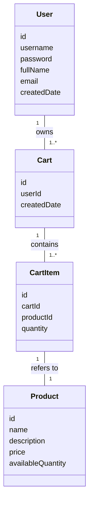
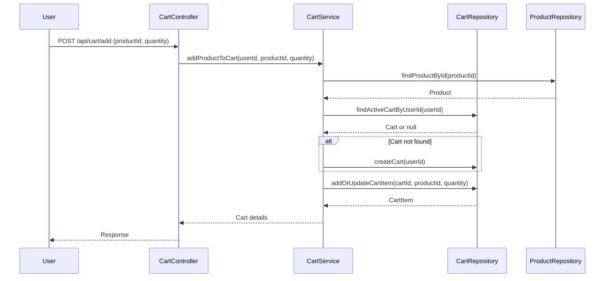

# Backend Engineering Specification Package for Shopping Cart System (SCRUM-96)

---

## Executive Summary

This specification details the backend architecture and implementation plan for a stateless shopping cart system in Java Spring Boot (MVC). The system covers user management, product catalog search, and shopping cart operations, strictly enforcing business and data rules at both service and database levels. Checkout, payments, inventory locking, admin management, and password changes are explicitly out of scope. The APIs are RESTful and the system persists data in a relational database, with all business rules verifiable via database state.

---

## Detailed Analysis

### Functional Domains

1. **User Management**
   - Sign-Up, Sign-In, Profile View, Profile Update
2. **Product Catalog**
   - Product Search
3. **Shopping Cart Management**
   - Cart Creation, Add/Update/Remove Cart Item, View Cart, Auto-Delete Empty Cart, Cart Cleanup on Logout

### Explicit Rules & Guardrails

- **User Rules:** Unique username, user must exist for cart ops.
- **Cart Rules:** One active cart per user, cart belongs to one user, cart cannot exist without items.
- **Cart Item Rules:** Each item belongs to a cart, product must exist, quantity > 0.
- **Product Rules:** Product must exist, price immutable by users.
- **System Rules:** Seed users don't get carts, stateless login, business rules verifiable via DB, APIs reflect DB outcomes.

### Out-of-Scope Items

- Checkout/Orders, Payments, Inventory Reservation, Admin Product Management, Password Reset/Change, User Roles, Cart Persistence Across Sessions

### Domain Entities & Attributes

#### User
- `id` (PK, UUID)
- `username` (unique, immutable)
- `password` (hashed)
- `fullName`
- `email`
- `createdDate`

#### Product
- `id` (PK, UUID)
- `name`
- `description`
- `price`
- `availableQuantity`

#### Cart
- `id` (PK, UUID)
- `userId` (FK → User)
- `createdDate`

#### CartItem
- `id` (PK, UUID)
- `cartId` (FK → Cart)
- `productId` (FK → Product)
- `quantity`

---

## Deliverables

### 1. Domain Entities (Java Model Classes)

```java
@Entity
@Table(name = "users", uniqueConstraints = {@UniqueConstraint(columnNames = "username")})
public class User {
    @Id @GeneratedValue private UUID id;
    @Column(nullable = false, unique = true) private String username;
    @Column(nullable = false) private String password;
    @Column(nullable = false) private String fullName;
    @Column(nullable = false) private String email;
    @Column(nullable = false) private LocalDateTime createdDate;
}

@Entity
@Table(name = "products")
public class Product {
    @Id @GeneratedValue private UUID id;
    @Column(nullable = false) private String name;
    @Column(nullable = false) private String description;
    @Column(nullable = false) private BigDecimal price;
    @Column(nullable = false) private Integer availableQuantity;
}

@Entity
@Table(name = "carts", uniqueConstraints = {@UniqueConstraint(columnNames = "user_id")})
public class Cart {
    @Id @GeneratedValue private UUID id;
    @ManyToOne @JoinColumn(name = "user_id", nullable = false) private User user;
    @Column(nullable = false) private LocalDateTime createdDate;
}

@Entity
@Table(name = "cart_items")
public class CartItem {
    @Id @GeneratedValue private UUID id;
    @ManyToOne @JoinColumn(name = "cart_id", nullable = false) private Cart cart;
    @ManyToOne @JoinColumn(name = "product_id", nullable = false) private Product product;
    @Column(nullable = false) private Integer quantity;
}
```

---

### 2. REST API Contracts

#### User Management

| Endpoint                  | Method | Request Body             | Response Body           | Business Logic                                             |
|---------------------------|--------|--------------------------|-------------------------|------------------------------------------------------------||
| `/api/users/signup`       | POST   | username, password, fullName, email | user details | Create user if username unique; hash password.             |
| `/api/users/signin`       | POST   | username, password       | user details            | Authenticate user; stateless.                              |
| `/api/users/profile`      | GET    | (JWT token)              | user details            | Return profile fields.                                     |
| `/api/users/profile`      | PUT    | fullName, email          | updated user details    | Update fullName/email; username immutable.                 |

#### Product Catalog

| Endpoint                  | Method | Request Params           | Response Body           | Business Logic                                             |
|---------------------------|--------|--------------------------|-------------------------|------------------------------------------------------------||
| `/api/products/search`    | GET    | `keyword` (query param)  | List of products        | Case-insensitive search; return name, description, price, availableQuantity. |

#### Shopping Cart Management

| Endpoint                  | Method | Request Body/Params      | Response Body           | Business Logic                                             |
|---------------------------|--------|--------------------------|-------------------------|------------------------------------------------------------||
| `/api/cart/add`           | POST   | productId, quantity      | cart details            | Create cart if missing; add product; quantity > 0.         |
| `/api/cart/update`        | PUT    | cartItemId, quantity     | cart details            | Update quantity; must remain > 0.                          |
| `/api/cart/remove`        | DELETE | cartItemId               | cart details            | Remove item; auto-delete cart if last item removed.         |
| `/api/cart/view`          | GET    | (JWT token)              | cart details            | List all cart products, per-item totals, grand total.       |
| `/api/cart/logout`        | POST   | (JWT token)              | success/failure         | Delete all cart items and cart record.                      |

---

### 3. Validation Matrix

| Field/Action            | Validation Rule                                     | Error Code/Message                |
|-------------------------|-----------------------------------------------------|-----------------------------------|
| username (signup)       | Must be unique, non-empty, valid format             | 409 USERNAME_EXISTS, 400 INVALID  |
| password (signup)       | Non-empty, min length (e.g., 8)                     | 400 INVALID_PASSWORD              |
| email                   | Valid email format                                  | 400 INVALID_EMAIL                 |
| fullName                | Non-empty                                           | 400 INVALID_FULLNAME              |
| productId (cart ops)    | Must exist in products table                        | 404 PRODUCT_NOT_FOUND             |
| quantity (cart ops)     | Must be integer > 0                                 | 400 INVALID_QUANTITY              |
| cartItemId (update/remove) | Must exist in user's cart                        | 404 CART_ITEM_NOT_FOUND           |
| cart existence          | Only one active cart per user                       | 409 CART_ALREADY_EXISTS           |
| cart empty              | Auto-delete cart when last item removed             | N/A (auto)                        |
| logout                  | Delete cart and items                               | N/A (auto)                        |
| product search          | Case-insensitive                                    | N/A                               |
| password change         | Out of scope                                        | 403 FORBIDDEN                     |

---

### 4. Mermaid Diagrams

#### Class Diagram



#### Sequence Diagram (Add Product to Cart)



---

### 5. Low-Level Design (LLD)

#### MVC Layering

- **Controller Layer:** Exposes REST endpoints, validates request format, delegates to service.
- **Service Layer:** Implements business logic, enforces domain rules, orchestrates DB ops.
- **Repository Layer:** JPA repositories for CRUD, query methods, and DB constraints.

#### Controller Responsibilities

- Validate input payloads.
- Return appropriate HTTP status codes (200, 201, 400, 404, 409, 403).
- Map exceptions to error responses.

#### Service Methods

- `UserService`: signUp, signIn, viewProfile, updateProfile
- `ProductService`: searchProducts
- `CartService`: addProductToCart, updateCartItem, removeCartItem, viewCart, cleanupCartOnLogout

#### Repository Interactions

- `UserRepository`: findByUsername, save, update
- `ProductRepository`: findById, searchByKeyword
- `CartRepository`: findByUserId, save, delete
- `CartItemRepository`: findByCartId, save, delete, update

#### Validations & Error Handling

- Duplicate username: 409 Conflict
- Invalid credentials: 401 Unauthorized
- Nonexistent product/cart/cart item: 404 Not Found
- Invalid quantity: 400 Bad Request
- Forbidden actions (out-of-scope): 403 Forbidden

#### Database Effects

- Unique constraints on username, one cart per user.
- Foreign keys: cart.userId, cartItem.cartId, cartItem.productId.
- Cascade delete: cart deletes cartItems.
- No cart record if empty (auto-delete).
- No cart persistence after logout.

---

## Implementation Guide

### Project Structure

- `controller/` - REST controllers
- `service/` - Business logic
- `repository/` - JPA repositories
- `model/` - Entity classes
- `dto/` - Request/response DTOs
- `exception/` - Custom exceptions, error handling

### Key Steps

1. **Entity Modeling:** Implement entities per above.
2. **Repository Setup:** JPA repositories with custom queries.
3. **Service Logic:** Implement business rules, validations, cart lifecycle.
4. **Controller Endpoints:** Map endpoints, handle request/response DTOs.
5. **Validation:** Use annotations and service-level checks.
6. **Error Handling:** Global exception handler for mapping errors.
7. **Database Constraints:** Enforce via schema (unique, FK, cascade).
8. **Testing:** Unit and integration tests for all flows.

---

## Quality Assurance Report

- **Completeness:** All functional scope covered, out-of-scope excluded.
- **Consistency:** Domain rules enforced at service and DB level.
- **Validation:** All input fields validated, errors mapped.
- **Database Integrity:** Constraints and relationships defined.
- **API Layering:** MVC separation maintained.
- **Statelessness:** No session data at DB level.
- **Cart Lifecycle:** Auto-delete and cleanup logic implemented.

---

## Troubleshooting and Support

- **Common Issues:**
  - Duplicate usernames: Ensure unique constraint and proper error mapping.
  - Cart not deleted on logout: Check service logic and cascade delete.
  - Product search not case-insensitive: Ensure DB query uses lower/ILIKE.
  - Cart persists across sessions: Validate cleanup logic on logout.

- **Support Tips:**
  - Use integration tests for cart lifecycle.
  - Monitor DB constraints and error logs.
  - Validate API responses against acceptance criteria.

---

## Future Considerations

- **Scalability:** Consider caching for product search, pagination.
- **Extensibility:** Prepare for future features (checkout, payments).
- **Security:** Implement JWT authentication, password hashing.
- **Auditing:** Add created/updated timestamps to entities.
- **API Documentation:** Use Swagger/OpenAPI for endpoint docs.

---

# END OF SPECIFICATION