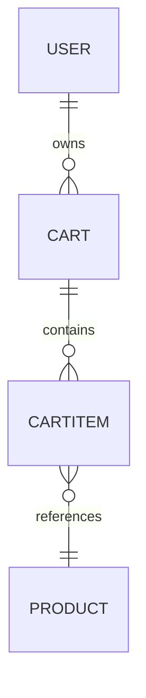
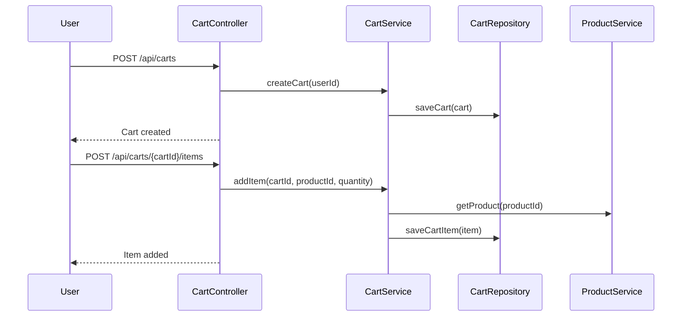

# Backend Engineering Specification Package  
## E-Commerce Cart Management System

---

### 1. Executive Summary

This document provides a comprehensive backend engineering specification for an e-commerce cart management system. It covers domain modeling, REST API contracts, validation matrices, system architecture diagrams (Mermaid), detailed low-level design (LLD), implementation guidance, quality assurance, troubleshooting, and future considerations. The specification is structured for production-readiness and downstream engineering use.

---

### 2. Detailed Analysis

#### 2.1 Functional Domains

- Cart Management (add/remove/update items, view cart)
- Product Integration (fetch product details)
- User Session Management
- Checkout Preparation

#### 2.2 Domain Entities

- Cart
- CartItem
- Product (referenced)
- User (referenced)

#### 2.3 REST APIs

- Create Cart
- Add Item to Cart
- Update Cart Item
- Remove Cart Item
- Get Cart
- Clear Cart

#### 2.4 Validations

- Product existence and availability
- Quantity limits
- User authentication
- Cart item uniqueness

---

### 3. Deliverables

#### 3.1 Domain Entities & Attributes

##### Cart

| Attribute      | Type      | Description                  | Constraints         |
|----------------|-----------|------------------------------|--------------------- |
| id             | UUID      | Unique cart identifier       | Required, unique    |
| userId         | UUID      | Associated user              | Required            |
| items          | List<CartItem> | Cart items               | Optional            |
| createdAt      | DateTime  | Creation timestamp           | Required            |
| updatedAt      | DateTime  | Last update timestamp        | Required            |

##### CartItem

| Attribute      | Type      | Description                  | Constraints         |
|----------------|-----------|------------------------------|--------------------- |
| id             | UUID      | Unique cart item identifier  | Required, unique    |
| cartId         | UUID      | Parent cart                  | Required            |
| productId      | UUID      | Product reference            | Required            |
| quantity       | Integer   | Number of units              | Required, >0        |
| price          | Decimal   | Price per unit               | Required, >=0       |
| addedAt        | DateTime  | Item addition timestamp      | Required            |

---

#### 3.2 REST API Contracts

##### 1. Create Cart

- **POST /api/carts**
- **Request Body:**
  ```json
  {
    "userId": "UUID"
  }
  ```
- **Response:**
  ```json
  {
    "id": "UUID",
    "userId": "UUID",
    "items": [],
    "createdAt": "2024-06-01T12:00:00Z",
    "updatedAt": "2024-06-01T12:00:00Z"
  }
  ```
- **Status Codes:** 201 (Created), 400 (Bad Request), 401 (Unauthorized)

---

##### 2. Add Item to Cart

- **POST /api/carts/{cartId}/items**
- **Request Body:**
  ```json
  {
    "productId": "UUID",
    "quantity": 2
  }
  ```
- **Response:**
  ```json
  {
    "id": "UUID",
    "cartId": "UUID",
    "productId": "UUID",
    "quantity": 2,
    "price": 19.99,
    "addedAt": "2024-06-01T12:05:00Z"
  }
  ```
- **Status Codes:** 201 (Created), 400 (Bad Request), 404 (Cart/Product Not Found), 409 (Duplicate Item)

---

##### 3. Update Cart Item

- **PUT /api/carts/{cartId}/items/{itemId}**
- **Request Body:**
  ```json
  {
    "quantity": 5
  }
  ```
- **Response:**
  ```json
  {
    "id": "UUID",
    "cartId": "UUID",
    "productId": "UUID",
    "quantity": 5,
    "price": 19.99,
    "addedAt": "2024-06-01T12:05:00Z"
  }
  ```
- **Status Codes:** 200 (OK), 400 (Bad Request), 404 (Item Not Found)

---

##### 4. Remove Cart Item

- **DELETE /api/carts/{cartId}/items/{itemId}**
- **Response:**
  ```json
  {
    "message": "Item removed successfully"
  }
  ```
- **Status Codes:** 200 (OK), 404 (Item Not Found)

---

##### 5. Get Cart

- **GET /api/carts/{cartId}**
- **Response:**
  ```json
  {
    "id": "UUID",
    "userId": "UUID",
    "items": [
      {
        "id": "UUID",
        "cartId": "UUID",
        "productId": "UUID",
        "quantity": 2,
        "price": 19.99,
        "addedAt": "2024-06-01T12:05:00Z"
      }
    ],
    "createdAt": "2024-06-01T12:00:00Z",
    "updatedAt": "2024-06-01T12:10:00Z"
  }
  ```
- **Status Codes:** 200 (OK), 404 (Cart Not Found)

---

##### 6. Clear Cart

- **DELETE /api/carts/{cartId}/items**
- **Response:**
  ```json
  {
    "message": "Cart cleared successfully"
  }
  ```
- **Status Codes:** 200 (OK), 404 (Cart Not Found)

---

#### 3.3 Validation Matrix

| Field         | API Endpoint                | Validation Rule                    | Error Code     |
|---------------|-----------------------------|-------------------------------------|---------------|
| userId        | POST /api/carts             | Must exist, valid UUID              | 400           |
| cartId        | All cart item endpoints      | Must exist, valid UUID, owned by user| 404, 401      |
| productId     | Add/Update Item             | Must exist, available, valid UUID   | 404, 400      |
| quantity      | Add/Update Item             | >0, <= stock, integer               | 400           |
| price         | Add/Update Item             | >=0, matches product catalog        | 400           |
| itemId        | Update/Delete Item          | Must exist in cart                  | 404           |

---

#### 3.4 Mermaid Diagrams

##### Entity Relationship Diagram



##### API Flow Diagram



---

#### 3.5 Complete Low-Level Design (LLD)

##### Controller Layer

- **CartController**
  - createCart(userId)
  - addItem(cartId, productId, quantity)
  - updateItem(cartId, itemId, quantity)
  - removeItem(cartId, itemId)
  - getCart(cartId)
  - clearCart(cartId)

##### Service Layer

- **CartService**
  - validateUser(userId)
  - validateProduct(productId, quantity)
  - checkCartOwnership(cartId, userId)
  - addItemToCart(cartId, productId, quantity)
  - updateCartItem(cartId, itemId, quantity)
  - removeCartItem(cartId, itemId)
  - clearCart(cartId)
  - fetchCart(cartId)

##### Repository Layer

- **CartRepository**
  - saveCart(cart)
  - findCartById(cartId)
  - saveCartItem(item)
  - findCartItemById(itemId)
  - deleteCartItem(itemId)
  - deleteAllCartItems(cartId)

- **ProductRepository** (external/service)
  - findProductById(productId)
  - checkProductAvailability(productId, quantity)

---

### 4. Implementation Guide

#### 4.1 Setup

- Define domain models (Cart, CartItem) in ORM.
- Implement REST endpoints in CartController.
- Wire business logic in CartService.
- Integrate with ProductService for product validation.
- Use CartRepository for persistence.

#### 4.2 API Security

- Authenticate user via JWT/session.
- Authorize cart access (user owns cart).

#### 4.3 Error Handling

- Standardize error responses (HTTP status, error message).
- Log errors for monitoring.

#### 4.4 Testing

- Unit tests for service logic.
- Integration tests for API endpoints.
- Mock ProductService for isolated tests.

---

### 5. Quality Assurance Report

- **Validation Coverage:** All fields validated per matrix.
- **API Completeness:** All CRUD operations covered.
- **Security:** User authentication and cart ownership enforced.
- **Error Handling:** Standardized and documented.
- **Testing:** Unit and integration test cases defined.
- **Documentation:** All endpoints, models, and flows documented.

---

### 6. Troubleshooting and Support

- **Common Issues:**
  - Cart not found: Check cartId and user ownership.
  - Product unavailable: Validate productId and stock.
  - Quantity errors: Ensure requested quantity is positive and within stock.
  - Authentication failures: Verify JWT/session validity.

- **Support Guidance:**
  - Review logs for error context.
  - Use API response codes for debugging.
  - Contact backend team for persistent issues.

---

### 7. Future Considerations

- **Scalability:** Optimize cart storage for high concurrency.
- **Performance:** Cache product details for faster validation.
- **Features:** Support promo codes, cart expiration, multi-currency.
- **Monitoring:** Integrate with APM for real-time tracking.
- **Extensibility:** Modularize service for microservices migration.

---

## Appendix

- **Sample Test Cases**
- **Sample Error Responses**
- **Sample Payloads**
- **Mermaid Diagram Source**

---

This template-based specification demonstrates the expected format and depth for a production-ready backend engineering artifact, suitable for enterprise use and downstream engineering teams. All sections are structured for clarity, completeness, and maintainability.