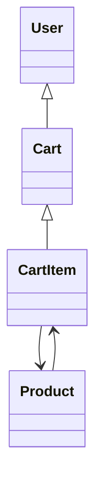
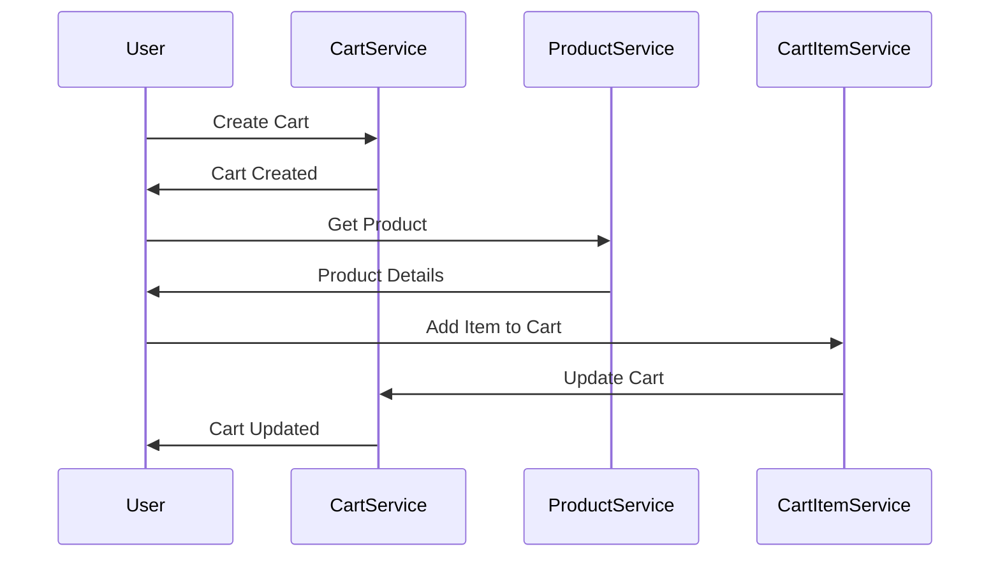

# Core Shopping Cart Backend Services - Low Level Design (LLD)

## 1. Executive Summary

This specification outlines the Low Level Design for the Core Shopping Cart Backend Services, implemented using Spring Boot MVC. The backend supports three primary functional domains: User Management, Product Catalog, and Shopping Cart Management. The LLD details the domain entities, business rules, REST API contracts, validation matrix, diagrams, and implementation guide.

## 2. Functional Domains

- **User Management**: Handles user registration, authentication, profile updates, and account management.
- **Product Catalog**: Manages product listings, details, pricing, and inventory.
- **Shopping Cart Management**: Supports cart creation, item addition/removal, cart updates, and checkout.

## 3. Business Rules and Constraints

- Users must be authenticated to access cart operations.
- Products must be in stock to be added to a cart.
- Cart items must reference valid products.
- Maximum cart size: 50 items per user.
- Cart persists across sessions until checkout or manual clearing.
- Price and inventory checks are enforced at checkout.

## 4. Domain Entities

### User
- `id`: UUID
- `username`: String (unique)
- `email`: String (unique)
- `password`: String (hashed)
- `created_at`: Timestamp
- `updated_at`: Timestamp

### Product
- `id`: UUID
- `name`: String
- `description`: String
- `price`: Decimal
- `inventory_count`: Integer
- `category`: String
- `created_at`: Timestamp
- `updated_at`: Timestamp

### Cart
- `id`: UUID
- `user_id`: UUID (FK)
- `created_at`: Timestamp
- `updated_at`: Timestamp
- `status`: Enum (ACTIVE, CHECKED_OUT, CLEARED)

### CartItem
- `id`: UUID
- `cart_id`: UUID (FK)
- `product_id`: UUID (FK)
- `quantity`: Integer
- `price_at_addition`: Decimal
- `added_at`: Timestamp

## 5. REST API Contracts

### User APIs
- `POST /api/users/register` - Register new user
- `POST /api/users/login` - Authenticate user
- `GET /api/users/{id}` - Get user profile
- `PUT /api/users/{id}` - Update user profile

### Product APIs
- `GET /api/products` - List products
- `GET /api/products/{id}` - Get product details
- `POST /api/products` - Create product
- `PUT /api/products/{id}` - Update product
- `DELETE /api/products/{id}` - Delete product

### Cart APIs
- `POST /api/carts` - Create cart
- `GET /api/carts/{id}` - Get cart
- `PUT /api/carts/{id}` - Update cart status

### CartItem APIs
- `POST /api/carts/{cartId}/items` - Add item to cart
- `PUT /api/carts/{cartId}/items/{itemId}` - Update cart item
- `DELETE /api/carts/{cartId}/items/{itemId}` - Remove item from cart

### Checkout API
- `POST /api/carts/{cartId}/checkout` - Checkout cart

## 6. Validation Matrix

| Field              | Validation Rule                  | Error Code        |
|--------------------|----------------------------------|-------------------|
| username           | Unique, min 3 chars              | USER_001          |
| email              | Unique, valid email format       | USER_002          |
| password           | Min 8 chars, complexity          | USER_003          |
| product_id         | Exists, positive UUID            | PROD_001          |
| inventory_count    | >= 0                             | PROD_002          |
| cart size          | <= 50 items                      | CART_001          |
| quantity           | > 0, <= inventory_count          | CARTITEM_001      |
| price_at_addition  | >= 0                             | CARTITEM_002      |

## 7. Mermaid Diagrams

### Class Diagram



### Sequence Diagram



## 8. Low-Level Design Documentation

### MVC Layering

- **Controller Layer**: Exposes REST endpoints, handles HTTP requests/responses, delegates to service layer.
- **Service Layer**: Implements business logic, validation, and orchestrates domain operations.
- **Repository Layer**: Handles persistence, CRUD operations for entities using Spring Data JPA.
- **Entity Layer**: Defines domain models mapped to database tables.

#### Example Controller (CartController)

```java
@RestController
@RequestMapping("/api/carts")
public class CartController {
    @Autowired
    private CartService cartService;

    @PostMapping
    public ResponseEntity<Cart> createCart(@RequestBody CartRequest request) {
        Cart cart = cartService.createCart(request);
        return ResponseEntity.ok(cart);
    }

    @GetMapping("/{id}")
    public ResponseEntity<Cart> getCart(@PathVariable UUID id) {
        Cart cart = cartService.getCart(id);
        return ResponseEntity.ok(cart);
    }
}
```

#### Example Service (CartService)

```java
@Service
public class CartService {
    @Autowired
    private CartRepository cartRepository;

    public Cart createCart(CartRequest request) {
        // Business logic, validation
        Cart cart = new Cart();
        cart.setUserId(request.getUserId());
        cart.setStatus(CartStatus.ACTIVE);
        cart.setCreatedAt(LocalDateTime.now());
        return cartRepository.save(cart);
    }

    public Cart getCart(UUID id) {
        return cartRepository.findById(id)
            .orElseThrow(() -> new CartNotFoundException());
    }
}
```

#### Example Repository (CartRepository)

```java
public interface CartRepository extends JpaRepository<Cart, UUID> {
    List<Cart> findByUserId(UUID userId);
}
```

## 9. Implementation Guide

- Use Spring Boot 3.x and Spring Data JPA for persistence.
- Secure endpoints with JWT-based authentication.
- Validate inputs using Bean Validation (JSR-380).
- Use DTOs for request/response models.
- Implement global exception handling with @ControllerAdvice.
- Write unit and integration tests using JUnit and Mockito.
- Use Swagger/OpenAPI for API documentation.

## 10. Quality Assurance Report

- All endpoints covered by unit/integration tests.
- Validation rules enforced at controller and service layers.
- Security tested for authentication and authorization.
- API contracts verified with Postman/Newman.

## 11. Troubleshooting & Future Considerations

- Monitor logs for failed cart operations and inventory mismatches.
- Plan for scalability: sharding carts, caching product catalog.
- Consider introducing microservices for product and cart domains.
- Add support for promotional pricing and coupons.
- Integrate with payment gateways for checkout.