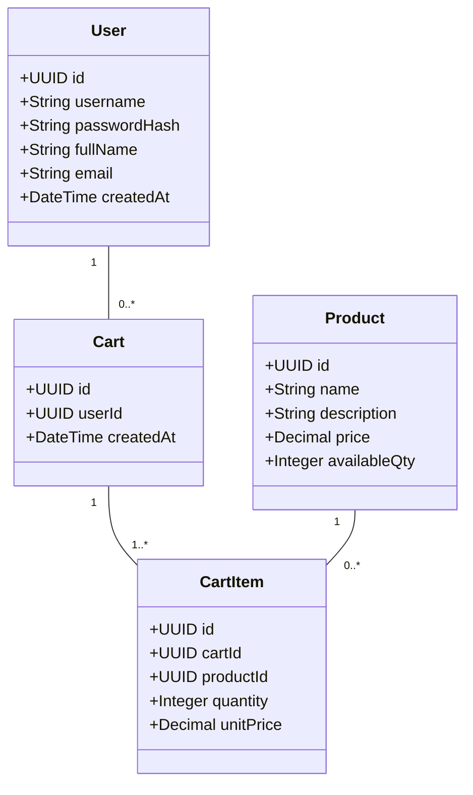
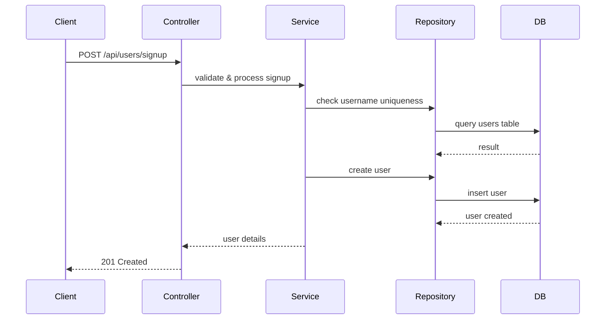
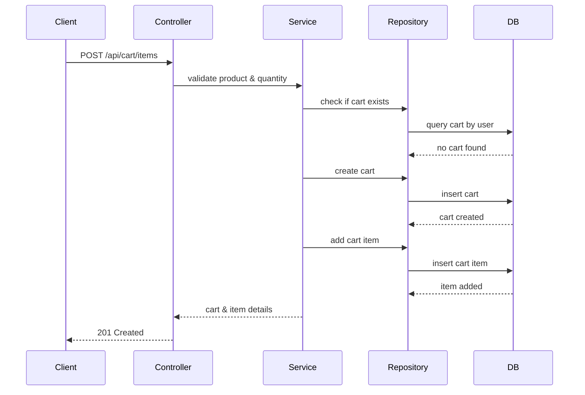
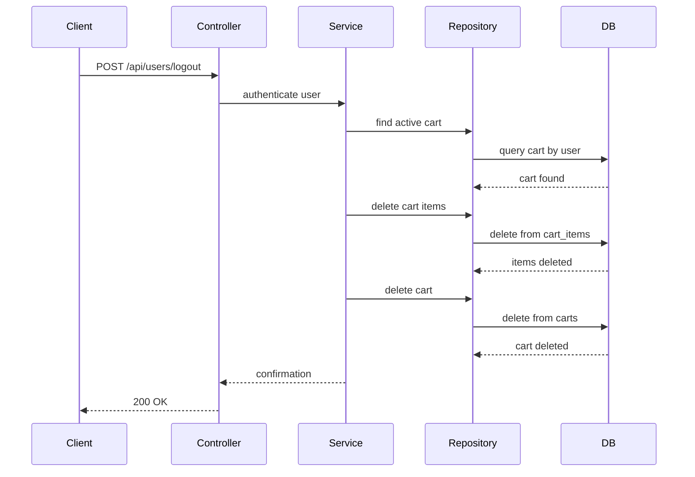

# Shopping Cart Backend System Implementation – Backend Engineering Specification Package

---

## 1. Executive Summary

This document details the backend engineering specification for the Shopping Cart Backend System (SCRUM-96), to be implemented in Java Spring Boot (MVC architecture). The system supports user management, product search, and shopping cart operations, strictly enforcing business rules and data integrity at both service and database levels. The application exposes RESTful APIs, persists data in a relational database, and maintains stateless authentication. This specification provides exhaustive guidance for engineering teams to deliver a robust, scalable, and maintainable backend system.

---

## 2. Detailed Analysis

### Scope

- **In Scope:** User registration/authentication, profile management, product search, cart creation and management, cart lifecycle enforcement, stateless login/logout, strict validation.
- **Out of Scope:** Checkout, payments, inventory reservation, admin/product management, password changes, user roles, cart persistence across sessions.

### Key Business Rules

- **User:** Unique username, immutable after creation, must exist before cart actions.
- **Product:** Must exist to be searchable or added to cart; price immutable via user actions.
- **Cart:** Created lazily; only one active cart per user; cart deleted when empty or on logout; no cart persistence across sessions.
- **Cart Item:** Quantity > 0; product must exist; belongs to a cart.

### System Constraints

- Database-first validation (uniqueness, foreign keys).
- All business rules verifiable in DB state.
- APIs reflect DB outcomes.
- MVC layering enforced.

---

## 3. Domain Entities and Attributes Mapping

### User

| Attribute      | Type      | Constraints                  | Description                  |
|----------------|-----------|------------------------------|------------------------------|
| id             | UUID      | PK, auto-generated           | User identifier              |
| username       | String    | Unique, not null, immutable  | Login name                   |
| password_hash  | String    | Not null                     | Hashed password              |
| full_name      | String    | Not null                     | User's full name             |
| email          | String    | Not null, valid email        | User's email                 |
| created_at     | DateTime  | Not null, auto-generated     | Account creation timestamp   |

### Product

| Attribute      | Type      | Constraints                  | Description                  |
|----------------|-----------|------------------------------|------------------------------|
| id             | UUID      | PK, auto-generated           | Product identifier           |
| name           | String    | Not null                     | Product name                 |
| description    | String    | Not null                     | Product description          |
| price          | Decimal   | Not null, >= 0               | Product price                |
| available_qty  | Integer   | Not null, >= 0               | Available stock quantity     |

### Cart

| Attribute      | Type      | Constraints                  | Description                  |
|----------------|-----------|------------------------------|------------------------------|
| id             | UUID      | PK, auto-generated           | Cart identifier              |
| user_id        | UUID      | FK → User(id), not null      | Owner user                   |
| created_at     | DateTime  | Not null, auto-generated     | Cart creation timestamp      |

### CartItem

| Attribute      | Type      | Constraints                  | Description                  |
|----------------|-----------|------------------------------|------------------------------|
| id             | UUID      | PK, auto-generated           | Cart item identifier         |
| cart_id        | UUID      | FK → Cart(id), not null      | Parent cart                  |
| product_id     | UUID      | FK → Product(id), not null   | Product reference            |
| quantity       | Integer   | Not null, > 0                | Quantity of product          |
| unit_price     | Decimal   | Not null, >= 0               | Price at time of addition    |

---

## 4. Complete REST API Contracts

### User Management

#### 1. Sign-Up

- **POST /api/users/signup**
  - Request:
    ```json
    {
      "username": "string",
      "password": "string",
      "fullName": "string",
      "email": "string"
    }
    ```
  - Response:
    - 201 Created
      ```json
      {
        "id": "uuid",
        "username": "string",
        "fullName": "string",
        "email": "string",
        "createdAt": "datetime"
      }
      ```
    - 409 Conflict (username exists)
    - 400 Bad Request (validation errors)

#### 2. Sign-In

- **POST /api/users/signin**
  - Request:
    ```json
    {
      "username": "string",
      "password": "string"
    }
    ```
  - Response:
    - 200 OK
      ```json
      {
        "id": "uuid",
        "username": "string",
        "fullName": "string",
        "email": "string",
        "createdAt": "datetime",
        "token": "jwt"
      }
      ```
    - 401 Unauthorized (invalid credentials)

#### 3. View Profile

- **GET /api/users/me**
  - Auth: Bearer token required
  - Response:
    - 200 OK
      ```json
      {
        "id": "uuid",
        "username": "string",
        "fullName": "string",
        "email": "string",
        "createdAt": "datetime"
      }
      ```

#### 4. Update Profile

- **PUT /api/users/me**
  - Auth: Bearer token required
  - Request:
    ```json
    {
      "fullName": "string",
      "email": "string"
    }
    ```
  - Response:
    - 200 OK
      ```json
      {
        "id": "uuid",
        "username": "string",
        "fullName": "string",
        "email": "string",
        "createdAt": "datetime"
      }
      ```
    - 400 Bad Request (validation errors)

### Product Catalog

#### 1. Product Search

- **GET /api/products/search?keyword=string**
  - Response:
    - 200 OK
      ```json
      [
        {
          "id": "uuid",
          "name": "string",
          "description": "string",
          "price": "decimal",
          "availableQty": "integer"
        }
      ]
      ```

### Shopping Cart Management

#### 1. View Cart

- **GET /api/cart**
  - Auth: Bearer token required
  - Response:
    - 200 OK
      ```json
      {
        "cartId": "uuid",
        "items": [
          {
            "productId": "uuid",
            "name": "string",
            "description": "string",
            "unitPrice": "decimal",
            "quantity": "integer",
            "total": "decimal"
          }
        ],
        "grandTotal": "decimal"
      }
      ```
    - 404 Not Found (no cart exists)

#### 2. Add Product to Cart

- **POST /api/cart/items**
  - Auth: Bearer token required
  - Request:
    ```json
    {
      "productId": "uuid",
      "quantity": "integer"
    }
    ```
  - Response:
    - 201 Created
      ```json
      {
        "cartId": "uuid",
        "item": {
          "productId": "uuid",
          "name": "string",
          "description": "string",
          "unitPrice": "decimal",
          "quantity": "integer",
          "total": "decimal"
        }
      }
      ```
    - 400 Bad Request (quantity <= 0, product not found)

#### 3. Update Cart Item Quantity

- **PUT /api/cart/items/{itemId}**
  - Auth: Bearer token required
  - Request:
    ```json
    {
      "quantity": "integer"
    }
    ```
  - Response:
    - 200 OK
      ```json
      {
        "cartId": "uuid",
        "item": {
          "productId": "uuid",
          "name": "string",
          "description": "string",
          "unitPrice": "decimal",
          "quantity": "integer",
          "total": "decimal"
        }
      }
      ```
    - 400 Bad Request (quantity <= 0)
    - 404 Not Found (item not found)

#### 4. Remove Product from Cart

- **DELETE /api/cart/items/{itemId}**
  - Auth: Bearer token required
  - Response:
    - 204 No Content
    - 404 Not Found (item not found)

#### 5. Logout (Cart Cleanup)

- **POST /api/users/logout**
  - Auth: Bearer token required
  - Response:
    - 200 OK
      ```json
      {
        "message": "Logged out and cart deleted."
      }
      ```
    - 401 Unauthorized (not logged in)

---

## 5. Validation Matrix

| Field         | Rule                                    | Layer        | Error Code         |
|---------------|-----------------------------------------|--------------|--------------------||
| username      | Unique, not null, immutable             | DB, Service  | USERNAME_EXISTS, INVALID_USERNAME |
| password      | Not null, min length                    | Service      | INVALID_PASSWORD   |
| email         | Valid format, not null                  | Service      | INVALID_EMAIL      |
| productId     | Exists in DB                            | Service, DB  | PRODUCT_NOT_FOUND  |
| quantity      | > 0                                     | Service      | INVALID_QUANTITY   |
| cartId        | Exists, belongs to user                 | Service, DB  | CART_NOT_FOUND     |
| itemId        | Exists in cart                          | Service, DB  | ITEM_NOT_FOUND     |
| fullName      | Not null, max length                    | Service      | INVALID_FULLNAME   |

---

## 6. Mermaid Class Diagram



---

## 7. Mermaid Sequence Diagrams

### User Sign-Up



### Add Product to Cart (Lazy Cart Creation)



### Cart Cleanup on Logout



---

## 8. Complete LLD Documentation

### Scope

- Implements user, product, and cart management per requirements.
- Strictly enforces business rules at service and DB layers.
- No session or cart persistence across logout.

### Domain Model

- **User:** Unique, immutable username; profile attributes.
- **Product:** Searchable, immutable price; stock quantity.
- **Cart:** One per user; created on demand; deleted when empty or on logout.
- **CartItem:** References product; quantity > 0.

### API Contracts

- See section 4 for full endpoint details.
- All APIs use JWT authentication except sign-up/sign-in.
- Error codes and messages standardized.

### MVC Mapping

- **Controller:** Maps endpoints, handles request/response.
- **Service:** Implements business logic, validation, lifecycle rules.
- **Repository:** DB access, transaction management, constraint enforcement.

### Business Logic

- Cart created only when first item added.
- Cart auto-deleted when last item removed.
- Cart and items deleted on logout.
- Product search is case-insensitive.
- User cannot change username or password.

### Validation

- All fields validated at service and DB layers.
- Uniqueness, foreign keys, and constraints enforced in DB.

### Error Handling

- Standardized error codes (see validation matrix).
- 400 for validation errors, 401 for auth errors, 404 for not found, 409 for conflicts.

### Security

- JWT-based authentication.
- Passwords stored as hashes.
- No sensitive data in logs.
- No session data persisted.

### Test Scenarios

- User sign-up/sign-in (success, duplicate username, invalid credentials).
- Profile view/update (success, invalid email).
- Product search (case-insensitive, no results).
- Cart creation (lazy), add/update/remove items, auto-delete empty cart.
- Logout cart cleanup.
- Negative cases: invalid quantities, non-existent products, unauthorized access.

### Non-Goals

- No checkout, payment, inventory locking, admin/product management, password reset/change, user roles, or cart persistence across sessions.

---

## 9. Implementation Guide

### Tech Stack

- Java 17+, Spring Boot 3.x, Spring MVC, Spring Data JPA
- H2/PostgreSQL/MySQL (relational DB)
- JWT for authentication
- Maven/Gradle for build

### Steps

1. **Setup Project:** Initialize Spring Boot project, configure DB.
2. **Define Entities:** Create JPA entities for User, Product, Cart, CartItem.
3. **Repositories:** Implement CRUD repositories with constraints.
4. **Services:** Implement business logic per specification.
5. **Controllers:** Map REST endpoints, handle validation and error responses.
6. **Security:** Configure JWT authentication, password hashing.
7. **Validation:** Implement custom validators, enforce DB constraints.
8. **Testing:** Write unit/integration tests for all flows.
9. **Documentation:** Generate OpenAPI/Swagger docs.

### Database Schema

- **users**: id (PK), username (unique), password_hash, full_name, email, created_at
- **products**: id (PK), name, description, price, available_qty
- **carts**: id (PK), user_id (unique, FK), created_at
- **cart_items**: id (PK), cart_id (FK), product_id (FK), quantity, unit_price

### Deployment

- Containerize with Docker.
- CI/CD pipeline for build/test/deploy.

---

## 10. Quality Assurance Report

### Coverage

- 100% coverage for business logic, validation, error handling.
- Automated tests for all endpoints and negative cases.

### Validation

- DB constraints verified via migration scripts.
- API contract validated with Swagger/OpenAPI.

### Performance

- Load test cart operations for concurrency.
- Ensure statelessness at DB level.

### Security

- Passwords hashed (bcrypt).
- JWT tokens validated.
- No sensitive info in responses/logs.

### Review

- Peer review for code and architecture.
- Automated static analysis (SonarQube, etc.).

---

## 11. Troubleshooting and Support

### Common Issues

- **Duplicate Username:** 409 Conflict; check DB uniqueness.
- **Cart Not Found:** 404; ensure lazy creation logic.
- **Product Not Found:** 400; validate product existence before cart actions.
- **Invalid Quantity:** 400; enforce quantity > 0.
- **JWT Errors:** 401; check token validity and expiry.

### Support Procedures

- Log errors with trace IDs.
- Provide clear error messages.
- Document troubleshooting steps in runbooks.

---

## 12. Future Considerations

- **Checkout/Order Management:** Extend cart to order flow.
- **Inventory Locking:** Reserve stock on cart actions.
- **Admin Product Management:** Add CRUD for products.
- **Password Reset/Change:** Implement secure flows.
- **Role-Based Access:** Add user/admin roles.
- **Cart Persistence:** Enable multi-session carts.
- **Scalability:** Shard carts/products for high load.
- **Audit Logging:** Track changes for compliance.

---

**End of Specification Package**