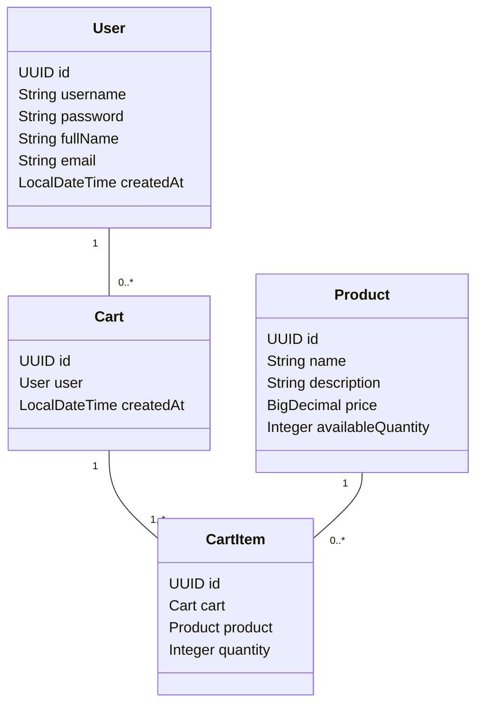
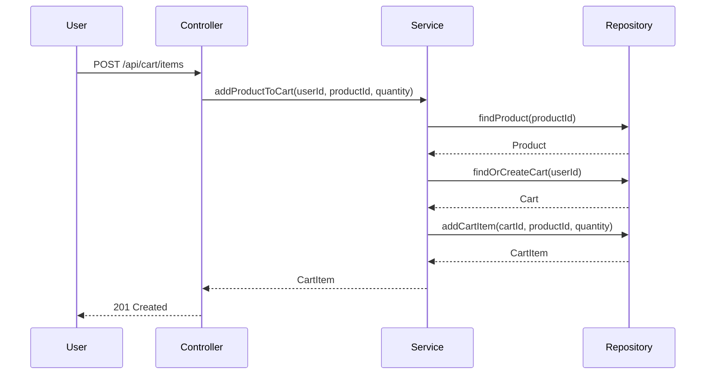

# Backend Engineering Specification Package for Shopping Cart System (SCRUM-96)

---

## Executive Summary

This specification details the backend implementation for a shopping cart system using Java Spring Boot (MVC architecture). The system covers user management, product search, and shopping cart operations, enforcing strict business rules and database-first validation. RESTful APIs will be exposed, with data persisted in a relational database. All domain rules are enforced at both service and database levels. The system is stateless at login, and carts do not persist across logout. Out-of-scope items include checkout, payments, inventory locking, admin management, and password changes.

---

## Detailed Analysis

### 1. Functional Domains

**A. User Management**
- Sign-Up, Sign-In, View Profile, Update Profile

**B. Product Catalog**
- Product Search

**C. Shopping Cart Management**
- Lazy Cart Creation, Add/Update/Remove Cart Item, View Cart, Auto-Delete Empty Cart, Cart Cleanup on Logout

### 2. Domain Entities & Attributes

#### User
- id (PK, UUID)
- username (unique, immutable)
- password (hashed)
- full_name
- email
- created_at

#### Product
- id (PK, UUID)
- name
- description
- price
- available_quantity

#### Cart
- id (PK, UUID)
- user_id (FK → User)
- created_at

#### CartItem
- id (PK, UUID)
- cart_id (FK → Cart)
- product_id (FK → Product)
- quantity

### 3. Explicit Rules & Guardrails

- Username must be unique and immutable.
- No session data stored at DB level.
- Cart created only when first product is added.
- Only one active cart per user.
- Cart cannot exist without at least one cart item.
- Product must exist before adding to cart.
- Cart and cart items deleted on logout or when last item removed.
- Product price cannot be modified by user.
- Product search is case-insensitive.
- APIs must reflect DB outcomes.

### 4. Required REST APIs

#### User Management

| Endpoint                  | Method | Description                  |
|---------------------------|--------|------------------------------|
| /api/users/signup         | POST   | Register new user            |
| /api/users/signin         | POST   | Authenticate user            |
| /api/users/profile        | GET    | View user profile            |
| /api/users/profile        | PUT    | Update full name, email      |

#### Product Catalog

| Endpoint                  | Method | Description                  |
|---------------------------|--------|------------------------------|
| /api/products/search      | GET    | Search products by keyword   |

#### Shopping Cart Management

| Endpoint                  | Method | Description                  |
|---------------------------|--------|------------------------------|
| /api/cart                 | GET    | View cart                    |
| /api/cart/items           | POST   | Add product to cart          |
| /api/cart/items/{itemId}  | PUT    | Update cart item quantity    |
| /api/cart/items/{itemId}  | DELETE | Remove product from cart     |
| /api/cart/logout          | POST   | Cleanup cart on logout       |

---

## Deliverables

### 1. Domain Entities

#### User (Java Entity)
```java
@Entity
@Table(name = "users", uniqueConstraints = @UniqueConstraint(columnNames = "username"))
public class User {
    @Id
    @GeneratedValue
    private UUID id;
    @Column(nullable = false, unique = true)
    private String username;
    @Column(nullable = false)
    private String password; // hashed
    @Column(nullable = false)
    private String fullName;
    @Column(nullable = false)
    private String email;
    @Column(nullable = false, updatable = false)
    private LocalDateTime createdAt;
}
```

#### Product
```java
@Entity
@Table(name = "products")
public class Product {
    @Id
    @GeneratedValue
    private UUID id;
    @Column(nullable = false)
    private String name;
    @Column(nullable = false)
    private String description;
    @Column(nullable = false)
    private BigDecimal price;
    @Column(nullable = false)
    private Integer availableQuantity;
}
```

#### Cart
```java
@Entity
@Table(name = "carts")
public class Cart {
    @Id
    @GeneratedValue
    private UUID id;
    @ManyToOne
    @JoinColumn(name = "user_id", nullable = false)
    private User user;
    @Column(nullable = false, updatable = false)
    private LocalDateTime createdAt;
}
```

#### CartItem
```java
@Entity
@Table(name = "cart_items")
public class CartItem {
    @Id
    @GeneratedValue
    private UUID id;
    @ManyToOne
    @JoinColumn(name = "cart_id", nullable = false)
    private Cart cart;
    @ManyToOne
    @JoinColumn(name = "product_id", nullable = false)
    private Product product;
    @Column(nullable = false)
    private Integer quantity;
}
```

### 2. API Contracts

#### User Sign-Up
- **POST /api/users/signup**
- Request:
    ```json
    {
      "username": "string",
      "password": "string",
      "fullName": "string",
      "email": "string"
    }
    ```
- Response:
    - 201 Created: User details (excluding password)
    - 400 Bad Request: Validation errors (username exists, missing fields)

#### User Sign-In
- **POST /api/users/signin**
- Request:
    ```json
    {
      "username": "string",
      "password": "string"
    }
    ```
- Response:
    - 200 OK: User details (excluding password)
    - 401 Unauthorized: Invalid credentials

#### View Profile
- **GET /api/users/profile**
- Response:
    - 200 OK: { "username", "fullName", "email", "createdAt" }
    - 401 Unauthorized: Not authenticated

#### Update Profile
- **PUT /api/users/profile**
- Request:
    ```json
    {
      "fullName": "string",
      "email": "string"
    }
    ```
- Response:
    - 200 OK: Updated user details
    - 400 Bad Request: Validation errors

#### Product Search
- **GET /api/products/search?keyword=abc**
- Response:
    - 200 OK: List of products [{ "name", "description", "price", "availableQuantity" }]
    - 400 Bad Request: Missing/invalid keyword

#### View Cart
- **GET /api/cart**
- Response:
    - 200 OK: List of cart items [{ "productId", "name", "quantity", "price", "total" }], grandTotal
    - 404 Not Found: No cart exists

#### Add Product to Cart
- **POST /api/cart/items**
- Request:
    ```json
    {
      "productId": "UUID",
      "quantity": 1
    }
    ```
- Response:
    - 201 Created: Cart item details
    - 400 Bad Request: Product not found, quantity <= 0

#### Update Cart Item Quantity
- **PUT /api/cart/items/{itemId}**
- Request:
    ```json
    {
      "quantity": 2
    }
    ```
- Response:
    - 200 OK: Updated cart item
    - 400 Bad Request: Quantity <= 0

#### Remove Product from Cart
- **DELETE /api/cart/items/{itemId}**
- Response:
    - 204 No Content: Item removed
    - 404 Not Found: Item not found

#### Cart Cleanup on Logout
- **POST /api/cart/logout**
- Response:
    - 200 OK: Cart deleted
    - 404 Not Found: No active cart

### 3. Validation Matrix

| Field                | Validation Rule                                 | Error Code         |
|----------------------|-------------------------------------------------|--------------------|
| username             | Required, unique, immutable                     | 400, 409           |
| password             | Required, min length                            | 400                |
| fullName             | Required                                        | 400                |
| email                | Required, valid format                          | 400                |
| productId            | Must exist                                      | 400, 404           |
| quantity             | > 0                                             | 400                |
| cart existence       | Only one active per user                        | 409                |
| cart item existence  | Product must exist                              | 400, 404           |
| cart item quantity   | > 0                                             | 400                |
| cart lifecycle       | Auto-delete when empty, cleanup on logout       | 200, 404           |

### 4. Diagrams

#### Mermaid Class Diagram



#### Mermaid Sequence Diagram (Add Product to Cart)



### 5. Low-Level Design (LLD)

#### Controller Layer

- Maps HTTP requests to service methods.
- Validates request payloads.
- Handles authentication (stateless, e.g., JWT).
- Returns appropriate HTTP responses.

#### Service Layer

- Implements business logic:
    - User registration, authentication, profile updates.
    - Product search (case-insensitive).
    - Cart lifecycle (lazy creation, single active cart, auto-deletion).
    - Cart item operations (add, update, remove).
    - Cart cleanup on logout.
- Enforces business rules before repository calls.

#### Repository Layer

- Interfaces with the database using JPA/Hibernate.
- Enforces DB-level constraints (unique, foreign keys).
- Handles CRUD for entities.

#### Validation & Error Handling

- All input validated at controller/service.
- DB constraints for uniqueness, FK, non-null enforced.
- Error responses standardized (400, 401, 404, 409).

#### Database Effects

- User creation: new row in users.
- Product search: SELECT on products.
- Cart creation: new row in carts.
- Cart item add/update/remove: INSERT/UPDATE/DELETE in cart_items.
- Cart deletion: DELETE cart_items, then DELETE cart.
- Cart cleanup on logout: DELETE cart_items, then DELETE cart.

---

## Implementation Guide

### 1. Project Structure

- `controller/` — REST controllers
- `service/` — Business logic
- `repository/` — JPA repositories
- `model/` — Entity classes
- `dto/` — Request/response DTOs
- `config/` — Security, DB config

### 2. Key Implementation Steps

- Set up Spring Boot project with MVC structure.
- Implement entity classes with JPA annotations.
- Define repositories for CRUD operations.
- Implement service layer enforcing business rules.
- Implement controllers mapping endpoints.
- Configure stateless authentication (e.g., JWT).
- Write unit/integration tests for all APIs.
- Ensure DB constraints (unique, FK, non-null).
- Implement error handling and validation.

### 3. Database Schema (DDL)

```sql
CREATE TABLE users (
    id UUID PRIMARY KEY,
    username VARCHAR(255) UNIQUE NOT NULL,
    password VARCHAR(255) NOT NULL,
    full_name VARCHAR(255) NOT NULL,
    email VARCHAR(255) NOT NULL,
    created_at TIMESTAMP NOT NULL
);

CREATE TABLE products (
    id UUID PRIMARY KEY,
    name VARCHAR(255) NOT NULL,
    description TEXT NOT NULL,
    price DECIMAL(10,2) NOT NULL,
    available_quantity INT NOT NULL
);

CREATE TABLE carts (
    id UUID PRIMARY KEY,
    user_id UUID NOT NULL REFERENCES users(id),
    created_at TIMESTAMP NOT NULL
);

CREATE TABLE cart_items (
    id UUID PRIMARY KEY,
    cart_id UUID NOT NULL REFERENCES carts(id) ON DELETE CASCADE,
    product_id UUID NOT NULL REFERENCES products(id),
    quantity INT NOT NULL CHECK (quantity > 0)
);
```

---

## Quality Assurance Report

- **Completeness:** All functional scope items mapped to APIs, entities, and validations.
- **Consistency:** Domain rules enforced at both service and DB levels.
- **Guardrails:** Out-of-scope features (checkout, payments, inventory, admin, password change) strictly excluded.
- **Validation:** All input fields validated, error codes standardized.
- **Testing:** Recommend unit, integration, and DB constraint tests for all endpoints.
- **Statelessness:** No session data stored in DB; cart lifecycle tied to login/logout as specified.

---

## Troubleshooting and Support

- **Common Issues:**
    - Username already exists: Return 409 Conflict.
    - Product not found: Return 404 Not Found.
    - Cart not found: Return 404 Not Found.
    - Quantity <= 0: Return 400 Bad Request.
    - Cart persists after logout: Ensure cart cleanup logic is triggered.
- **Support:**
    - Logging for all API errors.
    - Monitoring DB constraints.
    - Automated tests for cart lifecycle.
    - API documentation (Swagger/OpenAPI recommended).

---

## Future Considerations

- **Scalability:** Consider caching for product search, pagination for large catalogs.
- **Security:** Implement password hashing, JWT expiration, rate limiting.
- **Extensibility:** Design for future features (checkout, payments, inventory).
- **Auditability:** Add created/updated timestamps, audit logs for critical actions.
- **Internationalization:** Prepare for multi-language support in product catalog.
- **API Versioning:** Plan for backward compatibility.

---

**End of Specification**