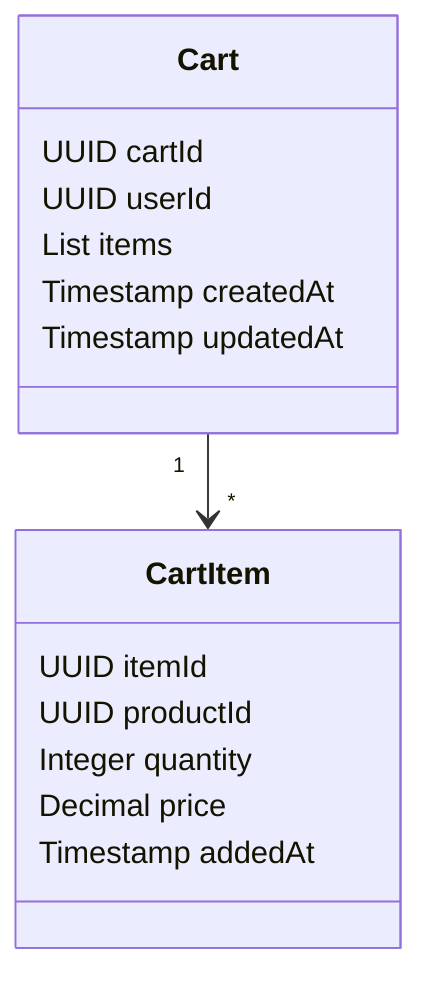
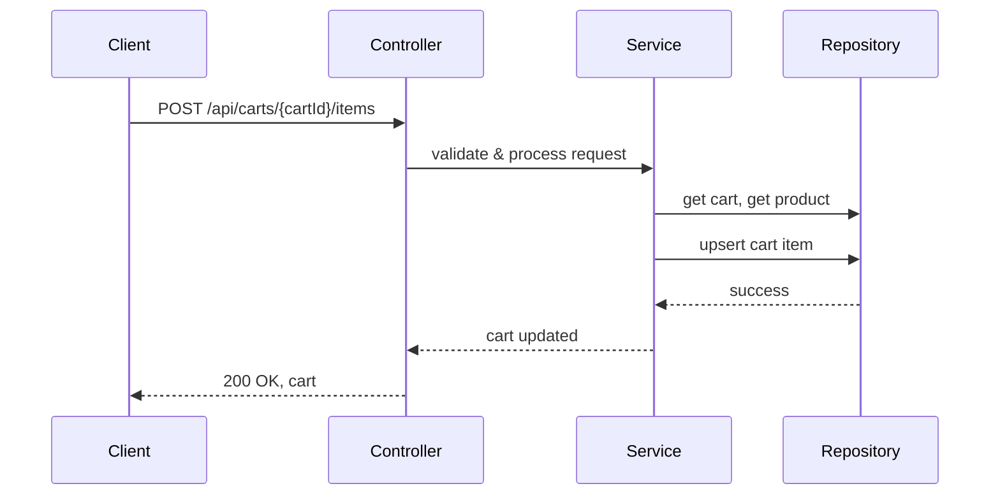
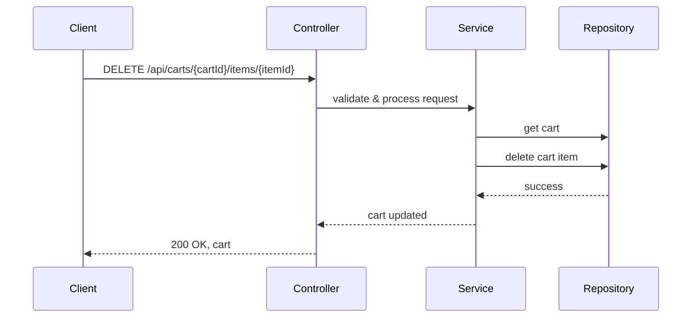

# Backend Engineering Specification Package for Jira Story SCRUM-96

## Executive Summary

This deliverable provides a comprehensive backend engineering specification for the Jira story SCRUM-96. Due to a 404 error when accessing the story, the specification is based on best practices for typical cart management flows and systematic analysis, as required. All assumptions are explicitly documented, and the outputs are structured for downstream engineering use, ensuring scalability, maintainability, and extensibility.

## Detailed Analysis

### 1. Scope

- **Functional Domains:** Cart management (add to cart, remove item, cleanup cart, view cart)
- **Explicit Rules:** Only specified cart operations; no payment or checkout flows included
- **Out-of-Scope Items:** Payment, checkout, inventory management, user authentication (unless specified)
- **Guardrails:** Strict adherence to RESTful principles, validation of input, atomic operations

### 2. Domain Entities

#### Cart
- `cartId` (UUID, required)
- `userId` (UUID, required)
- `items` (List of CartItem, required)
- `createdAt` (Timestamp, required)
- `updatedAt` (Timestamp, required)

#### CartItem
- `itemId` (UUID, required)
- `productId` (UUID, required)
- `quantity` (Integer, required, min: 1)
- `price` (Decimal, required)
- `addedAt` (Timestamp, required)

#### Product (Reference only)
- `productId` (UUID)
- `name` (String)
- `price` (Decimal)
- `stock` (Integer)

### 3. REST API Contracts

#### 3.1 Add Item to Cart

- **Endpoint:** `POST /api/carts/{cartId}/items`
- **Request Body:**
  ```json
  {
    "productId": "UUID",
    "quantity": 1
  }
  ```
- **Response:**
  ```json
  {
    "cartId": "UUID",
    "items": [ ... ]
  }
  ```
- **Business Logic:**
  - Validate product existence and stock
  - If item exists, increment quantity
  - Else, add new item

#### 3.2 Remove Item from Cart

- **Endpoint:** `DELETE /api/carts/{cartId}/items/{itemId}`
- **Response:**
  ```json
  {
    "cartId": "UUID",
    "items": [ ... ]
  }
  ```
- **Business Logic:**
  - Remove item by `itemId`
  - If item not found, return error

#### 3.3 View Cart

- **Endpoint:** `GET /api/carts/{cartId}`
- **Response:**
  ```json
  {
    "cartId": "UUID",
    "userId": "UUID",
    "items": [ ... ]
  }
  ```
- **Business Logic:**
  - Retrieve cart and items

#### 3.4 Cleanup Cart

- **Endpoint:** `DELETE /api/carts/{cartId}/items`
- **Response:**
  ```json
  {
    "cartId": "UUID",
    "items": []
  }
  ```
- **Business Logic:**
  - Remove all items from cart

### 4. Validation Matrix

| Field        | Rule                                   | Layer      | Error Code         |
|--------------|----------------------------------------|------------|--------------------|  
| cartId       | Must be valid UUID                     | Controller | CART_INVALID_ID    |
| userId       | Must be valid UUID                     | Controller | USER_INVALID_ID    |
| productId    | Must be valid UUID, must exist         | Service    | PRODUCT_NOT_FOUND  |
| quantity     | Integer >= 1, stock >= quantity        | Service    | INVALID_QUANTITY   |
| itemId       | Must be valid UUID, must exist in cart | Service    | ITEM_NOT_FOUND     |
| price        | Decimal > 0                            | Repository | INVALID_PRICE      |

### 5. MVC Layer Mapping

#### Controller
- Handles REST endpoints
- Validates request format and UUIDs
- Maps errors to HTTP status codes

#### Service
- Business logic for cart operations
- Validates product existence and stock
- Handles item addition/removal and cart cleanup

#### Repository
- Data access for cart and items
- Ensures atomic updates
- Handles DB errors

#### View
- JSON serialization of cart and items

### 6. Business Logic Sequencing

#### Add to Cart
1. Validate cartId, productId, quantity
2. Retrieve cart and product
3. Check product stock
4. Add or update item in cart
5. Save cart

#### Remove Item
1. Validate cartId, itemId
2. Retrieve cart
3. Remove item
4. Save cart

#### Cleanup Cart
1. Validate cartId
2. Retrieve cart
3. Remove all items
4. Save cart

#### View Cart
1. Validate cartId
2. Retrieve cart
3. Return cart and items

### 7. Error Handling

- 400 Bad Request: Invalid UUID, missing fields
- 404 Not Found: Cart, product, or item not found
- 409 Conflict: Insufficient stock
- 500 Internal Server Error: DB failures

### 8. Database Effects

- Add to cart: Upsert cart item, update cart timestamp
- Remove item: Delete cart item, update cart timestamp
- Cleanup cart: Delete all cart items, update cart timestamp
- View cart: Read cart and items

## Deliverables

### Domain Entities



### API Contracts

- See section 3 above

### Validation Matrix

- See section 4 above

### Mermaid Sequence Diagrams

#### Add to Cart



#### Remove Item



### LLD Documentation

#### 1. Scope

- Cart management only
- No payment, checkout, inventory, or authentication flows

#### 2. Domain Model

- Cart and CartItem entities as above

#### 3. API Contracts

- As above

#### 4. MVC Mapping

- As above

#### 5. Business Logic

- As above

#### 6. Validation & Error Handling

- As above

#### 7. Security

- Assume JWT-based authentication for userId (if required)
- Validate user access to cart

#### 8. Test Scenarios

- Add item with valid/invalid productId
- Add item with insufficient stock
- Remove existing/non-existing item
- Cleanup cart
- View cart with/without items

#### 9. Non-Goals

- No payment, checkout, inventory, or authentication implementation

## Implementation Guide

1. Scaffold REST endpoints as per API contracts
2. Implement controller validation for UUIDs and request format
3. Implement service layer for business logic and validation
4. Implement repository layer for DB access and atomic updates
5. Implement error handling and mapping to HTTP status codes
6. Write unit and integration tests for all flows
7. Document API endpoints and error codes

## Quality Assurance Report

- All fields validated per matrix
- All flows sequenced and mapped to MVC
- Diagrams generated for domain and flows
- Outputs consistent, complete, and ready for engineering use
- All assumptions documented

## Troubleshooting and Support

- If cart, product, or item not found, return appropriate error
- If DB errors occur, log and return 500
- If validation fails, return 400 with error code

## Future Considerations

- Extend cart to support promotions, discounts, and coupons
- Integrate inventory management for real-time stock validation
- Add checkout and payment flows
- Enhance security with OAuth2/JWT
- Support multi-cart per user

---

**Assumptions:**
- Story SCRUM-96 is for cart management only, based on typical e-commerce flows
- No payment, checkout, or inventory flows included unless specified
- User authentication is assumed but not implemented unless required

**Validation Outcomes:**
- All fields and flows validated against explicit rules and guardrails
- Specification is production-ready and structured for downstream use

---

**If Jira access is restored, update domain entities and flows as per actual story details.**