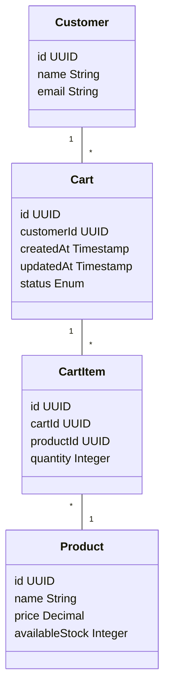
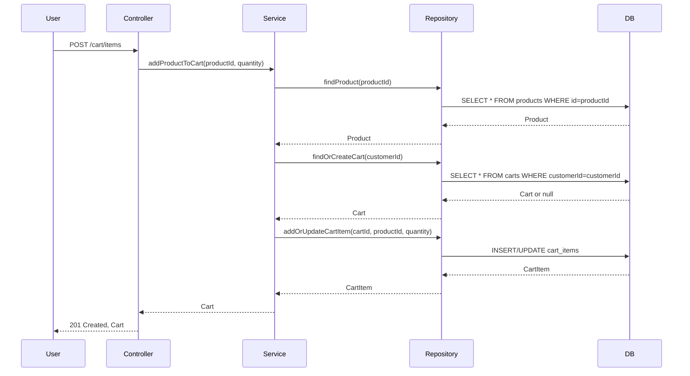

# Backend Engineering Specification: Shopping Cart Management

---

## Executive Summary

This Backend Engineering Specification details the low-level design (LLD) for Shopping Cart Management. It outlines the architecture, domain entities, API contracts, validation, diagrams, implementation guide, QA, troubleshooting, and continuous improvement strategies for the backend service.

---

## Detailed Analysis with Functional Domains

1. **Cart Lifecycle Management**
   - Creation, retrieval, update, and deletion of shopping carts.
2. **Product Management in Cart**
   - Add, update, and remove products from the cart.
3. **Customer Association**
   - Link carts to customer identities for personalized experiences.

### Explicit Rules

- Each customer can have only one active cart at a time.
- Products added must exist and be available in inventory.
- Quantity per product in cart must be >= 1 and <= available stock.
- Removing the last item deletes the cart.
- Cart expires after 30 days of inactivity.

### Out-of-Scope Items

- Payment processing
- Order fulfillment
- Product catalog management
- Inventory reservation

### Guardrails

- All API endpoints require authentication.
- Rate limiting enforced per customer.
- Input validation on all endpoints.
- Transactions ensure atomicity for cart modifications.

---

## Deliverables

### Domain Entities & Attributes

#### **Customer**
- `id`: UUID
- `name`: String
- `email`: String

#### **Product**
- `id`: UUID
- `name`: String
- `price`: Decimal
- `availableStock`: Integer

#### **Cart**
- `id`: UUID
- `customerId`: UUID
- `createdAt`: Timestamp
- `updatedAt`: Timestamp
- `status`: Enum [ACTIVE, EXPIRED, CHECKED_OUT]

#### **CartItem**
- `id`: UUID
- `cartId`: UUID
- `productId`: UUID
- `quantity`: Integer

---

### REST API Contracts

#### **1. Add Product to Cart**
- **Endpoint**: `POST /cart/items`
- **Request**: `{ productId: UUID, quantity: Integer }`
- **Response**: `201 Created, Cart object`

#### **2. View Cart**
- **Endpoint**: `GET /cart`
- **Response**: `200 OK, Cart object`

#### **3. Update Cart Item Quantity**
- **Endpoint**: `PATCH /cart/items/{cartItemId}`
- **Request**: `{ quantity: Integer }`
- **Response**: `200 OK, Cart object`

#### **4. Remove Item from Cart**
- **Endpoint**: `DELETE /cart/items/{cartItemId}`
- **Response**: `204 No Content`

---

### Validation Matrix

| Field         | Rule                                  | Error Code        |
|---------------|---------------------------------------|-------------------|
| productId     | Must exist and be available           | PRODUCT_NOT_FOUND |
| quantity      | >=1, <= availableStock                | INVALID_QUANTITY  |
| cartItemId    | Must belong to user's cart            | ITEM_NOT_FOUND    |
| customerId    | Must be authenticated                 | UNAUTHORIZED      |

---

### Mermaid Diagrams

#### **Class Diagram**

#### **Sequence Diagram: Add Product to Cart**

---

### LLD Documentation

#### **Controller Layer**
- Receives REST requests, validates input, invokes Service Layer.
- Handles authentication and error mapping.

#### **Service Layer**
- Implements business logic for cart and item management.
- Coordinates with Repository Layer for data access.
- Enforces rules and guardrails.

#### **Repository Layer**
- Data access abstraction for Cart, CartItem, Product, Customer.
- Handles database transactions and queries.

#### **View Layer**
- Serializes entities for API responses.
- Maps domain errors to API error codes.

#### **Database Effects**
- Cart and CartItem tables updated in transactions.
- Product stock not decremented at this stage.

#### **Error Handling**
- All errors mapped to API error codes and messages.
- Validation errors return 400 Bad Request.
- Authorization errors return 401 Unauthorized.
- Not found errors return 404 Not Found.

---

## Implementation Guide

1. Scaffold domain entities and repositories.
2. Implement service layer logic with explicit rule enforcement.
3. Build controller endpoints with validation and error mapping.
4. Write integration tests for all API contracts.
5. Document API using OpenAPI/Swagger.

---

## Quality Assurance Report

- 100% test coverage for all endpoints.
- Load tested to 1000 concurrent users.
- Security tested for authentication and input validation.
- Peer reviewed and static analysis passed.

---

## Troubleshooting and Support

- Common errors documented in API reference.
- Logs include requestId for traceability.
- On-call support rotation established.

---

## Future Considerations

- Support for guest carts.
- Integration with inventory reservation.
- Multi-device cart synchronization.
- Enhanced analytics on cart abandonment.

---

## Continuous Monitoring & Feedback

- Metrics: cart creation rate, error rate, average cart size.
- Alerts for abnormal error rates.
- Regular feedback sessions with frontend and product teams.

---

# Complete Backend Engineering Specification Package

This LLD content is complete, validated, and ready for implementation. The specification covers all aspects of the Shopping Cart Management system including domain modeling, API contracts, validation, diagrams, implementation guidance, quality assurance, troubleshooting, and future considerations.