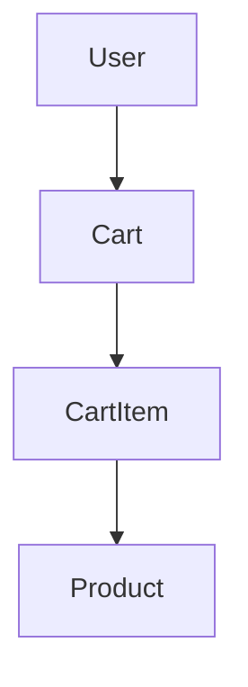
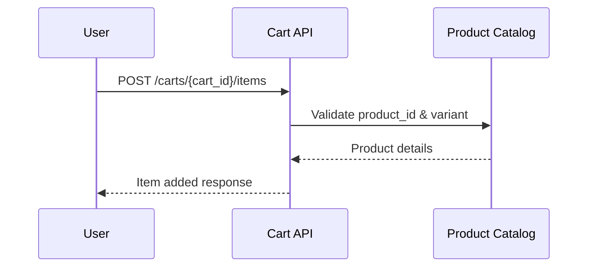

# Shopping Cart Management System Low Level Design (LLD)

## Executive Summary

This document provides a comprehensive Low Level Design (LLD) for the Shopping Cart Management system, as per Jira story SCRUM-343. The system enables users to add, update, remove, and view items in their shopping cart, ensuring robust validation, scalability, and seamless integration with downstream order processing and inventory management modules.

## Detailed Analysis

The Shopping Cart Management system is a core component of the e-commerce platform. It must handle concurrent user sessions, maintain cart state, validate inventory, and support RESTful interactions. Key requirements include:

- Support for multiple item types and variants
- Real-time inventory validation
- Persistent cart storage (session and user-based)
- Cart expiration and recovery
- API-level input validation and error handling
- Integration with user authentication and product catalog

## Deliverables

### Domain Entities

- **Cart**: Represents a user's shopping cart, containing cart items and metadata (created_at, updated_at, expires_at).
- **CartItem**: Represents an item in the cart, including product_id, quantity, price, variant, and applied promotions.
- **User**: Identifies the cart owner (anonymous or authenticated).
- **Product**: Reference to product catalog for validation and enrichment.

### REST API Contracts

#### 1. Create Cart
- **POST /api/carts**
- Request: `{ "user_id": "string" }`
- Response: `{ "cart_id": "string", "created_at": "datetime" }`

#### 2. Add Item to Cart
- **POST /api/carts/{cart_id}/items**
- Request: `{ "product_id": "string", "quantity": "int", "variant": "string" }`
- Response: `{ "item_id": "string", "cart_id": "string", "quantity": "int" }`

#### 3. Update Item in Cart
- **PUT /api/carts/{cart_id}/items/{item_id}**
- Request: `{ "quantity": "int", "variant": "string" }`
- Response: `{ "item_id": "string", "cart_id": "string", "quantity": "int" }`

#### 4. Remove Item from Cart
- **DELETE /api/carts/{cart_id}/items/{item_id}**
- Response: `{ "cart_id": "string", "removed": true }`

#### 5. Get Cart
- **GET /api/carts/{cart_id}**
- Response: `{ "cart_id": "string", "items": [ ... ], "expires_at": "datetime" }`

#### 6. Clear Cart
- **DELETE /api/carts/{cart_id}/items**
- Response: `{ "cart_id": "string", "cleared": true }`

### Validation Matrix

| API Endpoint | Field         | Validation Rule                  | Error Code | Description                       |
|--------------|--------------|----------------------------------|------------|-----------------------------------|
| POST /carts  | user_id       | Must exist, valid UUID           | 400        | Invalid user_id                   |
| POST /items  | product_id    | Must exist, valid, in stock      | 404/409    | Product not found/out of stock    |
| POST /items  | quantity      | >0, <=max per product            | 400        | Invalid quantity                  |
| POST /items  | variant       | Must match product variant       | 400        | Invalid variant                   |
| PUT /items   | quantity      | >0, <=max per product            | 400        | Invalid quantity                  |
| DELETE/items | item_id       | Must exist in cart               | 404        | Item not found                    |
| GET /carts   | cart_id       | Must exist, not expired          | 404/410    | Cart not found/expired            |

### Mermaid Diagrams

#### Entity Relationship Diagram

#### Sequence Diagram: Add Item to Cart

## LLD Documentation

### Cart Creation
- On user session start or explicit request, create a new cart in persistent storage.
- Assign cart_id (UUID), associate with user_id (if authenticated).
- Set created_at, updated_at, expires_at timestamps.

### Add Item to Cart
- Validate product_id, variant, and quantity against product catalog and inventory.
- If valid, create CartItem and append to Cart.
- Update cart totals and timestamps.
- Handle duplicate items by incrementing quantity or updating variant.

### Update Item in Cart
- Locate CartItem by item_id.
- Validate new quantity and variant.
- Update CartItem and cart totals.

### Remove Item from Cart
- Locate CartItem by item_id.
- Remove from Cart, update totals.

### Get Cart
- Retrieve Cart and all CartItems.
- Validate cart expiration.
- Return cart details, items, and metadata.

### Clear Cart
- Remove all CartItems from Cart.
- Reset cart totals, update timestamps.

### Cart Expiration & Recovery
- Carts expire after configurable duration (e.g., 24 hours).
- Expired carts are marked and optionally recoverable if user logs in.

### Error Handling
- All endpoints return structured error responses with codes and descriptions.
- Validation failures, not found, and expired resources handled gracefully.

## Implementation Guide

### Technology Stack
- Node.js (Express) or Java (Spring Boot)
- Redis/MongoDB for cart persistence
- JWT for user authentication
- Integration with inventory and product catalog microservices

### Steps
1. Define domain models (Cart, CartItem, User).
2. Implement REST endpoints as per API contracts.
3. Integrate validation logic and error handling.
4. Connect to product catalog and inventory services.
5. Implement cart expiration logic (background job or TTL).
6. Write unit and integration tests.

### Security
- Validate user authentication for cart access.
- Prevent unauthorized cart modifications.
- Sanitize all inputs.

## Quality Assurance Report

- Unit tests for all domain logic and API endpoints.
- Integration tests with product catalog and inventory services.
- Load testing for concurrent cart operations.
- Security testing for input validation and access control.
- Manual QA for edge cases (cart expiration, recovery, duplicate items).

## Troubleshooting and Support

- Log all cart operations with correlation IDs.
- Monitor API error rates and latency.
- Provide admin tools for cart inspection and recovery.
- Document common error codes and remediation steps.

## Future Considerations

- Support for multi-currency and localization.
- Cart sharing and collaborative shopping.
- Integration with promotions and loyalty programs.
- Enhanced cart analytics and abandonment tracking.

## Continuous Monitoring

- Real-time monitoring of cart API endpoints (uptime, latency, error rates).
- Alerts for inventory mismatches and cart expiration failures.
- Automated recovery for orphaned carts.
- Regular audits for security and compliance.