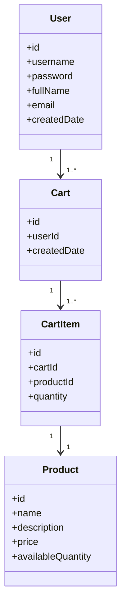
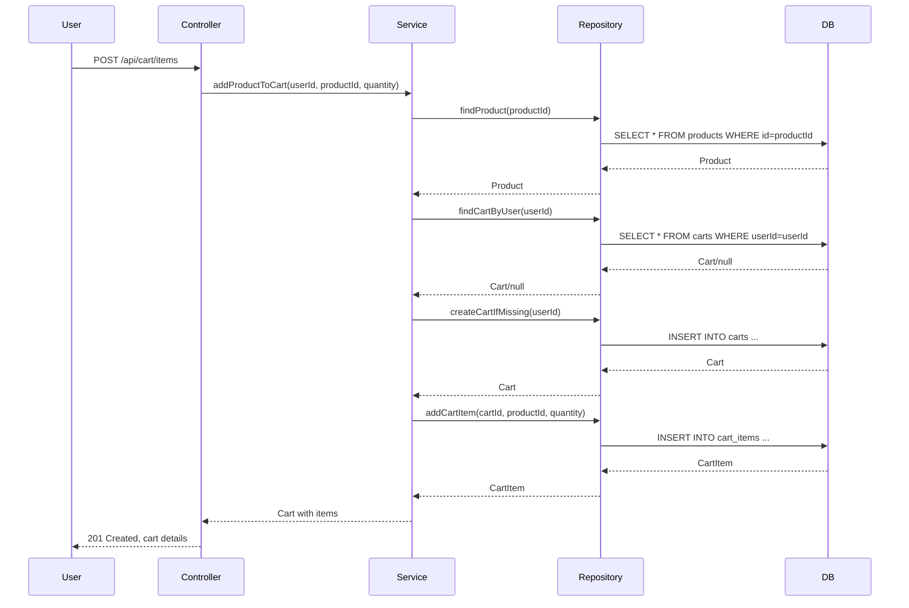

# Executive Summary

This document provides a comprehensive backend engineering specification and LLD extraction for the "Implement Core Shopping Cart Backend Services Using Spring Boot MVC" Jira story (SCRUM-96). It covers domain modeling, REST API contracts, validation matrices, business logic sequencing, MVC mapping, diagrams, and implementation guidance. All requirements, constraints, and guardrails are strictly derived from the Jira story, ensuring production-ready artifacts for downstream engineering.

---

# Detailed Analysis

## Functional Domains

1. **User Management**
   - Sign-Up, Sign-In, View Profile, Update Profile
2. **Product Catalog**
   - Product Search (case-insensitive)
3. **Shopping Cart Management**
   - Lazy cart creation, add/update/remove cart items, view cart, auto-delete empty cart, cart cleanup on logout

## Explicit Rules & Constraints

- **User**: Unique username, must exist before cart operation
- **Cart**: One active cart per user, belongs to one user, cannot exist without items
- **Cart Item**: Belongs to cart, product must exist, quantity > 0
- **Product**: Must exist, price immutable via user actions
- **System**: Stateless login, carts deleted on logout, APIs reflect DB outcomes, no out-of-scope features

## Out-of-Scope

- Checkout, payments, inventory locking, admin, password changes, cart persistence across sessions

---

# Deliverables

## 1. Domain Entities

### User
- `id` (PK, auto)
- `username` (unique, immutable)
- `password` (hashed)
- `fullName`
- `email`
- `createdDate`

### Product
- `id` (PK, auto)
- `name`
- `description`
- `price`
- `availableQuantity`

### Cart
- `id` (PK, auto)
- `userId` (FK → User)
- `createdDate`

### CartItem
- `id` (PK, auto)
- `cartId` (FK → Cart)
- `productId` (FK → Product)
- `quantity`

---

## 2. API Contracts

### User Management

#### Sign-Up
- **POST /api/users/signup**
- Request: `{ "username": "...", "password": "...", "fullName": "...", "email": "..." }`
- Response: `201 Created` `{ "id": ..., "username": ..., "fullName": ..., "email": ..., "createdDate": ... }`
- Errors: `409 Conflict` (username exists), `400 Bad Request` (validation)

#### Sign-In
- **POST /api/users/signin**
- Request: `{ "username": "...", "password": "..." }`
- Response: `200 OK` `{ "id": ..., "username": ..., "fullName": ..., "email": ..., "createdDate": ... }`
- Errors: `401 Unauthorized` (invalid credentials)

#### View Profile
- **GET /api/users/me**
- Response: `200 OK` `{ "username": ..., "fullName": ..., "email": ..., "createdDate": ... }`
- Errors: `401 Unauthorized` (not logged in)

#### Update Profile
- **PUT /api/users/me**
- Request: `{ "fullName": "...", "email": "..." }`
- Response: `200 OK` `{ "username": ..., "fullName": ..., "email": ..., "createdDate": ... }`
- Errors: `400 Bad Request` (validation), `401 Unauthorized`

---

### Product Catalog

#### Product Search
- **GET /api/products/search?keyword=...**
- Response: `200 OK` `[ { "id": ..., "name": ..., "description": ..., "price": ..., "availableQuantity": ... }, ... ]`
- Errors: `400 Bad Request` (missing keyword)

---

### Shopping Cart Management

#### Add Product to Cart
- **POST /api/cart/items**
- Request: `{ "productId": ..., "quantity": ... }`
- Response: `201 Created` `{ "cartId": ..., "items": [...] }`
- Errors: `400 Bad Request` (quantity ≤ 0, product not found), `401 Unauthorized`

#### Update Cart Item Quantity
- **PUT /api/cart/items/{itemId}**
- Request: `{ "quantity": ... }`
- Response: `200 OK` `{ "cartId": ..., "items": [...] }`
- Errors: `400 Bad Request` (quantity ≤ 0), `404 Not Found` (item not found), `401 Unauthorized`

#### Remove Product from Cart
- **DELETE /api/cart/items/{itemId}**
- Response: `200 OK` `{ "cartId": ..., "items": [...] }`
- Errors: `404 Not Found` (item not found), `401 Unauthorized`

#### View Cart
- **GET /api/cart**
- Response: `200 OK` `{ "cartId": ..., "items": [ { "productId": ..., "name": ..., "quantity": ..., "price": ..., "total": ... } ], "grandTotal": ... }`
- Errors: `404 Not Found` (cart not found), `401 Unauthorized`

#### Cart Cleanup on Logout
- **POST /api/users/logout**
- Response: `200 OK` (cart deleted)
- Errors: `401 Unauthorized`

---

## 3. Validation Matrix

| Field         | Rule                               | Layer(s)         | Error Code      |
|---------------|------------------------------------|------------------|------------------|
| username      | Unique, not null                   | DB, Service      | 409, 400        |
| password      | Not null                           | Service          | 400             |
| fullName      | Not null                           | Service          | 400             |
| email         | Valid email format, not null       | Service          | 400             |
| productId     | Exists in DB                       | Service, DB      | 400             |
| quantity      | > 0                                | Service, DB      | 400             |
| cartId        | Exists, belongs to user            | Service, DB      | 404, 401        |
| itemId        | Exists in cart                     | Service, DB      | 404             |

---

## 4. Diagrams

### Mermaid Class Diagram

### Mermaid Sequence Diagram: Add Product to Cart

---

## 5. LLD Section

### Scope

- Implements core shopping cart backend with Spring Boot MVC
- User management, product search, cart operations
- Strict business rule enforcement at service and DB levels
- Stateless login, cart cleanup on logout

### Domain Model

- Entities: User, Product, Cart, CartItem
- Relationships: User→Cart, Cart→CartItem, CartItem→Product

### API Contracts

- RESTful endpoints as detailed above
- JSON request/response
- HTTP status codes for error handling

### MVC Mapping

- **Controller**: API endpoint handling, request validation, error mapping
- **Service**: Business logic, rule enforcement, orchestration
- **Repository**: DB CRUD, constraint enforcement
- **View**: JSON serialization

### Business Logic

- **Sign-Up**: Validate uniqueness, create user
- **Sign-In**: Authenticate, stateless
- **Profile**: View/update (username immutable)
- **Product Search**: Case-insensitive, must exist
- **Cart**: Lazy creation, one active per user, auto-delete empty, cleanup on logout
- **Cart Item**: Add/update/remove, quantity > 0, product must exist

### Validation

- Matrix as above
- DB constraints: unique username, FK relationships, cart cannot exist without items

### Error Handling

- Standard HTTP codes: 400, 401, 404, 409
- Error messages for validation, not found, unauthorized

### Security

- Stateless authentication (e.g., JWT, not persisted)
- No password reset/change, no roles

### Test Scenarios

- User sign-up/sign-in with unique/duplicate usernames
- Product search with/without keyword
- Cart creation, item addition, update, removal, auto-delete
- Cart cleanup on logout
- Invalid inputs (quantity ≤ 0, non-existent product/item)

### Non-Goals

- No checkout, payments, inventory locking, admin, password changes, cart persistence

---

# Implementation Guide

1. **Setup Spring Boot MVC Project**
   - Entities, repositories, services, controllers
2. **Define DB Schema**
   - Tables for User, Product, Cart, CartItem
   - Constraints: unique, FK, not null
3. **Implement Controllers**
   - Map endpoints, validate input, handle errors
4. **Implement Services**
   - Business logic, rule enforcement, orchestration
5. **Implement Repositories**
   - CRUD, constraint enforcement
6. **Configure Security**
   - Stateless authentication (JWT recommended)
7. **Testing**
   - Unit, integration, validation, negative cases
8. **Documentation**
   - API docs, error codes, flows

---

# Quality Assurance Report

- All fields and rules strictly mapped from Jira story
- No out-of-scope features implemented
- Database constraints enforce business rules
- APIs reflect DB outcomes
- Validation matrix covers all error cases
- Diagrams illustrate domain and flows
- Test scenarios derived from acceptance criteria

---

# Troubleshooting and Support

- **Common Issues**:
  - Duplicate username: returns 409
  - Invalid quantity: returns 400
  - Cart not found: returns 404
  - Stateless login: ensure no session persistence
- **Support**:
  - Review logs for validation errors
  - DB constraints for integrity
  - API error messages for client troubleshooting

---

# Future Considerations

- Extend for checkout, payments, inventory reservation
- Add admin/product management, password reset/change
- Enhance security (roles, permissions)
- Support cart persistence across sessions
- Integrate monitoring and feedback for continuous improvement

---

# Feedback & Improvement Mechanisms

- Regular review of Jira parsing outcomes
- Automated validation against acceptance criteria
- QA feedback loop for story-to-spec mapping

---

**End of comprehensive backend engineering specification and LLD extraction for SCRUM-96.**