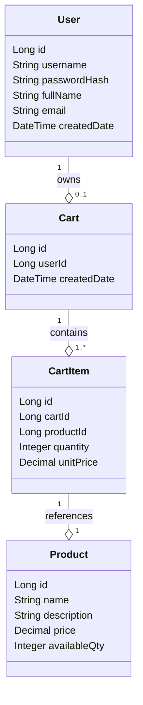
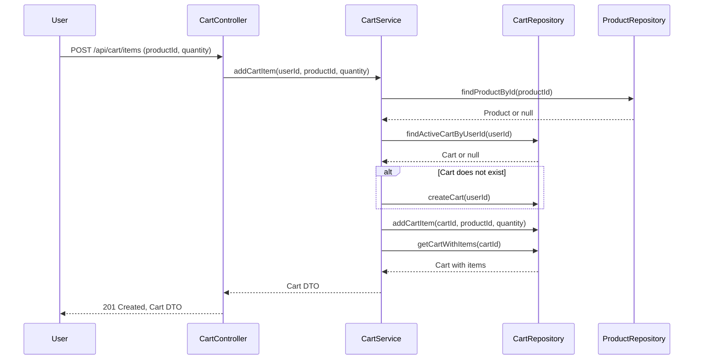

# Backend Engineering Specification Package: Shopping Cart System (Java Spring Boot, MVC)

---

## Executive Summary

This document provides a comprehensive backend engineering specification for a Shopping Cart System, designed for implementation in Java Spring Boot using the MVC architecture. It covers user management, product catalog, and shopping cart management, with strict adherence to functional scope, data integrity, and system-level rules as defined in Jira story SCRUM-96. The specification includes domain models, REST API contracts, validation matrices, Mermaid diagrams, detailed LLD documentation, and implementation guidance, ensuring production readiness and downstream engineering efficiency.

---

## Detailed Analysis

### 1. Functional Scope

#### 1.1 User Management
- **Sign-Up:** Register new users (username, password, full name, email). Username must be unique.
- **Sign-In:** Authenticate via username/password. Stateless at DB level. Returns user details.
- **View Profile:** Display username, full name, email, created date.
- **Update Profile:** Update full name and email only. Username immutable. Password changes out of scope.

#### 1.2 Product Catalog
- **Product Search:** Case-insensitive keyword search. Returns name, description, price, available quantity.

#### 1.3 Shopping Cart Management
- **Lazy Cart Creation:** Cart created only when first product is added.
- **Add Product to Cart:** Select product and quantity (>0). Auto-create cart if missing.
- **Update Cart Item Quantity:** Increase/decrease quantity (>0).
- **Remove Product from Cart:** Remove selected product.
- **View Cart:** List products, per-item totals, grand total.
- **Auto-Delete Empty Cart:** Delete cart and items when last item removed.
- **Cart Cleanup on Logout:** Delete cart and items on logout.

### 2. Data Integrity & Constraints

- **User:** Username unique. Must exist before cart ops.
- **Cart:** One active cart per user. Belongs to one user. Cannot exist without items.
- **Cart Item:** Belongs to one cart. Product must exist. Quantity >0.
- **Product:** Must exist. Price immutable via user actions.

### 3. System-Level Rules

- Seed users do not automatically receive carts.
- Login is stateless at DB level.
- All business rules verifiable via DB state.
- APIs reflect DB outcomes.

### 4. Out of Scope

- Checkout/Orders, Payments, Inventory reservation, Admin product management, Password reset/change, User roles & permissions, Cart persistence across sessions.

### 5. Acceptance Criteria

- APIs conform to MVC layering.
- DB constraints enforce uniqueness and FK rules.
- Cart lifecycle rules as defined.
- Empty carts removed automatically.
- Logout deletes active cart.
- Product search is case-insensitive.
- Stateless authentication.
- No out-of-scope functionality.

---

## Deliverables

### 1. Domain Entities & Attributes

#### User
| Field        | Type      | Constraints                        |
|--------------|-----------|------------------------------------||
| id           | Long      | PK, auto-generated                 |
| username     | String    | Unique, not null, immutable        |
| passwordHash | String    | Not null                           |
| fullName     | String    | Not null                           |
| email        | String    | Not null                           |
| createdDate  | DateTime  | Not null, auto-generated           |

#### Product
| Field        | Type      | Constraints                        |
|--------------|-----------|------------------------------------||
| id           | Long      | PK, auto-generated                 |
| name         | String    | Not null                           |
| description  | String    |                                   |
| price        | Decimal   | Not null, >0                       |
| availableQty | Integer   | >=0                                |

#### Cart
| Field        | Type      | Constraints                        |
|--------------|-----------|------------------------------------||
| id           | Long      | PK, auto-generated                 |
| userId       | Long      | FK to User, not null, unique       |
| createdDate  | DateTime  | Not null, auto-generated           |

#### CartItem
| Field        | Type      | Constraints                        |
|--------------|-----------|------------------------------------||
| id           | Long      | PK, auto-generated                 |
| cartId       | Long      | FK to Cart, not null               |
| productId    | Long      | FK to Product, not null            |
| quantity     | Integer   | >0                                 |
| unitPrice    | Decimal   | Snapshotted from Product.price     |

### 2. REST API Contracts

#### User APIs

- **POST /api/users/signup**
  - Request: `{ "username": "...", "password": "...", "fullName": "...", "email": "..." }`
  - Response: `201 Created`, `{ "id": ..., "username": "...", "fullName": "...", "email": "...", "createdDate": "..." }`
  - Errors: 400 (validation), 409 (username exists)

- **POST /api/users/signin**
  - Request: `{ "username": "...", "password": "..." }`
  - Response: `200 OK`, `{ "id": ..., "username": "...", "fullName": "...", "email": "...", "createdDate": "..." }`
  - Errors: 401 (invalid credentials)

- **GET /api/users/profile**
  - Auth required
  - Response: `200 OK`, `{ "username": "...", "fullName": "...", "email": "...", "createdDate": "..." }`
  - Errors: 401 (unauthenticated)

- **PUT /api/users/profile**
  - Request: `{ "fullName": "...", "email": "..." }`
  - Response: `200 OK`, `{ "username": "...", "fullName": "...", "email": "...", "createdDate": "..." }`
  - Errors: 400 (validation), 401 (unauthenticated)

#### Product APIs

- **GET /api/products/search?keyword=...**
  - Response: `200 OK`, `[ { "id": ..., "name": "...", "description": "...", "price": ..., "availableQty": ... }, ... ]`
  - Errors: 400 (invalid query)

#### Cart APIs

- **POST /api/cart/items**
  - Request: `{ "productId": ..., "quantity": ... }`
  - Response: `201 Created`, `{ "cartId": ..., "items": [ ... ], "grandTotal": ... }`
  - Errors: 400 (validation), 404 (product not found), 401 (unauthenticated)

- **PUT /api/cart/items/{itemId}**
  - Request: `{ "quantity": ... }`
  - Response: `200 OK`, `{ "cartId": ..., "items": [ ... ], "grandTotal": ... }`
  - Errors: 400 (validation), 404 (item not found), 401 (unauthenticated)

- **DELETE /api/cart/items/{itemId}**
  - Response: `200 OK`, `{ "cartId": ..., "items": [ ... ], "grandTotal": ... }` or `204 No Content` if cart deleted
  - Errors: 404 (item not found), 401 (unauthenticated)

- **GET /api/cart**
  - Response: `200 OK`, `{ "cartId": ..., "items": [ { "itemId": ..., "productId": ..., "name": "...", "quantity": ..., "unitPrice": ..., "total": ... } ], "grandTotal": ... }` or `404 Not Found` (no cart)
  - Errors: 401 (unauthenticated)

- **POST /api/cart/logout**
  - Response: `204 No Content`
  - Effect: Deletes cart and items for user session

### 3. Validation Matrix

| API                   | Field           | Validation Rule                       | Error Code |
|-----------------------|-----------------|---------------------------------------|------------|
| Sign-Up               | username        | Unique, not null, length 3-32         | 400/409    |
|                       | password        | Not null, length >=8                  | 400        |
|                       | fullName        | Not null, length 1-64                 | 400        |
|                       | email           | Valid email format, not null          | 400        |
| Sign-In               | username        | Exists                                | 401        |
|                       | password        | Matches hash                          | 401        |
| Update Profile        | fullName/email  | Not null, valid formats               | 400        |
| Product Search        | keyword         | Not null, length >=1                  | 400        |
| Add Cart Item         | productId       | Exists                                | 404        |
|                       | quantity        | Integer >0                            | 400        |
| Update Cart Item      | quantity        | Integer >0                            | 400        |
| Remove Cart Item      | itemId          | Exists in user's cart                 | 404        |
| View Cart             | N/A             | Cart exists for user                  | 404        |
| Logout                | N/A             | Authenticated session                 | 401        |

### 4. Mermaid Diagrams

#### Class Diagram

#### Sequence Diagram: Add Product to Cart

### 5. Low-Level Design (LLD) Documentation

#### MVC Layering

- **Controller Layer:** Handles HTTP requests, authentication, input validation, maps to service calls, formats responses.
- **Service Layer:** Orchestrates business logic, enforces rules (cart lifecycle, uniqueness, statelessness), coordinates repositories, error handling.
- **Repository Layer:** Direct DB access, entity CRUD, query composition, transaction management.

#### API Responsibilities

- **UserController**
  - `signup()`: Validate, hash password, persist user.
  - `signin()`: Validate, authenticate, return DTO.
  - `profile()`: Auth, fetch user, return DTO.
  - `updateProfile()`: Auth, validate, update allowed fields.

- **ProductController**
  - `searchProducts()`: Validate keyword, query repository, return DTO list.

- **CartController**
  - `addCartItem()`: Auth, validate product/quantity, lazy cart creation, persist item.
  - `updateCartItem()`: Auth, validate, update quantity, auto-delete cart if empty.
  - `removeCartItem()`: Auth, validate, remove item, auto-delete cart if empty.
  - `getCart()`: Auth, fetch cart/items, calculate totals.
  - `logout()`: Auth, delete cart/items.

#### Error Handling

- Use standard HTTP status codes.
- Return structured error messages: `{ "error": "message", "details": ... }`
- Log all validation and DB errors.

#### Database Effects

- **User:** Insert on sign-up, update on profile change.
- **Product:** Read-only for users.
- **Cart:** Create on first item add, delete when empty or on logout.
- **CartItem:** Insert/update/delete per API, cascade delete on cart removal.

#### Transactional Guarantees

- Cart and CartItem operations must be atomic.
- Use DB constraints for FK, uniqueness, and non-null.

---

## Implementation Guide

### 1. Entity Definitions (JPA/Hibernate)

- Annotate entities with FK, uniqueness, and not-null constraints.
- Use DTOs for API responses.
- Hash passwords using bcrypt.

### 2. Repository Interfaces

- `UserRepository`: findByUsername, save, update.
- `ProductRepository`: searchByKeyword (case-insensitive), findById.
- `CartRepository`: findActiveByUserId, save, delete.
- `CartItemRepository`: findByCartId, save, update, delete.

### 3. Service Logic

- **UserService:** Registration, authentication, profile management.
- **ProductService:** Search logic.
- **CartService:** Cart lifecycle, item management, cleanup on logout.

### 4. Controller Endpoints

- Use `@RestController`, map endpoints, validate inputs.
- Inject services via constructor.
- Handle exceptions globally (`@ControllerAdvice`).

### 5. Security

- Use JWT or session tokens for stateless authentication.
- Validate token on each request.
- No password reset/change endpoints.

### 6. Testing

- Unit tests for service/repository logic.
- Integration tests for API endpoints.
- Test DB constraints and transactional behavior.

---

## Quality Assurance Report

- **Coverage:** All functional scope and constraints mapped to APIs and DB.
- **Validation:** Matrix ensures all edge cases and errors handled.
- **Consistency:** Entity relationships, API contracts, and DB rules aligned.
- **Completeness:** No out-of-scope features present.
- **Acceptance:** All acceptance criteria traceable to implementation.

---

## Troubleshooting and Support

- **Common Issues:**
  - Unique constraint violations (username, cart per user).
  - FK constraint failures (cartItem references).
  - Stateless login failures (token issues).
  - Cart not deleted (check auto-delete logic).
- **Debugging:**
  - Enable SQL logging for DB errors.
  - Use structured error responses.
  - Log all API errors with context.

---

## Future Considerations

- **Checkout/Order Management:** Extend cart to order flow.
- **Inventory Reservation:** Integrate with inventory system.
- **Admin Product Management:** Add product CRUD for admins.
- **Password Management:** Add password reset/change.
- **Role-Based Access:** Extend user model for roles/permissions.
- **Session Persistence:** Support cart persistence across sessions.
- **Scalability:** Optimize for distributed systems and caching.

---

## Continuous Monitoring & Feedback

- **API Metrics:** Track usage, errors, performance.
- **DB Health:** Monitor constraint violations.
- **User Feedback:** Provide API error messages and documentation.
- **Engineering Feedback:** Regular code reviews, QA cycles.

---

# END OF SPECIFICATION PACKAGE

This document is ready for direct use by backend engineering teams for implementation, validation, and further extension. All requirements, rules, and acceptance criteria are mapped to technical artifacts, ensuring production readiness and maintainability.