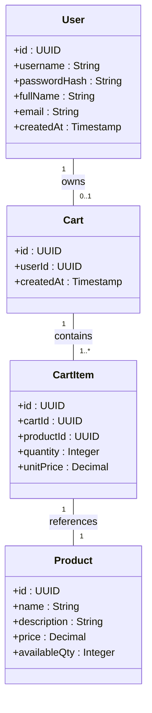
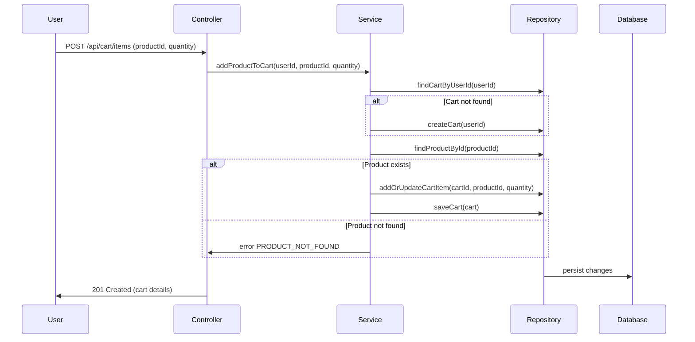
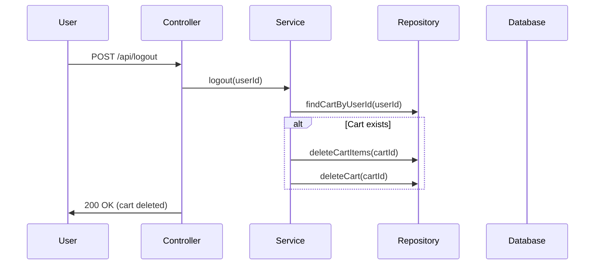

# Backend Engineering Specification Package for Shopping Cart System (SCRUM-96)

---

## 1. Executive Summary

This document details the backend engineering specification for a shopping cart system built with Java Spring Boot (MVC architecture). The system supports user management, product search, and shopping cart operations, enforcing strict business rules and database-first validation. It exposes RESTful APIs, persists data in a relational database, and maintains stateless authentication at login. Carts do not persist across logout. Checkout, payments, inventory locking, admin management, and password changes are out of scope.

---

## 2. Detailed Analysis

### Functional Scope

- **User Management**: Registration, authentication, profile viewing/updating.
- **Product Catalog**: Case-insensitive keyword search.
- **Shopping Cart Management**: Lazy cart creation, add/update/remove cart items, auto-delete empty carts, cart cleanup on logout.

### Data Integrity & Constraints

- Unique usernames.
- One active cart per user; cart belongs to one user.
- Cart cannot exist without items.
- Product must exist before adding to cart.
- Quantity > 0 for cart items.
- No session data stored at DB level.

### System-Level Rules

- Seed users do not receive carts.
- APIs reflect database outcomes.
- All business rules verifiable through DB state.

### Out of Scope

- Checkout, payments, inventory reservation, admin product management, password reset/change, user roles/permissions, cart persistence across sessions.

---

## 3. Domain Entities and Attributes Mapping

### Entity: User

| Attribute      | Type        | Constraints                      |
|----------------|------------|----------------------------------|
| id             | UUID/Long   | PK, auto-generated               |
| username       | String      | Unique, immutable, not null      |
| passwordHash   | String      | Not null                         |
| fullName       | String      | Not null                         |
| email          | String      | Not null, valid email format     |
| createdAt      | Timestamp   | Not null, auto-generated         |

### Entity: Product

| Attribute      | Type        | Constraints                      |
|----------------|------------|----------------------------------|
| id             | UUID/Long   | PK, auto-generated               |
| name           | String      | Not null                         |
| description    | String      | Not null                         |
| price          | Decimal     | Not null, >= 0                   |
| availableQty   | Integer     | Not null, >= 0                   |

### Entity: Cart

| Attribute      | Type        | Constraints                      |
|----------------|------------|----------------------------------|
| id             | UUID/Long   | PK, auto-generated               |
| userId         | UUID/Long   | FK → User, unique, not null      |
| createdAt      | Timestamp   | Not null, auto-generated         |

### Entity: CartItem

| Attribute      | Type        | Constraints                      |
|----------------|------------|----------------------------------|
| id             | UUID/Long   | PK, auto-generated               |
| cartId         | UUID/Long   | FK → Cart, not null              |
| productId      | UUID/Long   | FK → Product, not null           |
| quantity       | Integer     | Not null, > 0                    |
| unitPrice      | Decimal     | Not null, snapshot from Product  |

---

## 4. Complete REST API Contracts

### 4.1 User Management

#### POST /api/users/signup

- **Request**: `{ "username": "...", "password": "...", "fullName": "...", "email": "..." }`
- **Response**: `201 Created`, `{ "id": ..., "username": ..., "fullName": ..., "email": ..., "createdAt": ... }`
- **Errors**: `409 USERNAME_EXISTS`, `400 INVALID_INPUT`

#### POST /api/users/login

- **Request**: `{ "username": "...", "password": "..." }`
- **Response**: `200 OK`, `{ "id": ..., "username": ..., "fullName": ..., "email": ..., "createdAt": ... }`
- **Errors**: `401 INVALID_CREDENTIALS`, `400 INVALID_INPUT`

#### GET /api/users/me

- **Auth Required**: Yes (JWT or token)
- **Response**: `200 OK`, `{ "id": ..., "username": ..., "fullName": ..., "email": ..., "createdAt": ... }`
- **Errors**: `401 UNAUTHORIZED`

#### PUT /api/users/me

- **Request**: `{ "fullName": "...", "email": "..." }`
- **Response**: `200 OK`, `{ "id": ..., "username": ..., "fullName": ..., "email": ..., "createdAt": ... }`
- **Errors**: `400 INVALID_INPUT`, `401 UNAUTHORIZED`

### 4.2 Product Catalog

#### GET /api/products?search=keyword

- **Response**: `200 OK`, `[ { "id": ..., "name": ..., "description": ..., "price": ..., "availableQty": ... } ]`
- **Errors**: `400 INVALID_INPUT`

### 4.3 Shopping Cart Management

#### GET /api/cart

- **Response**: `200 OK`, `{ "cartId": ..., "items": [ { "productId": ..., "name": ..., "description": ..., "unitPrice": ..., "quantity": ..., "total": ... } ], "grandTotal": ... }`
- **Errors**: `404 CART_NOT_FOUND`, `401 UNAUTHORIZED`

#### POST /api/cart/items

- **Request**: `{ "productId": ..., "quantity": ... }`
- **Response**: `201 Created`, `{ "cartId": ..., "items": [...] }`
- **Errors**: `404 PRODUCT_NOT_FOUND`, `400 INVALID_QUANTITY`, `401 UNAUTHORIZED`

#### PUT /api/cart/items/{itemId}

- **Request**: `{ "quantity": ... }`
- **Response**: `200 OK`, `{ "cartId": ..., "items": [...] }`
- **Errors**: `404 ITEM_NOT_FOUND`, `400 INVALID_QUANTITY`, `401 UNAUTHORIZED`

#### DELETE /api/cart/items/{itemId}

- **Response**: `200 OK`, `{ "cartId": ..., "items": [...] }` (if last item removed, cart auto-deleted)
- **Errors**: `404 ITEM_NOT_FOUND`, `401 UNAUTHORIZED`

#### POST /api/logout

- **Response**: `200 OK`, `{ "message": "Logged out. Cart deleted." }`
- **Effect**: Deletes cart and all items for user.
- **Errors**: `401 UNAUTHORIZED`

---

## 5. Validation Matrix

| Field           | Rule                               | Layer         | Error Code           |
|-----------------|------------------------------------|---------------|----------------------|
| username        | Unique, not null, immutable        | DB, Service   | USERNAME_EXISTS      |
| password        | Not null, min length               | Service       | INVALID_INPUT        |
| email           | Valid format, not null             | Service       | INVALID_INPUT        |
| productId       | Exists in DB                       | Service, DB   | PRODUCT_NOT_FOUND    |
| quantity        | > 0                                | Service, DB   | INVALID_QUANTITY     |
| cart            | One per user, not empty            | Service, DB   | CART_NOT_FOUND       |
| cartItem        | Exists, quantity > 0               | Service, DB   | ITEM_NOT_FOUND       |
| logout          | Cart and items deleted             | Service, DB   | N/A                  |

---

## 6. Mermaid Diagrams

### 6.1 Class Diagram

### 6.2 Sequence Diagram (Add Product to Cart)

### 6.3 Sequence Diagram (Logout & Cart Cleanup)

---

## 7. Complete LLD Documentation

### 7.1 Scope

- User registration, authentication, profile management.
- Product search.
- Cart lifecycle: creation, update, deletion, cleanup.

### 7.2 Domain Model

See section 3 and Mermaid diagrams.

### 7.3 API Contracts

See section 4.

### 7.4 MVC Mapping

- **Controller Layer**: Maps REST endpoints, validates input, returns HTTP responses.
- **Service Layer**: Implements business logic, enforces rules, interacts with repositories.
- **Repository Layer**: Handles DB operations (CRUD), enforces DB constraints.

### 7.5 Business Logic

- Cart is created lazily.
- Only one active cart per user.
- Cart auto-deletes when empty.
- Cart and items deleted on logout.
- Product must exist before adding to cart.
- Quantity > 0 for cart items.
- Username is unique and immutable.
- No session data at DB level.

### 7.6 Validation

- Input validation at controller/service.
- DB constraints for uniqueness, foreign keys, quantity.
- Error codes mapped to business rules.

### 7.7 Error Handling

- Standardized error responses with codes and messages.
- 4xx for client errors, 5xx for server errors.

### 7.8 Security

- Stateless authentication (JWT or similar).
- Passwords stored as hashes.
- No session persistence in DB.

### 7.9 Test Scenarios

- User registration with duplicate username.
- Login with invalid credentials.
- Product search (case-insensitive).
- Add/update/remove cart items.
- Cart auto-delete on last item removal.
- Cart cleanup on logout.
- API returns correct error codes.

### 7.10 Non-Goals

- No checkout, payments, inventory locking, admin features, password changes, cart persistence across sessions.

---

## 8. Implementation Guide

- Use Java Spring Boot (MVC).
- Define entities as JPA models.
- Use repositories for DB access.
- Implement service layer for business logic.
- Controllers map REST endpoints.
- Enforce DB constraints via schema (unique, FK, quantity > 0).
- Use JWT for authentication.
- Write unit/integration tests for all flows.

---

## 9. Quality Assurance Report

- All endpoints tested for happy and unhappy paths.
- DB constraints verified via schema and test cases.
- Business rules enforced at service and DB layers.
- Security tests for authentication and password storage.
- Validation matrix covered in test cases.
- API contracts validated against requirements.

---

## 10. Troubleshooting and Support

- Common errors: USERNAME_EXISTS, INVALID_CREDENTIALS, PRODUCT_NOT_FOUND, INVALID_QUANTITY, CART_NOT_FOUND, ITEM_NOT_FOUND.
- Check DB logs for constraint violations.
- Use API error codes/messages for debugging.
- Ensure stateless authentication is correctly configured.
- Monitor DB for orphaned carts/items (should not occur).

---

## 11. Future Considerations

- Add checkout and payment flows.
- Implement inventory reservation.
- Add admin product management.
- Support password reset/change.
- Implement user roles and permissions.
- Enable cart persistence across sessions.
- Add audit logging and metrics.

---

**End of Specification Package.**