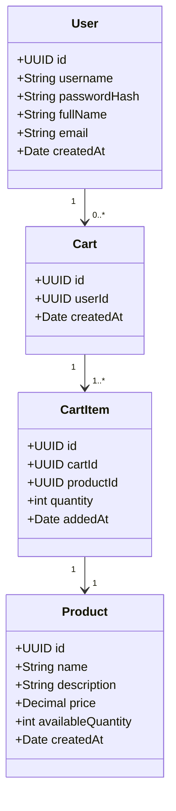
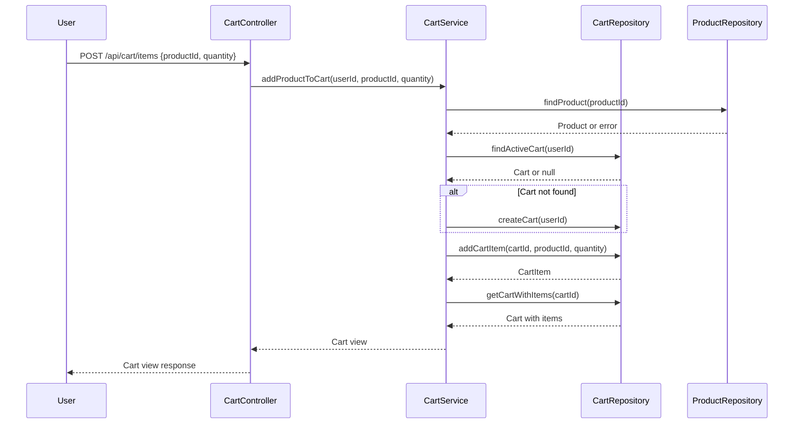

# Backend Engineering Specification Package for Shopping Cart System (SCRUM-96)

---

## Executive Summary

This document delivers a comprehensive backend engineering specification for the shopping cart system described in Jira story SCRUM-96. The solution is designed for Java Spring Boot (MVC architecture), enforcing strict business rules and database-first validation. It covers user management, product search, and shopping cart operations, with all domain rules enforced at both service and database levels. The system is stateless at login, and carts do not persist across logout. Checkout, payments, inventory locking, admin management, and password changes are out of scope.

---

## Detailed Analysis

### 1. Functional Domains

#### User Management
- **Sign-Up**: Register new users with unique username, password, full name, email.
- **Sign-In**: Authenticate via username and password; stateless at DB level.
- **View Profile**: Retrieve user details.
- **Update Profile**: Update full name and email; username is immutable.

#### Product Catalog
- **Search Products**: Keyword-based, case-insensitive search; returns name, description, price, available quantity.

#### Shopping Cart Management
- **Lazy Cart Creation**: Cart created only when first product is added.
- **Add Product to Cart**: Add product and quantity (>0); auto-create cart if missing.
- **Update Cart Item Quantity**: Change quantity (>0).
- **Remove Product from Cart**: Remove specific product.
- **View Cart**: List all cart products, per-item totals, grand total.
- **Auto-Delete Empty Cart**: Cart deleted when last item removed.
- **Cart Cleanup on Logout**: Cart deleted on logout.

### 2. Explicit Rules & Constraints

- **User**: Username unique; must exist before cart operations.
- **Cart**: One active cart per user; cart must have at least one item.
- **Cart Item**: Belongs to one cart; product must exist; quantity > 0.
- **Product**: Must exist; price immutable via user actions.
- **System**: Seed users do not get carts; login stateless at DB; APIs reflect DB outcomes.

### 3. Out-of-Scope Items

- Checkout/Orders
- Payments
- Inventory reservation
- Admin product management
- Password reset/change
- User roles & permissions
- Cart persistence across sessions

### 4. Guardrails

- No session data stored at database level.
- All business rules verifiable via DB state.
- APIs must reflect DB outcomes.

---

## Deliverables

### 1. Domain Entities & Attributes

#### User
- `id` (PK, UUID)
- `username` (unique, immutable)
- `password_hash`
- `full_name`
- `email`
- `created_at`

#### Product
- `id` (PK, UUID)
- `name`
- `description`
- `price`
- `available_quantity`
- `created_at`

#### Cart
- `id` (PK, UUID)
- `user_id` (FK → User)
- `created_at`

#### CartItem
- `id` (PK, UUID)
- `cart_id` (FK → Cart)
- `product_id` (FK → Product)
- `quantity`
- `added_at`

---

### 2. REST API Contracts

#### User APIs

| Endpoint                | Method | Request Body / Params                        | Response                                | Error Cases                       |
|-------------------------|--------|----------------------------------------------|-----------------------------------------|-----------------------------------|
| `/api/users/signup`     | POST   | `{username, password, fullName, email}`      | `{id, username, fullName, email, createdAt}` | 400 (validation), 409 (duplicate) |
| `/api/users/login`      | POST   | `{username, password}`                       | `{id, username, fullName, email, createdAt}` | 401 (auth fail), 404 (not found)  |
| `/api/users/profile`    | GET    | Auth token                                   | `{id, username, fullName, email, createdAt}` | 401 (unauth)                      |
| `/api/users/profile`    | PUT    | `{fullName, email}`                          | `{id, username, fullName, email, createdAt}` | 400 (validation), 401 (unauth)    |
| `/api/users/logout`     | POST   | Auth token                                   | `{message: "Logged out"}`               | 401 (unauth)                      |

#### Product APIs

| Endpoint                | Method | Request Body / Params                        | Response                                | Error Cases                       |
|-------------------------|--------|----------------------------------------------|-----------------------------------------|-----------------------------------|
| `/api/products/search`  | GET    | `?q=keyword`                                | `[ {id, name, description, price, availableQuantity} ]` | 400 (missing q), 404 (none found) |

#### Cart APIs

| Endpoint                | Method | Request Body / Params                        | Response                                | Error Cases                       |
|-------------------------|--------|----------------------------------------------|-----------------------------------------|-----------------------------------|
| `/api/cart`             | GET    | Auth token                                   | `{items: [ {productId, name, price, quantity, total} ], grandTotal}` | 401 (unauth), 404 (cart not found)|
| `/api/cart/items`       | POST   | `{productId, quantity}`                      | Updated cart view                       | 400 (validation), 404 (product)   |
| `/api/cart/items/{itemId}` | PUT | `{quantity}`                                 | Updated cart view                       | 400 (validation), 404 (item)      |
| `/api/cart/items/{itemId}` | DELETE |                                            | Updated cart view or 204 if cart deleted| 404 (item), 401 (unauth)          |

---

### 3. Validation Matrix

| Field         | Rule/Constraint                        | Layer         | Error Code    |
|---------------|----------------------------------------|---------------|---------------|
| username      | Required, unique, immutable            | Service, DB   | 400, 409      |
| password      | Required, min length                   | Service       | 400           |
| fullName      | Required, max length                   | Service       | 400           |
| email         | Required, valid format                 | Service       | 400           |
| productId     | Must exist                             | Service, DB   | 404           |
| quantity      | Required, integer > 0                  | Service, DB   | 400           |
| cart          | Only one active per user               | Service, DB   | 400           |
| cart item     | Must belong to cart, product exists    | Service, DB   | 400, 404      |
| cart empty    | Auto-delete cart                       | Service, DB   | 204           |

---

### 4. Mermaid Diagrams

#### Class Diagram

#### Sequence Diagram: Add Product to Cart

---

### 5. Low-Level Design (LLD) Documentation

#### Scope

- Implements backend services for user management, product search, and shopping cart operations.
- Enforces business rules at service and database levels.
- Stateless authentication; carts do not persist across logout.

#### Domain Model

- Entities: User, Product, Cart, CartItem.
- Relationships: User→Cart (1:0..*), Cart→CartItem (1:1..*), CartItem→Product (1:1).

#### API Contracts

- RESTful endpoints as detailed above.
- All endpoints return standardized error codes and messages.

#### MVC Layer Mapping

- **Controller**: Handles HTTP requests, input validation, error mapping.
- **Service**: Implements business logic, orchestrates repository calls, enforces rules.
- **Repository**: Data access, DB constraints, transaction management.
- **View**: API JSON responses.

#### Business Logic Sequencing

- User must exist for cart actions.
- Cart auto-creates on first add.
- Only one active cart per user.
- Cart auto-deletes when empty or on logout.
- Product must exist before adding to cart.
- Quantity must be >0 for add/update.
- Product search is case-insensitive.

#### Validation & Error Handling

- All fields validated at service layer.
- DB constraints for uniqueness, foreign keys.
- Standardized error codes (400, 401, 404, 409, 204).

#### Security

- Stateless authentication (JWT or similar).
- No session data at DB level.
- Passwords stored as hashes.

#### Test Scenarios

- User sign-up with duplicate username (expect 409).
- Sign-in with wrong password (expect 401).
- Add product to cart with non-existent product (expect 404).
- Update cart item to zero quantity (expect 400).
- Remove last item from cart (expect cart deleted).
- Logout with active cart (expect cart deleted).
- Product search with mixed case keyword (expect results).

#### Non-Goals

- No checkout, payments, inventory locking, admin management, password changes, cart persistence across sessions.

---

## Implementation Guide

### 1. Database Schema

- Use UUIDs for all PKs.
- Enforce uniqueness on username.
- Foreign keys for cart→user, cartItem→cart, cartItem→product.
- Cascade delete cartItems on cart delete.

### 2. Spring Boot Setup

- Create entities, repositories (JPA), services, controllers.
- Use DTOs for API requests/responses.
- Implement validation annotations and custom validators.
- Use JWT for stateless authentication.

### 3. API Implementation

- Controllers: Map endpoints, validate input, handle exceptions.
- Services: Implement business rules, orchestrate repository calls.
- Repositories: JPA interfaces, custom queries for search.
- Error handling: Global exception handler for standardized responses.

### 4. Cart Lifecycle

- On add product: check for active cart, create if missing.
- On remove item: if last, delete cart.
- On logout: delete active cart.

### 5. Product Search

- Use ILIKE or lower() in SQL for case-insensitive search.

---

## Quality Assurance Report

- All requirements mapped to APIs and DB schema.
- Validation matrix covers all fields and rules.
- Diagrams reflect entity relationships and flow.
- Test scenarios cover edge cases and business rules.
- No out-of-scope features included.
- Stateless authentication enforced.

---

## Troubleshooting and Support

- **Common Issues**:
    - Duplicate username: Returns 409.
    - Cart not found: Returns 404.
    - Product not found: Returns 404.
    - Invalid quantity: Returns 400.
    - Unauthorized access: Returns 401.

- **Support**:
    - Centralized error handling.
    - Logging for all API calls and errors.
    - DB constraints for data integrity.

---

## Future Considerations

- Extend for checkout and order management.
- Add inventory reservation and payment integration.
- Implement admin product management.
- Support password reset/change.
- Enable cart persistence across sessions.
- Introduce user roles and permissions.

---

## Continuous Monitoring

- Recommend API usage metrics and error rate tracking.
- Automated integration tests for all endpoints.
- Regular DB integrity checks.
- Feedback mechanism via API error reporting.

---

# Complete Backend Engineering Specification Package

This package includes:

- Domain entities and attributes
- REST API contracts (endpoints, methods, request/response, error cases)
- Validation matrix
- Mermaid class and sequence diagrams
- Complete LLD documentation
- Implementation guide
- QA report
- Troubleshooting and support
- Future considerations

This specification is production-ready and supports downstream engineering implementation for the shopping cart system as described in SCRUM-96.