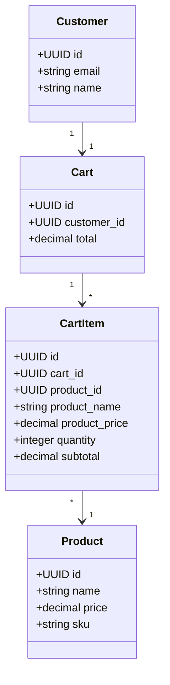
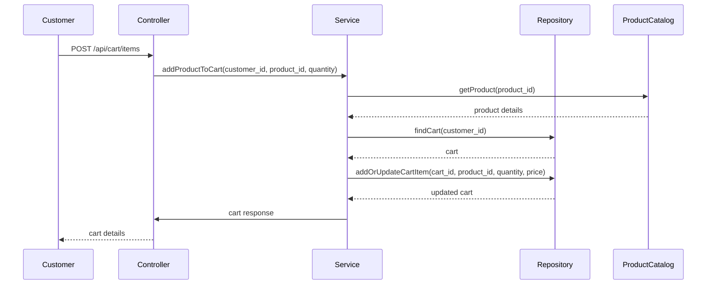

# Backend Engineering Specification Package: Shopping Cart Management ([FR] SCRUM-343)

---

## Executive Summary

This specification details the backend engineering requirements for the Shopping Cart Management feature, enabling customers to add products to their cart, manage quantities, view cart contents, update or remove items, and handle empty cart scenarios. The document translates product requirements and acceptance criteria into actionable engineering artifacts, including domain models, REST API contracts, validation matrices, Mermaid diagrams, and a complete LLD for production implementation.

---

## Detailed Analysis

### Functional Domains

- **Shopping Cart**: Temporary container for products selected by the customer.
- **Cart Item**: Representation of a product in the cart, including quantity and price.
- **Product**: Catalog entity with attributes such as name, price, and SKU.
- **Customer/User**: Owner of the cart, authenticated via session or token.

### Explicit Rules

- Adding a product sets quantity to 1 unless already present (then increments).
- Cart displays all items with name, price, quantity, and subtotal.
- Quantity updates recalculate subtotals and cart total.
- Removing an item deletes it and updates totals.
- Empty cart displays a message and link to continue shopping.

### Out-of-Scope Items

- Checkout/payment processing.
- Inventory reservation.
- Guest cart persistence across sessions.
- Product catalog management.

### Guardrails

- Cart operations are scoped to authenticated customers.
- Cart must not allow negative or zero quantities.
- Product price is fetched from the catalog at add time (not persisted in cart).
- Cart is session-based or user-based (configurable).

---

## Deliverables

### 1. Domain Entities & Attributes

#### **Customer**
- `id`: UUID
- `email`: string
- `name`: string

#### **Product**
- `id`: UUID
- `name`: string
- `price`: decimal
- `sku`: string

#### **Cart**
- `id`: UUID
- `customer_id`: UUID
- `items`: List[CartItem]
- `total`: decimal

#### **CartItem**
- `id`: UUID
- `cart_id`: UUID
- `product_id`: UUID
- `product_name`: string
- `product_price`: decimal
- `quantity`: integer
- `subtotal`: decimal

---

### 2. REST API Contracts

#### **Add Product to Cart**
- **Endpoint**: `POST /api/cart/items`
- **Request Body**:
  ```json
  {
    "product_id": "UUID",
    "quantity": 1 // optional, defaults to 1
  }
  ```
- **Response**:
  ```json
  {
    "cart_id": "UUID",
    "items": [ ... ],
    "total": 123.45
  }
  ```
- **Business Logic**:
  - If item exists, increment quantity.
  - Fetch product price from catalog.
  - Recalculate subtotal and cart total.

#### **View Cart**
- **Endpoint**: `GET /api/cart`
- **Response**:
  ```json
  {
    "cart_id": "UUID",
    "items": [
      {
        "product_id": "UUID",
        "product_name": "string",
        "product_price": 12.34,
        "quantity": 2,
        "subtotal": 24.68
      }
    ],
    "total": 24.68,
    "empty_message": "Your cart is empty", // if cart is empty
    "continue_shopping_url": "/products"
  }
  ```

#### **Update Item Quantity**
- **Endpoint**: `PUT /api/cart/items/{item_id}`
- **Request Body**:
  ```json
  {
    "quantity": 3
  }
  ```
- **Response**:
  ```json
  {
    "cart_id": "UUID",
    "items": [ ... ],
    "total": 123.45
  }
  ```
- **Business Logic**:
  - Validate quantity > 0.
  - Update item, recalculate subtotal and cart total.

#### **Remove Item**
- **Endpoint**: `DELETE /api/cart/items/{item_id}`
- **Response**:
  ```json
  {
    "cart_id": "UUID",
    "items": [ ... ],
    "total": 123.45
  }
  ```
- **Business Logic**:
  - Remove item, recalculate cart total.
  - If cart empty, return empty message.

---

### 3. Validation Matrix

| Field           | Validation Rule                  | Error Response                  |
|-----------------|----------------------------------|---------------------------------|
| product_id      | Must exist in catalog            | 404 Product Not Found           |
| quantity        | Integer > 0                      | 400 Invalid Quantity            |
| item_id         | Must exist in cart               | 404 Cart Item Not Found         |
| customer_id     | Must be authenticated            | 401 Unauthorized                |
| cart_id         | Must belong to customer          | 403 Forbidden                   |

---

### 4. Mermaid Diagrams

#### **Class Diagram**


#### **Sequence Diagram: Add Product to Cart**


---

### 5. LLD Documentation

#### **Controller Layer**
- Handles HTTP requests, authentication, and response formatting.
- Endpoints: `/api/cart`, `/api/cart/items`, `/api/cart/items/{item_id}`

#### **Service Layer**
- Business logic for cart operations:
  - `addProductToCart(customer_id, product_id, quantity)`
  - `getCart(customer_id)`
  - `updateCartItemQuantity(customer_id, item_id, quantity)`
  - `removeCartItem(customer_id, item_id)`
- Validates input, fetches product data, manages cart state.

#### **Repository Layer**
- Data access for Cart and CartItem entities.
- Methods:
  - `findCartByCustomerId(customer_id)`
  - `addOrUpdateCartItem(cart_id, product_id, quantity, price)`
  - `updateCartItemQuantity(item_id, quantity)`
  - `removeCartItem(item_id)`
  - `getCartItems(cart_id)`

#### **View Layer**
- Not applicable for backend, but API responses formatted for frontend consumption.

#### **Database Effects**
- Cart and CartItem tables updated on add, update, remove.
- Product price is not persisted in cart; always fetched from catalog.

#### **Error Handling**
- 404 for missing product or cart item.
- 400 for invalid quantity.
- 401 for unauthenticated user.
- 403 for unauthorized cart access.

---

## Implementation Guide

1. **Setup Domain Models**: Define entities for Cart, CartItem, Product, Customer.
2. **API Endpoints**: Implement REST endpoints as specified.
3. **Business Logic**: Ensure service methods handle all acceptance criteria.
4. **Validation**: Apply validation matrix rules at controller/service layers.
5. **Persistence**: Use repository pattern for cart and item storage.
6. **Testing**: Write unit and integration tests for all flows and edge cases.
7. **Documentation**: Generate OpenAPI/Swagger docs from API contracts.

---

## Quality Assurance Report

- **Completeness**: All acceptance criteria mapped to API flows and business logic.
- **Consistency**: Domain models and API contracts aligned.
- **Validation**: Matrix covers all input fields and error cases.
- **Scalability**: Cart operations optimized for session/user scope.
- **Maintainability**: Clear separation of concerns (MVC), modular service methods.

---

## Troubleshooting and Support

- **Common Issues**:
  - Product not found: Ensure catalog sync.
  - Invalid quantity: Validate at both frontend and backend.
  - Cart not found: Auto-create cart on first add.
- **Logging**: Log all cart operations with customer context.
- **Monitoring**: Track cart API usage and error rates.

---

## Future Considerations

- **Guest Cart Persistence**: Add support for guest carts across sessions.
- **Inventory Reservation**: Integrate with inventory system for real-time stock.
- **Promotions/Discounts**: Extend CartItem and Cart models for discounts.
- **Checkout Integration**: Connect cart to order/checkout flows.
- **Performance Optimization**: Cache product data, optimize cart queries.

---

# END OF SPECIFICATION PACKAGE

This document is ready for downstream engineering implementation, QA, and future extensibility. All artifacts are included for production readiness.