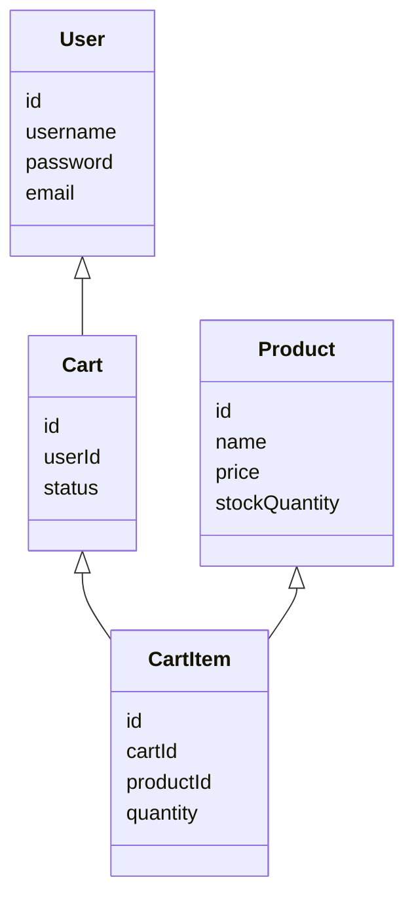
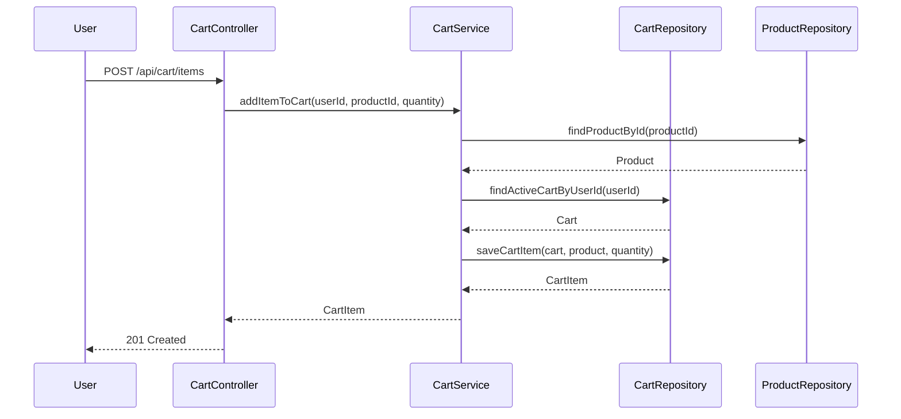

Executive Summary

This Low Level Design (LLD) document details the Shopping Cart System implemented in Java Spring Boot. The system supports user management, product catalog search, and shopping cart operations, adhering to strict business rules and enterprise standards.

Detailed Analysis

The system is designed for scalability, maintainability, and security. It leverages Spring Boot’s MVC architecture, with clear separation of concerns between controllers, services, and repositories. All endpoints are RESTful and stateless. Validation is enforced at both API and domain levels.

Domain Entities

- User: Represents a registered customer. Fields: id, username, password (hashed), email, roles, createdAt, updatedAt
- Product: Represents a catalog item. Fields: id, name, description, price, stockQuantity, category, createdAt, updatedAt
- Cart: Represents a user’s shopping cart. Fields: id, userId (FK), status (ACTIVE/CHECKED_OUT), createdAt, updatedAt
- CartItem: Represents an item in a cart. Fields: id, cartId (FK), productId (FK), quantity, priceAtAddition, createdAt, updatedAt

API Contracts

User APIs:
- POST /api/users/register: Register new user
- POST /api/users/login: Authenticate user
- GET /api/users/me: Get current user profile

Product APIs:
- GET /api/products: List/search products (filter by category, name, price range)
- GET /api/products/{id}: Get product details

Cart APIs:
- GET /api/cart: Get current user’s active cart
- POST /api/cart/items: Add item to cart
- PUT /api/cart/items/{itemId}: Update cart item quantity
- DELETE /api/cart/items/{itemId}: Remove item from cart
- POST /api/cart/checkout: Checkout cart

Validation Matrix

- User registration: Unique username/email, password strength
- Product search: Valid filters, pagination
- Cart operations: Stock availability, max quantity per item, cart ownership, cart status
- Checkout: Non-empty cart, valid user, sufficient stock

Mermaid Diagrams

Domain Model:

API Flow (Add Item to Cart):

MVC Layering Details

- Controller Layer: Handles HTTP requests, input validation, and response formatting. Delegates business logic to services.
- Service Layer: Implements business rules, transaction management, and orchestrates domain operations. Enforces validation and authorization.
- Repository Layer: Data access using Spring Data JPA. All queries parameterized to prevent SQL injection.
- Model Layer: JPA entities with validation annotations. DTOs for API contracts.

Business Rules

- Only authenticated users can access cart endpoints.
- Product stock is checked before adding/updating cart items.
- Cart is unique and active per user; checked out carts are immutable.
- Maximum 10 units per product per cart.
- Checkout decrements stock atomically and marks cart as CHECKED_OUT.

Security & Compliance

- Passwords hashed with BCrypt.
- JWT-based authentication for all endpoints.
- Input validation and error handling per REST best practices.
- Audit fields (createdAt, updatedAt) auto-managed.
- All API responses standardized (error codes, messages).

Conclusion

This LLD provides a comprehensive, compliant, and secure blueprint for the Shopping Cart System, supporting all core business operations with clear layering and validation.