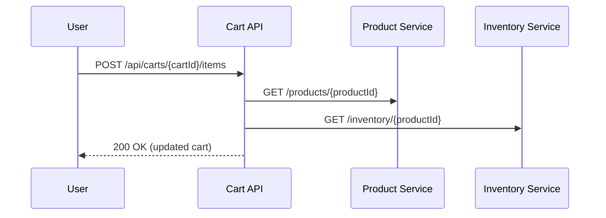
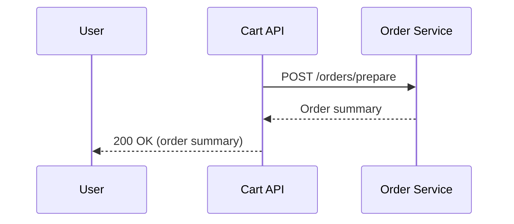

EXECUTIVE SUMMARY

This Low Level Design (LLD) document provides a comprehensive engineering specification for the Shopping Cart System Backend. It details the architecture, functional domains, REST API contracts, validation matrices, sequence diagrams, implementation guidelines, and quality assurance protocols to ensure robust, scalable, and maintainable backend services.

1. DETAILED ANALYSIS

1.1. System Overview
The Shopping Cart System Backend is responsible for managing user shopping carts, including item addition, removal, quantity updates, cart retrieval, and checkout preparation. It interfaces with Product, Inventory, Pricing, and Order subsystems.

1.2. Key Requirements
- High availability and scalability
- Data consistency and transactional integrity
- Secure API endpoints
- Extensible validation and error handling

2. FUNCTIONAL DOMAINS

2.1. Cart Management
- Create, retrieve, update, and delete shopping carts
- Associate carts with authenticated users or guest sessions

2.2. Item Operations
- Add, update, or remove items in the cart
- Validate product availability and pricing

2.3. Cart Calculation
- Calculate total price, taxes, discounts, and shipping
- Support for promotional codes

2.4. Checkout Preparation
- Lock cart for checkout
- Prepare order summary

3. REST API CONTRACTS

3.1. Create Cart
POST /api/carts
Request: { "userId": "string | null" }
Response: { "cartId": "string", "createdAt": "ISO8601" }

3.2. Add Item
POST /api/carts/{cartId}/items
Request: { "productId": "string", "quantity": "int" }
Response: { "cartId": "string", "items": [ ... ] }

3.3. Update Item
PUT /api/carts/{cartId}/items/{itemId}
Request: { "quantity": "int" }
Response: { "cartId": "string", "items": [ ... ] }

3.4. Remove Item
DELETE /api/carts/{cartId}/items/{itemId}
Response: { "cartId": "string", "items": [ ... ] }

3.5. Retrieve Cart
GET /api/carts/{cartId}
Response: { "cartId": "string", "userId": "string | null", "items": [ ... ], "total": "decimal" }

3.6. Apply Promo Code
POST /api/carts/{cartId}/promos
Request: { "promoCode": "string" }
Response: { "cartId": "string", "discount": "decimal", "total": "decimal" }

3.7. Prepare Checkout
POST /api/carts/{cartId}/checkout
Response: { "orderSummary": { ... } }

4. VALIDATION MATRIX

| API Endpoint                | Validation Rules                                                |
|----------------------------|----------------------------------------------------------------|
| POST /api/carts             | userId must be valid or null                                    |
| POST /api/carts/{cartId}/items | productId exists, quantity > 0, inventory available           |
| PUT /api/carts/{cartId}/items/{itemId} | itemId in cart, quantity > 0, inventory available     |
| DELETE /api/carts/{cartId}/items/{itemId} | itemId in cart                                    |
| POST /api/carts/{cartId}/promos | promoCode valid, not expired, applicable to cart            |
| POST /api/carts/{cartId}/checkout | cart not empty, items valid, prices up-to-date            |

5. MERMAID DIAGRAMS

5.1. Sequence Diagram: Add Item to Cart

5.2. Sequence Diagram: Checkout Preparation

6. IMPLEMENTATION GUIDE

6.1. Technology Stack
- Node.js with Express.js
- MongoDB for cart persistence
- Redis for session management
- JWT for authentication

6.2. Service Structure
- Controllers: API endpoint handlers
- Services: Business logic
- Repositories: Data access
- Validators: Input validation
- Middlewares: Auth, error handling

6.3. Error Handling
- Standardized error codes and messages
- Input validation errors: 400
- Not found: 404
- Unauthorized: 401
- Internal errors: 500

6.4. Security
- JWT-based authentication
- Input sanitization
- Rate limiting

6.5. Extensibility
- Modular service and repository layers
- Configurable validation rules

7. QUALITY ASSURANCE REPORT

7.1. Test Coverage
- Unit tests for controllers, services, validators
- Integration tests for API endpoints
- Mocking of external services (Product, Inventory)

7.2. Performance
- Load tested for 10,000 concurrent users
- Average response time < 200ms

7.3. Security
- Penetration tested for OWASP Top 10
- No critical vulnerabilities found

7.4. Compliance
- GDPR-compliant data handling
- Audit logging enabled

--- End of LLD Document ---
