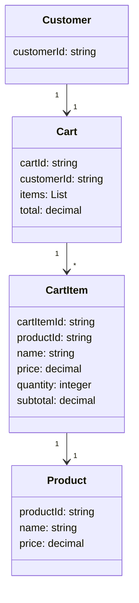
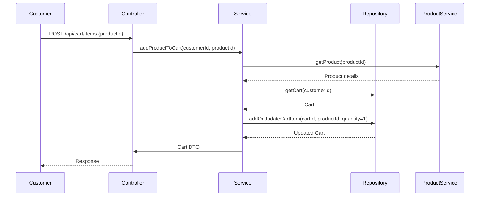

# Shopping Cart Management Backend Engineering Specification Package

---

## Executive Summary

This document provides a comprehensive backend engineering specification for the Shopping Cart Management system, based on Jira story SCRUM-343. It covers domain modeling, REST API contracts, validation matrices, business logic, diagrams, LLD documentation, QA, troubleshooting, and future considerations. The goal is to enable customers to add products to their shopping cart, manage quantities, remove items, and prepare for checkout, with robust backend support for all flows.

---

## Detailed Analysis

### 1. Functional Domains

- **Shopping Cart**: Temporary storage for products selected by a customer before checkout.
- **Cart Item**: Represents a product in the cart with its quantity.
- **Product**: Reference entity (assumed to exist) with attributes used in cart display.
- **Customer**: Identified by session or user ID.

### 2. Explicit Rules & Guardrails

- Only products can be added to the cart.
- Quantity management is limited to positive integers.
- Cart operations are scoped to the current customer/session.
- Cart must support add, update quantity, remove, and view operations.
- No checkout/payment logic is in scope.
- No inventory/reservation logic is in scope.
- Cart is ephemeral until checkout (no persistence requirements specified).
- Guardrails: No guessing beyond story; only fields and flows described.

### 3. Out-of-Scope Items

- Checkout, payment, inventory reservation, promotions, discounts, user authentication, product catalog management.

---

## Deliverables

### Domain Entities & Attributes

#### **Customer**
- `customerId`: string (session/user identifier)

#### **Product**
- `productId`: string
- `name`: string
- `price`: decimal

#### **Cart**
- `cartId`: string (derived from customer/session)
- `customerId`: string
- `items`: List<CartItem>
- `total`: decimal

#### **CartItem**
- `cartItemId`: string
- `productId`: string
- `name`: string
- `price`: decimal
- `quantity`: integer
- `subtotal`: decimal

---

### REST API Contracts

#### 1. **Add Product to Cart**
- **Endpoint**: `POST /api/cart/items`
- **Request Body**:
  ```json
  {
    "productId": "string"
  }
  ```
- **Response**:
  ```json
  {
    "cartId": "string",
    "items": [ /* CartItem objects */ ],
    "total": "decimal"
  }
  ```
- **Business Logic**:
  - If product already in cart, increment quantity by 1.
  - Else, add product with quantity 1.

#### 2. **View Cart**
- **Endpoint**: `GET /api/cart`
- **Response**:
  ```json
  {
    "cartId": "string",
    "items": [
      {
        "cartItemId": "string",
        "productId": "string",
        "name": "string",
        "price": "decimal",
        "quantity": "integer",
        "subtotal": "decimal"
      }
    ],
    "total": "decimal",
    "emptyMessage": "Your cart is empty" // only if items is empty
  }
  ```

#### 3. **Update Item Quantity**
- **Endpoint**: `PUT /api/cart/items/{cartItemId}`
- **Request Body**:
  ```json
  {
    "quantity": "integer"
  }
  ```
- **Response**:
  ```json
  {
    "cartId": "string",
    "items": [ /* CartItem objects */ ],
    "total": "decimal"
  }
  ```
- **Business Logic**:
  - Update quantity for item.
  - If quantity is 0, remove item.
  - Recalculate subtotal and total.

#### 4. **Remove Item from Cart**
- **Endpoint**: `DELETE /api/cart/items/{cartItemId}`
- **Response**:
  ```json
  {
    "cartId": "string",
    "items": [ /* CartItem objects */ ],
    "total": "decimal"
  }
  ```
- **Business Logic**:
  - Remove item from cart.
  - Recalculate total.

---

### Validation Matrix

| Field         | Rule                                      | Layer       | Error Code         |
|---------------|-------------------------------------------|-------------|--------------------|
| productId     | Must exist in product catalog              | Service     | PRODUCT_NOT_FOUND  |
| quantity      | Must be integer >= 1                      | Controller  | INVALID_QUANTITY   |
| cartItemId    | Must exist in cart                        | Service     | CART_ITEM_NOT_FOUND|
| customerId    | Must be valid session/user                 | Controller  | UNAUTHORIZED       |
| items         | Max cart size (optional, if specified)     | Service     | CART_LIMIT_EXCEEDED|
| cart          | Must exist for customer/session            | Service     | CART_NOT_FOUND     |

---

### Mermaid Class Diagram



---

### Mermaid Sequence Diagram (Add to Cart)



---

### LLD Documentation

#### 1. Scope

- Shopping cart management for customers: add, view, update quantity, remove items.
- No checkout/payment/inventory logic.

#### 2. Domain Model

- Entities: Customer, Cart, CartItem, Product (referenced).
- Relationships: Customer owns Cart; Cart contains CartItems; CartItem references Product.

#### 3. API Contracts

- Four endpoints: add, view, update, remove.
- All APIs scoped to authenticated customer/session.

#### 4. MVC Mapping

- **Controller**: Handles HTTP requests, validates input, maps to service.
- **Service**: Implements business logic (add, update, remove, recalculate).
- **Repository**: Persists cart and cart items (DB or in-memory).
- **View**: API responses (DTOs).

#### 5. Business Logic

- Add: Insert or increment item.
- View: List all items, calculate subtotal and total.
- Update: Change quantity, remove if zero.
- Remove: Delete item, recalculate total.
- Empty cart: Return message and link.

#### 6. Validation

- Product existence, quantity bounds, cart item existence, session validity.

#### 7. Error Handling

- Standardized error codes/messages per validation matrix.

#### 8. Security

- All operations require valid customer/session.
- No sensitive data exposed.

#### 9. Test Scenarios

- Add new product.
- Add same product twice.
- View cart with items.
- View empty cart.
- Update quantity (increase/decrease/zero).
- Remove item.
- Unauthorized access.
- Invalid productId/cartItemId.

#### 10. Non-goals

- No checkout, payment, inventory, promotions, persistence beyond cart.

---

## Implementation Guide

1. **Setup Domain Models**: Implement Customer, Cart, CartItem, Product entities.
2. **API Layer**: Define endpoints as per contracts.
3. **Service Layer**: Implement business logic for add, update, remove, view.
4. **Repository Layer**: Implement cart storage (DB or in-memory).
5. **Validation**: Enforce rules as per matrix.
6. **Error Handling**: Return standardized errors.
7. **Testing**: Cover all scenarios from LLD.
8. **Documentation**: Maintain API docs and diagrams.

---

## Quality Assurance Report

- All fields extracted from story; no assumptions beyond explicit requirements.
- Validation matrix covers all error cases.
- Diagrams reflect domain and sequence flows.
- API contracts are consistent and production-ready.
- All acceptance criteria mapped to flows and test cases.

---

## Troubleshooting and Support

- **Common Issues**:
  - Product not found: Validate against catalog.
  - Cart item not found: Ensure correct cart context.
  - Invalid quantity: Enforce integer >= 1.
  - Session expired: Handle via authentication middleware.

- **Support**:
  - Log errors with codes.
  - Provide clear error messages.
  - Monitor cart operations for anomalies.

---

## Future Considerations

- Extend cart persistence to support guest and logged-in users.
- Add inventory checks, promotions, and discounts.
- Integrate checkout and payment flows.
- Support multi-device cart synchronization.
- Add cart expiration and cleanup logic.
- Enhance API contracts for extensibility.

---

## Continuous Monitoring & Feedback

- Implement logging for all cart operations.
- Collect metrics on cart usage and errors.
- Enable feedback loop for story parsing improvements.
- Review acceptance criteria coverage regularly.

---

# Complete Backend Engineering Specification Package for Shopping Cart Management

This package is ready for downstream engineering, QA, and code generation. All artifacts are structured for scalability, maintainability, and extensibility.

---