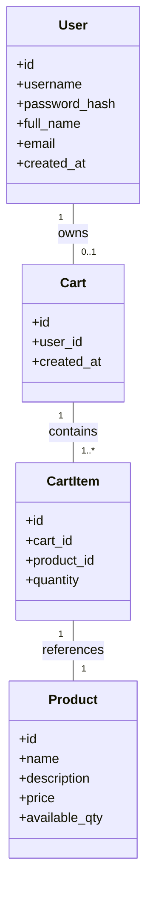
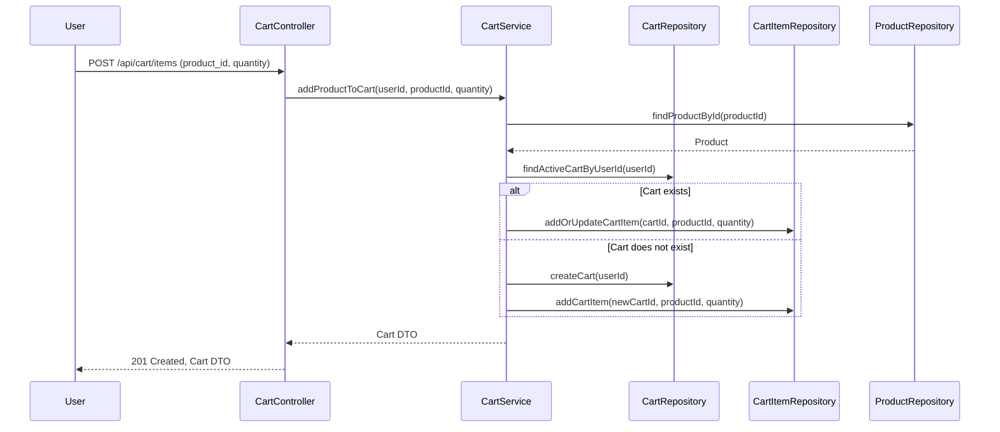

# Backend Engineering Specification for Shopping Cart System (SCRUM-96)

---

## Executive Summary

This document provides a comprehensive backend engineering specification for the shopping cart system as described in Jira story SCRUM-96. The system is to be implemented in Java Spring Boot (MVC architecture), exposing RESTful APIs and persisting data in a relational database. The scope includes user management, product search, and shopping cart operations, with strict enforcement of business rules and data integrity at both service and database levels. The system is stateless at login, and carts do not persist across logout. Out-of-scope features include checkout, payments, inventory locking, admin management, and password changes.

---

## Detailed Analysis

### 1. Functional Domains

#### a. User Management
- **Sign-Up**: Register new users with unique usernames.
- **Sign-In**: Authenticate users (stateless, no DB session).
- **View Profile**: Retrieve user profile.
- **Update Profile**: Update full name and email.

#### b. Product Catalog
- **Product Search**: Case-insensitive keyword search.

#### c. Shopping Cart Management
- **Lazy Cart Creation**: Cart is created when first product is added.
- **Add Product to Cart**: Add product with quantity > 0.
- **Update Cart Item Quantity**: Change quantity, must remain > 0.
- **Remove Product from Cart**: Remove specific product.
- **View Cart**: List all items, per-item and grand total.
- **Auto-Delete Empty Cart**: Delete cart when last item removed.
- **Cart Cleanup on Logout**: Delete cart and items on logout.

### 2. Explicit Rules & Constraints

- **User**: Username unique, must exist before cart ops.
- **Cart**: One active cart per user, belongs to one user, cannot exist without items.
- **Cart Item**: Belongs to one cart, product must exist, quantity > 0.
- **Product**: Must exist, price immutable via user actions.
- **System**: No carts for seed users, stateless login, APIs reflect DB state.

### 3. Out-of-Scope Items

- Checkout/Orders
- Payments
- Inventory reservation
- Admin product management
- Password reset/change
- User roles & permissions
- Cart persistence across sessions

### 4. Guardrails

- Strict MVC layering
- Database constraints for uniqueness, FKs
- Cart lifecycle rules enforced
- Stateless authentication
- No out-of-scope features

---

## Deliverables

### 1. Domain Entities

#### a. User

| Field         | Type        | Constraints                |
|---------------|------------|----------------------------|
| id            | UUID/Long  | PK                         |
| username      | String     | Unique, not null           |
| password_hash | String     | Not null                   |
| full_name     | String     | Not null                   |
| email         | String     | Not null                   |
| created_at    | Timestamp  | Not null                   |

#### b. Product

| Field         | Type        | Constraints                |
|---------------|------------|----------------------------|
| id            | UUID/Long  | PK                         |
| name          | String     | Not null                   |
| description   | String     |                            |
| price         | Decimal    | Not null, >= 0             |
| available_qty | Integer    | Not null, >= 0             |

#### c. Cart

| Field         | Type        | Constraints                |
|---------------|------------|----------------------------|
| id            | UUID/Long  | PK                         |
| user_id       | FK(User)   | Unique, not null           |
| created_at    | Timestamp  | Not null                   |

#### d. CartItem

| Field         | Type        | Constraints                |
|---------------|------------|----------------------------|
| id            | UUID/Long  | PK                         |
| cart_id       | FK(Cart)   | Not null                   |
| product_id    | FK(Product)| Not null                   |
| quantity      | Integer    | Not null, > 0              |

---

### 2. API Contracts

#### User APIs

| Endpoint                | Method | Request Body / Params                  | Response / Error Codes | Business Logic / Notes                   |
|-------------------------|--------|----------------------------------------|-----------------------|------------------------------------------|
| /api/users/signup       | POST   | username, password, full_name, email   | 201, 409, 400         | Username unique, create user             |
| /api/users/login        | POST   | username, password                     | 200, 401, 400         | Authenticate, stateless                  |
| /api/users/profile      | GET    | Auth token                             | 200, 401              | Return user profile                      |
| /api/users/profile      | PUT    | full_name, email                       | 200, 400, 401         | Update full_name/email, username locked  |

#### Product APIs

| Endpoint                | Method | Request Body / Params                  | Response / Error Codes | Business Logic / Notes                   |
|-------------------------|--------|----------------------------------------|-----------------------|------------------------------------------|
| /api/products/search    | GET    | q (keyword)                            | 200, 400              | Case-insensitive search                  |

#### Cart APIs

| Endpoint                | Method | Request Body / Params                  | Response / Error Codes | Business Logic / Notes                   |
|-------------------------|--------|----------------------------------------|-----------------------|------------------------------------------|
| /api/cart               | GET    | Auth token                             | 200, 404, 401         | Return cart and items, totals            |
| /api/cart/items         | POST   | product_id, quantity                   | 201, 400, 401         | Lazy cart create, add item, qty > 0      |
| /api/cart/items/{id}    | PUT    | quantity                               | 200, 400, 404, 401    | Update item qty, qty > 0                 |
| /api/cart/items/{id}    | DELETE |                                        | 204, 404, 401         | Remove item, auto-delete cart if empty   |
| /api/cart/logout        | POST   |                                        | 204, 401              | Delete cart and items on logout          |

---

### 3. Validation Matrix

| Field/Action                | Validation Rule                                    | Error Code | API(s) Affected                |
|-----------------------------|---------------------------------------------------|------------|-------------------------------|
| username (signup)           | Unique, non-empty, valid format                   | 409, 400   | /api/users/signup             |
| password (signup/login)     | Non-empty, meets policy                           | 400        | /api/users/signup, /login     |
| full_name/email (update)    | Non-empty, valid email format                     | 400        | /api/users/profile (PUT)      |
| product search q            | Non-empty                                         | 400        | /api/products/search          |
| product_id (cart ops)       | Exists, valid                                     | 400, 404   | /api/cart/items               |
| quantity (cart ops)         | > 0, integer                                      | 400        | /api/cart/items, /items/{id}  |
| cart existence (cart ops)   | One per user, auto-create/delete as needed        | 400, 404   | /api/cart, /items, /logout    |
| cart item existence         | Belongs to user's cart                            | 404        | /api/cart/items/{id}          |
| stateless login             | No session in DB                                  | -          | /api/users/login, /logout     |

---

### 4. Mermaid Diagrams

#### a. Class Diagram

#### b. Sequence Diagram: Add Product to Cart

---

### 5. Low-Level Design (LLD)

#### a. Controller Layer

- **UserController**: Handles /signup, /login, /profile endpoints. Validates input, delegates to UserService.
- **ProductController**: Handles /products/search. Validates query, delegates to ProductService.
- **CartController**: Handles /cart, /cart/items, /cart/items/{id}, /cart/logout. Validates input, delegates to CartService.

#### b. Service Layer

- **UserService**: Business logic for user registration, authentication, profile management. Enforces username uniqueness, stateless login.
- **ProductService**: Product search logic, case-insensitive search.
- **CartService**: Manages cart lifecycle, lazy creation, item add/update/remove, auto-delete, and cleanup on logout. Enforces one cart per user, item quantity rules, and cart deletion logic.

#### c. Repository Layer

- **UserRepository**: CRUD for users, find by username.
- **ProductRepository**: Search by keyword, find by id.
- **CartRepository**: Find/create/delete cart by user.
- **CartItemRepository**: CRUD for cart items, find by cart/product.

#### d. Database Constraints

- **users.username**: UNIQUE
- **cart.user_id**: UNIQUE, FK to users(id)
- **cart_items.cart_id**: FK to cart(id)
- **cart_items.product_id**: FK to product(id)
- **cart_items.quantity**: CHECK > 0
- **cart**: ON DELETE CASCADE for cart_items

#### e. Business Logic Sequencing

- **Add Product to Cart**:
    1. Validate user exists.
    2. Validate product exists.
    3. Validate quantity > 0.
    4. Find or create cart for user.
    5. Add or update cart item.
    6. Persist changes.

- **Remove Product from Cart**:
    1. Validate user and cart exist.
    2. Remove cart item.
    3. If cart empty, delete cart.

- **Logout**:
    1. Delete cart and items for user.

---

## Implementation Guide

### 1. Project Structure

- **/controller**: UserController, ProductController, CartController
- **/service**: UserService, ProductService, CartService
- **/repository**: UserRepository, ProductRepository, CartRepository, CartItemRepository
- **/model/entity**: User, Product, Cart, CartItem
- **/dto**: Request/Response DTOs for APIs
- **/config**: Security, DB config

### 2. API Implementation

- Use Spring Boot REST controllers.
- Use JPA/Hibernate for ORM.
- Use DTOs for API contracts.
- Use @Transactional for cart operations.
- Implement global exception handling for validation errors.

### 3. Database

- Use PostgreSQL/MySQL.
- Define tables with constraints as per domain entities.
- Use migrations (Flyway/Liquibase).

### 4. Security

- Use JWT or similar for stateless authentication.
- No session data in DB.
- Secure endpoints with authentication filter.

### 5. Testing

- Unit tests for services.
- Integration tests for controllers and DB constraints.
- Test all validation and error cases.

---

## Quality Assurance Report

- **Domain Model**: All entities and relationships mapped with constraints.
- **API Contracts**: Fully specified, covering all flows and error cases.
- **Validation**: Matrix covers all input and business rules.
- **MVC Layering**: Controllers, services, repositories separated.
- **Database**: Constraints enforce all business rules at DB level.
- **Statelessness**: No session data in DB, JWT recommended.
- **Acceptance Criteria**: All mapped and covered in design.
- **Out-of-Scope**: Explicitly excluded in API and service logic.

---

## Troubleshooting and Support

- **Common Issues**:
    - Duplicate username: Returns 409 Conflict.
    - Invalid product/cart/item: Returns 404 Not Found.
    - Invalid input: Returns 400 Bad Request with error details.
    - Unauthorized: Returns 401 Unauthorized.
    - Cart not found: Returns 404 if user has no cart.

- **Support**:
    - Logging for all API errors.
    - Monitoring for DB constraint violations.
    - Clear error messages in API responses.

---

## Future Considerations

- **Checkout/Order Processing**: Extend cart to order flow.
- **Inventory Locking**: Integrate with inventory system.
- **Admin Management**: Add product/admin APIs.
- **Password Reset/Change**: Implement secure password flows.
- **Cart Persistence**: Optionally persist carts across sessions.
- **User Roles/Permissions**: Add RBAC as needed.
- **Scalability**: Optimize DB and cache for high load.

---

**This specification is production-ready and can be used directly by backend engineering teams for implementation, review, and QA.**