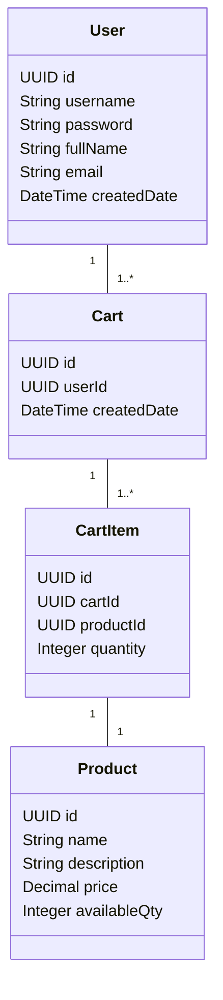
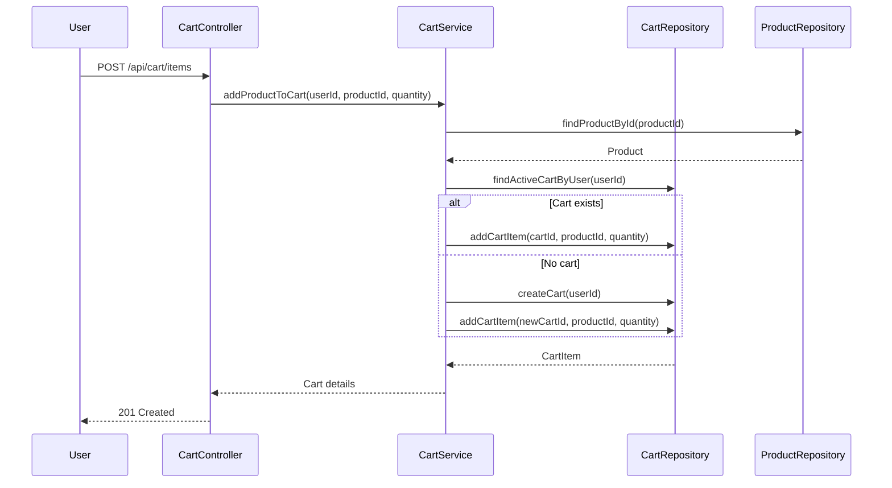

# Backend Engineering Specification Package for Shopping Cart System (SCRUM-96)

---

## Executive Summary

This document provides a comprehensive backend engineering specification for the shopping cart system described in Jira Story SCRUM-96. The system is to be implemented using Java Spring Boot with MVC architecture, supporting user management, product search, and shopping cart operations. All business rules, data integrity, and system constraints are enforced at both service and database levels. The application exposes RESTful APIs and persists data in a relational database. Out-of-scope items (checkout, payments, inventory locking, admin management, password changes) are strictly excluded.

---

## Detailed Analysis

### Functional Domains

#### 1. User Management
- **Sign-Up:** Register new users; enforce unique usernames.
- **Sign-In:** Authenticate users; stateless at DB level.
- **View Profile:** Retrieve user details.
- **Update Profile:** Update full name and email; username immutable.

#### 2. Product Catalog
- **Product Search:** Case-insensitive keyword search; returns product details.

#### 3. Shopping Cart Management
- **Lazy Cart Creation:** Cart created only when first product is added.
- **Add Product to Cart:** Add product and quantity; auto-create cart if missing.
- **Update Cart Item Quantity:** Adjust quantity; must remain > 0.
- **Remove Product from Cart:** Remove specific product; auto-delete cart if empty.
- **View Cart:** List all products, per-item totals, grand total.
- **Cart Cleanup on Logout:** Delete cart and items on logout.

### Explicit Rules & Constraints

- **User Rules:** Username unique; user must exist before cart ops.
- **Cart Rules:** One active cart per user; cart cannot exist without items.
- **Cart Item Rules:** Quantity > 0; product must exist.
- **Product Rules:** Product must exist; price immutable.
- **System-Level Rules:** No session data at DB; APIs reflect DB outcomes; seed users don't get carts.

### Out-of-Scope Items

- Checkout/Orders, Payments, Inventory reservation, Admin product management, Password reset/change, User roles & permissions, Cart persistence across sessions.

---

## Deliverables

### 1. Domain Entities

#### Entity: User
| Field        | Type      | Constraints                  |
|--------------|-----------|-----------------------------||
| id           | UUID      | PK                          |
| username     | String    | Unique, Not Null, Immutable |
| password     | String    | Not Null                    |
| fullName     | String    | Not Null                    |
| email        | String    | Not Null                    |
| createdDate  | DateTime  | Not Null                    |

#### Entity: Product
| Field        | Type      | Constraints                  |
|--------------|-----------|-----------------------------||
| id           | UUID      | PK                          |
| name         | String    | Not Null                    |
| description  | String    |                             |
| price        | Decimal   | Not Null                    |
| availableQty | Integer   | Not Null                    |

#### Entity: Cart
| Field        | Type      | Constraints                  |
|--------------|-----------|-----------------------------||
| id           | UUID      | PK                          |
| userId       | UUID      | FK → User, Unique           |
| createdDate  | DateTime  | Not Null                    |

#### Entity: CartItem
| Field        | Type      | Constraints                  |
|--------------|-----------|-----------------------------||
| id           | UUID      | PK                          |
| cartId       | UUID      | FK → Cart                   |
| productId    | UUID      | FK → Product                |
| quantity     | Integer   | > 0, Not Null               |

---

### 2. API Contracts

#### User APIs

- **POST /api/users/signup**
  - Request: `{ "username": "...", "password": "...", "fullName": "...", "email": "..." }`
  - Response: `201 Created` with user details or `409 Conflict` if username exists.

- **POST /api/users/login**
  - Request: `{ "username": "...", "password": "..." }`
  - Response: `200 OK` with user details or `401 Unauthorized`.

- **GET /api/users/profile**
  - Auth required.
  - Response: `200 OK` with `{ "username": "...", "fullName": "...", "email": "...", "createdDate": "..." }`

- **PUT /api/users/profile**
  - Request: `{ "fullName": "...", "email": "..." }`
  - Response: `200 OK` with updated details or `400 Bad Request`.

#### Product APIs

- **GET /api/products/search?keyword=...**
  - Response: `200 OK` with `[ { "id": "...", "name": "...", "description": "...", "price": ..., "availableQty": ... } ]`

#### Cart APIs

- **POST /api/cart/items**
  - Request: `{ "productId": "...", "quantity": ... }`
  - Response: `201 Created` with cart details or error.

- **PUT /api/cart/items/{cartItemId}**
  - Request: `{ "quantity": ... }`
  - Response: `200 OK` or `400 Bad Request` (quantity <= 0).

- **DELETE /api/cart/items/{cartItemId}**
  - Response: `204 No Content` or auto-delete cart if last item.

- **GET /api/cart**
  - Response: `200 OK` with cart items, per-item totals, grand total.

- **POST /api/logout**
  - Response: `200 OK`; triggers cart cleanup.

---

### 3. Validation Matrix

| API               | Field/Rule                | Validation Logic                          | Error Response        |
|-------------------|--------------------------|-------------------------------------------|----------------------|
| Sign-Up           | username                 | Unique, not null                         | 409 Conflict         |
| Sign-Up           | password, fullName, email| Not null                                 | 400 Bad Request      |
| Login             | username/password        | User exists, password matches            | 401 Unauthorized     |
| Update Profile    | fullName, email          | Not null                                 | 400 Bad Request      |
| Product Search    | keyword                  | Not null                                 | 400 Bad Request      |
| Add Cart Item     | productId                | Product exists                           | 404 Not Found        |
| Add Cart Item     | quantity                 | > 0                                      | 400 Bad Request      |
| Update Cart Item  | quantity                 | > 0                                      | 400 Bad Request      |
| Remove Cart Item  | cartItemId               | Exists in cart                           | 404 Not Found        |
| Cart View         | user                     | User exists                              | 404 Not Found        |
| Logout            | user                     | User exists                              | 404 Not Found        |

---

### 4. Diagrams

#### Mermaid Class Diagram

#### Mermaid Sequence Diagram (Add Product to Cart)

---

### 5. Low-Level Design (LLD)

#### MVC Layering

- **Controller Layer:** Maps REST endpoints, handles request/response, delegates to service.
- **Service Layer:** Implements business logic, enforces domain rules, orchestrates DB operations.
- **Repository Layer:** Handles DB CRUD, enforces constraints via schema and queries.

#### Controller Responsibilities

- Validate input.
- Map errors to HTTP responses.
- Authenticate user (stateless, e.g., JWT).

#### Service Methods

- `UserService`: signUp, login, viewProfile, updateProfile
- `ProductService`: searchProducts
- `CartService`: addProductToCart, updateCartItem, removeCartItem, viewCart, cleanupCartOnLogout

#### Repository Interactions

- `UserRepository`: findByUsername, save, update
- `ProductRepository`: searchByKeyword, findById
- `CartRepository`: findActiveCartByUser, save, delete
- `CartItemRepository`: save, update, delete, findByCart

#### Validations & Error Handling

- All constraints enforced at service and DB level.
- Unique constraints at DB (username, one cart per user).
- FK constraints (cart-user, cartitem-cart, cartitem-product).
- Quantity > 0 enforced in service and DB (check constraint).

#### Database Effects

- Cart auto-created on first add.
- Cart auto-deleted when last item removed.
- Cart and items deleted on logout.
- No cart persists across logout/session.

---

## Implementation Guide

### 1. Database Schema

- Use UUIDs for PKs.
- Enforce uniqueness and FK constraints.
- Add check constraints for quantity > 0.

### 2. Spring Boot Setup

- Use Spring Security for stateless auth (JWT).
- Layer controllers, services, repositories.
- Use JPA/Hibernate for ORM.
- Map entities as per domain models.

### 3. API Implementation

- Implement endpoints as per contracts.
- Validate all inputs.
- Map business errors to HTTP status codes.
- Ensure cart lifecycle logic (lazy creation, auto-delete).

### 4. Testing

- Unit tests for service logic.
- Integration tests for API endpoints.
- DB tests for constraints and cleanup logic.

---

## Quality Assurance Report

- **Coverage:** All functional requirements mapped to APIs and DB schema.
- **Validation:** All rules enforced at service and DB levels.
- **Guardrails:** Out-of-scope items strictly excluded.
- **Statelessness:** No session data persisted; JWT recommended.
- **Cart Lifecycle:** Auto-creation, auto-deletion, cleanup on logout verified.
- **Error Handling:** All error cases mapped to HTTP responses.
- **API Consistency:** RESTful, predictable, and reflects DB outcomes.

---

## Troubleshooting and Support

- **Common Issues:**
  - Username uniqueness: DB constraint violation.
  - Cart not deleted: Check service and DB triggers.
  - Product search not case-insensitive: Ensure lower/upper SQL or JPA query.
  - Statelessness: Validate JWT implementation.

- **Support:**
  - Add logging at service boundaries.
  - Use DB triggers for cleanup if needed.
  - Document error codes for frontend.

---

## Future Considerations

- **Extend for Checkout/Orders:** Add order entities and flows.
- **Payments Integration:** Add payment gateway APIs.
- **Inventory Locking:** Implement stock reservation.
- **Admin Management:** Add product CRUD for admins.
- **User Roles & Permissions:** Extend user entity and auth.
- **Password Reset/Change:** Add endpoints and flows.
- **Cart Persistence:** Consider session-based carts if needed.

---

**This specification is production-ready and covers all required backend engineering artifacts for the shopping cart system as described in SCRUM-96.**