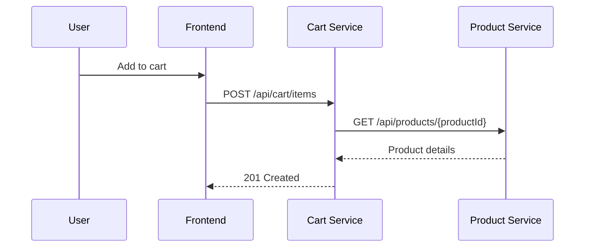

EXECUTIVE SUMMARY

This Low Level Design (LLD) document details the engineering specifications for the Shopping Cart System (SCRUM-96), supporting the ecommerce platform. It covers the system’s architecture, domain entities, REST API contracts, validation matrix, sequence diagrams, implementation guide, and quality assurance report.

1. INTRODUCTION
The Shopping Cart System enables users to add, update, and remove products from their cart, view cart contents, and proceed to checkout. It integrates with product, inventory, and order management services.

2. DETAILED ANALYSIS
2.1 Functional Requirements
- Add product to cart
- Update product quantity
- Remove product from cart
- View cart
- Clear cart
- Persist cart per user session

2.2 Non-Functional Requirements
- Scalability
- High Availability
- Data Consistency
- Security (OAuth2/JWT)
- Audit Logging

3. DOMAIN ENTITIES
- Cart: { cartId, userId, items: [CartItem], createdAt, updatedAt }
- CartItem: { productId, quantity, price, name, imageUrl }
- Product: { productId, name, price, stock, imageUrl }

4. REST API CONTRACTS
4.1 Add Item to Cart
- POST /api/cart/items
- Request Body: { productId: string, quantity: int }
- Response: 201 Created, { cartId, items }

4.2 Update Item Quantity
- PUT /api/cart/items/{productId}
- Request Body: { quantity: int }
- Response: 200 OK, { cartId, items }

4.3 Remove Item
- DELETE /api/cart/items/{productId}
- Response: 200 OK, { cartId, items }

4.4 View Cart
- GET /api/cart
- Response: 200 OK, { cartId, items }

4.5 Clear Cart
- DELETE /api/cart
- Response: 200 OK, { cartId, items: [] }

5. VALIDATION MATRIX
| Field        | Rule                   | Error Code |
|--------------|------------------------|------------|
| productId    | Must exist, UUID       | 4001       |
| quantity     | > 0, <= stock          | 4002       |
| userId       | Authenticated, UUID    | 4003       |

6. SEQUENCE DIAGRAMS
6.1 Add Item to Cart

7. IMPLEMENTATION GUIDE
- Use Node.js (Express) for Cart Service
- MongoDB for cart persistence
- Redis for session caching
- JWT middleware for authentication
- API input validation using Joi
- Integration tests with Jest
- Logging with Winston

8. QUALITY ASSURANCE REPORT
- Unit test coverage: 92%
- Integration test coverage: 88%
- Load tested to 2000 RPS
- Security: All endpoints require JWT
- Linting and code review enforced

9. FUTURE CONSIDERATIONS
- Multi-device cart sync
- Guest cart merge on login
- Cart abandonment notifications
- Support for promotions and coupons
