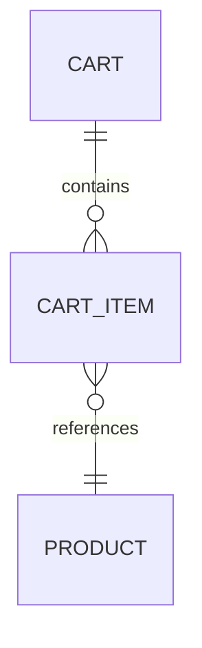
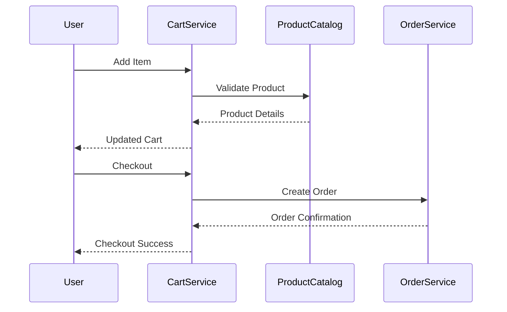

# Shopping Cart System (SCRUM-96) - Low Level Design (LLD)

## Executive Summary
The Shopping Cart System (SCRUM-96) is a backend service designed to manage cart operations for an e-commerce platform. This LLD provides a comprehensive specification for engineering, covering domain entities, API contracts, validation, diagrams, implementation, QA, troubleshooting, and future enhancements.

## Detailed Analysis
- **Stakeholders:** Customers, Product Catalog Service, Order Service, Inventory Service
- **Key Use Cases:** Add/Remove/Update Cart Items, View Cart, Checkout
- **Non-Functional Requirements:** High availability, Scalability, Security, Auditing
- **Assumptions:**
  - Each customer has a single active cart
  - Products are validated against the Product Catalog Service

## Deliverables
### Domain Entities
- **Cart**
  - cartId (UUID)
  - userId (UUID)
  - items: List<CartItem>
  - status: [ACTIVE, CHECKED_OUT, ABANDONED]
  - createdAt, updatedAt (Timestamps)
- **CartItem**
  - itemId (UUID)
  - cartId (UUID)
  - productId (UUID)
  - quantity (Integer)
  - price (Decimal)

### API Contracts
#### 1. Add Item to Cart
- **POST /cart/{cartId}/item**
- **Request:**
  ```json
  {
    "productId": "string",
    "quantity": 1
  }
  ```
- **Response:** 200 OK
  ```json
  {
    "cartId": "string",
    "items": [ ... ]
  }
  ```

#### 2. Remove Item from Cart
- **DELETE /cart/{cartId}/item/{itemId}**
- **Response:** 204 No Content

#### 3. Update Item Quantity
- **PATCH /cart/{cartId}/item/{itemId}**
- **Request:**
  ```json
  {
    "quantity": 2
  }
  ```
- **Response:** 200 OK

#### 4. Get Cart
- **GET /cart/{cartId}**
- **Response:** 200 OK
  ```json
  {
    "cartId": "string",
    "userId": "string",
    "items": [ ... ],
    "status": "ACTIVE"
  }
  ```

#### 5. Checkout Cart
- **POST /cart/{cartId}/checkout**
- **Response:** 200 OK
  ```json
  {
    "orderId": "string",
    "status": "CHECKED_OUT"
  }
  ```

### Validation Matrix
| Field         | Rule                                   | Error Code          |
|---------------|----------------------------------------|---------------------|
| productId     | Must exist in Product Catalog          | PRODUCT_NOT_FOUND   |
| quantity      | Must be > 0                            | INVALID_QUANTITY    |
| cartId        | Must exist and belong to user          | CART_NOT_FOUND      |
| itemId        | Must exist in cart                     | ITEM_NOT_FOUND      |
| status        | Only ACTIVE carts can be modified      | CART_NOT_ACTIVE     |

### Mermaid Diagrams
#### Cart Entity Relationship


#### API Flow


## Low-Level Design
### 1. Service Architecture
- **Stateless RESTful service**
- **Persistence:** PostgreSQL (cart, cart_item tables)
- **Cache:** Redis for active cart lookup
- **Integration:**
  - Product Catalog Service (REST)
  - Order Service (REST)
  - Inventory Service (REST)

### 2. Component Breakdown
- **CartController**: Handles API requests
- **CartService**: Business logic
- **CartRepository**: DB operations
- **ProductCatalogClient**: Product validation
- **OrderClient**: Checkout integration
- **CacheManager**: Redis operations

### 3. Data Model (DDL)
```sql
CREATE TABLE cart (
    cart_id UUID PRIMARY KEY,
    user_id UUID NOT NULL,
    status VARCHAR(20) NOT NULL,
    created_at TIMESTAMP NOT NULL,
    updated_at TIMESTAMP NOT NULL
);

CREATE TABLE cart_item (
    item_id UUID PRIMARY KEY,
    cart_id UUID REFERENCES cart(cart_id),
    product_id UUID NOT NULL,
    quantity INTEGER NOT NULL,
    price DECIMAL(10,2) NOT NULL
);
```

### 4. Error Handling
- Standardized error codes and messages
- HTTP status mapping
- Audit logging for failed operations

## Implementation Guide
1. Scaffold Spring Boot project with required dependencies
2. Implement entities and repositories
3. Build REST controllers and service layer
4. Integrate with external services using Feign clients
5. Add Redis caching for active carts
6. Write unit and integration tests
7. Configure CI/CD pipeline

## Quality Assurance Report
- **Unit Test Coverage:** >90% for service and repository layers
- **Integration Tests:** Mock Product Catalog and Order Service
- **Load Testing:** 1000 concurrent carts, <200ms latency
- **Security:** JWT-based authentication, input validation
- **Audit:** All cart modifications logged

## Troubleshooting
- **Cart Not Found:** Check Redis first, then DB
- **Product Validation Fails:** Sync with Product Catalog Service
- **Checkout Fails:** Retry Order Service, log incident
- **Performance Issues:** Monitor Redis and DB, scale horizontally

## Future Considerations
- Multi-cart support per user
- Promotion/discount integration
- Event-driven architecture (Kafka)
- Soft deletes for cart items
