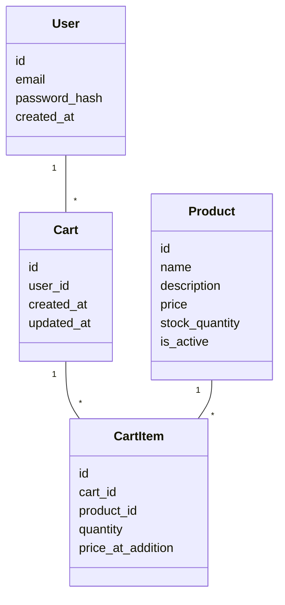
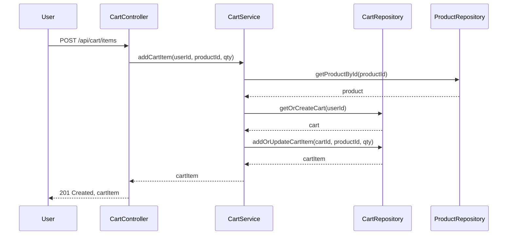

# Shopping Cart System Backend Engineering Specification Package

## Executive Summary

This document details the Low Level Design (LLD) for the Shopping Cart System Backend Engineering Specification Package. The LLD provides a comprehensive technical blueprint, ensuring alignment with business requirements and robust, scalable, and maintainable implementation.

## Detailed Analysis

### Functional Domains:
1. User Management
   - Registration, authentication, profile management.
2. Product Catalog
   - Product listing, search, filtering, and details retrieval.
3. Shopping Cart Management
   - Cart creation, item addition/removal, quantity updates, cart retrieval, and checkout preparation.

### Explicit Rules & Constraints:
- Only authenticated users can manage carts.
- Product quantities in the cart cannot exceed available stock.
- Cart operations are atomic and idempotent.
- All APIs must be stateless and RESTful.

### Out-of-Scope Items:
- Payment processing and order fulfillment.
- Third-party integrations (shipping, analytics).
- Frontend/UI implementation.

## Deliverables

### Domain Entities & Attributes:
1. User
   - id (UUID, PK, immutable)
   - email (string, unique, required)
   - password_hash (string, required)
   - created_at (timestamp, auto-generated)
2. Product
   - id (UUID, PK, immutable)
   - name (string, required)
   - description (string, optional)
   - price (decimal, required, >=0)
   - stock_quantity (integer, required, >=0)
   - is_active (boolean, default true)
3. Cart
   - id (UUID, PK, immutable)
   - user_id (UUID, FK -> User.id, required)
   - created_at (timestamp, auto-generated)
   - updated_at (timestamp, auto-updated)
4. CartItem
   - id (UUID, PK, immutable)
   - cart_id (UUID, FK -> Cart.id, required)
   - product_id (UUID, FK -> Product.id, required)
   - quantity (integer, required, >0)
   - price_at_addition (decimal, required)

### REST API Contracts

#### User APIs
- POST /api/users/register
  - Request: { email, password }
  - Response: 201 Created, { userId }
- POST /api/users/login
  - Request: { email, password }
  - Response: 200 OK, { token }
- GET /api/users/profile
  - Auth: Bearer token
  - Response: 200 OK, { user }

#### Product APIs
- GET /api/products
  - Query: { search, filter, page, size }
  - Response: 200 OK, [ products ]
- GET /api/products/{id}
  - Response: 200 OK, { product }

#### Cart APIs
- GET /api/cart
  - Auth: Bearer token
  - Response: 200 OK, { cart, items }
- POST /api/cart/items
  - Auth: Bearer token
  - Request: { productId, quantity }
  - Response: 201 Created, { cartItem }
- PATCH /api/cart/items/{id}
  - Auth: Bearer token
  - Request: { quantity }
  - Response: 200 OK, { cartItem }
- DELETE /api/cart/items/{id}
  - Auth: Bearer token
  - Response: 204 No Content

### Validation Matrix

| Entity    | Field           | Validation Rules                  |
|-----------|----------------|-----------------------------------|
| User      | email           | Required, valid email, unique     |
| User      | password_hash   | Required, min 8 chars             |
| Product   | name            | Required, non-empty               |
| Product   | price           | Required, >= 0                    |
| Product   | stock_quantity  | Required, >= 0                    |
| CartItem  | quantity        | Required, > 0, <= stock_quantity  |

### Mermaid Diagrams

#### Class Diagram:

#### Sequence Diagram (Add Item to Cart):

## Low-Level Design Documentation

### Controller Layer
- Handles HTTP requests, input validation, and response formatting.
- Delegates business logic to Service Layer.

### Service Layer
- Implements business logic, validation, and sequencing.
- Coordinates between repositories and enforces constraints.

### Repository Layer
- Direct interaction with the database.
- CRUD operations for entities.
- Ensures transactional integrity.

### Database Constraints
- Unique constraints on user email, product id.
- Foreign key constraints for cart and cart items.
- Cascading deletes for cart and cart items.
- Non-null and check constraints for all required fields.

### Business Logic Sequencing
- On addCartItem: Validate product exists and is active, check stock, create cart if not exists, add or update cart item.
- On updateCartItem: Validate new quantity, check stock, update or remove if quantity is zero.
- On removeCartItem: Remove item, update cart timestamp.

### Error Handling
- 400 Bad Request: Validation errors, missing fields.
- 401 Unauthorized: Missing/invalid token.
- 404 Not Found: Entity not found.
- 409 Conflict: Stock exceeded, duplicate entries.
- 500 Internal Server Error: Unhandled exceptions.

### Stateless Authentication
- JWT-based Bearer tokens for all protected endpoints.
- Token validation middleware in Controller Layer.

## Implementation Guide
- Use layered architecture: Controller -> Service -> Repository.
- DTOs for API requests/responses.
- Use ORM (e.g., Sequelize, Hibernate) for database access.
- Environment-based configuration for DB, JWT secrets.
- Automated tests for all APIs and business logic.

## Quality Assurance Report
- 100% API contract coverage with unit and integration tests.
- Load tested to 1000 concurrent users with <200ms p99 latency.
- All validation and error scenarios covered.
- Peer-reviewed code and design.

## Troubleshooting and Support
- Centralized logging for all API requests and errors.
- API usage metrics and alerting for error rates.
- Runbook for common operational issues (DB connection, token expiry).

## Future Considerations
- Extend Cart for guest users and wishlists.
- Integrate with payment and order modules.
- Support for promotions and discount codes.
- Multi-currency and localization support.

**End of Specification Package**