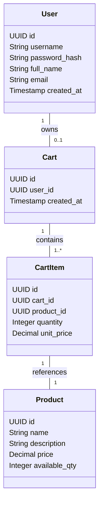
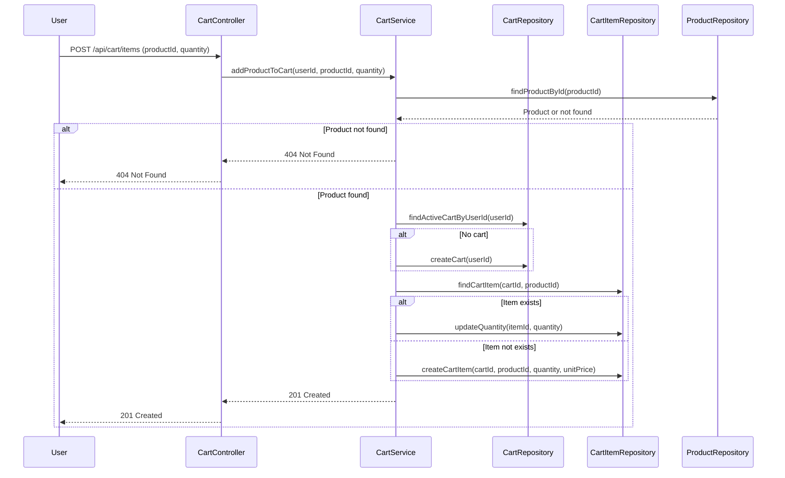

# Backend Engineering Specification Package: Shopping Cart System (SCRUM-96)

---

## 1. Executive Summary

This document specifies the complete backend engineering requirements for the Shopping Cart System, as described in Jira story SCRUM-96. The solution is to be implemented in Java Spring Boot (MVC architecture), exposing RESTful APIs and persisting all data in a relational database. The system supports user management, product search, and shopping cart operations, with strict enforcement of business rules and database-first validation. Out-of-scope features include checkout, payments, inventory locking, admin management, and password changes.

---

## 2. Detailed Analysis

### 2.1 Functional Domains

- **User Management:** Registration, authentication, profile viewing, and profile update.
- **Product Catalog:** Case-insensitive keyword search on products.
- **Shopping Cart Management:** Lazy cart creation, add/update/remove items, view cart, auto-delete empty cart, cart cleanup on logout.

### 2.2 Explicit Rules & Guardrails

- **User:** Username must be unique. User must exist before any cart operation.
- **Cart:** One active cart per user. Cart belongs to one user. Cart cannot exist without items.
- **Cart Item:** Each belongs to a cart. Product must exist before adding. Quantity > 0.
- **Product:** Must exist to be searchable or added to cart. Price is immutable by users.
- **System:** Stateless login; carts do not persist across logout. No session data in DB. All business rules must be verifiable at DB level. APIs must reflect DB outcomes.

### 2.3 Out-of-Scope

- Checkout/Orders, Payments, Inventory reservation, Admin product management, Password reset/change, User roles/permissions, Cart persistence across sessions.

---

## 3. Domain Entities and Attributes

### 3.1 User

| Attribute      | Type        | Constraints                  | Description                  |
|----------------|------------|------------------------------|------------------------------|
| id             | UUID       | PK, auto-generated           | User identifier              |
| username       | String     | Unique, not null, immutable  | Login username               |
| password_hash  | String     | Not null                     | Hashed password              |
| full_name      | String     | Not null                     | User's full name             |
| email          | String     | Not null                     | User's email                 |
| created_at     | Timestamp  | Not null, auto-generated     | Account creation timestamp   |

### 3.2 Product

| Attribute      | Type        | Constraints                  | Description                  |
|----------------|------------|------------------------------|------------------------------|
| id             | UUID       | PK, auto-generated           | Product identifier           |
| name           | String     | Not null                     | Product name                 |
| description    | String     | Not null                     | Product description          |
| price          | Decimal    | Not null, >= 0               | Product price                |
| available_qty  | Integer    | Not null, >= 0               | Stock available              |

### 3.3 Cart

| Attribute      | Type        | Constraints                  | Description                  |
|----------------|------------|------------------------------|------------------------------|
| id             | UUID       | PK, auto-generated           | Cart identifier              |
| user_id        | UUID       | FK → User(id), unique        | Owner user                   |
| created_at     | Timestamp  | Not null, auto-generated     | Cart creation timestamp      |

### 3.4 CartItem

| Attribute      | Type        | Constraints                  | Description                  |
|----------------|------------|------------------------------|------------------------------|
| id             | UUID       | PK, auto-generated           | Cart item identifier         |
| cart_id        | UUID       | FK → Cart(id), not null      | Owning cart                  |
| product_id     | UUID       | FK → Product(id), not null   | Product in cart              |
| quantity       | Integer    | Not null, > 0                | Quantity of product          |
| unit_price     | Decimal    | Not null                     | Price at time of add         |

---

## 4. REST API Contracts

### 4.1 User Management

#### 4.1.1 User Sign-Up

- **POST /api/users/signup**
- **Request Body:**
    ```json
    {
      "username": "string",
      "password": "string",
      "fullName": "string",
      "email": "string"
    }
    ```
- **Responses:**
    - 201 Created: User created
    - 400 Bad Request: Validation errors (e.g., username exists)
    - 409 Conflict: Username already exists

#### 4.1.2 User Sign-In

- **POST /api/users/signin**
- **Request Body:**
    ```json
    {
      "username": "string",
      "password": "string"
    }
    ```
- **Responses:**
    - 200 OK: User details (no session stored)
    - 401 Unauthorized: Invalid credentials

#### 4.1.3 View Profile

- **GET /api/users/me**
- **Auth:** Bearer token (JWT)
- **Responses:**
    - 200 OK: 
        ```json
        {
          "username": "string",
          "fullName": "string",
          "email": "string",
          "createdAt": "ISO8601"
        }
        ```
    - 401 Unauthorized: Not authenticated

#### 4.1.4 Update Profile

- **PUT /api/users/me**
- **Request Body:**
    ```json
    {
      "fullName": "string",
      "email": "string"
    }
    ```
- **Responses:**
    - 200 OK: Updated profile
    - 400 Bad Request: Validation errors
    - 401 Unauthorized: Not authenticated

---

### 4.2 Product Catalog

#### 4.2.1 Product Search

- **GET /api/products?query={keyword}**
- **Query Params:**
    - `query`: string (required)
- **Responses:**
    - 200 OK: 
        ```json
        [
          {
            "id": "uuid",
            "name": "string",
            "description": "string",
            "price": "decimal",
            "availableQty": "integer"
          }
        ]
        ```
    - 400 Bad Request: Missing query param

---

### 4.3 Shopping Cart Management

#### 4.3.1 Add Product to Cart

- **POST /api/cart/items**
- **Auth:** Bearer token (JWT)
- **Request Body:**
    ```json
    {
      "productId": "uuid",
      "quantity": "integer"
    }
    ```
- **Business Logic:**
    - If user has no cart, create one.
    - Product must exist.
    - Quantity > 0.
    - Add or increment item in cart.
- **Responses:**
    - 201 Created: Item added/updated
    - 400 Bad Request: Validation errors
    - 404 Not Found: Product not found
    - 401 Unauthorized: Not authenticated

#### 4.3.2 Update Cart Item Quantity

- **PUT /api/cart/items/{itemId}**
- **Auth:** Bearer token (JWT)
- **Request Body:**
    ```json
    {
      "quantity": "integer"
    }
    ```
- **Business Logic:**
    - Quantity must remain > 0.
    - Update quantity.
- **Responses:**
    - 200 OK: Item updated
    - 400 Bad Request: Invalid quantity
    - 404 Not Found: Item not found
    - 401 Unauthorized: Not authenticated

#### 4.3.3 Remove Product from Cart

- **DELETE /api/cart/items/{itemId}**
- **Auth:** Bearer token (JWT)
- **Business Logic:**
    - Remove item.
    - If last item, delete cart.
- **Responses:**
    - 204 No Content: Item (and possibly cart) deleted
    - 404 Not Found: Item not found
    - 401 Unauthorized: Not authenticated

#### 4.3.4 View Cart

- **GET /api/cart**
- **Auth:** Bearer token (JWT)
- **Responses:**
    - 200 OK:
        ```json
        {
          "cartId": "uuid",
          "items": [
            {
              "itemId": "uuid",
              "productId": "uuid",
              "name": "string",
              "description": "string",
              "unitPrice": "decimal",
              "quantity": "integer",
              "total": "decimal"
            }
          ],
          "grandTotal": "decimal"
        }
        ```
    - 404 Not Found: No active cart
    - 401 Unauthorized: Not authenticated

#### 4.3.5 Logout (Cart Cleanup)

- **POST /api/users/logout**
- **Auth:** Bearer token (JWT)
- **Business Logic:**
    - Delete cart and cart items for user.
    - Invalidate token (if applicable).
- **Responses:**
    - 200 OK: Cart deleted
    - 401 Unauthorized: Not authenticated

---

## 5. Validation Matrix

| API                        | Field           | Validation Rules                                  | Error Codes                |
|----------------------------|-----------------|---------------------------------------------------|----------------------------|
| POST /users/signup         | username        | Required, unique, non-empty                       | 400, 409                   |
|                            | password        | Required, min length (e.g., 8), hashed            | 400                        |
|                            | fullName        | Required, non-empty                               | 400                        |
|                            | email           | Required, valid email                             | 400                        |
| POST /users/signin         | username        | Required                                          | 400                        |
|                            | password        | Required                                          | 400                        |
| PUT /users/me              | fullName        | Optional, non-empty                               | 400                        |
|                            | email           | Optional, valid email                             | 400                        |
| GET /products              | query           | Required, non-empty                               | 400                        |
| POST /cart/items           | productId       | Required, must exist                              | 400, 404                   |
|                            | quantity        | Required, integer > 0                             | 400                        |
| PUT /cart/items/{itemId}   | quantity        | Required, integer > 0                             | 400                        |
| DELETE /cart/items/{itemId}| itemId          | Must exist in user's cart                         | 404                        |
| GET /cart                  |                 | User must have active cart                        | 404                        |
| POST /users/logout         |                 | User must be authenticated                        | 401                        |

---

## 6. Mermaid Class and Sequence Diagrams

### 6.1 Class Diagram



### 6.2 Sequence Diagram: Add Product to Cart



---

## 7. Complete LLD Documentation

### 7.1 MVC Layering

- **Controller Layer:** Handles HTTP requests/responses, authentication, input validation.
- **Service Layer:** Implements business logic, enforces domain rules, coordinates repositories.
- **Repository Layer:** Data access, entity persistence, query logic.

### 7.2 Entity Relationships

- **User** (1) — (0..1) **Cart**
- **Cart** (1) — (1..*) **CartItem**
- **CartItem** (1) — (1) **Product**

### 7.3 Database Schema (DDL Example)

```sql
CREATE TABLE users (
    id UUID PRIMARY KEY,
    username VARCHAR(50) UNIQUE NOT NULL,
    password_hash VARCHAR(255) NOT NULL,
    full_name VARCHAR(100) NOT NULL,
    email VARCHAR(100) NOT NULL,
    created_at TIMESTAMP NOT NULL DEFAULT NOW()
);

CREATE TABLE products (
    id UUID PRIMARY KEY,
    name VARCHAR(100) NOT NULL,
    description TEXT NOT NULL,
    price DECIMAL(10,2) NOT NULL CHECK (price >= 0),
    available_qty INTEGER NOT NULL CHECK (available_qty >= 0)
);

CREATE TABLE carts (
    id UUID PRIMARY KEY,
    user_id UUID UNIQUE NOT NULL REFERENCES users(id) ON DELETE CASCADE,
    created_at TIMESTAMP NOT NULL DEFAULT NOW()
);

CREATE TABLE cart_items (
    id UUID PRIMARY KEY,
    cart_id UUID NOT NULL REFERENCES carts(id) ON DELETE CASCADE,
    product_id UUID NOT NULL REFERENCES products(id),
    quantity INTEGER NOT NULL CHECK (quantity > 0),
    unit_price DECIMAL(10,2) NOT NULL,
    UNIQUE(cart_id, product_id)
);
```

### 7.4 Key Business Logic

- **Cart Creation:** Only when adding first product.
- **Cart Deletion:** When last item removed or on logout.
- **Cart Item Quantity:** Must always be > 0.
- **User Uniqueness:** Username unique at DB and API level.
- **Stateless Auth:** JWT or similar, no DB session.

### 7.5 Error Handling

- Use standard HTTP status codes.
- Provide structured error responses:
    ```json
    {
      "error": "ValidationError",
      "message": "Quantity must be greater than zero"
    }
    ```

### 7.6 Security

- Passwords hashed (e.g., BCrypt).
- JWT for stateless authentication.
- Input validation and sanitization.

---

## 8. Implementation Guide

### 8.1 Technology Stack

- Java 17+
- Spring Boot (MVC, Data JPA, Security)
- PostgreSQL (or other RDBMS)
- JWT for authentication
- Maven/Gradle for build

### 8.2 Project Structure

```
src/
  main/
    java/
      com.example.cart/
        controller/
        service/
        repository/
        model/
        dto/
        exception/
    resources/
      application.yml
```

### 8.3 Key Implementation Steps

1. **Setup Spring Boot project with dependencies.**
2. **Define JPA entities for User, Product, Cart, CartItem.**
3. **Implement repositories with Spring Data JPA.**
4. **Implement service layer enforcing all business rules.**
5. **Implement controllers with REST endpoints, validation, error handling.**
6. **Configure JWT-based authentication.**
7. **Seed database with products and optional users.**
8. **Write integration and unit tests for all endpoints and business rules.**
9. **Document all APIs using Swagger/OpenAPI.**

### 8.4 Sample Controller Snippet

```java
@PostMapping("/api/cart/items")
public ResponseEntity<?> addProductToCart(@RequestBody AddCartItemRequest req, Principal principal) {
    cartService.addProductToCart(principal.getName(), req.getProductId(), req.getQuantity());
    return ResponseEntity.status(HttpStatus.CREATED).build();
}
```

---

## 9. Quality Assurance Report

### 9.1 Test Coverage

- **Unit Tests:** All service methods, validation logic.
- **Integration Tests:** All REST endpoints, DB constraints, error cases.
- **Negative Testing:** Invalid input, unauthorized access, business rule violations.
- **Concurrency:** Ensure cart rules hold under concurrent requests.

### 9.2 Acceptance Criteria Mapping

- All APIs conform to MVC layering.
- DB constraints enforce uniqueness and foreign keys.
- Cart lifecycle rules behave as defined.
- Empty carts are removed automatically.
- Logout deletes any active cart.
- Product search is case-insensitive.
- Stateless authentication is preserved.
- No out-of-scope functionality present.

### 9.3 Example Test Cases

- Sign up with existing username → 409 Conflict
- Add product to cart with quantity 0 → 400 Bad Request
- Remove last item from cart → Cart deleted
- Logout with active cart → Cart and items deleted
- Product search with mixed-case keyword → Returns correct products

---

## 10. Troubleshooting and Support

### 10.1 Common Issues

- **Username already exists:** Ensure DB unique constraint and API check.
- **Cart not found:** User has not added any items yet.
- **Invalid JWT:** Return 401 Unauthorized.
- **Product not found:** Validate product existence before cart operations.

### 10.2 Support Procedures

- Check logs for stack traces and validation errors.
- Use Swagger UI to manually test endpoints.
- Validate DB state for orphaned carts/items (should never occur if rules are enforced).

---

## 11. Future Considerations

- **Checkout/Order Management:** Add order entity and checkout flow.
- **Inventory Reservation:** Implement stock locking at checkout.
- **Admin Product Management:** Add endpoints for product CRUD.
- **Password Reset/Change:** Implement secure password flows.
- **User Roles/Permissions:** Add RBAC for admin/user separation.
- **Session Management:** Optional for future stateful features.
- **Cart Persistence:** Optionally allow carts to persist across sessions.

---

**End of Specification**