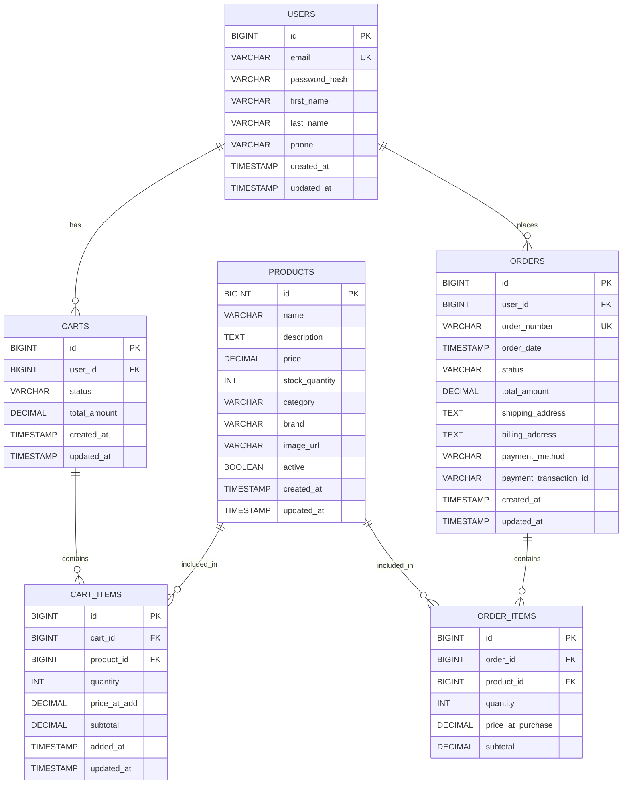

# E-Commerce Database ER Diagram

## Relationships

### User Relationships
- **USERS to CARTS**: One-to-Many (One user can have multiple carts over time)
- **USERS to ORDERS**: One-to-Many (One user can place multiple orders)

### Cart Relationships
- **CARTS to CART_ITEMS**: One-to-Many (One cart contains multiple items)
- **PRODUCTS to CART_ITEMS**: One-to-Many (One product can be in multiple carts)

### Order Relationships
- **ORDERS to ORDER_ITEMS**: One-to-Many (One order contains multiple items)
- **PRODUCTS to ORDER_ITEMS**: One-to-Many (One product can be in multiple orders)

## Constraints

### Primary Keys
- All tables have auto-incrementing BIGINT primary keys

### Foreign Keys
- `carts.user_id` → `users.id` (CASCADE on delete)
- `cart_items.cart_id` → `carts.id` (CASCADE on delete)
- `cart_items.product_id` → `products.id` (RESTRICT on delete)
- `orders.user_id` → `users.id` (RESTRICT on delete)
- `order_items.order_id` → `orders.id` (CASCADE on delete)
- `order_items.product_id` → `products.id` (RESTRICT on delete)

### Unique Constraints
- `users.email`: Unique email addresses
- `orders.order_number`: Unique order numbers
- `cart_items(cart_id, product_id)`: Composite unique constraint

### Indexes
- `idx_user_email` on users.email
- `idx_product_name` on products.name
- `idx_product_category` on products.category
- `idx_product_brand` on products.brand
- `idx_product_active` on products.active
- `idx_cart_user` on carts.user_id
- `idx_cart_status` on carts.status
- `idx_cart_item_cart` on cart_items.cart_id
- `idx_cart_item_product` on cart_items.product_id
- `idx_order_user` on orders.user_id
- `idx_order_status` on orders.status
- `idx_order_date` on orders.order_date
- `idx_order_number` on orders.order_number
- `idx_order_item_order` on order_items.order_id
- `idx_order_item_product` on order_items.product_id
