# ARCHITECTURE DIAGRAM
## Shopping Cart Backend System - SCRUM-96

---

### DOCUMENT METADATA

**Document ID**: ARCH-SCRUM-96-001
**Document Title**: Architecture Diagram - Shopping Cart Backend System
**Version**: 1.0
**Status**: APPROVED
**Classification**: INTERNAL USE
**Created Date**: 2024
**Last Updated**: 2024
**Author**: Enterprise Architecture Team

**Related Documents**:
- Requirements Document: REQ-SCRUM-96-001
- Domain Model: DM-SCRUM-96-001
- High-Level Design: HLD-SCRUM-96-001

---

## COMPREHENSIVE SYSTEM ARCHITECTURE DIAGRAM

This diagram provides a complete overview of the Shopping Cart Backend System architecture, showing all layers, components, data flows, and integrations.

```mermaid
graph TB
    subgraph "Presentation Layer"
        UI["Web UI / Mobile App<br/>(React/Angular/Vue)"]
        API_Gateway["API Gateway<br/>(REST/GraphQL)"]
    end

    subgraph "Security Layer"
        Auth["Authentication Service<br/>(JWT Token Generation)"]
        AuthZ["Authorization Middleware<br/>(Role-Based Access Control)"]
        JWT["JWT Validator<br/>(Token Verification)"]
    end

    subgraph "Application Layer"
        CartController["Cart Controller<br/>(REST Endpoints)"]
        ProductController["Product Controller<br/>(REST Endpoints)"]
        OrderController["Order Controller<br/>(REST Endpoints)"]
        UserController["User Controller<br/>(REST Endpoints)"]
        
        CartService["Cart Service<br/>(Business Logic)"]
        ProductService["Product Service<br/>(Business Logic)"]
        OrderService["Order Service<br/>(Business Logic)"]
        UserService["User Service<br/>(Business Logic)"]
        PaymentService["Payment Service<br/>(Payment Processing)"]
    end

    subgraph "Domain Layer"
        CartAggregate["Cart Aggregate<br/>(Domain Model)"]
        ProductEntity["Product Entity<br/>(Domain Model)"]
        OrderAggregate["Order Aggregate<br/>(Domain Model)"]
        UserEntity["User Entity<br/>(Domain Model)"]
        
        CartItem["Cart Item<br/>(Value Object)"]
        Price["Price<br/>(Value Object)"]
        Address["Address<br/>(Value Object)"]
        
        DomainEvents["Domain Events<br/>(Event Bus)"]
    end

    subgraph "Infrastructure Layer"
        CartRepo["Cart Repository<br/>(Data Access)"]
        ProductRepo["Product Repository<br/>(Data Access)"]
        OrderRepo["Order Repository<br/>(Data Access)"]
        UserRepo["User Repository<br/>(Data Access)"]
        
        Cache["Cache Service<br/>(Redis)"]
        MessageQueue["Message Queue<br/>(RabbitMQ/Kafka)"]
        Logger["Logging Service<br/>(ELK Stack)"]
    end

    subgraph "Data Layer"
        DB[("Primary Database<br/>(PostgreSQL/MySQL)")]
        ReadDB[("Read Replica<br/>(Query Optimization)")]
        FileStorage[("File Storage<br/>(S3/Blob Storage)")]
    end

    subgraph "External Integrations"
        PaymentGateway["Payment Gateway<br/>(Stripe/PayPal)"]
        EmailService["Email Service<br/>(SendGrid/SES)"]
        InventorySystem["Inventory System<br/>(External API)"]
        ShippingService["Shipping Service<br/>(External API)"]
    end

    %% User Flow
    UI -->|HTTPS Request| API_Gateway
    API_Gateway -->|Authenticate| Auth
    Auth -->|Generate Token| JWT
    API_Gateway -->|Authorize| AuthZ
    
    %% Controller Layer Connections
    AuthZ -->|Authorized Request| CartController
    AuthZ -->|Authorized Request| ProductController
    AuthZ -->|Authorized Request| OrderController
    AuthZ -->|Authorized Request| UserController
    
    %% Service Layer Connections
    CartController -->|Business Logic| CartService
    ProductController -->|Business Logic| ProductService
    OrderController -->|Business Logic| OrderService
    UserController -->|Business Logic| UserService
    
    OrderService -->|Process Payment| PaymentService
    
    %% Domain Layer Connections
    CartService -->|Manage| CartAggregate
    ProductService -->|Manage| ProductEntity
    OrderService -->|Manage| OrderAggregate
    UserService -->|Manage| UserEntity
    
    CartAggregate -->|Contains| CartItem
    ProductEntity -->|Has| Price
    OrderAggregate -->|Has| Address
    
    CartService -->|Publish| DomainEvents
    OrderService -->|Publish| DomainEvents
    
    %% Repository Layer Connections
    CartService -->|Data Access| CartRepo
    ProductService -->|Data Access| ProductRepo
    OrderService -->|Data Access| OrderRepo
    UserService -->|Data Access| UserRepo
    
    %% Infrastructure Connections
    CartRepo -->|Read/Write| DB
    ProductRepo -->|Read/Write| DB
    OrderRepo -->|Read/Write| DB
    UserRepo -->|Read/Write| DB
    
    ProductRepo -->|Read| ReadDB
    CartRepo -->|Cache| Cache
    ProductRepo -->|Cache| Cache
    
    DomainEvents -->|Async Processing| MessageQueue
    
    CartService -->|Log Events| Logger
    OrderService -->|Log Events| Logger
    PaymentService -->|Log Events| Logger
    
    %% External Integration Connections
    PaymentService -->|Process Payment| PaymentGateway
    OrderService -->|Send Confirmation| EmailService
    ProductService -->|Check Stock| InventorySystem
    OrderService -->|Calculate Shipping| ShippingService
    
    %% File Storage
    ProductService -->|Store Images| FileStorage
    
    %% Styling
    classDef presentation fill:#e1f5ff,stroke:#01579b,stroke-width:2px
    classDef security fill:#fff3e0,stroke:#e65100,stroke-width:2px
    classDef application fill:#f3e5f5,stroke:#4a148c,stroke-width:2px
    classDef domain fill:#e8f5e9,stroke:#1b5e20,stroke-width:2px
    classDef infrastructure fill:#fce4ec,stroke:#880e4f,stroke-width:2px
    classDef data fill:#e0f2f1,stroke:#004d40,stroke-width:2px
    classDef external fill:#fff9c4,stroke:#f57f17,stroke-width:2px
    
    class UI,API_Gateway presentation
    class Auth,AuthZ,JWT security
    class CartController,ProductController,OrderController,UserController,CartService,ProductService,OrderService,UserService,PaymentService application
    class CartAggregate,ProductEntity,OrderAggregate,UserEntity,CartItem,Price,Address,DomainEvents domain
    class CartRepo,ProductRepo,OrderRepo,UserRepo,Cache,MessageQueue,Logger infrastructure
    class DB,ReadDB,FileStorage data
    class PaymentGateway,EmailService,InventorySystem,ShippingService external
```

---

## ARCHITECTURE DIAGRAM LEGEND

### Layer Colors

- **Blue (Presentation Layer)**: User interfaces and API gateway
- **Orange (Security Layer)**: Authentication and authorization components
- **Purple (Application Layer)**: Controllers and services (business logic)
- **Green (Domain Layer)**: Domain entities, aggregates, and business rules
- **Pink (Infrastructure Layer)**: Repositories, cache, messaging, logging
- **Teal (Data Layer)**: Databases and file storage
- **Yellow (External Integrations)**: Third-party services and APIs

### Component Types

- **Rectangles**: Application components (controllers, services, repositories)
- **Cylinders**: Data stores (databases, cache, file storage)
- **Solid Arrows**: Synchronous calls and data flow
- **Dashed Arrows**: Asynchronous calls or optional flows

---

## KEY ARCHITECTURAL FEATURES

### 1. Layered Architecture
- **7 distinct layers**: Presentation, Security, Application, Domain, Infrastructure, Data, External
- **Clear separation of concerns**: Each layer has specific responsibilities
- **Dependency flow**: Top-down (presentation → security → application → domain → infrastructure → data)

### 2. Security Components
- **JWT-based authentication**: Stateless token generation and validation
- **RBAC authorization**: Role-based access control middleware
- **Security at every layer**: Authentication filter, authorization checks, input validation

### 3. Domain-Driven Design
- **Aggregate roots**: Cart, Product, Order, User
- **Value objects**: CartItem, Price, Address
- **Domain events**: Event bus for cross-aggregate communication

### 4. Data Access Patterns
- **Repository pattern**: Abstraction for data access
- **Read/Write separation**: Primary database for writes, read replicas for queries
- **Caching strategy**: Redis for frequently accessed data (products, carts)

### 5. Scalability Features
- **Stateless application**: Multiple instances can run behind load balancer
- **Database replication**: Master-slave setup for read scaling
- **Caching layer**: Reduces database load
- **Message queue**: Asynchronous processing for non-critical operations

### 6. External Integrations
- **Payment gateway**: Stripe/PayPal for payment processing
- **Email service**: SendGrid/SES for notifications
- **Inventory system**: External API for stock management
- **Shipping service**: External API for shipping calculations

### 7. Observability
- **Logging**: ELK Stack (Elasticsearch, Logstash, Kibana)
- **Monitoring**: Prometheus + Grafana (not shown in diagram)
- **Distributed tracing**: Correlation IDs across services

---

## DATA FLOW EXAMPLES

### User Registration Flow
1. User → UI → API Gateway
2. API Gateway → Auth Service (no token required)
3. Auth Service → User Service
4. User Service → User Entity (domain validation)
5. User Service → User Repository
6. User Repository → Database (INSERT)
7. Response flows back through layers

### Add Product to Cart Flow (Lazy Cart Creation)
1. User → UI → API Gateway (with JWT token)
2. API Gateway → JWT Validator → AuthZ
3. AuthZ → Cart Controller
4. Cart Controller → Cart Service
5. Cart Service → Cart Repository (check if cart exists)
6. If no cart: Cart Service → Cart Aggregate (create new)
7. Cart Service → Product Repository (validate product)
8. Cart Service → CartItem (create with price snapshot)
9. Cart Service → Cart Repository (save cart + items)
10. Cart Repository → Database (INSERT/UPDATE)
11. Cart Service → Domain Events (publish CartItemAdded)
12. Domain Events → Message Queue (async processing)
13. Response flows back through layers

### User Logout Flow (Cart Deletion)
1. User → UI → API Gateway (with JWT token)
2. API Gateway → JWT Validator → AuthZ
3. AuthZ → Auth Controller
4. Auth Controller → Auth Service
5. Auth Service → Cart Service (delete cart)
6. Cart Service → Cart Repository
7. Cart Repository → Database (DELETE cart, CASCADE to cart_items)
8. Auth Service → Domain Events (publish CartDeleted, UserLoggedOut)
9. Response flows back through layers

---

## TECHNOLOGY STACK MAPPING

| Layer | Technologies |
|-------|-------------|
| **Presentation** | React, Angular, Vue.js, Mobile Apps (iOS/Android) |
| **API Gateway** | Spring Cloud Gateway, Kong, Nginx |
| **Security** | Spring Security, JWT (jjwt), BCrypt |
| **Application** | Spring Boot, Spring MVC, Spring Transaction |
| **Domain** | JPA Entities, Hibernate, Bean Validation |
| **Infrastructure** | Spring Data JPA, Redis, RabbitMQ/Kafka, ELK Stack |
| **Data** | MySQL 8.0, PostgreSQL, AWS S3, Azure Blob Storage |
| **External** | Stripe API, PayPal API, SendGrid API, AWS SES |

---

## DEPLOYMENT CONSIDERATIONS

### Containerization
- **Docker**: Each application instance runs in a container
- **Docker Compose**: Local development and testing
- **Kubernetes**: Production orchestration (optional)

### Load Balancing
- **Nginx/HAProxy**: Distribute traffic across application instances
- **Health checks**: Automatic removal of unhealthy instances

### Database
- **Master-Slave Replication**: Write to master, read from replicas
- **Connection Pooling**: HikariCP for efficient connection management
- **Backup Strategy**: Automated daily backups with point-in-time recovery

### Caching
- **Redis Cluster**: High availability and scalability
- **Cache Invalidation**: TTL-based and event-driven

### Monitoring
- **Application Metrics**: Prometheus scraping Spring Boot Actuator
- **Dashboards**: Grafana for visualization
- **Alerting**: PagerDuty/Slack integration for critical issues

---

## SECURITY ARCHITECTURE HIGHLIGHTS

### Authentication Flow
1. User provides credentials → Auth Service
2. Auth Service validates → User Repository → Database
3. Auth Service generates JWT token (HS256, 1-hour expiration)
4. Client stores token (localStorage/sessionStorage)
5. Client includes token in Authorization header for subsequent requests
6. JWT Validator verifies token signature and expiration
7. AuthZ checks user roles and permissions

### Authorization Levels
- **Public**: Product search (no authentication required)
- **Authenticated**: Cart operations, profile management
- **Admin**: User management, product management (future)

### Data Protection
- **Passwords**: BCrypt hashed (strength 12)
- **PII**: Encrypted at rest (database TDE)
- **Transmission**: HTTPS/TLS 1.3 required
- **Audit Logs**: All sensitive operations logged

---

## COMPLIANCE MAPPING

### GDPR Compliance
- **Privacy by Design**: Cart deleted on logout (no data retention)
- **Data Minimization**: Only necessary user data collected
- **Right to Erasure**: User deletion API available
- **Audit Trail**: All data access logged

### PCI-DSS (Future)
- **No Card Storage**: Use tokenization via payment gateway
- **Secure Transmission**: HTTPS for all payment-related data
- **Access Control**: Strict RBAC for payment operations

---

## SCALABILITY PATTERNS

### Horizontal Scaling
- **Stateless Application**: Add more instances behind load balancer
- **Database Read Replicas**: Distribute read load
- **Cache Layer**: Reduce database queries

### Vertical Scaling
- **Increase Resources**: More CPU/RAM for application and database servers
- **Connection Pool Tuning**: Adjust pool size based on load

### Performance Optimization
- **Database Indexing**: Optimize query performance
- **Query Optimization**: Use pagination, avoid N+1 queries
- **Caching Strategy**: Cache frequently accessed data (products, user profiles)
- **Async Processing**: Use message queue for non-critical operations

---

## DISASTER RECOVERY

### Backup Strategy
- **Database Backups**: Daily full backups, hourly incremental
- **Transaction Logs**: Continuous backup for point-in-time recovery
- **Retention**: 30 days for full backups, 7 days for transaction logs

### Recovery Procedures
- **RTO (Recovery Time Objective)**: < 1 hour
- **RPO (Recovery Point Objective)**: < 15 minutes
- **Automated Failover**: Database replication with automatic promotion

---

## FUTURE ENHANCEMENTS

### Phase 2 (Order Processing)
- Add Order entity and OrderItem
- Implement checkout workflow
- Integrate payment gateway
- Add order history and tracking

### Phase 3 (Advanced Features)
- Wishlist functionality
- Product recommendations
- Inventory reservation
- Real-time stock updates
- Multi-currency support

### Phase 4 (Analytics)
- User behavior tracking
- Cart abandonment analysis
- Product performance metrics
- Revenue analytics

---

**END OF ARCHITECTURE DIAGRAM DOCUMENT**

This architecture diagram provides a comprehensive visual representation of the Shopping Cart Backend System, showing all components, layers, data flows, and integrations. It serves as a reference for development, deployment, and system understanding.