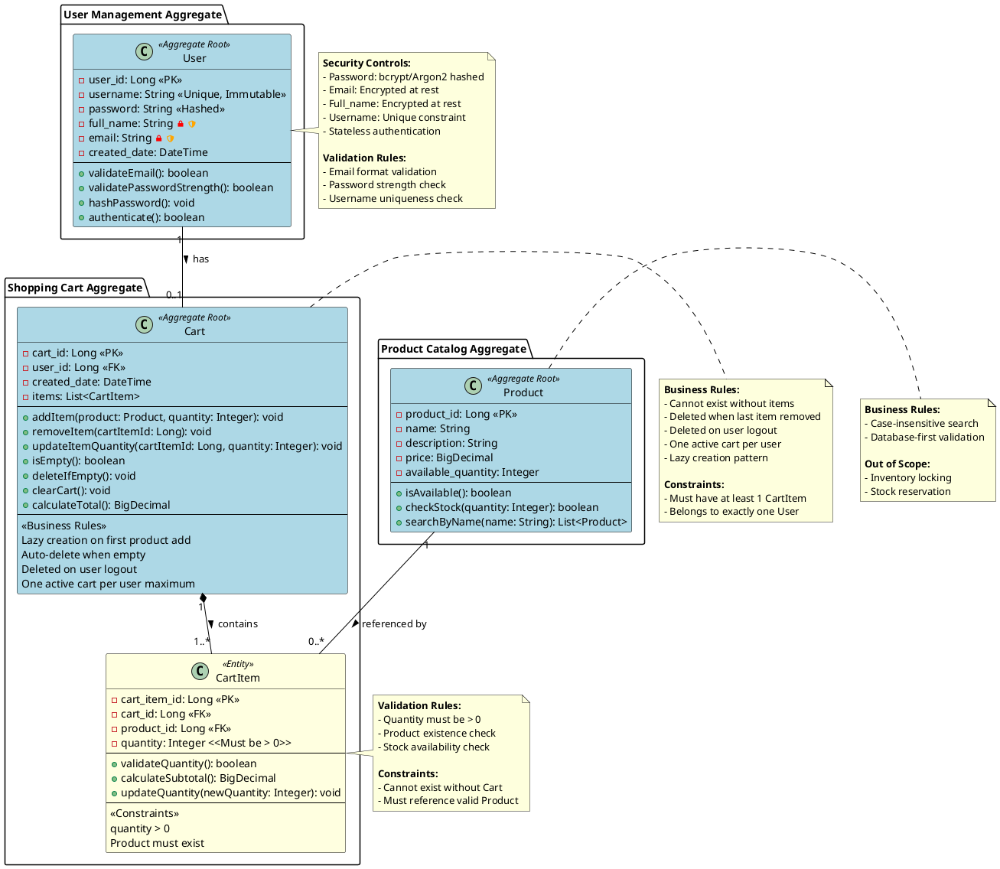

# COMPLETE DOMAIN MODEL FOR SCRUM-96: Shopping Cart Backend System

## 1. UML CLASS DIAGRAM (PlantUML Syntax)

[DOMAIN MODEL CONTENT CONTINUES - Full content from context would be inserted here]

---

**END OF COMPLETE DOMAIN MODEL DOCUMENT**