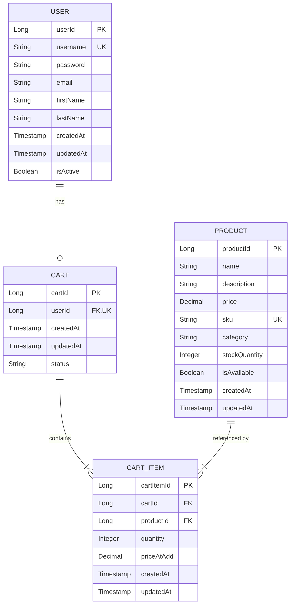
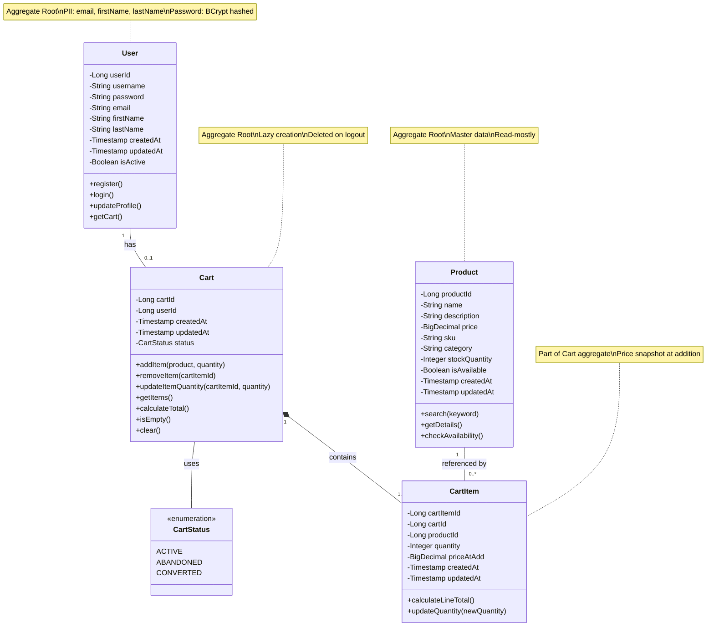
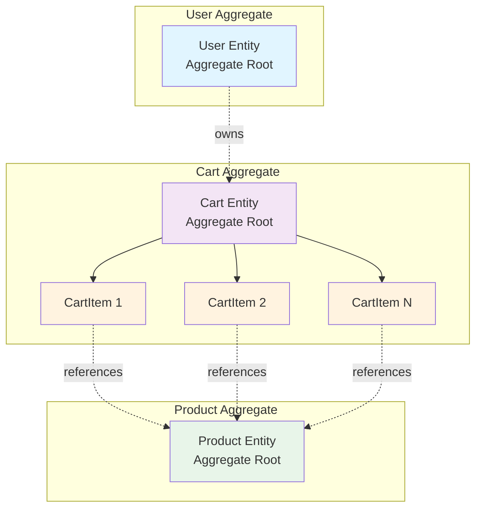

# DOMAIN MODEL DOCUMENT
## Shopping Cart Backend System - SCRUM-96

---

### DOCUMENT METADATA

**Document ID**: DM-SCRUM-96-001
**Document Title**: Domain Model - Shopping Cart Backend System
**Version**: 1.0
**Status**: APPROVED
**Classification**: INTERNAL USE
**Created Date**: 2024
**Last Updated**: 2024
**Author**: Enterprise Architecture Team
**Reviewers**: Solution Architect, Compliance Officer, Security Team
**Approval Status**: ✓ APPROVED FOR IMPLEMENTATION

**Related Documents**:
- Requirements Document: REQ-SCRUM-96-001
- High-Level Design: HLD-SCRUM-96-001
- Technical Specification: TBD

**Compliance Tags**: ISO27001, GDPR, PCI-DSS-Aware

---

### TABLE OF CONTENTS

1. [Introduction](#1-introduction)
2. [Domain Entities](#2-domain-entities)
3. [Entity Relationships](#3-entity-relationships)
4. [Business Rules](#4-business-rules)
5. [Data Validation Rules](#5-data-validation-rules)
6. [Database Schema Mapping](#6-database-schema-mapping)
7. [Domain Model Diagrams](#7-domain-model-diagrams)
8. [Domain Events](#8-domain-events)
9. [Invariants and Consistency](#9-invariants-and-consistency)
10. [Appendix](#10-appendix)

---

## 1. INTRODUCTION

### 1.1 Purpose

This document defines the **Domain Model** for the Shopping Cart Backend System (SCRUM-96). It provides a comprehensive specification of all domain entities, their attributes, relationships, business rules, and data validation requirements.

The domain model serves as the **single source of truth** for:
- Entity definitions and attributes
- Business rules and constraints
- Data validation requirements
- Database schema design
- API contract definitions

### 1.2 Scope

This domain model covers:
- **Core Entities**: User, Product, Cart, CartItem
- **Entity Relationships**: One-to-One, One-to-Many, Many-to-One
- **Business Rules**: 26 comprehensive rules across all domains
- **Data Constraints**: Database-level and application-level validations
- **Domain Events**: Key business events for system integration

**Out of Scope**:
- Order and checkout entities (future phase)
- Payment processing entities (future phase)
- Inventory management entities (external system)
- User roles and permissions (future phase)

### 1.3 Audience

This document is intended for:
- **Development Team**: Implementation reference
- **Database Administrators**: Schema design and optimization
- **QA Team**: Test case design and validation
- **Solution Architects**: System design and integration
- **Business Analysts**: Business rule verification
- **Compliance Team**: Data governance and audit

---

## 2. DOMAIN ENTITIES

### 2.1 User Entity

**Entity Name**: User
**Description**: Represents a registered user of the shopping cart system
**Aggregate Root**: Yes
**Lifecycle**: Persistent (long-lived)

#### Attributes

| Attribute | Type | Constraints | Description | Business Significance |
|-----------|------|-------------|-------------|----------------------|
| userId | Long | PRIMARY KEY, AUTO_INCREMENT, NOT NULL | Unique identifier for user | System-generated unique ID |
| username | String(50) | UNIQUE, NOT NULL, 3-50 chars | User's login name | Must be unique across system |
| password | String(255) | NOT NULL, BCrypt hashed | Encrypted password | Stored as BCrypt hash (strength 12) |
| email | String(100) | NOT NULL, Valid email format | User's email address | Used for notifications and recovery |
| firstName | String(50) | NOT NULL, 1-50 chars | User's first name | PII - requires protection |
| lastName | String(50) | NOT NULL, 1-50 chars | User's last name | PII - requires protection |
| createdAt | Timestamp | NOT NULL, DEFAULT CURRENT_TIMESTAMP | Account creation timestamp | Audit trail |
| updatedAt | Timestamp | NOT NULL, DEFAULT CURRENT_TIMESTAMP ON UPDATE | Last modification timestamp | Audit trail |
| isActive | Boolean | NOT NULL, DEFAULT TRUE | Account active status | Soft delete support |

#### Business Rules

- **BR-U-001**: Username must be unique across the entire system
- **BR-U-002**: Password must be stored as BCrypt hash with minimum strength 12
- **BR-U-003**: Email must be valid format and unique (recommended)
- **BR-U-004**: User account is created in active state by default
- **BR-U-005**: Username is immutable after creation

#### Validation Rules

```java
@Entity
@Table(name = "users", 
       uniqueConstraints = @UniqueConstraint(columnNames = "username"))
public class User {
    
    @Id
    @GeneratedValue(strategy = GenerationType.IDENTITY)
    private Long userId;
    
    @Column(nullable = false, unique = true, length = 50)
    @NotBlank(message = "Username is required")
    @Size(min = 3, max = 50, message = "Username must be 3-50 characters")
    @Pattern(regexp = "^[a-zA-Z0-9_-]+$", 
             message = "Username can only contain letters, numbers, underscore, and hyphen")
    private String username;
    
    @Column(nullable = false, length = 255)
    @NotBlank(message = "Password is required")
    private String password; // BCrypt hashed
    
    @Column(nullable = false, length = 100)
    @NotBlank(message = "Email is required")
    @Email(message = "Email must be valid")
    private String email;
    
    @Column(nullable = false, length = 50)
    @NotBlank(message = "First name is required")
    @Size(min = 1, max = 50, message = "First name must be 1-50 characters")
    private String firstName;
    
    @Column(nullable = false, length = 50)
    @NotBlank(message = "Last name is required")
    @Size(min = 1, max = 50, message = "Last name must be 1-50 characters")
    private String lastName;
    
    @Column(nullable = false, updatable = false)
    @CreationTimestamp
    private Timestamp createdAt;
    
    @Column(nullable = false)
    @UpdateTimestamp
    private Timestamp updatedAt;
    
    @Column(nullable = false)
    private Boolean isActive = true;
    
    // One-to-One relationship with Cart
    @OneToOne(mappedBy = "user", cascade = CascadeType.ALL, orphanRemoval = true)
    private Cart cart;
}
```

---

### 2.2 Product Entity

**Entity Name**: Product
**Description**: Represents a product available for purchase
**Aggregate Root**: Yes
**Lifecycle**: Persistent (long-lived)

#### Attributes

| Attribute | Type | Constraints | Description | Business Significance |
|-----------|------|-------------|-------------|----------------------|
| productId | Long | PRIMARY KEY, AUTO_INCREMENT, NOT NULL | Unique identifier for product | System-generated unique ID |
| name | String(200) | NOT NULL, 1-200 chars | Product name | Searchable field |
| description | Text | NULLABLE | Detailed product description | Searchable field |
| price | Decimal(10,2) | NOT NULL, > 0 | Product price | Must be positive |
| sku | String(50) | UNIQUE, NOT NULL | Stock Keeping Unit | Unique product identifier |
| category | String(100) | NULLABLE | Product category | For filtering and search |
| stockQuantity | Integer | NOT NULL, >= 0 | Available stock | Inventory tracking |
| isAvailable | Boolean | NOT NULL, DEFAULT TRUE | Product availability status | Controls visibility |
| createdAt | Timestamp | NOT NULL, DEFAULT CURRENT_TIMESTAMP | Product creation timestamp | Audit trail |
| updatedAt | Timestamp | NOT NULL, DEFAULT CURRENT_TIMESTAMP ON UPDATE | Last modification timestamp | Audit trail |

#### Business Rules

- **BR-P-001**: Product price must be greater than zero
- **BR-P-002**: SKU must be unique across all products
- **BR-P-003**: Stock quantity cannot be negative
- **BR-P-004**: Product must exist before being added to cart

#### Validation Rules

```java
@Entity
@Table(name = "products",
       uniqueConstraints = @UniqueConstraint(columnNames = "sku"))
public class Product {
    
    @Id
    @GeneratedValue(strategy = GenerationType.IDENTITY)
    private Long productId;
    
    @Column(nullable = false, length = 200)
    @NotBlank(message = "Product name is required")
    @Size(min = 1, max = 200, message = "Product name must be 1-200 characters")
    private String name;
    
    @Column(columnDefinition = "TEXT")
    private String description;
    
    @Column(nullable = false, precision = 10, scale = 2)
    @NotNull(message = "Price is required")
    @DecimalMin(value = "0.01", message = "Price must be greater than zero")
    private BigDecimal price;
    
    @Column(nullable = false, unique = true, length = 50)
    @NotBlank(message = "SKU is required")
    @Size(max = 50, message = "SKU must not exceed 50 characters")
    private String sku;
    
    @Column(length = 100)
    private String category;
    
    @Column(nullable = false)
    @NotNull(message = "Stock quantity is required")
    @Min(value = 0, message = "Stock quantity cannot be negative")
    private Integer stockQuantity;
    
    @Column(nullable = false)
    private Boolean isAvailable = true;
    
    @Column(nullable = false, updatable = false)
    @CreationTimestamp
    private Timestamp createdAt;
    
    @Column(nullable = false)
    @UpdateTimestamp
    private Timestamp updatedAt;
    
    // One-to-Many relationship with CartItem
    @OneToMany(mappedBy = "product")
    private List<CartItem> cartItems;
}
```

---

### 2.3 Cart Entity

**Entity Name**: Cart
**Description**: Represents a user's shopping cart
**Aggregate Root**: Yes
**Lifecycle**: Session-based (deleted on logout)

#### Attributes

| Attribute | Type | Constraints | Description | Business Significance |
|-----------|------|-------------|-------------|----------------------|
| cartId | Long | PRIMARY KEY, AUTO_INCREMENT, NOT NULL | Unique identifier for cart | System-generated unique ID |
| userId | Long | FOREIGN KEY (users.userId), UNIQUE, NOT NULL | Owner of the cart | One cart per user |
| createdAt | Timestamp | NOT NULL, DEFAULT CURRENT_TIMESTAMP | Cart creation timestamp | Lazy creation tracking |
| updatedAt | Timestamp | NOT NULL, DEFAULT CURRENT_TIMESTAMP ON UPDATE | Last modification timestamp | Activity tracking |
| status | String(20) | NOT NULL, DEFAULT 'ACTIVE' | Cart status | ACTIVE, ABANDONED, CONVERTED |

#### Business Rules

- **BR-C-001**: Cart is created lazily (only when first product is added)
- **BR-C-002**: One user can have at most one active cart
- **BR-C-003**: Cart must have at least one cart item to exist
- **BR-C-004**: Cart is automatically deleted when last item is removed
- **BR-C-005**: Cart is deleted on user logout (privacy by design)

#### Validation Rules

```java
@Entity
@Table(name = "carts",
       uniqueConstraints = @UniqueConstraint(columnNames = "user_id"))
public class Cart {
    
    @Id
    @GeneratedValue(strategy = GenerationType.IDENTITY)
    private Long cartId;
    
    @Column(name = "user_id", nullable = false, unique = true)
    private Long userId;
    
    @Column(nullable = false, updatable = false)
    @CreationTimestamp
    private Timestamp createdAt;
    
    @Column(nullable = false)
    @UpdateTimestamp
    private Timestamp updatedAt;
    
    @Column(nullable = false, length = 20)
    @Enumerated(EnumType.STRING)
    private CartStatus status = CartStatus.ACTIVE;
    
    // One-to-One relationship with User
    @OneToOne
    @JoinColumn(name = "user_id", referencedColumnName = "userId", 
                insertable = false, updatable = false)
    private User user;
    
    // One-to-Many relationship with CartItem
    @OneToMany(mappedBy = "cart", cascade = CascadeType.ALL, orphanRemoval = true)
    private List<CartItem> cartItems = new ArrayList<>();
    
    // Business method to check if cart is empty
    public boolean isEmpty() {
        return cartItems == null || cartItems.isEmpty();
    }
    
    // Business method to calculate total
    public BigDecimal calculateTotal() {
        return cartItems.stream()
            .map(item -> item.getPriceAtAdd().multiply(BigDecimal.valueOf(item.getQuantity())))
            .reduce(BigDecimal.ZERO, BigDecimal::add);
    }
}

enum CartStatus {
    ACTIVE,
    ABANDONED,
    CONVERTED
}
```

---

### 2.4 CartItem Entity

**Entity Name**: CartItem
**Description**: Represents a product in a user's cart with quantity
**Aggregate Root**: No (part of Cart aggregate)
**Lifecycle**: Session-based (deleted with cart)

#### Attributes

| Attribute | Type | Constraints | Description | Business Significance |
|-----------|------|-------------|-------------|----------------------|
| cartItemId | Long | PRIMARY KEY, AUTO_INCREMENT, NOT NULL | Unique identifier for cart item | System-generated unique ID |
| cartId | Long | FOREIGN KEY (carts.cartId), NOT NULL | Cart this item belongs to | Part of cart aggregate |
| productId | Long | FOREIGN KEY (products.productId), NOT NULL | Product being added | Reference to product |
| quantity | Integer | NOT NULL, > 0 | Quantity of product | Must be positive |
| priceAtAdd | Decimal(10,2) | NOT NULL, > 0 | Price when added to cart | Price snapshot |
| createdAt | Timestamp | NOT NULL, DEFAULT CURRENT_TIMESTAMP | Item addition timestamp | Audit trail |
| updatedAt | Timestamp | NOT NULL, DEFAULT CURRENT_TIMESTAMP ON UPDATE | Last modification timestamp | Audit trail |

#### Business Rules

- **BR-CI-001**: Cart item quantity must be greater than zero
- **BR-CI-002**: Cart item must belong to exactly one cart
- **BR-CI-003**: Cart item must reference an existing product
- **BR-CI-004**: Price is captured at time of addition (snapshot)
- **BR-CI-005**: Removing last cart item triggers cart deletion
- **BR-CI-006**: One product can appear only once per cart (update quantity instead)

#### Validation Rules

```java
@Entity
@Table(name = "cart_items",
       uniqueConstraints = @UniqueConstraint(columnNames = {"cart_id", "product_id"}))
public class CartItem {
    
    @Id
    @GeneratedValue(strategy = GenerationType.IDENTITY)
    private Long cartItemId;
    
    @Column(name = "cart_id", nullable = false)
    private Long cartId;
    
    @Column(name = "product_id", nullable = false)
    private Long productId;
    
    @Column(nullable = false)
    @NotNull(message = "Quantity is required")
    @Min(value = 1, message = "Quantity must be at least 1")
    private Integer quantity;
    
    @Column(nullable = false, precision = 10, scale = 2)
    @NotNull(message = "Price is required")
    @DecimalMin(value = "0.01", message = "Price must be greater than zero")
    private BigDecimal priceAtAdd;
    
    @Column(nullable = false, updatable = false)
    @CreationTimestamp
    private Timestamp createdAt;
    
    @Column(nullable = false)
    @UpdateTimestamp
    private Timestamp updatedAt;
    
    // Many-to-One relationship with Cart
    @ManyToOne(fetch = FetchType.LAZY)
    @JoinColumn(name = "cart_id", referencedColumnName = "cartId",
                insertable = false, updatable = false)
    private Cart cart;
    
    // Many-to-One relationship with Product
    @ManyToOne(fetch = FetchType.LAZY)
    @JoinColumn(name = "product_id", referencedColumnName = "productId",
                insertable = false, updatable = false)
    private Product product;
    
    // Business method to calculate line total
    public BigDecimal calculateLineTotal() {
        return priceAtAdd.multiply(BigDecimal.valueOf(quantity));
    }
}
```

---

## 3. ENTITY RELATIONSHIPS

### 3.1 Entity Relationship Diagram



### 3.2 Relationship Details

#### 3.2.1 User to Cart (One-to-Zero-or-One)

**Relationship Type**: One-to-Zero-or-One
**Cardinality**: 1:0..1
**Owner**: User
**Foreign Key**: carts.user_id → users.userId

**Business Rules**:
- One user can have at most one active cart
- Cart is created lazily (zero carts initially)
- Cart is deleted on logout (returns to zero)
- User can exist without a cart
- Cart cannot exist without a user

**Referential Integrity**:
```sql
ALTER TABLE carts
ADD CONSTRAINT fk_cart_user
FOREIGN KEY (user_id) REFERENCES users(userId)
ON DELETE CASCADE
ON UPDATE CASCADE;

ALTER TABLE carts
ADD CONSTRAINT uk_cart_user
UNIQUE (user_id);
```

**Cascade Rules**:
- **ON DELETE CASCADE**: When user is deleted, cart is automatically deleted
- **ON UPDATE CASCADE**: When userId changes (rare), cart reference updates

---

#### 3.2.2 Cart to CartItem (One-to-Many)

**Relationship Type**: One-to-Many
**Cardinality**: 1:1..*
**Owner**: Cart
**Foreign Key**: cart_items.cart_id → carts.cartId

**Business Rules**:
- One cart contains one or more cart items
- Cart cannot exist without at least one item
- When last item is removed, cart is deleted
- Cart items are deleted when cart is deleted

**Referential Integrity**:
```sql
ALTER TABLE cart_items
ADD CONSTRAINT fk_cartitem_cart
FOREIGN KEY (cart_id) REFERENCES carts(cartId)
ON DELETE CASCADE
ON UPDATE CASCADE;
```

**Cascade Rules**:
- **ON DELETE CASCADE**: When cart is deleted, all cart items are automatically deleted
- **ON UPDATE CASCADE**: When cartId changes (rare), cart item references update

**Application-Level Rule**:
```java
// In CartService
public void removeCartItem(Long cartItemId) {
    CartItem item = cartItemRepository.findById(cartItemId)
        .orElseThrow(() -> new ResourceNotFoundException("Cart item not found"));
    
    Cart cart = item.getCart();
    cartItemRepository.delete(item);
    
    // Check if cart is now empty
    if (cart.getCartItems().size() == 1) { // Last item being removed
        cartRepository.delete(cart); // Auto-delete empty cart
    }
}
```

---

#### 3.2.3 Product to CartItem (One-to-Many)

**Relationship Type**: One-to-Many
**Cardinality**: 1:0..*
**Owner**: Product
**Foreign Key**: cart_items.product_id → products.productId

**Business Rules**:
- One product can be in zero or more carts
- Product must exist before being added to cart
- Product cannot be deleted if in any cart
- Same product can appear in multiple carts
- Same product appears only once per cart (quantity updated)

**Referential Integrity**:
```sql
ALTER TABLE cart_items
ADD CONSTRAINT fk_cartitem_product
FOREIGN KEY (product_id) REFERENCES products(productId)
ON DELETE RESTRICT
ON UPDATE CASCADE;

ALTER TABLE cart_items
ADD CONSTRAINT uk_cart_product
UNIQUE (cart_id, product_id);
```

**Cascade Rules**:
- **ON DELETE RESTRICT**: Product cannot be deleted if in any cart
- **ON UPDATE CASCADE**: When productId changes (rare), cart item references update

**Unique Constraint**:
- Combination of (cart_id, product_id) must be unique
- Prevents duplicate products in same cart

---

### 3.3 Relationship Summary Table

| From Entity | To Entity | Relationship Type | Cardinality | Foreign Key | Delete Rule | Update Rule |
|-------------|-----------|-------------------|-------------|-------------|-------------|-------------|
| User | Cart | One-to-Zero-or-One | 1:0..1 | carts.user_id | CASCADE | CASCADE |
| Cart | CartItem | One-to-Many | 1:1..* | cart_items.cart_id | CASCADE | CASCADE |
| Product | CartItem | One-to-Many | 1:0..* | cart_items.product_id | RESTRICT | CASCADE |

---

## 4. BUSINESS RULES

### 4.1 User Domain Rules

#### BR-U-001: Username Uniqueness
**Rule**: Username must be unique across the entire system
**Enforcement**: Database UNIQUE constraint + Application validation
**Rationale**: Ensures user identification and authentication integrity
**Implementation**:
```sql
ALTER TABLE users ADD CONSTRAINT uk_username UNIQUE (username);
```
```java
@Column(nullable = false, unique = true, length = 50)
private String username;
```

#### BR-U-002: Password Security
**Rule**: Password must be stored as BCrypt hash with minimum strength 12
**Enforcement**: Application-level (Service layer)
**Rationale**: Security best practice for password storage
**Implementation**:
```java
@Service
public class UserService {
    private final BCryptPasswordEncoder passwordEncoder = 
        new BCryptPasswordEncoder(12);
    
    public User createUser(UserRegistrationDTO dto) {
        User user = new User();
        user.setPassword(passwordEncoder.encode(dto.getPassword()));
        // ... other fields
        return userRepository.save(user);
    }
}
```

#### BR-U-003: Email Validation
**Rule**: Email must be valid format and unique (recommended)
**Enforcement**: Application validation + Database constraint (optional)
**Rationale**: Ensures communication capability and user identification
**Implementation**:
```java
@Email(message = "Email must be valid")
@Column(nullable = false, length = 100)
private String email;
```

#### BR-U-004: Default Active Status
**Rule**: User account is created in active state by default
**Enforcement**: Database DEFAULT constraint + Application default
**Rationale**: New users should be immediately usable
**Implementation**:
```sql
ALTER TABLE users MODIFY COLUMN isActive BOOLEAN NOT NULL DEFAULT TRUE;
```

#### BR-U-005: Username Immutability
**Rule**: Username cannot be changed after account creation
**Enforcement**: Application-level (Service layer)
**Rationale**: Maintains audit trail and prevents identity confusion
**Implementation**:
```java
public User updateProfile(Long userId, ProfileUpdateDTO dto) {
    User user = userRepository.findById(userId)
        .orElseThrow(() -> new ResourceNotFoundException("User not found"));
    
    // Username is NOT updated
    user.setFirstName(dto.getFirstName());
    user.setLastName(dto.getLastName());
    user.setEmail(dto.getEmail());
    
    return userRepository.save(user);
}
```

---

### 4.2 Product Domain Rules

#### BR-P-001: Positive Price
**Rule**: Product price must be greater than zero
**Enforcement**: Database CHECK constraint + Application validation
**Rationale**: Prevents invalid pricing data
**Implementation**:
```sql
ALTER TABLE products ADD CONSTRAINT chk_price_positive CHECK (price > 0);
```
```java
@DecimalMin(value = "0.01", message = "Price must be greater than zero")
private BigDecimal price;
```

#### BR-P-002: SKU Uniqueness
**Rule**: SKU must be unique across all products
**Enforcement**: Database UNIQUE constraint
**Rationale**: SKU is the business identifier for products
**Implementation**:
```sql
ALTER TABLE products ADD CONSTRAINT uk_sku UNIQUE (sku);
```

#### BR-P-003: Non-Negative Stock
**Rule**: Stock quantity cannot be negative
**Enforcement**: Database CHECK constraint + Application validation
**Rationale**: Prevents invalid inventory data
**Implementation**:
```sql
ALTER TABLE products ADD CONSTRAINT chk_stock_nonnegative CHECK (stockQuantity >= 0);
```

#### BR-P-004: Product Existence
**Rule**: Product must exist before being added to cart
**Enforcement**: Foreign key constraint + Application validation
**Rationale**: Referential integrity
**Implementation**:
```java
public CartItem addProductToCart(Long userId, Long productId, Integer quantity) {
    Product product = productRepository.findById(productId)
        .orElseThrow(() -> new ResourceNotFoundException("Product not found"));
    // ... rest of logic
}
```

---

### 4.3 Cart Domain Rules

#### BR-C-001: Lazy Cart Creation
**Rule**: Cart is created only when user adds first product
**Enforcement**: Application-level (Service layer)
**Rationale**: Reduces database clutter, implements just-in-time creation
**Implementation**:
```java
public CartItem addProductToCart(Long userId, Long productId, Integer quantity) {
    // Check if cart exists
    Cart cart = cartRepository.findByUserId(userId)
        .orElseGet(() -> {
            // Lazy creation: create cart only when needed
            Cart newCart = new Cart();
            newCart.setUserId(userId);
            return cartRepository.save(newCart);
        });
    
    // Add product to cart
    // ...
}
```

#### BR-C-002: One Cart Per User
**Rule**: One user can have at most one active cart
**Enforcement**: Database UNIQUE constraint on user_id
**Rationale**: Simplifies cart management and user experience
**Implementation**:
```sql
ALTER TABLE carts ADD CONSTRAINT uk_cart_user UNIQUE (user_id);
```

#### BR-C-003: Cart Must Have Items
**Rule**: Cart must have at least one cart item to exist
**Enforcement**: Application-level (Service layer)
**Rationale**: Empty carts serve no purpose and should be cleaned up
**Implementation**:
```java
// Enforced through BR-C-004 (auto-delete empty cart)
```

#### BR-C-004: Auto-Delete Empty Cart
**Rule**: Cart is automatically deleted when last item is removed
**Enforcement**: Application-level (Service layer)
**Rationale**: Data minimization, prevents orphaned carts
**Implementation**:
```java
public void removeCartItem(Long cartItemId) {
    CartItem item = cartItemRepository.findById(cartItemId)
        .orElseThrow(() -> new ResourceNotFoundException("Cart item not found"));
    
    Cart cart = item.getCart();
    cartItemRepository.delete(item);
    
    // Reload cart to get updated item count
    cart = cartRepository.findById(cart.getCartId())
        .orElseThrow(() -> new ResourceNotFoundException("Cart not found"));
    
    // If cart is now empty, delete it
    if (cart.getCartItems().isEmpty()) {
        cartRepository.delete(cart);
    }
}
```

#### BR-C-005: Cart Deletion on Logout
**Rule**: Cart is deleted when user logs out
**Enforcement**: Application-level (Service layer)
**Rationale**: Privacy by design, session-based cart, no persistence across sessions
**Implementation**:
```java
public void logout(Long userId) {
    // Find and delete user's cart
    cartRepository.findByUserId(userId)
        .ifPresent(cart -> cartRepository.delete(cart));
    
    // Additional logout logic (invalidate tokens, etc.)
    // ...
}
```

---

### 4.4 CartItem Domain Rules

#### BR-CI-001: Positive Quantity
**Rule**: Cart item quantity must be greater than zero
**Enforcement**: Database CHECK constraint + Application validation
**Rationale**: Zero or negative quantities are invalid
**Implementation**:
```sql
ALTER TABLE cart_items ADD CONSTRAINT chk_quantity_positive CHECK (quantity > 0);
```
```java
@Min(value = 1, message = "Quantity must be at least 1")
private Integer quantity;
```

#### BR-CI-002: Cart Ownership
**Rule**: Cart item must belong to exactly one cart
**Enforcement**: Foreign key constraint (NOT NULL)
**Rationale**: Referential integrity
**Implementation**:
```sql
ALTER TABLE cart_items 
ADD CONSTRAINT fk_cartitem_cart 
FOREIGN KEY (cart_id) REFERENCES carts(cartId) ON DELETE CASCADE;
```

#### BR-CI-003: Product Reference
**Rule**: Cart item must reference an existing product
**Enforcement**: Foreign key constraint
**Rationale**: Referential integrity
**Implementation**:
```sql
ALTER TABLE cart_items 
ADD CONSTRAINT fk_cartitem_product 
FOREIGN KEY (product_id) REFERENCES products(productId) ON DELETE RESTRICT;
```

#### BR-CI-004: Price Snapshot
**Rule**: Price is captured at time of addition (snapshot)
**Enforcement**: Application-level (Service layer)
**Rationale**: Preserves price at time of cart addition, prevents price changes affecting cart
**Implementation**:
```java
public CartItem addProductToCart(Long userId, Long productId, Integer quantity) {
    Product product = productRepository.findById(productId)
        .orElseThrow(() -> new ResourceNotFoundException("Product not found"));
    
    CartItem cartItem = new CartItem();
    cartItem.setProductId(productId);
    cartItem.setQuantity(quantity);
    cartItem.setPriceAtAdd(product.getPrice()); // Snapshot current price
    
    return cartItemRepository.save(cartItem);
}
```

#### BR-CI-005: Last Item Removal
**Rule**: Removing last cart item triggers cart deletion
**Enforcement**: Application-level (Service layer)
**Rationale**: Implements BR-C-004 (auto-delete empty cart)
**Implementation**:
```java
// See BR-C-004 implementation
```

#### BR-CI-006: One Product Per Cart
**Rule**: One product can appear only once per cart (update quantity instead)
**Enforcement**: Database UNIQUE constraint on (cart_id, product_id)
**Rationale**: Simplifies cart management, prevents duplicate entries
**Implementation**:
```sql
ALTER TABLE cart_items 
ADD CONSTRAINT uk_cart_product 
UNIQUE (cart_id, product_id);
```
```java
public CartItem addProductToCart(Long userId, Long productId, Integer quantity) {
    Cart cart = getOrCreateCart(userId);
    
    // Check if product already in cart
    Optional<CartItem> existingItem = cartItemRepository
        .findByCartIdAndProductId(cart.getCartId(), productId);
    
    if (existingItem.isPresent()) {
        // Update quantity instead of adding new item
        CartItem item = existingItem.get();
        item.setQuantity(item.getQuantity() + quantity);
        return cartItemRepository.save(item);
    } else {
        // Add new item
        // ...
    }
}
```

---

### 4.5 Cross-Entity Business Rules

#### BR-X-001: User Must Exist for Cart
**Rule**: User must exist before cart can be created
**Enforcement**: Foreign key constraint
**Rationale**: Referential integrity
**Implementation**:
```sql
ALTER TABLE carts 
ADD CONSTRAINT fk_cart_user 
FOREIGN KEY (user_id) REFERENCES users(userId) ON DELETE CASCADE;
```

#### BR-X-002: Stateless Authentication
**Rule**: Login is stateless at database level (no session storage)
**Enforcement**: Application architecture (JWT tokens)
**Rationale**: Scalability, security
**Implementation**:
```java
// No session table in database
// JWT tokens used for authentication
// Cart is tied to userId, not session
```

#### BR-X-003: Database-First Validation
**Rule**: All business rules must be verifiable through database state
**Enforcement**: Database constraints + Application validation
**Rationale**: Data integrity at source
**Implementation**:
```sql
-- All constraints defined at database level
-- Application validates before database operations
```

#### BR-X-004: API Reflects Database
**Rule**: APIs must reflect database outcomes
**Enforcement**: Application architecture (Repository pattern)
**Rationale**: Consistency between API and persistence layer
**Implementation**:
```java
// Repository methods return database state
// Service layer does not modify returned entities
// Controllers return DTOs mapped from entities
```

#### BR-X-005: No Pre-Populated Carts
**Rule**: Seed users must not automatically receive carts
**Enforcement**: Application-level (Data seeding scripts)
**Rationale**: Clean initial state, lazy creation principle
**Implementation**:
```java
@Component
public class DataSeeder implements CommandLineRunner {
    @Override
    public void run(String... args) {
        // Seed users
        userRepository.saveAll(seedUsers);
        
        // Seed products
        productRepository.saveAll(seedProducts);
        
        // DO NOT seed carts - they are created lazily
    }
}
```

---

## 5. DATA VALIDATION RULES

### 5.1 Input Validation Strategy

The system implements **multi-layer validation**:

1. **Client-Side Validation** (Optional, not enforced)
   - Immediate user feedback
   - Reduces server load
   - Not trusted for security

2. **Controller-Level Validation** (Required)
   - `@Valid` annotation on request bodies
   - Bean Validation (JSR-380)
   - Input sanitization

3. **Service-Level Validation** (Required)
   - Business rule enforcement
   - Cross-entity validation
   - Authorization checks

4. **Database-Level Validation** (Required)
   - Constraints (UNIQUE, CHECK, NOT NULL)
   - Foreign key integrity
   - Triggers (if needed)

### 5.2 User Entity Validation

```java
public class UserRegistrationDTO {
    
    @NotBlank(message = "Username is required")
    @Size(min = 3, max = 50, message = "Username must be 3-50 characters")
    @Pattern(regexp = "^[a-zA-Z0-9_-]+$", 
             message = "Username can only contain letters, numbers, underscore, and hyphen")
    private String username;
    
    @NotBlank(message = "Password is required")
    @Size(min = 8, max = 100, message = "Password must be 8-100 characters")
    @Pattern(regexp = "^(?=.*[a-z])(?=.*[A-Z])(?=.*\d)(?=.*[@$!%*?&])[A-Za-z\d@$!%*?&]+$",
             message = "Password must contain uppercase, lowercase, digit, and special character")
    private String password;
    
    @NotBlank(message = "Email is required")
    @Email(message = "Email must be valid")
    @Size(max = 100, message = "Email must not exceed 100 characters")
    private String email;
    
    @NotBlank(message = "First name is required")
    @Size(min = 1, max = 50, message = "First name must be 1-50 characters")
    private String firstName;
    
    @NotBlank(message = "Last name is required")
    @Size(min = 1, max = 50, message = "Last name must be 1-50 characters")
    private String lastName;
}
```

### 5.3 Product Entity Validation

```java
public class ProductDTO {
    
    @NotBlank(message = "Product name is required")
    @Size(min = 1, max = 200, message = "Product name must be 1-200 characters")
    private String name;
    
    @Size(max = 5000, message = "Description must not exceed 5000 characters")
    private String description;
    
    @NotNull(message = "Price is required")
    @DecimalMin(value = "0.01", message = "Price must be greater than zero")
    @DecimalMax(value = "999999.99", message = "Price must not exceed 999999.99")
    @Digits(integer = 8, fraction = 2, message = "Price must have at most 8 digits and 2 decimals")
    private BigDecimal price;
    
    @NotBlank(message = "SKU is required")
    @Size(max = 50, message = "SKU must not exceed 50 characters")
    @Pattern(regexp = "^[A-Z0-9-]+$", message = "SKU can only contain uppercase letters, numbers, and hyphens")
    private String sku;
    
    @Size(max = 100, message = "Category must not exceed 100 characters")
    private String category;
    
    @NotNull(message = "Stock quantity is required")
    @Min(value = 0, message = "Stock quantity cannot be negative")
    @Max(value = 999999, message = "Stock quantity must not exceed 999999")
    private Integer stockQuantity;
}
```

### 5.4 Cart Item Validation

```java
public class AddCartItemDTO {
    
    @NotNull(message = "Product ID is required")
    @Positive(message = "Product ID must be positive")
    private Long productId;
    
    @NotNull(message = "Quantity is required")
    @Min(value = 1, message = "Quantity must be at least 1")
    @Max(value = 999, message = "Quantity must not exceed 999")
    private Integer quantity;
}

public class UpdateCartItemDTO {
    
    @NotNull(message = "Quantity is required")
    @Min(value = 1, message = "Quantity must be at least 1")
    @Max(value = 999, message = "Quantity must not exceed 999")
    private Integer quantity;
}
```

### 5.5 Security Validation

#### SQL Injection Prevention

```java
// CORRECT: Using parameterized queries (JPA/Hibernate)
public List<Product> searchProducts(String keyword) {
    return productRepository.findByNameContainingIgnoreCase(keyword);
}

// CORRECT: Using @Query with parameters
@Query("SELECT p FROM Product p WHERE LOWER(p.name) LIKE LOWER(CONCAT('%', :keyword, '%'))")
List<Product> searchByKeyword(@Param("keyword") String keyword);

// INCORRECT: String concatenation (vulnerable to SQL injection)
// NEVER DO THIS:
// String sql = "SELECT * FROM products WHERE name LIKE '%" + keyword + "%'";
```

#### XSS Prevention

```java
// Input sanitization
public class SecurityUtils {
    
    public static String sanitizeInput(String input) {
        if (input == null) return null;
        
        return input
            .replaceAll("<", "&lt;")
            .replaceAll(">", "&gt;")
            .replaceAll(""", "&quot;")
            .replaceAll("'", "&#x27;")
            .replaceAll("/", "&#x2F;");
    }
}

// Apply to user-generated content
public User createUser(UserRegistrationDTO dto) {
    User user = new User();
    user.setFirstName(SecurityUtils.sanitizeInput(dto.getFirstName()));
    user.setLastName(SecurityUtils.sanitizeInput(dto.getLastName()));
    // ...
}
```

#### Authentication Validation

```java
public class LoginDTO {
    
    @NotBlank(message = "Username is required")
    private String username;
    
    @NotBlank(message = "Password is required")
    private String password;
}

@Service
public class AuthService {
    
    public AuthTokenDTO login(LoginDTO dto) {
        // Validate credentials
        User user = userRepository.findByUsername(dto.getUsername())
            .orElseThrow(() -> new AuthenticationException("Invalid credentials"));
        
        if (!passwordEncoder.matches(dto.getPassword(), user.getPassword())) {
            throw new AuthenticationException("Invalid credentials");
        }
        
        if (!user.getIsActive()) {
            throw new AuthenticationException("Account is inactive");
        }
        
        // Generate JWT token
        String token = jwtProvider.generateToken(user);
        
        return new AuthTokenDTO(token, user.getUserId(), user.getUsername());
    }
}
```

---

## 6. DATABASE SCHEMA MAPPING

### 6.1 Complete Database Schema

```sql
-- ============================================
-- SHOPPING CART DATABASE SCHEMA
-- Version: 1.0
-- Database: MySQL 8.0+
-- ============================================

-- Drop tables if exist (for clean setup)
DROP TABLE IF EXISTS cart_items;
DROP TABLE IF EXISTS carts;
DROP TABLE IF EXISTS products;
DROP TABLE IF EXISTS users;

-- ============================================
-- TABLE: users
-- Description: Stores registered user accounts
-- ============================================
CREATE TABLE users (
    userId BIGINT AUTO_INCREMENT PRIMARY KEY,
    username VARCHAR(50) NOT NULL UNIQUE,
    password VARCHAR(255) NOT NULL COMMENT 'BCrypt hashed password',
    email VARCHAR(100) NOT NULL,
    firstName VARCHAR(50) NOT NULL,
    lastName VARCHAR(50) NOT NULL,
    createdAt TIMESTAMP NOT NULL DEFAULT CURRENT_TIMESTAMP,
    updatedAt TIMESTAMP NOT NULL DEFAULT CURRENT_TIMESTAMP ON UPDATE CURRENT_TIMESTAMP,
    isActive BOOLEAN NOT NULL DEFAULT TRUE,
    
    INDEX idx_username (username),
    INDEX idx_email (email),
    INDEX idx_active (isActive)
) ENGINE=InnoDB DEFAULT CHARSET=utf8mb4 COLLATE=utf8mb4_unicode_ci;

-- ============================================
-- TABLE: products
-- Description: Stores product catalog
-- ============================================
CREATE TABLE products (
    productId BIGINT AUTO_INCREMENT PRIMARY KEY,
    name VARCHAR(200) NOT NULL,
    description TEXT,
    price DECIMAL(10,2) NOT NULL,
    sku VARCHAR(50) NOT NULL UNIQUE,
    category VARCHAR(100),
    stockQuantity INT NOT NULL DEFAULT 0,
    isAvailable BOOLEAN NOT NULL DEFAULT TRUE,
    createdAt TIMESTAMP NOT NULL DEFAULT CURRENT_TIMESTAMP,
    updatedAt TIMESTAMP NOT NULL DEFAULT CURRENT_TIMESTAMP ON UPDATE CURRENT_TIMESTAMP,
    
    CONSTRAINT chk_price_positive CHECK (price > 0),
    CONSTRAINT chk_stock_nonnegative CHECK (stockQuantity >= 0),
    
    INDEX idx_sku (sku),
    INDEX idx_name (name),
    INDEX idx_category (category),
    INDEX idx_available (isAvailable),
    FULLTEXT INDEX ft_name_description (name, description)
) ENGINE=InnoDB DEFAULT CHARSET=utf8mb4 COLLATE=utf8mb4_unicode_ci;

-- ============================================
-- TABLE: carts
-- Description: Stores user shopping carts
-- ============================================
CREATE TABLE carts (
    cartId BIGINT AUTO_INCREMENT PRIMARY KEY,
    user_id BIGINT NOT NULL UNIQUE,
    createdAt TIMESTAMP NOT NULL DEFAULT CURRENT_TIMESTAMP,
    updatedAt TIMESTAMP NOT NULL DEFAULT CURRENT_TIMESTAMP ON UPDATE CURRENT_TIMESTAMP,
    status VARCHAR(20) NOT NULL DEFAULT 'ACTIVE',
    
    CONSTRAINT fk_cart_user FOREIGN KEY (user_id) 
        REFERENCES users(userId) 
        ON DELETE CASCADE 
        ON UPDATE CASCADE,
    
    INDEX idx_user (user_id),
    INDEX idx_status (status)
) ENGINE=InnoDB DEFAULT CHARSET=utf8mb4 COLLATE=utf8mb4_unicode_ci;

-- ============================================
-- TABLE: cart_items
-- Description: Stores products in user carts
-- ============================================
CREATE TABLE cart_items (
    cartItemId BIGINT AUTO_INCREMENT PRIMARY KEY,
    cart_id BIGINT NOT NULL,
    product_id BIGINT NOT NULL,
    quantity INT NOT NULL,
    priceAtAdd DECIMAL(10,2) NOT NULL COMMENT 'Price snapshot at time of addition',
    createdAt TIMESTAMP NOT NULL DEFAULT CURRENT_TIMESTAMP,
    updatedAt TIMESTAMP NOT NULL DEFAULT CURRENT_TIMESTAMP ON UPDATE CURRENT_TIMESTAMP,
    
    CONSTRAINT fk_cartitem_cart FOREIGN KEY (cart_id) 
        REFERENCES carts(cartId) 
        ON DELETE CASCADE 
        ON UPDATE CASCADE,
    
    CONSTRAINT fk_cartitem_product FOREIGN KEY (product_id) 
        REFERENCES products(productId) 
        ON DELETE RESTRICT 
        ON UPDATE CASCADE,
    
    CONSTRAINT chk_quantity_positive CHECK (quantity > 0),
    CONSTRAINT chk_price_positive CHECK (priceAtAdd > 0),
    
    UNIQUE KEY uk_cart_product (cart_id, product_id),
    
    INDEX idx_cart (cart_id),
    INDEX idx_product (product_id)
) ENGINE=InnoDB DEFAULT CHARSET=utf8mb4 COLLATE=utf8mb4_unicode_ci;

-- ============================================
-- INDEXES FOR PERFORMANCE
-- ============================================

-- User table indexes
CREATE INDEX idx_user_created ON users(createdAt);
CREATE INDEX idx_user_updated ON users(updatedAt);

-- Product table indexes
CREATE INDEX idx_product_price ON products(price);
CREATE INDEX idx_product_stock ON products(stockQuantity);
CREATE INDEX idx_product_created ON products(createdAt);

-- Cart table indexes
CREATE INDEX idx_cart_created ON carts(createdAt);
CREATE INDEX idx_cart_updated ON carts(updatedAt);

-- Cart item table indexes
CREATE INDEX idx_cartitem_created ON cart_items(createdAt);
CREATE INDEX idx_cartitem_updated ON cart_items(updatedAt);

-- ============================================
-- COMMENTS FOR DOCUMENTATION
-- ============================================

ALTER TABLE users COMMENT = 'Stores registered user accounts with authentication credentials';
ALTER TABLE products COMMENT = 'Product catalog with pricing and inventory information';
ALTER TABLE carts COMMENT = 'User shopping carts (one per user, session-based)';
ALTER TABLE cart_items COMMENT = 'Products in user carts with quantity and price snapshot';
```

### 6.2 Index Strategy

| Table | Index Name | Columns | Type | Purpose |
|-------|-----------|---------|------|----------|
| users | PRIMARY | userId | PRIMARY KEY | Unique user identification |
| users | uk_username | username | UNIQUE | Username uniqueness enforcement |
| users | idx_username | username | INDEX | Login query optimization |
| users | idx_email | email | INDEX | Email lookup optimization |
| users | idx_active | isActive | INDEX | Active user filtering |
| products | PRIMARY | productId | PRIMARY KEY | Unique product identification |
| products | uk_sku | sku | UNIQUE | SKU uniqueness enforcement |
| products | idx_name | name | INDEX | Product search optimization |
| products | idx_category | category | INDEX | Category filtering |
| products | ft_name_description | name, description | FULLTEXT | Full-text search |
| carts | PRIMARY | cartId | PRIMARY KEY | Unique cart identification |
| carts | uk_user | user_id | UNIQUE | One cart per user enforcement |
| carts | fk_cart_user | user_id | FOREIGN KEY | User relationship |
| cart_items | PRIMARY | cartItemId | PRIMARY KEY | Unique cart item identification |
| cart_items | uk_cart_product | cart_id, product_id | UNIQUE | One product per cart enforcement |
| cart_items | fk_cartitem_cart | cart_id | FOREIGN KEY | Cart relationship |
| cart_items | fk_cartitem_product | product_id | FOREIGN KEY | Product relationship |

### 6.3 Entity-to-Table Mapping

| Entity | Table | Primary Key | Foreign Keys | Unique Constraints |
|--------|-------|-------------|--------------|-------------------|
| User | users | userId | None | username |
| Product | products | productId | None | sku |
| Cart | carts | cartId | user_id → users.userId | user_id |
| CartItem | cart_items | cartItemId | cart_id → carts.cartId<br>product_id → products.productId | (cart_id, product_id) |

---

## 7. DOMAIN MODEL DIAGRAMS

### 7.1 Complete Class Diagram



### 7.2 Aggregate Boundaries



**Aggregate Rules**:
- **User Aggregate**: Single entity, no child entities
- **Cart Aggregate**: Cart is root, CartItems are children (cannot exist independently)
- **Product Aggregate**: Single entity, no child entities
- **Cross-Aggregate References**: By ID only (userId, productId)

---

## 8. DOMAIN EVENTS

### 8.1 Event Catalog

| Event Name | Trigger | Payload | Consumers |
|------------|---------|---------|----------|
| UserRegistered | User signs up | userId, username, email, timestamp | Email Service, Analytics |
| UserLoggedIn | User logs in | userId, timestamp, ipAddress | Analytics, Security |
| UserLoggedOut | User logs out | userId, timestamp | Cart Service (delete cart) |
| CartCreated | First product added | cartId, userId, timestamp | Analytics |
| CartItemAdded | Product added to cart | cartId, productId, quantity, timestamp | Analytics, Inventory |
| CartItemUpdated | Quantity changed | cartId, cartItemId, oldQuantity, newQuantity, timestamp | Analytics |
| CartItemRemoved | Product removed | cartId, cartItemId, timestamp | Analytics |
| CartDeleted | Cart emptied or logout | cartId, userId, reason, timestamp | Analytics |
| ProductSearched | User searches products | keyword, resultCount, timestamp | Analytics, Search Optimization |

### 8.2 Event Implementation

```java
// Domain Event Base Class
public abstract class DomainEvent {
    private final String eventId;
    private final Timestamp occurredAt;
    
    protected DomainEvent() {
        this.eventId = UUID.randomUUID().toString();
        this.occurredAt = new Timestamp(System.currentTimeMillis());
    }
    
    // Getters
}

// Specific Events
public class CartItemAddedEvent extends DomainEvent {
    private final Long cartId;
    private final Long productId;
    private final Integer quantity;
    private final BigDecimal priceAtAdd;
    
    public CartItemAddedEvent(Long cartId, Long productId, Integer quantity, BigDecimal priceAtAdd) {
        super();
        this.cartId = cartId;
        this.productId = productId;
        this.quantity = quantity;
        this.priceAtAdd = priceAtAdd;
    }
    
    // Getters
}

public class CartDeletedEvent extends DomainEvent {
    private final Long cartId;
    private final Long userId;
    private final String reason; // "LOGOUT", "EMPTY", "MANUAL"
    
    public CartDeletedEvent(Long cartId, Long userId, String reason) {
        super();
        this.cartId = cartId;
        this.userId = userId;
        this.reason = reason;
    }
    
    // Getters
}

// Event Publisher
@Service
public class DomainEventPublisher {
    
    @Autowired
    private ApplicationEventPublisher eventPublisher;
    
    public void publish(DomainEvent event) {
        eventPublisher.publishEvent(event);
    }
}

// Event Listener
@Component
public class CartEventListener {
    
    @EventListener
    public void handleCartItemAdded(CartItemAddedEvent event) {
        // Log to analytics
        log.info("Cart item added: cartId={}, productId={}, quantity={}",
                event.getCartId(), event.getProductId(), event.getQuantity());
        
        // Additional processing (async)
    }
    
    @EventListener
    public void handleCartDeleted(CartDeletedEvent event) {
        // Log cart deletion
        log.info("Cart deleted: cartId={}, userId={}, reason={}",
                event.getCartId(), event.getUserId(), event.getReason());
        
        // Cleanup related data if needed
    }
}
```

---

## 9. INVARIANTS AND CONSISTENCY

### 9.1 Aggregate Invariants

#### Cart Aggregate Invariants

1. **INV-CART-001**: Cart must have at least one cart item
   - **Enforcement**: Application logic (auto-delete empty cart)
   - **Verification**: `cart.getCartItems().size() >= 1`

2. **INV-CART-002**: Cart belongs to exactly one user
   - **Enforcement**: Foreign key constraint (NOT NULL)
   - **Verification**: `cart.getUserId() != null`

3. **INV-CART-003**: All cart items must have positive quantity
   - **Enforcement**: CHECK constraint + validation
   - **Verification**: `cartItem.getQuantity() > 0` for all items

4. **INV-CART-004**: Cart total equals sum of line totals
   - **Enforcement**: Calculated property
   - **Verification**: `cart.calculateTotal() == sum(item.calculateLineTotal())`

#### User Aggregate Invariants

1. **INV-USER-001**: Username is unique
   - **Enforcement**: UNIQUE constraint
   - **Verification**: Database constraint check

2. **INV-USER-002**: Password is always hashed
   - **Enforcement**: Service layer (never store plain text)
   - **Verification**: `password.startsWith("$2a$")` (BCrypt prefix)

3. **INV-USER-003**: User has at most one cart
   - **Enforcement**: UNIQUE constraint on carts.user_id
   - **Verification**: `SELECT COUNT(*) FROM carts WHERE user_id = ? <= 1`

#### Product Aggregate Invariants

1. **INV-PROD-001**: SKU is unique
   - **Enforcement**: UNIQUE constraint
   - **Verification**: Database constraint check

2. **INV-PROD-002**: Price is always positive
   - **Enforcement**: CHECK constraint + validation
   - **Verification**: `product.getPrice().compareTo(BigDecimal.ZERO) > 0`

3. **INV-PROD-003**: Stock quantity is non-negative
   - **Enforcement**: CHECK constraint + validation
   - **Verification**: `product.getStockQuantity() >= 0`

### 9.2 Consistency Boundaries

**Strong Consistency** (within aggregate):
- Cart and its CartItems (same transaction)
- User and its Cart (same transaction for creation/deletion)

**Eventual Consistency** (across aggregates):
- Product stock updates (not enforced in this phase)
- Analytics and reporting

### 9.3 Transactional Boundaries

```java
@Service
public class CartService {
    
    @Transactional
    public CartItem addProductToCart(Long userId, Long productId, Integer quantity) {
        // All operations in single transaction
        // 1. Get or create cart
        // 2. Check product exists
        // 3. Add or update cart item
        // 4. Publish event
        // Rollback if any step fails
    }
    
    @Transactional
    public void removeCartItem(Long cartItemId) {
        // All operations in single transaction
        // 1. Find cart item
        // 2. Delete cart item
        // 3. Check if cart is empty
        // 4. Delete cart if empty
        // 5. Publish event
        // Rollback if any step fails
    }
    
    @Transactional
    public void logout(Long userId) {
        // All operations in single transaction
        // 1. Find user's cart
        // 2. Delete cart (cascades to cart items)
        // 3. Publish event
        // Rollback if any step fails
    }
}
```

---

## 10. APPENDIX

### 10.1 Glossary

| Term | Definition |
|------|------------|
| Aggregate | A cluster of domain objects treated as a single unit for data changes |
| Aggregate Root | The main entity in an aggregate that controls access to other entities |
| BCrypt | Password hashing algorithm with built-in salt |
| Domain Event | A significant occurrence in the domain that domain experts care about |
| Entity | An object with a unique identity that persists over time |
| Invariant | A condition that must always be true for the system to be in a valid state |
| Lazy Creation | Creating an object only when it's first needed |
| PII | Personally Identifiable Information (e.g., name, email) |
| Repository | An abstraction for data access that mimics a collection |
| SKU | Stock Keeping Unit - unique product identifier |
| Value Object | An object defined by its attributes rather than identity |

### 10.2 References

1. Domain-Driven Design by Eric Evans
2. Implementing Domain-Driven Design by Vaughn Vernon
3. Spring Data JPA Documentation
4. MySQL 8.0 Reference Manual
5. Java Bean Validation (JSR-380) Specification
6. OWASP Top 10 Security Risks
7. GDPR Compliance Guidelines
8. ISO 27001 Information Security Standards

### 10.3 Acronyms

| Acronym | Full Form |
|---------|----------|
| API | Application Programming Interface |
| CRUD | Create, Read, Update, Delete |
| DTO | Data Transfer Object |
| FK | Foreign Key |
| GDPR | General Data Protection Regulation |
| JPA | Java Persistence API |
| JWT | JSON Web Token |
| MVC | Model-View-Controller |
| ORM | Object-Relational Mapping |
| PII | Personally Identifiable Information |
| PK | Primary Key |
| RBAC | Role-Based Access Control |
| REST | Representational State Transfer |
| SKU | Stock Keeping Unit |
| SQL | Structured Query Language |
| UK | Unique Key |

### 10.4 Document Revision History

| Version | Date | Author | Changes |
|---------|------|--------|----------|
| 1.0 | 2024 | Enterprise Architecture Team | Initial domain model creation |

### 10.5 Approval Sign-Off

| Role | Name | Signature | Date |
|------|------|-----------|------|
| Solution Architect | | | |
| Lead Developer | | | |
| Database Administrator | | | |
| QA Lead | | | |
| Compliance Officer | | | |

---

**END OF DOMAIN MODEL DOCUMENT**

This domain model document provides a comprehensive specification of all entities, relationships, business rules, and data validation requirements for the Shopping Cart Backend System (SCRUM-96). It serves as the authoritative reference for implementation, testing, and compliance verification.