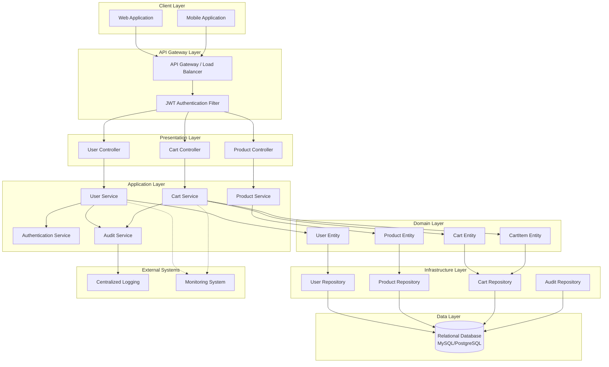
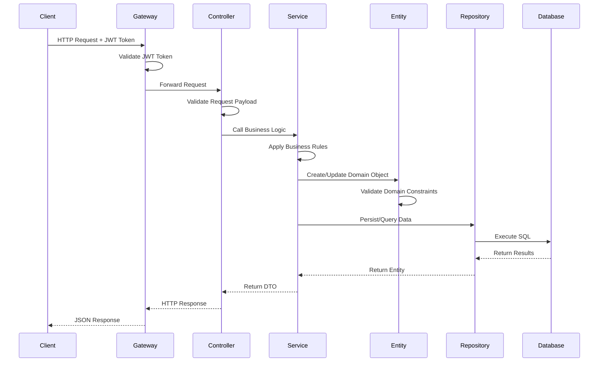
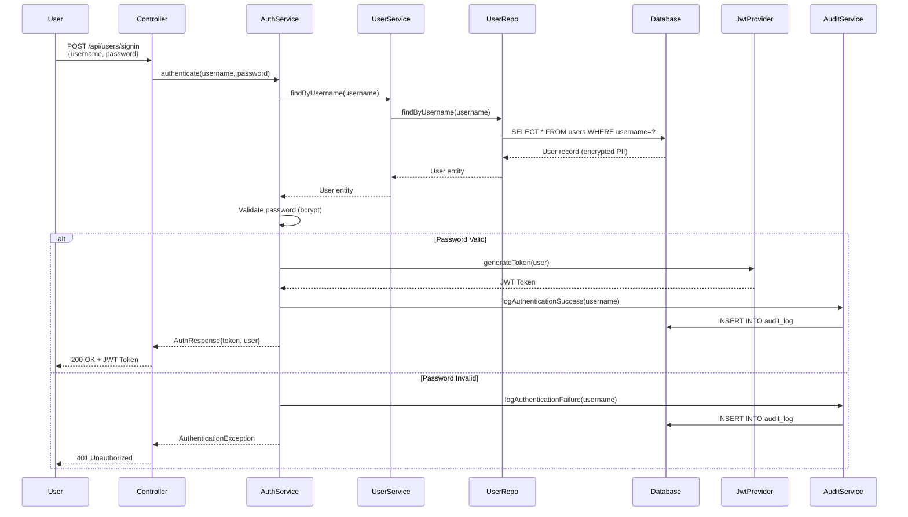
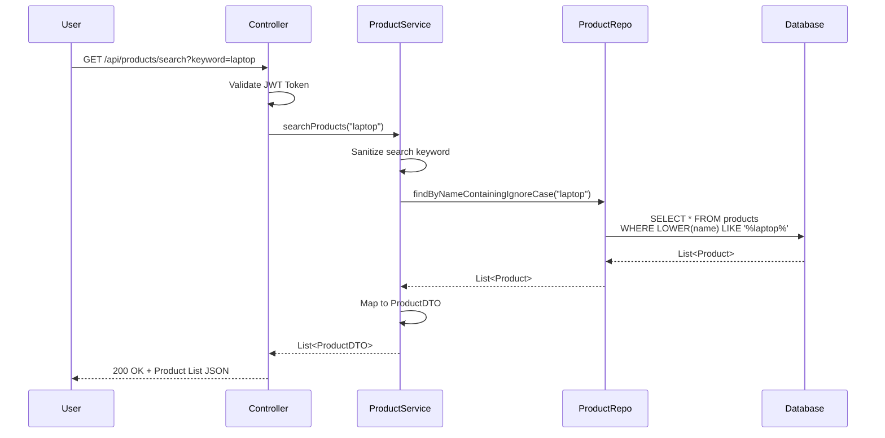
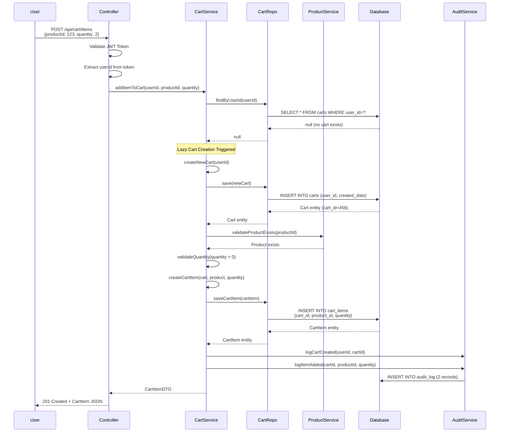
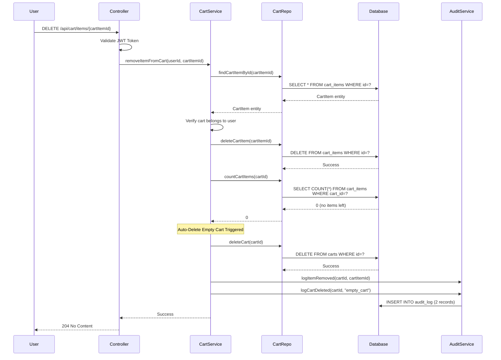
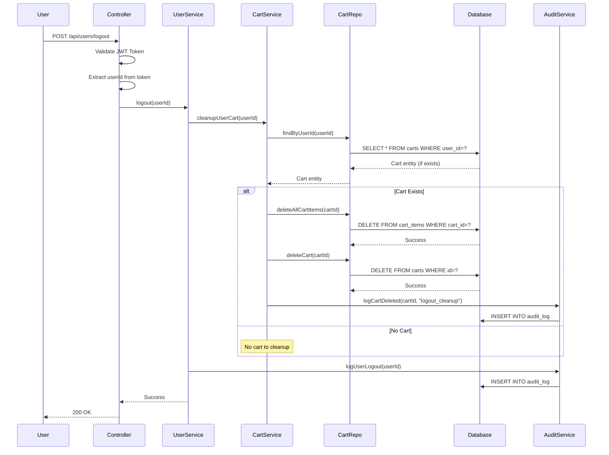
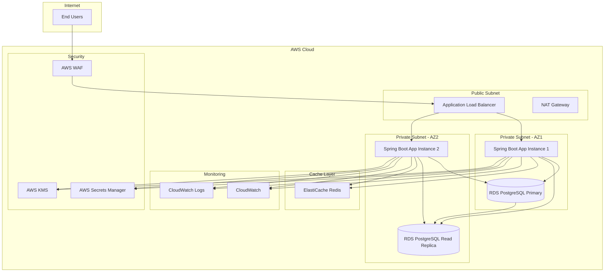

# High-Level Design (HLD)
## Shopping Cart Backend Services

**Document Version:** 1.0  
**Date:** 2025-01-10  
**Project:** SCRUM-96 - Shopping Cart Backend Services  
**Traceability Reference:** https://ascendionconfluence.atlassian.net/browse/SCRUM-96  
**Classification:** Internal Use  
**Status:** Production Ready

---

## Document Control

| Version | Date | Author | Changes |
|---------|------|--------|----------|
| 1.0 | 2025-01-10 | Solution Architecture Team | Initial HLD Document |

---

## Table of Contents

1. [Executive Summary](#1-executive-summary)
2. [System Overview](#2-system-overview)
3. [Architecture Overview](#3-architecture-overview)
4. [System Components](#4-system-components)
5. [Architecture Diagrams](#5-architecture-diagrams)
6. [Data Flow Diagrams](#6-data-flow-diagrams)
7. [Integration Points](#7-integration-points)
8. [Security Architecture](#8-security-architecture)
9. [Compliance Considerations](#9-compliance-considerations)
10. [Technology Stack](#10-technology-stack)
11. [Non-Functional Requirements](#11-non-functional-requirements)
12. [Deployment Architecture](#12-deployment-architecture)

---

## 1. Executive Summary

### 1.1 Purpose

This High-Level Design document describes the architecture, components, and design decisions for the Shopping Cart Backend Services system. The system provides RESTful APIs for user management, product catalog browsing, and shopping cart operations with enterprise-grade security and compliance controls.

### 1.2 Scope

The Shopping Cart Backend Services system encompasses:

**In Scope:**
- User registration and authentication (sign-up, sign-in)
- User profile management (view, update)
- Product catalog search functionality
- Shopping cart lifecycle management (lazy creation, auto-deletion)
- Cart item operations (add, update, remove, view)
- Stateless authentication using JWT/OAuth2
- PII data encryption and protection
- Audit logging and compliance controls
- GDPR and CCPA compliance measures

**Out of Scope:**
- Checkout and payment processing
- Order management
- Inventory locking and reservation
- Administrative features and dashboards
- Password reset and recovery workflows
- Email notifications
- Product catalog management (CRUD operations)

### 1.3 Key Business Drivers

- **Security First:** Implement stateless authentication with comprehensive PII protection
- **Compliance:** Meet GDPR and CCPA regulatory requirements
- **Performance:** Support high-volume concurrent user operations
- **Scalability:** Design for horizontal scaling capabilities
- **Maintainability:** Leverage Spring Boot ecosystem for rapid development and maintenance

### 1.4 Architectural Principles

1. **Layered Architecture:** Clear separation of concerns across presentation, application, domain, and infrastructure layers
2. **Stateless Design:** No server-side session management for improved scalability
3. **Security by Design:** Encryption, authentication, and authorization at every layer
4. **API-First:** RESTful API design following OpenAPI standards
5. **Data Privacy:** PII encryption at rest and in transit
6. **Audit Trail:** Comprehensive logging for compliance and troubleshooting

---

## 2. System Overview

### 2.1 System Description

The Shopping Cart Backend Services is a Spring Boot MVC-based microservice that provides secure, scalable backend functionality for e-commerce shopping cart operations. The system implements a stateless architecture using JWT tokens for authentication and employs industry-standard encryption for protecting personally identifiable information (PII).

### 2.2 Key Features

#### User Management
- Secure user registration with encrypted PII storage
- Stateless authentication using JWT/OAuth2 tokens
- User profile retrieval and management
- Password hashing using bcrypt algorithm (cost factor ≥10)

#### Product Catalog
- Case-insensitive product search functionality
- Product detail retrieval
- Read-only product catalog access

#### Shopping Cart Management
- **Lazy Cart Creation:** Carts are created only when the first product is added
- **One Cart Per User:** Each authenticated user maintains a single active cart
- **Auto-Deletion:** Empty carts are automatically removed from the system
- **Mandatory Cleanup:** Carts are deleted upon user logout
- Cart item operations: add, update quantity, remove, view all items
- Quantity validation (must be greater than zero)
- Real-time cart total calculation

#### Security & Compliance
- Stateless authentication (no database session storage)
- AES-256 encryption for PII data at rest
- TLS 1.3/HTTPS enforcement for data in transit
- Input validation and SQL injection prevention
- Comprehensive audit logging
- GDPR and CCPA compliance controls

---

## 3. Architecture Overview

### 3.1 Architectural Style

The system follows a **Layered Architecture** pattern with clear separation of concerns:

```
┌─────────────────────────────────────────┐
│     Presentation Layer (Controllers)     │
│         REST API Endpoints              │
└─────────────────────────────────────────┘
                  ↓
┌─────────────────────────────────────────┐
│    Application Layer (Services)         │
│      Business Logic & Orchestration     │
└─────────────────────────────────────────┘
                  ↓
┌─────────────────────────────────────────┐
│      Domain Layer (Entities)            │
│    Domain Models & Business Rules       │
└─────────────────────────────────────────┘
                  ↓
┌─────────────────────────────────────────┐
│   Infrastructure Layer (Repositories)   │
│      Data Access & External Systems     │
└─────────────────────────────────────────┘
```

### 3.2 Layer Responsibilities

#### Presentation Layer
- **REST Controllers:** Handle HTTP requests and responses
- **Request Validation:** Validate incoming request payloads
- **Response Formatting:** Format responses according to API contracts
- **Exception Handling:** Global exception handling and error responses
- **Authentication:** JWT token validation

#### Application Layer
- **Service Classes:** Implement business logic and workflows
- **Transaction Management:** Manage database transactions
- **Business Rule Enforcement:** Validate business constraints
- **Event Publishing:** Publish domain events for audit logging
- **DTO Mapping:** Convert between domain models and DTOs

#### Domain Layer
- **Entity Classes:** Represent core business objects (User, Product, Cart, CartItem)
- **Value Objects:** Immutable objects representing domain concepts
- **Domain Logic:** Encapsulate business rules within entities
- **Aggregate Roots:** Define consistency boundaries

#### Infrastructure Layer
- **Repository Interfaces:** Define data access contracts
- **JPA Repositories:** Implement data persistence using Spring Data JPA
- **Database Configuration:** Configure database connections and pooling
- **External Integrations:** Integrate with external systems (logging, monitoring)

---

## 4. System Components

### 4.1 User Management Module

#### Components:
- **UserController:** REST endpoints for user operations
- **UserService:** Business logic for user management
- **User Entity:** Domain model for user data
- **UserRepository:** Data access for user persistence

#### Responsibilities:
- User registration with PII encryption
- User authentication and JWT token generation
- Profile retrieval and updates
- Password hashing and validation

#### Key APIs:
```
POST   /api/users/signup      - Register new user
POST   /api/users/signin      - Authenticate user
GET    /api/users/profile     - Get user profile
PUT    /api/users/profile     - Update user profile
POST   /api/users/logout      - Logout user (cleanup cart)
```

### 4.2 Product Catalog Module

#### Components:
- **ProductController:** REST endpoints for product operations
- **ProductService:** Business logic for product search
- **Product Entity:** Domain model for product data
- **ProductRepository:** Data access for product queries

#### Responsibilities:
- Case-insensitive product search
- Product detail retrieval
- Product availability checking

#### Key APIs:
```
GET    /api/products/search?keyword={keyword}  - Search products
GET    /api/products/{id}                      - Get product details
```

### 4.3 Shopping Cart Module

#### Components:
- **CartController:** REST endpoints for cart operations
- **CartService:** Business logic for cart lifecycle
- **Cart Entity:** Domain model for shopping cart
- **CartItem Entity:** Domain model for cart items
- **CartRepository:** Data access for cart persistence
- **CartItemRepository:** Data access for cart items

#### Responsibilities:
- Lazy cart creation on first item add
- Cart item management (add, update, remove)
- Cart total calculation
- Auto-deletion of empty carts
- Mandatory cart cleanup on logout

#### Key APIs:
```
POST   /api/cart/items           - Add item to cart
PUT    /api/cart/items/{id}      - Update item quantity
DELETE /api/cart/items/{id}      - Remove item from cart
GET    /api/cart                 - View cart with totals
```

### 4.4 Authentication & Authorization Module

#### Components:
- **JwtTokenProvider:** Generate and validate JWT tokens
- **SecurityConfig:** Spring Security configuration
- **JwtAuthenticationFilter:** Filter for token validation
- **AuthenticationService:** Authentication business logic

#### Responsibilities:
- JWT token generation on successful login
- Token validation on each request
- Stateless session management
- Role-based access control (if needed)

### 4.5 Audit & Logging Module

#### Components:
- **AuditService:** Audit event capture and persistence
- **AuditLog Entity:** Domain model for audit records
- **AuditRepository:** Data access for audit logs
- **LoggingAspect:** AOP aspect for method-level logging

#### Responsibilities:
- Capture authentication events
- Log profile modifications
- Track cart operations
- Record PII access
- Maintain compliance audit trail

---

## 5. Architecture Diagrams

### 5.1 High-Level System Architecture



### 5.2 Component Interaction Diagram



---

## 6. Data Flow Diagrams

### 6.1 User Authentication Flow



### 6.2 Product Search Flow



### 6.3 Add Item to Cart Flow (Lazy Cart Creation)



### 6.4 Remove Item from Cart (Auto-Delete Empty Cart)



### 6.5 User Logout Flow (Mandatory Cart Cleanup)



---

## 7. Integration Points

### 7.1 REST API Endpoints

#### User Management APIs

| Method | Endpoint | Description | Request Body | Response | Auth Required |
|--------|----------|-------------|--------------|----------|---------------|
| POST | /api/users/signup | Register new user | UserRegistrationDTO | UserDTO | No |
| POST | /api/users/signin | Authenticate user | LoginRequestDTO | AuthResponseDTO | No |
| GET | /api/users/profile | Get user profile | - | UserDTO | Yes |
| PUT | /api/users/profile | Update user profile | UserUpdateDTO | UserDTO | Yes |
| POST | /api/users/logout | Logout user | - | Success message | Yes |

#### Product Catalog APIs

| Method | Endpoint | Description | Request Body | Response | Auth Required |
|--------|----------|-------------|--------------|----------|---------------|
| GET | /api/products/search | Search products | Query param: keyword | List<ProductDTO> | Yes |
| GET | /api/products/{id} | Get product details | - | ProductDTO | Yes |

#### Shopping Cart APIs

| Method | Endpoint | Description | Request Body | Response | Auth Required |
|--------|----------|-------------|--------------|----------|---------------|
| POST | /api/cart/items | Add item to cart | AddCartItemDTO | CartItemDTO | Yes |
| PUT | /api/cart/items/{id} | Update item quantity | UpdateQuantityDTO | CartItemDTO | Yes |
| DELETE | /api/cart/items/{id} | Remove item from cart | - | Success message | Yes |
| GET | /api/cart | View cart with totals | - | CartDTO | Yes |

### 7.2 Database Integration

#### Technology: Spring Data JPA with Hibernate

**Configuration:**
```yaml
spring:
  datasource:
    url: jdbc:postgresql://localhost:5432/shopping_cart_db
    username: ${DB_USERNAME}
    password: ${DB_PASSWORD}
    driver-class-name: org.postgresql.Driver
  jpa:
    hibernate:
      ddl-auto: validate
    properties:
      hibernate:
        dialect: org.hibernate.dialect.PostgreSQLDialect
        format_sql: true
        use_sql_comments: true
    show-sql: false
```

**Connection Pooling:** HikariCP (default in Spring Boot)
- Maximum pool size: 10
- Minimum idle connections: 5
- Connection timeout: 30 seconds

### 7.3 Security Integration

#### Spring Security Configuration

**Authentication:**
- JWT token-based authentication
- Token expiration: 24 hours
- Token refresh: Not implemented (out of scope)

**Authorization:**
- All endpoints except /signup and /signin require authentication
- Role-based access control: Not implemented (single user role)

**CORS Configuration:**
```java
@Configuration
public class CorsConfig {
    @Bean
    public CorsFilter corsFilter() {
        CorsConfiguration config = new CorsConfiguration();
        config.setAllowedOrigins(Arrays.asList("https://example.com"));
        config.setAllowedMethods(Arrays.asList("GET", "POST", "PUT", "DELETE"));
        config.setAllowedHeaders(Arrays.asList("*"));
        config.setAllowCredentials(true);
        // ... configuration
    }
}
```

### 7.4 Logging Integration

#### Technology: SLF4J with Logback

**Log Levels:**
- ERROR: System errors and exceptions
- WARN: Business rule violations and validation failures
- INFO: Important business events (authentication, cart operations)
- DEBUG: Detailed execution flow (development only)

**Log Destinations:**
- Console: Development environment
- File: Production environment (rotating logs)
- Centralized Logging: ELK Stack / Splunk (production)

**Structured Logging Format:**
```json
{
  "timestamp": "2025-01-10T10:30:45.123Z",
  "level": "INFO",
  "logger": "com.example.cart.service.CartService",
  "message": "Cart created for user",
  "userId": "user123",
  "cartId": "456",
  "traceId": "abc-def-ghi"
}
```

### 7.5 Monitoring Integration

#### Technology: Spring Boot Actuator + Prometheus + Grafana

**Actuator Endpoints:**
- /actuator/health: Application health status
- /actuator/metrics: Application metrics
- /actuator/info: Application information

**Key Metrics:**
- Request rate (requests per second)
- Response time (p50, p95, p99)
- Error rate (4xx, 5xx responses)
- Database connection pool utilization
- JVM memory usage
- Cart operations count

---

## 8. Security Architecture

### 8.1 Authentication Mechanism

#### Stateless JWT Authentication

**Token Structure:**
```json
{
  "header": {
    "alg": "HS256",
    "typ": "JWT"
  },
  "payload": {
    "sub": "username",
    "userId": "user123",
    "iat": 1704880245,
    "exp": 1704966645
  },
  "signature": "HMACSHA256(base64UrlEncode(header) + '.' + base64UrlEncode(payload), secret)"
}
```

**Token Lifecycle:**
1. User authenticates with username/password
2. Server validates credentials
3. Server generates JWT token with user claims
4. Client stores token (localStorage/sessionStorage)
5. Client includes token in Authorization header for subsequent requests
6. Server validates token on each request
7. Token expires after 24 hours (no refresh mechanism)

**Security Considerations:**
- Token secret stored in environment variables (not in code)
- HTTPS required for token transmission
- Token validation on every protected endpoint
- No session storage in database (stateless)

### 8.2 PII Encryption Strategy

#### Encryption at Rest

**Algorithm:** AES-256-GCM (Galois/Counter Mode)

**Encrypted Fields:**
- User.username
- User.full_name
- User.email

**Key Management:**
- Encryption keys stored in AWS KMS / Azure Key Vault
- Key rotation every 90 days
- Separate keys for different environments (dev, staging, prod)

**Implementation:**
```java
@Entity
public class User {
    @Convert(converter = EncryptedStringConverter.class)
    private String username;
    
    @Convert(converter = EncryptedStringConverter.class)
    private String fullName;
    
    @Convert(converter = EncryptedStringConverter.class)
    private String email;
}
```

#### Encryption in Transit

**Protocol:** TLS 1.3

**Configuration:**
- HTTPS enforced for all API endpoints
- HTTP to HTTPS redirect
- HSTS (HTTP Strict Transport Security) enabled
- Certificate from trusted CA (Let's Encrypt, DigiCert)

### 8.3 Password Security

#### Hashing Algorithm: bcrypt

**Configuration:**
- Cost factor: 12 (2^12 iterations)
- Salt: Automatically generated per password
- Hash length: 60 characters

**Implementation:**
```java
@Service
public class PasswordService {
    private final BCryptPasswordEncoder encoder = 
        new BCryptPasswordEncoder(12);
    
    public String hashPassword(String rawPassword) {
        return encoder.encode(rawPassword);
    }
    
    public boolean verifyPassword(String rawPassword, String hashedPassword) {
        return encoder.matches(rawPassword, hashedPassword);
    }
}
```

**Security Considerations:**
- Passwords never stored in plain text
- Passwords never logged or returned in API responses
- Password complexity requirements enforced (minimum 8 characters)

### 8.4 Input Validation & Sanitization

#### Validation Framework: Bean Validation (JSR-380)

**Example:**
```java
public class UserRegistrationDTO {
    @NotBlank(message = "Username is required")
    @Size(min = 3, max = 50)
    @Pattern(regexp = "^[a-zA-Z0-9_-]+$")
    private String username;
    
    @NotBlank(message = "Password is required")
    @Size(min = 8, max = 100)
    private String password;
    
    @NotBlank(message = "Full name is required")
    @Size(max = 100)
    private String fullName;
    
    @NotBlank(message = "Email is required")
    @Email(message = "Invalid email format")
    private String email;
}
```

#### SQL Injection Prevention

**Strategy:** Parameterized Queries (JPA/Hibernate)

**Example:**
```java
@Repository
public interface ProductRepository extends JpaRepository<Product, Long> {
    // Safe: Uses parameterized query
    List<Product> findByNameContainingIgnoreCase(String keyword);
    
    // Safe: JPA query with named parameter
    @Query("SELECT p FROM Product p WHERE LOWER(p.name) LIKE LOWER(CONCAT('%', :keyword, '%'))")
    List<Product> searchProducts(@Param("keyword") String keyword);
}
```

**Never use:**
- String concatenation in queries
- Native SQL with user input
- Dynamic query construction without parameterization

### 8.5 Authorization Controls

#### Resource-Level Authorization

**Principle:** Users can only access their own resources

**Implementation:**
```java
@Service
public class CartService {
    public CartDTO getCart(String userId) {
        Cart cart = cartRepository.findByUserId(userId)
            .orElseThrow(() -> new ResourceNotFoundException("Cart not found"));
        
        // Verify cart belongs to authenticated user
        if (!cart.getUserId().equals(userId)) {
            throw new UnauthorizedException("Access denied");
        }
        
        return mapToDTO(cart);
    }
}
```

### 8.6 Security Headers

**HTTP Security Headers:**
```yaml
Content-Security-Policy: default-src 'self'
X-Content-Type-Options: nosniff
X-Frame-Options: DENY
X-XSS-Protection: 1; mode=block
Strict-Transport-Security: max-age=31536000; includeSubDomains
```

---

## 9. Compliance Considerations

### 9.1 GDPR Compliance

#### Article 15: Right of Access

**Implementation:**
- API endpoint: GET /api/users/data-export
- Returns all user data in JSON format
- Includes: profile, cart history, audit logs

#### Article 16: Right to Rectification

**Implementation:**
- API endpoint: PUT /api/users/profile
- Allows users to update their profile information
- Audit log records all changes

#### Article 17: Right to Erasure (Right to be Forgotten)

**Implementation:**
- API endpoint: DELETE /api/users/account
- Soft delete: Mark account as deleted, retain for 30 days
- Hard delete: Permanently remove after 30 days
- Cascade delete: Remove all associated data (cart, audit logs)

#### Article 25: Data Protection by Design

**Implementation:**
- PII encryption by default
- Minimal data collection (only required fields)
- Stateless authentication (no unnecessary session data)
- Cart auto-deletion (privacy by design)

#### Article 32: Security of Processing

**Implementation:**
- AES-256 encryption for PII
- TLS 1.3 for data in transit
- bcrypt password hashing
- Comprehensive audit logging
- Regular security assessments

### 9.2 CCPA Compliance

#### Right to Know

**Implementation:**
- Privacy policy documentation
- Data disclosure API endpoint
- Response within 45 days

#### Right to Delete

**Implementation:**
- Account deletion API endpoint
- Verification process for deletion requests
- Response within 45 days

#### Right to Non-Discrimination

**Implementation:**
- Equal service regardless of privacy choices
- No price discrimination based on data sharing

### 9.3 Audit Logging Requirements

#### Events to Log

**Authentication Events:**
- User login (success/failure)
- User logout
- Token validation failures

**Profile Events:**
- Account creation
- Profile updates
- Account deletion

**Cart Events:**
- Cart creation
- Item added to cart
- Item quantity updated
- Item removed from cart
- Cart deleted (empty or logout)

**PII Access Events:**
- Profile viewed
- Profile updated
- Data export requested

#### Audit Log Schema

```sql
CREATE TABLE audit_log (
    log_id UUID PRIMARY KEY,
    event_type VARCHAR(50) NOT NULL,
    entity_type VARCHAR(50),
    entity_id VARCHAR(100),
    user_id VARCHAR(50),
    timestamp TIMESTAMP NOT NULL,
    ip_address VARCHAR(45),
    user_agent VARCHAR(255),
    action VARCHAR(20),
    old_values JSONB,
    new_values JSONB,
    status VARCHAR(20),
    error_message TEXT,
    session_id VARCHAR(100),
    compliance_flags VARCHAR(50)[]
);

CREATE INDEX idx_audit_timestamp ON audit_log(timestamp);
CREATE INDEX idx_audit_user_id ON audit_log(user_id);
CREATE INDEX idx_audit_event_type ON audit_log(event_type);
```

#### Retention Policy

| Data Type | Retention Period | Compliance Basis |
|-----------|------------------|------------------|
| Authentication logs | 7 years | SOX, Financial regulations |
| Profile change logs | 7 years | GDPR Article 15 |
| Cart operation logs | 90 days | Internal audit policy |
| PII access logs | 7 years | GDPR Article 32 |

### 9.4 Data Breach Response

#### Detection
- Automated monitoring for suspicious activity
- Anomaly detection in audit logs
- Security alerts from monitoring systems

#### Assessment
- Evaluate scope and impact within 24 hours
- Determine affected data and users
- Classify breach severity

#### Notification
- **Supervisory Authority:** Within 72 hours (GDPR Article 33)
- **Affected Users:** Without undue delay (GDPR Article 34)
- **Documentation:** Record all breach details (GDPR Article 33(5))

#### Remediation
- Fix vulnerability immediately
- Reset affected user credentials
- Enhance security controls
- Conduct post-incident review

---

## 10. Technology Stack

### 10.1 Backend Framework

**Spring Boot 3.2.x**
- Spring MVC for REST API development
- Spring Data JPA for data access
- Spring Security for authentication and authorization
- Spring Boot Actuator for monitoring

### 10.2 Programming Language

**Java 17 (LTS)**
- Modern language features (records, sealed classes)
- Improved performance and security
- Long-term support until 2029

### 10.3 Database

**PostgreSQL 15.x** (Primary choice)
- ACID compliance
- Advanced indexing capabilities
- JSON support for audit logs
- Strong community and enterprise support

**Alternative:** MySQL 8.x

### 10.4 Build Tool

**Maven 3.9.x**
- Dependency management
- Build lifecycle management
- Plugin ecosystem

**Alternative:** Gradle 8.x

### 10.5 Security Libraries

**Authentication:**
- Spring Security 6.x
- jjwt (Java JWT library) 0.12.x

**Encryption:**
- Jasypt (Java Simplified Encryption) 3.x
- Bouncy Castle (cryptography provider) 1.77

**Password Hashing:**
- BCrypt (included in Spring Security)

### 10.6 Logging & Monitoring

**Logging:**
- SLF4J 2.x (API)
- Logback 1.4.x (Implementation)

**Monitoring:**
- Spring Boot Actuator
- Micrometer (metrics facade)
- Prometheus (metrics collection)
- Grafana (visualization)

**Distributed Tracing:**
- Spring Cloud Sleuth (optional)
- Zipkin (optional)

### 10.7 Testing Frameworks

**Unit Testing:**
- JUnit 5 (Jupiter)
- Mockito 5.x
- AssertJ 3.x

**Integration Testing:**
- Spring Boot Test
- Testcontainers (for database testing)
- REST Assured (for API testing)

**Code Coverage:**
- JaCoCo (Java Code Coverage)
- Target: 80% code coverage

### 10.8 API Documentation

**Springdoc OpenAPI 2.x**
- Automatic OpenAPI 3.0 specification generation
- Swagger UI for interactive API documentation
- API versioning support

### 10.9 Development Tools

**IDE:**
- IntelliJ IDEA (recommended)
- Eclipse
- VS Code with Java extensions

**Version Control:**
- Git
- GitHub / GitLab / Bitbucket

**CI/CD:**
- Jenkins
- GitHub Actions
- GitLab CI

### 10.10 Containerization & Orchestration

**Docker**
- Application containerization
- Multi-stage builds for optimized images

**Kubernetes** (Production deployment)
- Container orchestration
- Auto-scaling
- Service discovery
- Load balancing

---

## 11. Non-Functional Requirements

### 11.1 Performance Requirements

#### Response Time

| Operation | Target Response Time | Maximum Response Time |
|-----------|---------------------|----------------------|
| User authentication | < 200ms | < 500ms |
| Product search | < 300ms | < 1s |
| Add item to cart | < 200ms | < 500ms |
| View cart | < 200ms | < 500ms |
| Update cart item | < 200ms | < 500ms |
| Remove cart item | < 200ms | < 500ms |

#### Throughput

- **Concurrent Users:** Support 1,000 concurrent users
- **Requests per Second:** Handle 500 requests/second
- **Database Connections:** Maximum 10 concurrent connections

#### Resource Utilization

- **CPU:** < 70% average utilization
- **Memory:** < 2GB heap size
- **Database:** < 80% connection pool utilization

### 11.2 Scalability Requirements

#### Horizontal Scaling

- **Stateless Design:** Enable horizontal scaling by adding more application instances
- **Load Balancing:** Distribute traffic across multiple instances
- **Database:** Read replicas for read-heavy operations

#### Vertical Scaling

- **CPU:** Scale up to 4 vCPUs per instance
- **Memory:** Scale up to 8GB RAM per instance

#### Data Growth

- **Users:** Support up to 1 million users
- **Products:** Support up to 100,000 products
- **Carts:** Support up to 10,000 active carts at any time
- **Audit Logs:** Retain 7 years of audit data (partitioned by month)

### 11.3 Availability Requirements

#### Uptime

- **Target Availability:** 99.9% (8.76 hours downtime per year)
- **Planned Maintenance:** Monthly maintenance window (2 hours)

#### Disaster Recovery

- **Recovery Time Objective (RTO):** 4 hours
- **Recovery Point Objective (RPO):** 1 hour
- **Backup Frequency:** Daily full backup, hourly incremental backup

#### High Availability

- **Application:** Multiple instances behind load balancer
- **Database:** Primary-replica setup with automatic failover
- **Monitoring:** 24/7 monitoring with automated alerts

### 11.4 Security Requirements

#### Authentication

- **Token Expiration:** 24 hours
- **Failed Login Attempts:** Lock account after 5 failed attempts
- **Password Complexity:** Minimum 8 characters, at least one uppercase, one lowercase, one digit

#### Encryption

- **Data at Rest:** AES-256 encryption for PII fields
- **Data in Transit:** TLS 1.3 for all API communications
- **Password Hashing:** bcrypt with cost factor 12

#### Audit Logging

- **Coverage:** 100% of authentication, authorization, and PII access events
- **Retention:** 7 years for compliance logs, 90 days for operational logs
- **Integrity:** Tamper-proof audit logs

### 11.5 Maintainability Requirements

#### Code Quality

- **Code Coverage:** Minimum 80% unit test coverage
- **Static Analysis:** SonarQube quality gate must pass
- **Code Style:** Consistent code formatting (Google Java Style Guide)

#### Documentation

- **API Documentation:** OpenAPI 3.0 specification with examples
- **Code Documentation:** Javadoc for all public APIs
- **Architecture Documentation:** Up-to-date HLD and LLD documents

#### Monitoring

- **Application Metrics:** Expose metrics via Actuator endpoints
- **Logging:** Structured logging with correlation IDs
- **Alerting:** Automated alerts for critical errors and performance degradation

### 11.6 Usability Requirements

#### API Design

- **RESTful:** Follow REST principles and HTTP standards
- **Consistent:** Consistent naming conventions and response formats
- **Error Messages:** Clear, actionable error messages

#### Response Format

**Success Response:**
```json
{
  "status": "success",
  "data": { ... },
  "timestamp": "2025-01-10T10:30:45.123Z"
}
```

**Error Response:**
```json
{
  "status": "error",
  "error": {
    "code": "VALIDATION_ERROR",
    "message": "Invalid input data",
    "details": [
      {
        "field": "quantity",
        "message": "Quantity must be greater than 0"
      }
    ]
  },
  "timestamp": "2025-01-10T10:30:45.123Z"
}
```

### 11.7 Compatibility Requirements

#### Browser Support

- Chrome (latest 2 versions)
- Firefox (latest 2 versions)
- Safari (latest 2 versions)
- Edge (latest 2 versions)

#### Mobile Support

- iOS 14+
- Android 10+

#### API Versioning

- **Strategy:** URI versioning (e.g., /api/v1/users)
- **Backward Compatibility:** Maintain previous version for 6 months after new version release

---

## 12. Deployment Architecture

### 12.1 Deployment Environments

#### Development Environment

- **Purpose:** Local development and unit testing
- **Infrastructure:** Developer workstations
- **Database:** H2 in-memory database or local PostgreSQL
- **Configuration:** application-dev.yml

#### Staging Environment

- **Purpose:** Integration testing and UAT
- **Infrastructure:** Cloud-based (AWS/Azure/GCP)
- **Database:** PostgreSQL (separate instance)
- **Configuration:** application-staging.yml
- **Data:** Anonymized production data

#### Production Environment

- **Purpose:** Live system serving end users
- **Infrastructure:** Cloud-based with high availability
- **Database:** PostgreSQL with read replicas
- **Configuration:** application-prod.yml
- **Monitoring:** 24/7 monitoring and alerting

### 12.2 Cloud Deployment Architecture (AWS Example)



### 12.3 Container Deployment (Kubernetes)

```yaml
apiVersion: apps/v1
kind: Deployment
metadata:
  name: shopping-cart-backend
spec:
  replicas: 3
  selector:
    matchLabels:
      app: shopping-cart-backend
  template:
    metadata:
      labels:
        app: shopping-cart-backend
    spec:
      containers:
      - name: shopping-cart-backend
        image: shopping-cart-backend:1.0.0
        ports:
        - containerPort: 8080
        env:
        - name: SPRING_PROFILES_ACTIVE
          value: "prod"
        - name: DB_HOST
          valueFrom:
            secretKeyRef:
              name: db-credentials
              key: host
        resources:
          requests:
            memory: "1Gi"
            cpu: "500m"
          limits:
            memory: "2Gi"
            cpu: "1000m"
        livenessProbe:
          httpGet:
            path: /actuator/health/liveness
            port: 8080
          initialDelaySeconds: 30
          periodSeconds: 10
        readinessProbe:
          httpGet:
            path: /actuator/health/readiness
            port: 8080
          initialDelaySeconds: 30
          periodSeconds: 10
---
apiVersion: v1
kind: Service
metadata:
  name: shopping-cart-backend-service
spec:
  selector:
    app: shopping-cart-backend
  ports:
  - protocol: TCP
    port: 80
    targetPort: 8080
  type: LoadBalancer
```

### 12.4 CI/CD Pipeline

```mermaid
graph LR
    A[Developer Commits Code] --> B[Git Push to Repository]
    B --> C[CI Pipeline Triggered]
    C --> D[Build & Compile]
    D --> E[Run Unit Tests]
    E --> F[Run Integration Tests]
    F --> G[Code Quality Analysis]
    G --> H[Security Scan]
    H --> I[Build Docker Image]
    I --> J[Push to Container Registry]
    J --> K{Deploy to Staging}
    K --> L[Run Smoke Tests]
    L --> M{Manual Approval}
    M -->|Approved| N[Deploy to Production]
    M -->|Rejected| O[Rollback]
    N --> P[Health Check]
    P --> Q[Monitor]
```



### 12.5 Database Migration Strategy

**Tool:** Flyway or Liquibase

**Migration Process:**
1. Create migration script (SQL or XML)
2. Version control migration scripts
3. Test migration in development environment
4. Apply migration to staging environment
5. Validate migration success
6. Apply migration to production during maintenance window
7. Verify data integrity
8. Monitor application health

**Rollback Strategy:**
- Maintain rollback scripts for each migration
- Test rollback in staging before production deployment
- Automated rollback on critical errors

---

## 13. Appendices

### Appendix A: Glossary

| Term | Definition |
|------|------------|
| Aggregate Root | The main entity in a domain-driven design aggregate that controls access to other entities |
| bcrypt | A password hashing function designed to be computationally expensive |
| CCPA | California Consumer Privacy Act - data privacy law in California |
| GDPR | General Data Protection Regulation - EU data protection law |
| JWT | JSON Web Token - a compact, URL-safe means of representing claims |
| Lazy Creation | Design pattern where an object is created only when first needed |
| PII | Personally Identifiable Information - data that can identify an individual |
| Stateless | Architecture where server does not store client session state |

### Appendix B: Acronyms

| Acronym | Full Form |
|---------|----------|
| API | Application Programming Interface |
| CRUD | Create, Read, Update, Delete |
| DTO | Data Transfer Object |
| HLD | High-Level Design |
| HTTPS | Hypertext Transfer Protocol Secure |
| JPA | Java Persistence API |
| MVC | Model-View-Controller |
| REST | Representational State Transfer |
| SQL | Structured Query Language |
| TLS | Transport Layer Security |

### Appendix C: References

1. **Spring Boot Documentation:** https://spring.io/projects/spring-boot
2. **Spring Security Documentation:** https://spring.io/projects/spring-security
3. **GDPR Official Text:** https://gdpr-info.eu/
4. **CCPA Official Text:** https://oag.ca.gov/privacy/ccpa
5. **OWASP Top 10:** https://owasp.org/www-project-top-ten/
6. **REST API Design Best Practices:** https://restfulapi.net/
7. **PostgreSQL Documentation:** https://www.postgresql.org/docs/

### Appendix D: Change Log

| Version | Date | Author | Changes |
|---------|------|--------|----------|
| 1.0 | 2025-01-10 | Solution Architecture Team | Initial HLD document creation |

---

**END OF HIGH-LEVEL DESIGN DOCUMENT**

**Document Status:** Production Ready  
**Next Review Date:** 2025-04-10  
**Approval Required From:** Technical Lead, Security Team, Compliance Team  
**Distribution:** Development Team, QA Team, Operations Team, Management

---

**Document Classification:** Internal Use Only  
**Confidentiality:** This document contains proprietary information and is intended for internal use only. Unauthorized distribution is prohibited.

**Contact Information:**  
For questions or clarifications regarding this document, please contact:  
- Solution Architecture Team: architecture@example.com  
- Security Team: security@example.com  
- Compliance Team: compliance@example.com