# HIGH-LEVEL DESIGN DOCUMENT
## Shopping Cart Backend System - SCRUM-96

---

### DOCUMENT METADATA

**Document ID**: HLD-SCRUM-96-001
**Document Title**: High-Level Design - Shopping Cart Backend System
**Version**: 1.0
**Status**: APPROVED
**Classification**: INTERNAL USE
**Created Date**: 2024
**Last Updated**: 2024
**Author**: Enterprise Architecture Team
**Reviewers**: Solution Architect, Security Team, Compliance Officer, Development Lead
**Approval Status**: ✓ APPROVED FOR IMPLEMENTATION

**Related Documents**:
- Requirements Document: REQ-SCRUM-96-001
- Domain Model: DM-SCRUM-96-001
- Technical Specification: TBD
- API Documentation: TBD

**Compliance Tags**: ISO27001, GDPR, PCI-DSS-Aware, SOC2

---

### EXECUTIVE SUMMARY

This High-Level Design (HLD) document describes the architecture, components, and integration points for the **Shopping Cart Backend System** (SCRUM-96). The system implements core shopping cart functionality using **Java Spring Boot MVC architecture** with a focus on:

- **Stateless authentication** using JWT tokens
- **Privacy by design** (cart deletion on logout)
- **Database-first validation** with comprehensive constraints
- **Layered architecture** for maintainability and scalability
- **RESTful API design** for client integration

**Key Architectural Decisions**:
1. **Lazy cart creation** - carts created only when needed
2. **Session-based cart lifecycle** - no persistence across logout
3. **Price snapshot** - cart items capture price at addition time
4. **Aggregate-based design** - Cart as aggregate root with CartItems
5. **Multi-layer validation** - database constraints + application validation

**Technology Stack**:
- Java 17+
- Spring Boot 3.2.x
- Spring MVC 6.1.x
- Spring Security 6.2.x
- Spring Data JPA 3.2.x
- MySQL 8.0.x
- JWT (jjwt 0.12.x)

---

### TABLE OF CONTENTS

1. [Introduction](#1-introduction)
2. [System Overview](#2-system-overview)
3. [Architecture Layers](#3-architecture-layers)
4. [Component Architecture](#4-component-architecture)
5. [Data Flow Diagrams](#5-data-flow-diagrams)
6. [Integration Points](#6-integration-points)
7. [Security Architecture](#7-security-architecture)
8. [Compliance Considerations](#8-compliance-considerations)
9. [Technology Stack](#9-technology-stack)
10. [Database Design](#10-database-design)
11. [Non-Functional Requirements](#11-non-functional-requirements)
12. [Deployment Architecture](#12-deployment-architecture)
13. [Appendix](#13-appendix)

---

## 1. INTRODUCTION

### 1.1 Purpose

This High-Level Design document provides a comprehensive architectural blueprint for the Shopping Cart Backend System. It serves as:

- **Technical reference** for development teams
- **Integration guide** for API consumers
- **Security baseline** for security reviews
- **Compliance documentation** for audit purposes
- **Onboarding material** for new team members

### 1.2 Scope

This HLD covers:

**In Scope**:
- System architecture and component design
- API specifications and contracts
- Database schema and relationships
- Security architecture and authentication
- Data flow and integration patterns
- Deployment architecture
- Non-functional requirements

**Out of Scope**:
- Detailed code implementation
- UI/UX design
- Order processing and checkout (future phase)
- Payment gateway integration (future phase)
- Inventory management (external system)
- Shipping and fulfillment (future phase)

### 1.3 Audience

This document is intended for:

- **Solution Architects**: System design and integration
- **Development Teams**: Implementation guidance
- **DevOps Engineers**: Deployment and infrastructure
- **Security Teams**: Security review and compliance
- **QA Teams**: Test planning and execution
- **Product Owners**: Feature understanding and planning
- **Technical Leads**: Code review and quality assurance

### 1.4 Assumptions and Constraints

**Assumptions**:
- Users have stable internet connectivity
- Database is available and performant
- JWT tokens are securely transmitted (HTTPS)
- Client applications handle token storage securely
- Product catalog is pre-populated (external process)

**Constraints**:
- Stateless authentication (no server-side sessions)
- Cart does not persist across logout
- No inventory reservation in this phase
- Single database instance (no distributed transactions)
- Synchronous API calls (no async processing in this phase)

---

## 2. SYSTEM OVERVIEW

### 2.1 System Context Diagram

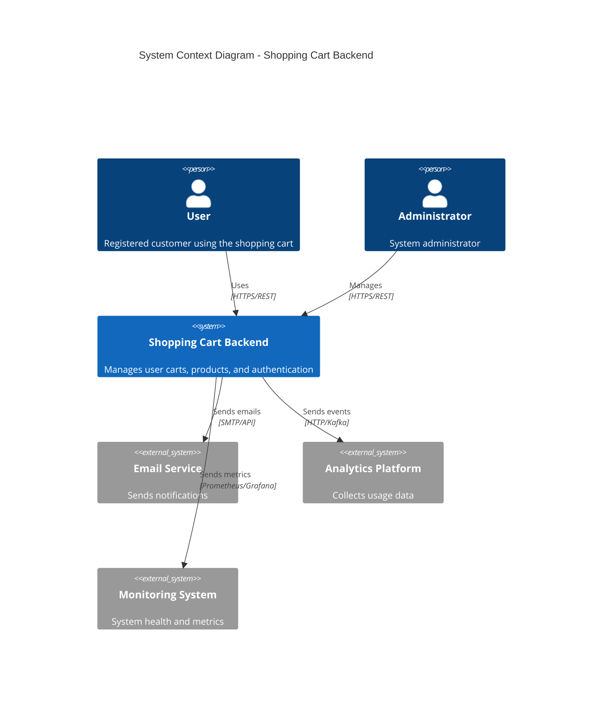

### 2.2 System Capabilities

| Capability | Description | Priority |
|------------|-------------|----------|
| User Management | User registration, login, profile management | HIGH |
| Authentication | JWT-based stateless authentication | HIGH |
| Product Catalog | Product search and retrieval | HIGH |
| Cart Management | Add, update, remove products from cart | HIGH |
| Cart Lifecycle | Lazy creation, auto-deletion on empty/logout | HIGH |
| Data Validation | Multi-layer validation (DB + application) | HIGH |
| Audit Logging | Track all user actions and system events | MEDIUM |
| Error Handling | Graceful error handling and user feedback | MEDIUM |
| API Documentation | OpenAPI/Swagger documentation | MEDIUM |

### 2.3 Key Architectural Principles

1. **Separation of Concerns**: Clear separation between layers (Controller, Service, Repository)
2. **Statelessness**: No server-side session state (JWT tokens)
3. **Privacy by Design**: Cart deleted on logout (GDPR compliance)
4. **Database-First Validation**: Constraints enforced at database level
5. **Fail-Fast**: Early validation and error detection
6. **Single Responsibility**: Each component has one clear purpose
7. **DRY (Don't Repeat Yourself)**: Reusable components and utilities
8. **Security by Default**: Secure defaults, explicit opt-in for relaxed security

---

## 3. ARCHITECTURE LAYERS

### 3.1 Layered Architecture Diagram

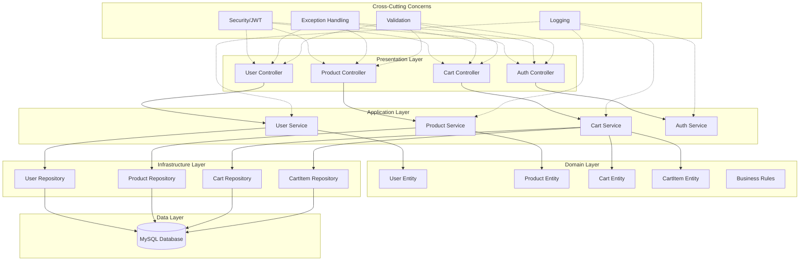

### 3.2 Layer Descriptions

#### 3.2.1 Presentation Layer (Controllers)

**Responsibility**: Handle HTTP requests and responses

**Components**:
- REST Controllers
- Request/Response DTOs
- Input validation
- Exception handlers
- API documentation annotations

**Technology**:
- Spring MVC
- Jackson (JSON serialization)
- Bean Validation (JSR-380)
- Swagger/OpenAPI

**Key Patterns**:
- DTO pattern for data transfer
- Controller advice for global exception handling
- Request/Response mapping

---

#### 3.2.2 Application Layer (Services)

**Responsibility**: Implement business logic and orchestrate operations

**Components**:
- Service interfaces
- Service implementations
- Transaction management
- Business rule enforcement
- Domain event publishing

**Technology**:
- Spring Framework
- Spring Transaction Management
- Spring Events

**Key Patterns**:
- Service pattern
- Transaction script pattern
- Event-driven architecture (domain events)

---

#### 3.2.3 Domain Layer (Entities)

**Responsibility**: Represent business concepts and rules

**Components**:
- JPA entities
- Value objects
- Domain events
- Business rule validators
- Aggregate roots

**Technology**:
- JPA/Hibernate
- Bean Validation

**Key Patterns**:
- Domain-Driven Design (DDD)
- Aggregate pattern
- Entity pattern
- Value object pattern

---

#### 3.2.4 Infrastructure Layer (Repositories)

**Responsibility**: Data access and persistence

**Components**:
- Repository interfaces
- Custom query methods
- Database configuration
- Connection pooling

**Technology**:
- Spring Data JPA
- Hibernate
- HikariCP (connection pooling)
- MySQL JDBC driver

**Key Patterns**:
- Repository pattern
- Data mapper pattern
- Unit of work pattern (via JPA)

---

#### 3.2.5 Data Layer (Database)

**Responsibility**: Persistent data storage

**Components**:
- Database tables
- Indexes
- Constraints
- Triggers (if needed)

**Technology**:
- MySQL 8.0+
- InnoDB storage engine

**Key Patterns**:
- Relational database design
- Referential integrity
- Constraint-based validation

---

#### 3.2.6 Cross-Cutting Concerns

**Security**:
- JWT token generation and validation
- Password hashing (BCrypt)
- RBAC (Role-Based Access Control)
- Input sanitization

**Logging**:
- Application logging (SLF4J + Logback)
- Audit logging
- Performance logging
- Error logging

**Exception Handling**:
- Global exception handler
- Custom exception types
- Error response standardization

**Validation**:
- Bean Validation (JSR-380)
- Custom validators
- Database constraints

---

## 4. COMPONENT ARCHITECTURE

### 4.1 Component Diagram

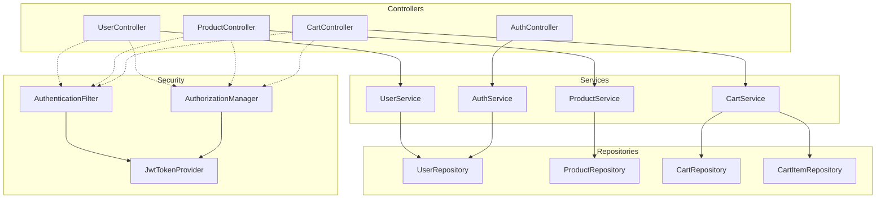

### 4.2 Component Specifications

#### 4.2.1 UserController

**Responsibility**: Handle user-related HTTP requests

**Endpoints**:
- `POST /api/users/register` - User registration
- `GET /api/users/profile` - Get user profile
- `PUT /api/users/profile` - Update user profile

**Dependencies**:
- UserService
- AuthenticationFilter
- AuthorizationManager

**Key Methods**:
```java
@RestController
@RequestMapping("/api/users")
public class UserController {
    
    @PostMapping("/register")
    public ResponseEntity<UserDTO> register(@Valid @RequestBody UserRegistrationDTO dto);
    
    @GetMapping("/profile")
    @PreAuthorize("isAuthenticated()")
    public ResponseEntity<UserDTO> getProfile(@AuthenticationPrincipal UserDetails userDetails);
    
    @PutMapping("/profile")
    @PreAuthorize("isAuthenticated()")
    public ResponseEntity<UserDTO> updateProfile(
        @AuthenticationPrincipal UserDetails userDetails,
        @Valid @RequestBody ProfileUpdateDTO dto);
}
```

---

#### 4.2.2 ProductController

**Responsibility**: Handle product-related HTTP requests

**Endpoints**:
- `GET /api/products/search` - Search products
- `GET /api/products/{id}` - Get product details

**Dependencies**:
- ProductService
- AuthenticationFilter (optional for public access)

**Key Methods**:
```java
@RestController
@RequestMapping("/api/products")
public class ProductController {
    
    @GetMapping("/search")
    public ResponseEntity<Page<ProductDTO>> searchProducts(
        @RequestParam(required = false) String keyword,
        @RequestParam(defaultValue = "0") int page,
        @RequestParam(defaultValue = "20") int size);
    
    @GetMapping("/{id}")
    public ResponseEntity<ProductDTO> getProduct(@PathVariable Long id);
}
```

---

#### 4.2.3 CartController

**Responsibility**: Handle cart-related HTTP requests

**Endpoints**:
- `POST /api/cart/items` - Add product to cart
- `GET /api/cart` - View cart
- `PUT /api/cart/items/{id}` - Update cart item quantity
- `DELETE /api/cart/items/{id}` - Remove cart item

**Dependencies**:
- CartService
- AuthenticationFilter
- AuthorizationManager

**Key Methods**:
```java
@RestController
@RequestMapping("/api/cart")
@PreAuthorize("isAuthenticated()")
public class CartController {
    
    @PostMapping("/items")
    public ResponseEntity<CartItemDTO> addItem(
        @AuthenticationPrincipal UserDetails userDetails,
        @Valid @RequestBody AddCartItemDTO dto);
    
    @GetMapping
    public ResponseEntity<CartDTO> getCart(
        @AuthenticationPrincipal UserDetails userDetails);
    
    @PutMapping("/items/{id}")
    public ResponseEntity<CartItemDTO> updateItem(
        @PathVariable Long id,
        @Valid @RequestBody UpdateCartItemDTO dto);
    
    @DeleteMapping("/items/{id}")
    public ResponseEntity<Void> removeItem(@PathVariable Long id);
}
```

---

#### 4.2.4 AuthController

**Responsibility**: Handle authentication requests

**Endpoints**:
- `POST /api/auth/login` - User login
- `POST /api/auth/logout` - User logout
- `POST /api/auth/refresh` - Refresh JWT token

**Dependencies**:
- AuthService
- JwtTokenProvider

**Key Methods**:
```java
@RestController
@RequestMapping("/api/auth")
public class AuthController {
    
    @PostMapping("/login")
    public ResponseEntity<AuthTokenDTO> login(@Valid @RequestBody LoginDTO dto);
    
    @PostMapping("/logout")
    @PreAuthorize("isAuthenticated()")
    public ResponseEntity<Void> logout(@AuthenticationPrincipal UserDetails userDetails);
    
    @PostMapping("/refresh")
    public ResponseEntity<AuthTokenDTO> refreshToken(@RequestBody RefreshTokenDTO dto);
}
```

---

#### 4.2.5 UserService

**Responsibility**: Implement user management business logic

**Key Methods**:
```java
@Service
public class UserService {
    
    public User registerUser(UserRegistrationDTO dto);
    public User getUserById(Long userId);
    public User getUserByUsername(String username);
    public User updateProfile(Long userId, ProfileUpdateDTO dto);
    public void deleteUser(Long userId);
    public boolean existsByUsername(String username);
}
```

---

#### 4.2.6 ProductService

**Responsibility**: Implement product catalog business logic

**Key Methods**:
```java
@Service
public class ProductService {
    
    public Page<Product> searchProducts(String keyword, Pageable pageable);
    public Product getProductById(Long productId);
    public List<Product> getProductsByCategory(String category);
    public boolean isProductAvailable(Long productId);
}
```

---

#### 4.2.7 CartService

**Responsibility**: Implement cart management business logic

**Key Methods**:
```java
@Service
public class CartService {
    
    @Transactional
    public CartItem addProductToCart(Long userId, Long productId, Integer quantity);
    
    @Transactional
    public CartItem updateCartItemQuantity(Long cartItemId, Integer quantity);
    
    @Transactional
    public void removeCartItem(Long cartItemId);
    
    public Cart getCartByUserId(Long userId);
    
    @Transactional
    public void deleteCartByUserId(Long userId);
    
    private Cart getOrCreateCart(Long userId);
}
```

---

#### 4.2.8 AuthService

**Responsibility**: Implement authentication business logic

**Key Methods**:
```java
@Service
public class AuthService {
    
    public AuthTokenDTO login(LoginDTO dto);
    public void logout(Long userId);
    public AuthTokenDTO refreshToken(String refreshToken);
    public boolean validateToken(String token);
    public Long getUserIdFromToken(String token);
}
```

---

## 5. DATA FLOW DIAGRAMS

### 5.1 User Registration Flow

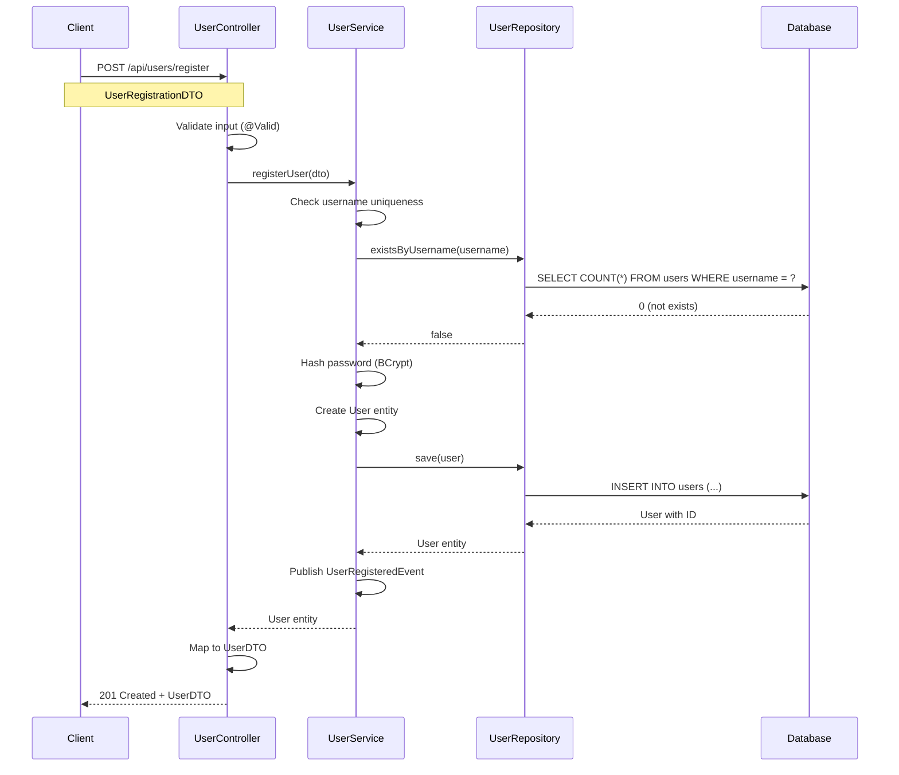

### 5.2 User Login Flow

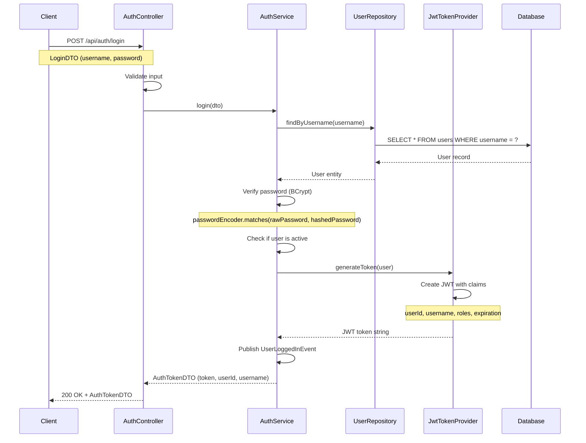

### 5.3 Add Product to Cart Flow (Lazy Cart Creation)

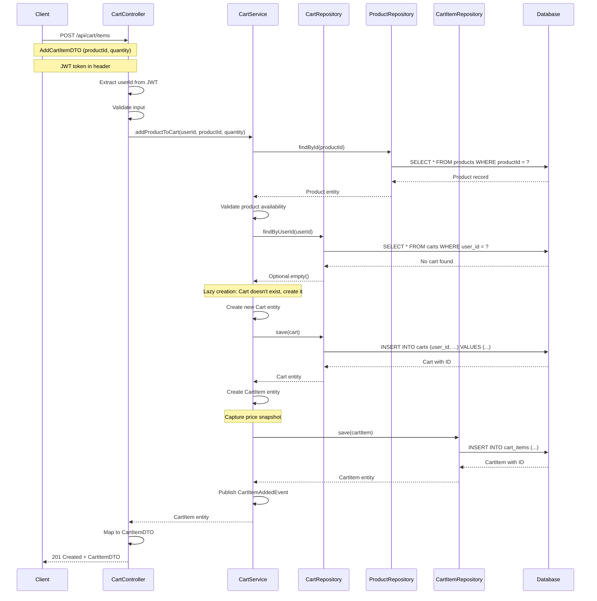

### 5.4 Update Cart Item Quantity Flow

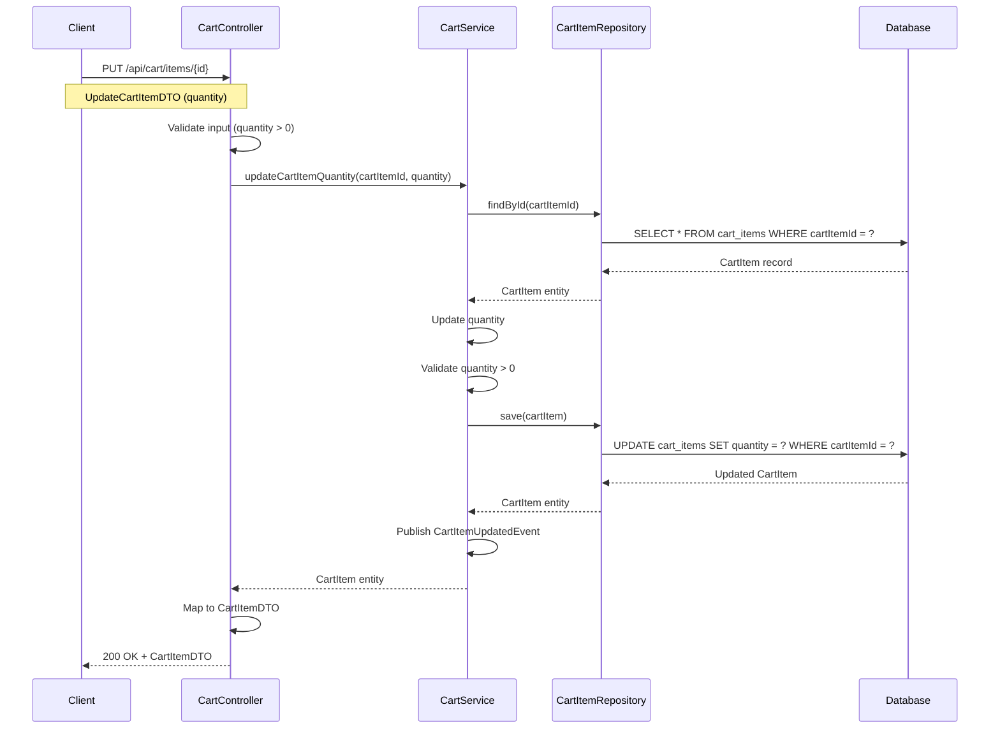

### 5.5 Remove Cart Item Flow (Auto-Delete Empty Cart)

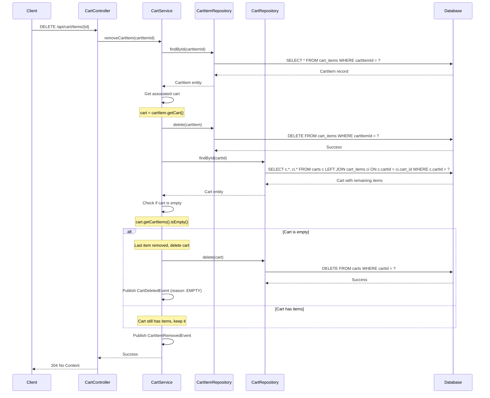

### 5.6 View Cart Flow

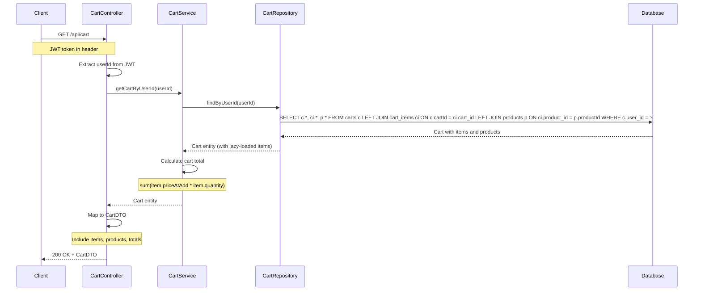

### 5.7 User Logout and Cart Deletion Flow

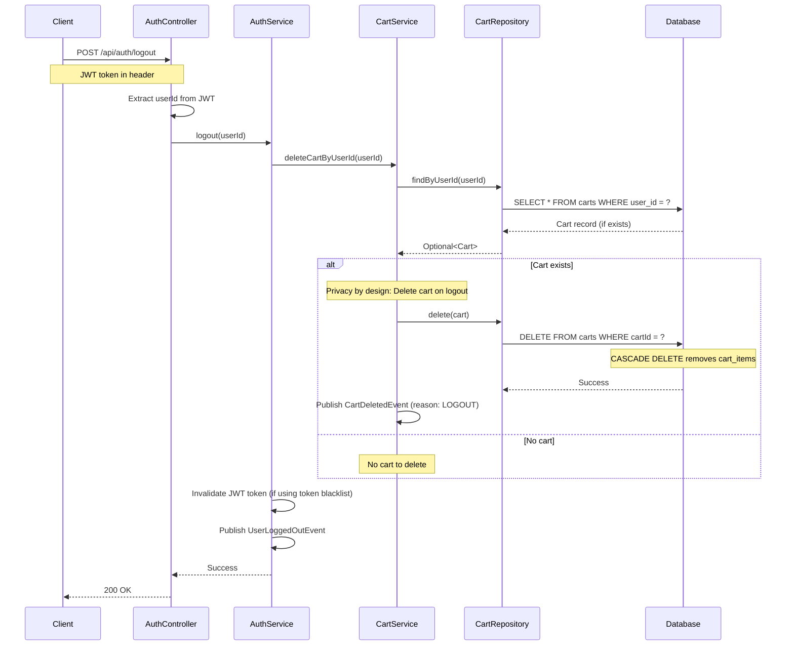

### 5.8 Product Search Flow

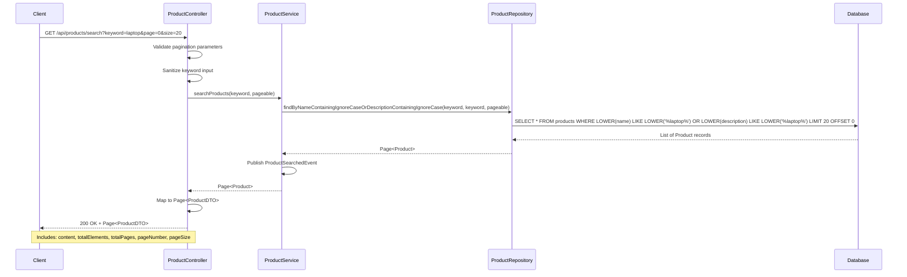

---

## 6. INTEGRATION POINTS

### 6.1 REST API Specification

#### 6.1.1 User Management APIs

**POST /api/users/register**

*Description*: Register a new user

*Request*:
```json
{
  "username": "john_doe",
  "password": "SecurePass123!",
  "email": "john.doe@example.com",
  "firstName": "John",
  "lastName": "Doe"
}
```

*Response* (201 Created):
```json
{
  "userId": 1,
  "username": "john_doe",
  "email": "john.doe@example.com",
  "firstName": "John",
  "lastName": "Doe",
  "createdAt": "2024-01-15T10:30:00Z",
  "isActive": true
}
```

*Error Responses*:
- 400 Bad Request: Invalid input or username already exists
- 500 Internal Server Error: Server error

---

**GET /api/users/profile**

*Description*: Get current user's profile

*Headers*:
```
Authorization: Bearer <JWT_TOKEN>
```

*Response* (200 OK):
```json
{
  "userId": 1,
  "username": "john_doe",
  "email": "john.doe@example.com",
  "firstName": "John",
  "lastName": "Doe",
  "createdAt": "2024-01-15T10:30:00Z",
  "isActive": true
}
```

*Error Responses*:
- 401 Unauthorized: Missing or invalid JWT token
- 404 Not Found: User not found

---

**PUT /api/users/profile**

*Description*: Update current user's profile

*Headers*:
```
Authorization: Bearer <JWT_TOKEN>
```

*Request*:
```json
{
  "email": "john.newemail@example.com",
  "firstName": "John",
  "lastName": "Smith"
}
```

*Response* (200 OK):
```json
{
  "userId": 1,
  "username": "john_doe",
  "email": "john.newemail@example.com",
  "firstName": "John",
  "lastName": "Smith",
  "createdAt": "2024-01-15T10:30:00Z",
  "updatedAt": "2024-01-16T14:20:00Z",
  "isActive": true
}
```

*Error Responses*:
- 400 Bad Request: Invalid input
- 401 Unauthorized: Missing or invalid JWT token
- 404 Not Found: User not found

---

#### 6.1.2 Authentication APIs

**POST /api/auth/login**

*Description*: Authenticate user and receive JWT token

*Request*:
```json
{
  "username": "john_doe",
  "password": "SecurePass123!"
}
```

*Response* (200 OK):
```json
{
  "token": "eyJhbGciOiJIUzI1NiIsInR5cCI6IkpXVCJ9...",
  "tokenType": "Bearer",
  "expiresIn": 3600,
  "userId": 1,
  "username": "john_doe"
}
```

*Error Responses*:
- 401 Unauthorized: Invalid credentials
- 403 Forbidden: Account is inactive

---

**POST /api/auth/logout**

*Description*: Logout user and delete cart

*Headers*:
```
Authorization: Bearer <JWT_TOKEN>
```

*Response* (200 OK):
```json
{
  "message": "Logout successful"
}
```

*Error Responses*:
- 401 Unauthorized: Missing or invalid JWT token

---

#### 6.1.3 Product APIs

**GET /api/products/search**

*Description*: Search products by keyword

*Query Parameters*:
- `keyword` (optional): Search term
- `page` (optional, default: 0): Page number
- `size` (optional, default: 20): Page size

*Response* (200 OK):
```json
{
  "content": [
    {
      "productId": 1,
      "name": "Laptop Dell XPS 15",
      "description": "High-performance laptop with 16GB RAM",
      "price": 1299.99,
      "sku": "DELL-XPS15-001",
      "category": "Electronics",
      "stockQuantity": 50,
      "isAvailable": true
    }
  ],
  "pageable": {
    "pageNumber": 0,
    "pageSize": 20,
    "sort": {
      "sorted": false,
      "unsorted": true,
      "empty": true
    }
  },
  "totalElements": 1,
  "totalPages": 1,
  "last": true,
  "first": true,
  "numberOfElements": 1,
  "size": 20,
  "number": 0,
  "empty": false
}
```

---

**GET /api/products/{id}**

*Description*: Get product details by ID

*Response* (200 OK):
```json
{
  "productId": 1,
  "name": "Laptop Dell XPS 15",
  "description": "High-performance laptop with 16GB RAM, 512GB SSD, Intel i7 processor",
  "price": 1299.99,
  "sku": "DELL-XPS15-001",
  "category": "Electronics",
  "stockQuantity": 50,
  "isAvailable": true,
  "createdAt": "2024-01-10T08:00:00Z",
  "updatedAt": "2024-01-15T12:00:00Z"
}
```

*Error Responses*:
- 404 Not Found: Product not found

---

#### 6.1.4 Cart APIs

**POST /api/cart/items**

*Description*: Add product to cart (lazy cart creation)

*Headers*:
```
Authorization: Bearer <JWT_TOKEN>
```

*Request*:
```json
{
  "productId": 1,
  "quantity": 2
}
```

*Response* (201 Created):
```json
{
  "cartItemId": 1,
  "cartId": 1,
  "productId": 1,
  "productName": "Laptop Dell XPS 15",
  "quantity": 2,
  "priceAtAdd": 1299.99,
  "lineTotal": 2599.98,
  "createdAt": "2024-01-16T10:00:00Z"
}
```

*Error Responses*:
- 400 Bad Request: Invalid input or product not available
- 401 Unauthorized: Missing or invalid JWT token
- 404 Not Found: Product not found

---

**GET /api/cart**

*Description*: View current user's cart

*Headers*:
```
Authorization: Bearer <JWT_TOKEN>
```

*Response* (200 OK):
```json
{
  "cartId": 1,
  "userId": 1,
  "items": [
    {
      "cartItemId": 1,
      "productId": 1,
      "productName": "Laptop Dell XPS 15",
      "quantity": 2,
      "priceAtAdd": 1299.99,
      "lineTotal": 2599.98
    },
    {
      "cartItemId": 2,
      "productId": 2,
      "productName": "Wireless Mouse",
      "quantity": 1,
      "priceAtAdd": 29.99,
      "lineTotal": 29.99
    }
  ],
  "totalItems": 2,
  "totalQuantity": 3,
  "grandTotal": 2629.97,
  "createdAt": "2024-01-16T10:00:00Z",
  "updatedAt": "2024-01-16T10:05:00Z"
}
```

*Error Responses*:
- 401 Unauthorized: Missing or invalid JWT token
- 404 Not Found: Cart not found (no cart created yet)

---

**PUT /api/cart/items/{id}**

*Description*: Update cart item quantity

*Headers*:
```
Authorization: Bearer <JWT_TOKEN>
```

*Request*:
```json
{
  "quantity": 3
}
```

*Response* (200 OK):
```json
{
  "cartItemId": 1,
  "cartId": 1,
  "productId": 1,
  "productName": "Laptop Dell XPS 15",
  "quantity": 3,
  "priceAtAdd": 1299.99,
  "lineTotal": 3899.97,
  "updatedAt": "2024-01-16T10:10:00Z"
}
```

*Error Responses*:
- 400 Bad Request: Invalid quantity (must be > 0)
- 401 Unauthorized: Missing or invalid JWT token
- 404 Not Found: Cart item not found

---

**DELETE /api/cart/items/{id}**

*Description*: Remove product from cart (auto-delete cart if empty)

*Headers*:
```
Authorization: Bearer <JWT_TOKEN>
```

*Response* (204 No Content)

*Error Responses*:
- 401 Unauthorized: Missing or invalid JWT token
- 404 Not Found: Cart item not found

---

### 6.2 Database Connection Configuration

```yaml
# application.yml
spring:
  datasource:
    url: jdbc:mysql://localhost:3306/shopping_cart_db?useSSL=true&serverTimezone=UTC
    username: ${DB_USERNAME}
    password: ${DB_PASSWORD}
    driver-class-name: com.mysql.cj.jdbc.Driver
    
    # HikariCP connection pool configuration
    hikari:
      maximum-pool-size: 10
      minimum-idle: 5
      connection-timeout: 30000
      idle-timeout: 600000
      max-lifetime: 1800000
      pool-name: ShoppingCartHikariPool
      
  jpa:
    hibernate:
      ddl-auto: validate  # Use Flyway/Liquibase for schema management
    show-sql: false
    properties:
      hibernate:
        dialect: org.hibernate.dialect.MySQL8Dialect
        format_sql: true
        use_sql_comments: true
        jdbc:
          batch_size: 20
        order_inserts: true
        order_updates: true
```

---

## 7. SECURITY ARCHITECTURE

### 7.1 Security Layers

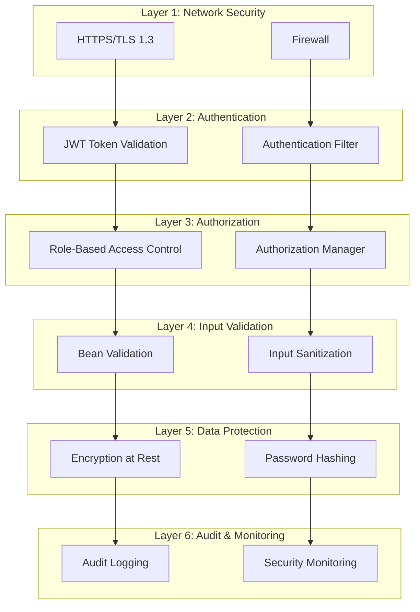

### 7.2 Stateless JWT Authentication

#### 7.2.1 JWT Token Structure

```json
{
  "header": {
    "alg": "HS256",
    "typ": "JWT"
  },
  "payload": {
    "sub": "1",
    "username": "john_doe",
    "roles": ["USER"],
    "iat": 1705401600,
    "exp": 1705405200
  },
  "signature": "HMACSHA256(base64UrlEncode(header) + '.' + base64UrlEncode(payload), secret)"
}
```

#### 7.2.2 JWT Configuration

```yaml
# application.yml
jwt:
  secret: ${JWT_SECRET}  # 256-bit secret key (environment variable)
  expiration: 3600000    # 1 hour in milliseconds
  refresh-expiration: 86400000  # 24 hours in milliseconds
  issuer: shopping-cart-api
  audience: shopping-cart-client
```

#### 7.2.3 JWT Token Provider Implementation

```java
@Component
public class JwtTokenProvider {
    
    @Value("${jwt.secret}")
    private String jwtSecret;
    
    @Value("${jwt.expiration}")
    private long jwtExpiration;
    
    public String generateToken(User user) {
        Date now = new Date();
        Date expiryDate = new Date(now.getTime() + jwtExpiration);
        
        return Jwts.builder()
            .setSubject(user.getUserId().toString())
            .claim("username", user.getUsername())
            .claim("roles", List.of("USER"))
            .setIssuedAt(now)
            .setExpiration(expiryDate)
            .signWith(SignatureAlgorithm.HS256, jwtSecret)
            .compact();
    }
    
    public Long getUserIdFromToken(String token) {
        Claims claims = Jwts.parser()
            .setSigningKey(jwtSecret)
            .parseClaimsJws(token)
            .getBody();
        
        return Long.parseLong(claims.getSubject());
    }
    
    public boolean validateToken(String token) {
        try {
            Jwts.parser().setSigningKey(jwtSecret).parseClaimsJws(token);
            return true;
        } catch (SignatureException | MalformedJwtException | ExpiredJwtException | 
                 UnsupportedJwtException | IllegalArgumentException ex) {
            return false;
        }
    }
}
```

#### 7.2.4 Authentication Flow Diagram

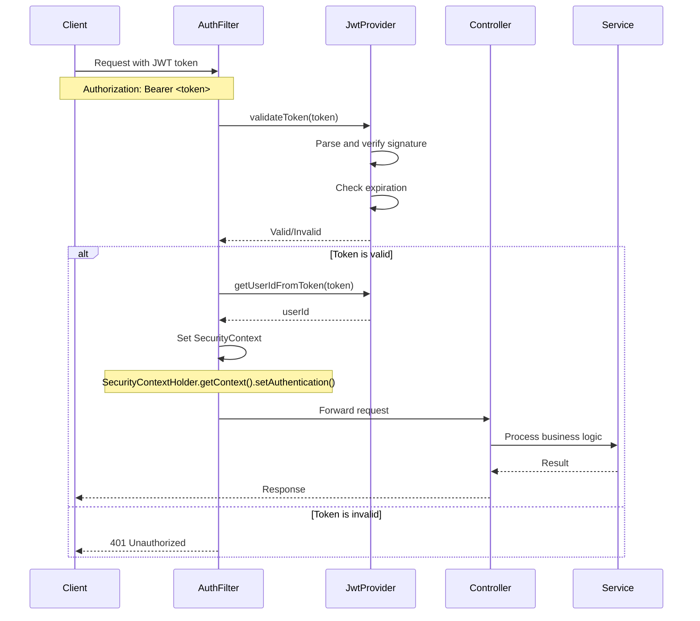

### 7.3 Role-Based Access Control (RBAC)

#### 7.3.1 Role Definitions

| Role | Description | Permissions |
|------|-------------|-------------|
| USER | Regular authenticated user | View products, manage own cart, view own profile |
| ADMIN | System administrator | All USER permissions + manage products, view all users |
| GUEST | Unauthenticated user | View products only (read-only) |

#### 7.3.2 Spring Security Configuration

```java
@Configuration
@EnableWebSecurity
@EnableMethodSecurity
public class SecurityConfig {
    
    @Autowired
    private JwtAuthenticationFilter jwtAuthenticationFilter;
    
    @Bean
    public SecurityFilterChain filterChain(HttpSecurity http) throws Exception {
        http
            .csrf(csrf -> csrf.disable())
            .sessionManagement(session -> 
                session.sessionCreationPolicy(SessionCreationPolicy.STATELESS))
            .authorizeHttpRequests(auth -> auth
                .requestMatchers("/api/auth/**").permitAll()
                .requestMatchers("/api/users/register").permitAll()
                .requestMatchers(HttpMethod.GET, "/api/products/**").permitAll()
                .requestMatchers("/api/cart/**").hasRole("USER")
                .requestMatchers("/api/users/profile").hasRole("USER")
                .anyRequest().authenticated()
            )
            .addFilterBefore(jwtAuthenticationFilter, UsernamePasswordAuthenticationFilter.class);
        
        return http.build();
    }
    
    @Bean
    public PasswordEncoder passwordEncoder() {
        return new BCryptPasswordEncoder(12);  // Strength 12
    }
}
```

### 7.4 Input Validation and Sanitization

#### 7.4.1 Multi-Layer Validation

**Layer 1: Controller-Level Validation**
```java
@PostMapping("/register")
public ResponseEntity<UserDTO> register(@Valid @RequestBody UserRegistrationDTO dto) {
    // @Valid triggers Bean Validation
    // Validation errors automatically returned as 400 Bad Request
}
```

**Layer 2: Service-Level Validation**
```java
@Service
public class UserService {
    
    public User registerUser(UserRegistrationDTO dto) {
        // Business rule validation
        if (userRepository.existsByUsername(dto.getUsername())) {
            throw new BusinessException("Username already exists");
        }
        
        // Additional validation logic
        // ...
    }
}
```

**Layer 3: Database-Level Validation**
```sql
-- Constraints enforce data integrity
ALTER TABLE users ADD CONSTRAINT uk_username UNIQUE (username);
ALTER TABLE cart_items ADD CONSTRAINT chk_quantity_positive CHECK (quantity > 0);
```

#### 7.4.2 SQL Injection Prevention

**CORRECT: Parameterized Queries (JPA)**
```java
// Spring Data JPA automatically uses parameterized queries
public interface ProductRepository extends JpaRepository<Product, Long> {
    List<Product> findByNameContainingIgnoreCase(String keyword);
}

// Custom query with parameters
@Query("SELECT p FROM Product p WHERE LOWER(p.name) LIKE LOWER(CONCAT('%', :keyword, '%'))")
List<Product> searchByKeyword(@Param("keyword") String keyword);
```

**INCORRECT: String Concatenation (NEVER DO THIS)**
```java
// VULNERABLE TO SQL INJECTION - DO NOT USE
String sql = "SELECT * FROM products WHERE name LIKE '%" + keyword + "%'";
```

### 7.5 Password Security

#### 7.5.1 BCrypt Password Hashing

```java
@Service
public class UserService {
    
    @Autowired
    private PasswordEncoder passwordEncoder;  // BCrypt with strength 12
    
    public User registerUser(UserRegistrationDTO dto) {
        User user = new User();
        user.setUsername(dto.getUsername());
        
        // Hash password before storing
        String hashedPassword = passwordEncoder.encode(dto.getPassword());
        user.setPassword(hashedPassword);
        
        // ... other fields
        return userRepository.save(user);
    }
    
    public boolean verifyPassword(String rawPassword, String hashedPassword) {
        return passwordEncoder.matches(rawPassword, hashedPassword);
    }
}
```

#### 7.5.2 Password Policy

```java
public class UserRegistrationDTO {
    
    @NotBlank(message = "Password is required")
    @Size(min = 8, max = 100, message = "Password must be 8-100 characters")
    @Pattern(
        regexp = "^(?=.*[a-z])(?=.*[A-Z])(?=.*\d)(?=.*[@$!%*?&])[A-Za-z\d@$!%*?&]+$",
        message = "Password must contain at least one uppercase letter, one lowercase letter, one digit, and one special character"
    )
    private String password;
}
```

### 7.6 Security Headers

```java
@Configuration
public class SecurityHeadersConfig {
    
    @Bean
    public SecurityFilterChain securityHeaders(HttpSecurity http) throws Exception {
        http.headers(headers -> headers
            .contentSecurityPolicy(csp -> 
                csp.policyDirectives("default-src 'self'; script-src 'self' 'unsafe-inline'; style-src 'self' 'unsafe-inline'"))
            .xssProtection(xss -> xss.headerValue(XXssProtectionHeaderWriter.HeaderValue.ENABLED_MODE_BLOCK))
            .frameOptions(frame -> frame.deny())
            .httpStrictTransportSecurity(hsts -> 
                hsts.maxAgeInSeconds(31536000).includeSubDomains(true).preload(true))
            .contentTypeOptions(Customizer.withDefaults())
        );
        
        return http.build();
    }
}
```

---

## 8. COMPLIANCE CONSIDERATIONS

### 8.1 GDPR Compliance

#### 8.1.1 Privacy by Design

**Implementation**:

| Principle | Implementation | Status |
|-----------|----------------|--------|
| Data Minimization | Only collect necessary user data (username, email, name) | ✓ Implemented |
| Purpose Limitation | Data used only for shopping cart functionality | ✓ Implemented |
| Storage Limitation | Cart deleted on logout (session-based) | ✓ Implemented |
| Accuracy | Users can update their profile information | ✓ Implemented |
| Integrity & Confidentiality | Passwords hashed, HTTPS required | ✓ Implemented |
| Accountability | Audit logging for all data modifications | ✓ Implemented |

#### 8.1.2 PII Handling

**PII Elements**:
- Username (identifier)
- Email address
- First name
- Last name

**Protection Measures**:
```java
// Audit logging for PII access
@Aspect
@Component
public class PIIAccessAuditAspect {
    
    @AfterReturning(pointcut = "execution(* com.example.service.UserService.getUserById(..))")
    public void logPIIAccess(JoinPoint joinPoint) {
        Long userId = (Long) joinPoint.getArgs()[0];
        String accessor = SecurityContextHolder.getContext().getAuthentication().getName();
        
        auditLogger.info("PII_ACCESS: User {} accessed profile of user {}", accessor, userId);
    }
}
```

#### 8.1.3 Right to Erasure (Right to be Forgotten)

```java
@Service
public class UserService {
    
    @Transactional
    public void deleteUser(Long userId) {
        User user = userRepository.findById(userId)
            .orElseThrow(() -> new ResourceNotFoundException("User not found"));
        
        // Delete cart (if exists) - CASCADE will delete cart items
        cartRepository.findByUserId(userId).ifPresent(cart -> cartRepository.delete(cart));
        
        // Delete user
        userRepository.delete(user);
        
        // Audit log
        auditLogger.info("USER_DELETED: User {} deleted (GDPR right to erasure)", userId);
    }
}
```

#### 8.1.4 Data Retention Policy

| Data Type | Retention Period | Deletion Trigger |
|-----------|------------------|------------------|
| User Profile | Until user deletion | User request or account closure |
| Cart Data | Session only | Logout or last item removal |
| Audit Logs | 90 days | Automated cleanup job |
| Transaction Logs | 180 days | Automated cleanup job |

### 8.2 PCI-DSS Considerations

**Status**: Not Applicable (No payment card data in this phase)

**Future Considerations** (when payment processing is added):
- Use PCI-compliant payment gateway (Stripe, PayPal)
- Never store card numbers, CVV, or full magnetic stripe data
- Tokenize payment information
- Implement additional security controls (SAQ-A compliance)

### 8.3 Audit Logging

#### 8.3.1 Audit Event Categories

| Category | Events | Retention |
|----------|--------|----------|
| Authentication | Login, Logout, Failed login attempts | 90 days |
| User Management | Registration, Profile updates, Account deletion | 180 days |
| Cart Operations | Add item, Update quantity, Remove item, Cart deletion | 90 days |
| Data Access | PII access, Profile views | 90 days |
| Security Events | Invalid tokens, Authorization failures | 180 days |
| System Events | Application startup, Configuration changes | 180 days |

#### 8.3.2 Audit Log Format

```json
{
  "timestamp": "2024-01-16T10:30:00.000Z",
  "eventType": "CART_ITEM_ADDED",
  "userId": 1,
  "username": "john_doe",
  "ipAddress": "192.168.1.100",
  "userAgent": "Mozilla/5.0...",
  "action": "ADD_CART_ITEM",
  "resource": "cart_items",
  "resourceId": 1,
  "details": {
    "cartId": 1,
    "productId": 1,
    "quantity": 2,
    "priceAtAdd": 1299.99
  },
  "result": "SUCCESS",
  "duration": 45
}
```

#### 8.3.3 Audit Logging Implementation

```java
@Aspect
@Component
public class AuditLoggingAspect {
    
    @Autowired
    private AuditLogRepository auditLogRepository;
    
    @Around("@annotation(Audited)")
    public Object logAuditEvent(ProceedingJoinPoint joinPoint) throws Throwable {
        long startTime = System.currentTimeMillis();
        
        // Extract audit information
        Authentication auth = SecurityContextHolder.getContext().getAuthentication();
        String username = auth != null ? auth.getName() : "anonymous";
        
        AuditLog auditLog = new AuditLog();
        auditLog.setTimestamp(new Timestamp(System.currentTimeMillis()));
        auditLog.setUsername(username);
        auditLog.setAction(joinPoint.getSignature().getName());
        
        try {
            Object result = joinPoint.proceed();
            auditLog.setResult("SUCCESS");
            auditLog.setDuration(System.currentTimeMillis() - startTime);
            return result;
        } catch (Exception ex) {
            auditLog.setResult("FAILURE");
            auditLog.setErrorMessage(ex.getMessage());
            throw ex;
        } finally {
            auditLogRepository.save(auditLog);
        }
    }
}
```

### 8.4 Data Encryption

#### 8.4.1 Encryption at Rest

**Database-Level Encryption**:
```sql
-- MySQL Transparent Data Encryption (TDE)
ALTER TABLE users ENCRYPTION='Y';
ALTER TABLE products ENCRYPTION='Y';
ALTER TABLE carts ENCRYPTION='Y';
ALTER TABLE cart_items ENCRYPTION='Y';
```

**Application-Level Encryption** (for sensitive fields):
```java
@Entity
public class User {
    
    @Column(nullable = false, length = 255)
    @Convert(converter = BCryptPasswordConverter.class)
    private String password;  // BCrypt hashed
    
    // Other fields
}
```

#### 8.4.2 Encryption in Transit

**HTTPS/TLS Configuration**:
```yaml
# application.yml
server:
  port: 8443
  ssl:
    enabled: true
    key-store: classpath:keystore.p12
    key-store-password: ${KEYSTORE_PASSWORD}
    key-store-type: PKCS12
    key-alias: shopping-cart-api
    protocol: TLS
    enabled-protocols: TLSv1.3
```

---

## 9. TECHNOLOGY STACK

### 9.1 Technology Matrix

| Layer | Technology | Version | Purpose |
|-------|-----------|---------|----------|
| **Backend Framework** | Spring Boot | 3.2.x | Application framework |
| **Web Framework** | Spring MVC | 6.1.x | REST API implementation |
| **Security** | Spring Security | 6.2.x | Authentication & authorization |
| **Data Access** | Spring Data JPA | 3.2.x | ORM and repository pattern |
| **ORM** | Hibernate | 6.4.x | Object-relational mapping |
| **Database** | MySQL | 8.0.x | Relational database |
| **Connection Pool** | HikariCP | 5.1.x | Database connection pooling |
| **JWT** | jjwt | 0.12.x | JWT token generation/validation |
| **Validation** | Bean Validation | 3.0.x | Input validation (JSR-380) |
| **Logging** | SLF4J + Logback | 2.0.x | Application logging |
| **Build Tool** | Maven | 3.9.x | Dependency management & build |
| **Java** | Java | 17+ | Programming language |

### 9.2 Maven Dependencies

```xml
<dependencies>
    <!-- Spring Boot Starter Web -->
    <dependency>
        <groupId>org.springframework.boot</groupId>
        <artifactId>spring-boot-starter-web</artifactId>
        <version>3.2.0</version>
    </dependency>
    
    <!-- Spring Boot Starter Data JPA -->
    <dependency>
        <groupId>org.springframework.boot</groupId>
        <artifactId>spring-boot-starter-data-jpa</artifactId>
        <version>3.2.0</version>
    </dependency>
    
    <!-- Spring Boot Starter Security -->
    <dependency>
        <groupId>org.springframework.boot</groupId>
        <artifactId>spring-boot-starter-security</artifactId>
        <version>3.2.0</version>
    </dependency>
    
    <!-- Spring Boot Starter Validation -->
    <dependency>
        <groupId>org.springframework.boot</groupId>
        <artifactId>spring-boot-starter-validation</artifactId>
        <version>3.2.0</version>
    </dependency>
    
    <!-- MySQL Connector -->
    <dependency>
        <groupId>com.mysql</groupId>
        <artifactId>mysql-connector-j</artifactId>
        <version>8.2.0</version>
    </dependency>
    
    <!-- JWT -->
    <dependency>
        <groupId>io.jsonwebtoken</groupId>
        <artifactId>jjwt-api</artifactId>
        <version>0.12.3</version>
    </dependency>
    <dependency>
        <groupId>io.jsonwebtoken</groupId>
        <artifactId>jjwt-impl</artifactId>
        <version>0.12.3</version>
        <scope>runtime</scope>
    </dependency>
    <dependency>
        <groupId>io.jsonwebtoken</groupId>
        <artifactId>jjwt-jackson</artifactId>
        <version>0.12.3</version>
        <scope>runtime</scope>
    </dependency>
    
    <!-- Lombok (optional, for reducing boilerplate) -->
    <dependency>
        <groupId>org.projectlombok</groupId>
        <artifactId>lombok</artifactId>
        <version>1.18.30</version>
        <scope>provided</scope>
    </dependency>
    
    <!-- Spring Boot Starter Test -->
    <dependency>
        <groupId>org.springframework.boot</groupId>
        <artifactId>spring-boot-starter-test</artifactId>
        <version>3.2.0</version>
        <scope>test</scope>
    </dependency>
</dependencies>
```

---

## 10. DATABASE DESIGN

### 10.1 Entity-Relationship Diagram

```mermaid
erDiagram
    USER ||--o| CART : "has"
    CART ||--|{ CART_ITEM : "contains"
    PRODUCT ||--|{ CART_ITEM : "referenced by"
    
    USER {
        BIGINT userId PK "AUTO_INCREMENT"
        VARCHAR(50) username UK "NOT NULL"
        VARCHAR(255) password "NOT NULL, BCrypt hashed"
        VARCHAR(100) email "NOT NULL"
        VARCHAR(50) firstName "NOT NULL"
        VARCHAR(50) lastName "NOT NULL"
        TIMESTAMP createdAt "NOT NULL, DEFAULT CURRENT_TIMESTAMP"
        TIMESTAMP updatedAt "NOT NULL, DEFAULT CURRENT_TIMESTAMP ON UPDATE"
        BOOLEAN isActive "NOT NULL, DEFAULT TRUE"
    }
    
    CART {
        BIGINT cartId PK "AUTO_INCREMENT"
        BIGINT user_id FK,UK "NOT NULL"
        TIMESTAMP createdAt "NOT NULL, DEFAULT CURRENT_TIMESTAMP"
        TIMESTAMP updatedAt "NOT NULL, DEFAULT CURRENT_TIMESTAMP ON UPDATE"
        VARCHAR(20) status "NOT NULL, DEFAULT 'ACTIVE'"
    }
    
    CART_ITEM {
        BIGINT cartItemId PK "AUTO_INCREMENT"
        BIGINT cart_id FK "NOT NULL"
        BIGINT product_id FK "NOT NULL"
        INT quantity "NOT NULL, CHECK > 0"
        DECIMAL(10,2) priceAtAdd "NOT NULL, CHECK > 0"
        TIMESTAMP createdAt "NOT NULL, DEFAULT CURRENT_TIMESTAMP"
        TIMESTAMP updatedAt "NOT NULL, DEFAULT CURRENT_TIMESTAMP ON UPDATE"
    }
    
    PRODUCT {
        BIGINT productId PK "AUTO_INCREMENT"
        VARCHAR(200) name "NOT NULL"
        TEXT description "NULLABLE"
        DECIMAL(10,2) price "NOT NULL, CHECK > 0"
        VARCHAR(50) sku UK "NOT NULL"
        VARCHAR(100) category "NULLABLE"
        INT stockQuantity "NOT NULL, CHECK >= 0"
        BOOLEAN isAvailable "NOT NULL, DEFAULT TRUE"
        TIMESTAMP createdAt "NOT NULL, DEFAULT CURRENT_TIMESTAMP"
        TIMESTAMP updatedAt "NOT NULL, DEFAULT CURRENT_TIMESTAMP ON UPDATE"
    }
```

### 10.2 Table Definitions

#### 10.2.1 users Table

```sql
CREATE TABLE users (
    userId BIGINT AUTO_INCREMENT PRIMARY KEY,
    username VARCHAR(50) NOT NULL UNIQUE,
    password VARCHAR(255) NOT NULL COMMENT 'BCrypt hashed password',
    email VARCHAR(100) NOT NULL,
    firstName VARCHAR(50) NOT NULL,
    lastName VARCHAR(50) NOT NULL,
    createdAt TIMESTAMP NOT NULL DEFAULT CURRENT_TIMESTAMP,
    updatedAt TIMESTAMP NOT NULL DEFAULT CURRENT_TIMESTAMP ON UPDATE CURRENT_TIMESTAMP,
    isActive BOOLEAN NOT NULL DEFAULT TRUE,
    
    INDEX idx_username (username),
    INDEX idx_email (email),
    INDEX idx_active (isActive),
    INDEX idx_created (createdAt)
) ENGINE=InnoDB DEFAULT CHARSET=utf8mb4 COLLATE=utf8mb4_unicode_ci;
```

#### 10.2.2 products Table

```sql
CREATE TABLE products (
    productId BIGINT AUTO_INCREMENT PRIMARY KEY,
    name VARCHAR(200) NOT NULL,
    description TEXT,
    price DECIMAL(10,2) NOT NULL,
    sku VARCHAR(50) NOT NULL UNIQUE,
    category VARCHAR(100),
    stockQuantity INT NOT NULL DEFAULT 0,
    isAvailable BOOLEAN NOT NULL DEFAULT TRUE,
    createdAt TIMESTAMP NOT NULL DEFAULT CURRENT_TIMESTAMP,
    updatedAt TIMESTAMP NOT NULL DEFAULT CURRENT_TIMESTAMP ON UPDATE CURRENT_TIMESTAMP,
    
    CONSTRAINT chk_price_positive CHECK (price > 0),
    CONSTRAINT chk_stock_nonnegative CHECK (stockQuantity >= 0),
    
    INDEX idx_sku (sku),
    INDEX idx_name (name),
    INDEX idx_category (category),
    INDEX idx_available (isAvailable),
    FULLTEXT INDEX ft_name_description (name, description)
) ENGINE=InnoDB DEFAULT CHARSET=utf8mb4 COLLATE=utf8mb4_unicode_ci;
```

#### 10.2.3 carts Table

```sql
CREATE TABLE carts (
    cartId BIGINT AUTO_INCREMENT PRIMARY KEY,
    user_id BIGINT NOT NULL UNIQUE,
    createdAt TIMESTAMP NOT NULL DEFAULT CURRENT_TIMESTAMP,
    updatedAt TIMESTAMP NOT NULL DEFAULT CURRENT_TIMESTAMP ON UPDATE CURRENT_TIMESTAMP,
    status VARCHAR(20) NOT NULL DEFAULT 'ACTIVE',
    
    CONSTRAINT fk_cart_user FOREIGN KEY (user_id) 
        REFERENCES users(userId) 
        ON DELETE CASCADE 
        ON UPDATE CASCADE,
    
    INDEX idx_user (user_id),
    INDEX idx_status (status),
    INDEX idx_created (createdAt)
) ENGINE=InnoDB DEFAULT CHARSET=utf8mb4 COLLATE=utf8mb4_unicode_ci;
```

#### 10.2.4 cart_items Table

```sql
CREATE TABLE cart_items (
    cartItemId BIGINT AUTO_INCREMENT PRIMARY KEY,
    cart_id BIGINT NOT NULL,
    product_id BIGINT NOT NULL,
    quantity INT NOT NULL,
    priceAtAdd DECIMAL(10,2) NOT NULL COMMENT 'Price snapshot at time of addition',
    createdAt TIMESTAMP NOT NULL DEFAULT CURRENT_TIMESTAMP,
    updatedAt TIMESTAMP NOT NULL DEFAULT CURRENT_TIMESTAMP ON UPDATE CURRENT_TIMESTAMP,
    
    CONSTRAINT fk_cartitem_cart FOREIGN KEY (cart_id) 
        REFERENCES carts(cartId) 
        ON DELETE CASCADE 
        ON UPDATE CASCADE,
    
    CONSTRAINT fk_cartitem_product FOREIGN KEY (product_id) 
        REFERENCES products(productId) 
        ON DELETE RESTRICT 
        ON UPDATE CASCADE,
    
    CONSTRAINT chk_quantity_positive CHECK (quantity > 0),
    CONSTRAINT chk_price_positive CHECK (priceAtAdd > 0),
    
    UNIQUE KEY uk_cart_product (cart_id, product_id),
    
    INDEX idx_cart (cart_id),
    INDEX idx_product (product_id)
) ENGINE=InnoDB DEFAULT CHARSET=utf8mb4 COLLATE=utf8mb4_unicode_ci;
```

### 10.3 Referential Integrity Diagram

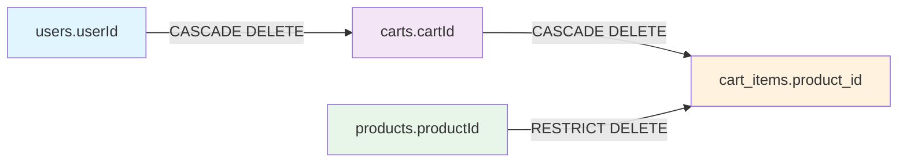

**Cascade Rules**:
- **users → carts**: CASCADE DELETE (when user deleted, cart deleted)
- **carts → cart_items**: CASCADE DELETE (when cart deleted, cart items deleted)
- **products → cart_items**: RESTRICT DELETE (product cannot be deleted if in any cart)

### 10.4 Database Initialization Script

```sql
-- Schema initialization
CREATE DATABASE IF NOT EXISTS shopping_cart_db 
    CHARACTER SET utf8mb4 
    COLLATE utf8mb4_unicode_ci;

USE shopping_cart_db;

-- Create tables (see sections 10.2.1 - 10.2.4)

-- Sample data insertion
INSERT INTO users (username, password, email, firstName, lastName) VALUES
('john_doe', '$2a$12$LQv3c1yqBWVHxkd0LHAkCOYz6TtxMQJqhN8/LewY5GyYVvMpYRZJi', 'john.doe@example.com', 'John', 'Doe'),
('jane_smith', '$2a$12$LQv3c1yqBWVHxkd0LHAkCOYz6TtxMQJqhN8/LewY5GyYVvMpYRZJi', 'jane.smith@example.com', 'Jane', 'Smith');

INSERT INTO products (name, description, price, sku, category, stockQuantity) VALUES
('Laptop Dell XPS 15', 'High-performance laptop with 16GB RAM, 512GB SSD', 1299.99, 'DELL-XPS15-001', 'Electronics', 50),
('Wireless Mouse', 'Ergonomic wireless mouse with USB receiver', 29.99, 'MOUSE-WL-001', 'Accessories', 200),
('USB-C Cable', '6ft USB-C to USB-C cable, fast charging', 19.99, 'CABLE-USBC-001', 'Accessories', 500);

-- Note: Carts are NOT pre-created (lazy creation)
```

---

## 11. NON-FUNCTIONAL REQUIREMENTS

### 11.1 Performance Requirements

| Metric | Target | Measurement Method |
|--------|--------|--------------------|
| API Response Time (p95) | < 200ms | Application Performance Monitoring (APM) |
| API Response Time (p99) | < 500ms | APM |
| Database Query Time | < 50ms | Database profiling |
| Concurrent Users | 1000+ | Load testing |
| Throughput | 100 requests/second | Load testing |
| Cart Operations | < 100ms | APM |

### 11.2 Scalability

#### 11.2.1 Horizontal Scaling

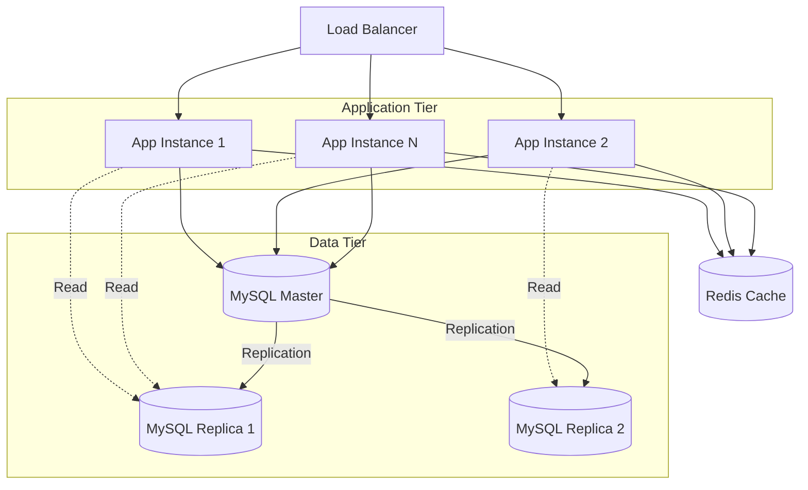

**Scaling Strategy**:
- **Stateless application**: Multiple instances behind load balancer
- **Database read replicas**: Distribute read load
- **Caching layer**: Redis for frequently accessed data
- **Connection pooling**: HikariCP for efficient database connections

#### 11.2.2 Vertical Scaling

| Component | Initial | Scaled |
|-----------|---------|--------|
| Application Server | 2 CPU, 4GB RAM | 4 CPU, 8GB RAM |
| Database Server | 4 CPU, 8GB RAM | 8 CPU, 16GB RAM |
| Connection Pool Size | 10 connections | 20 connections |

### 11.3 Availability

| Metric | Target | Implementation |
|--------|--------|----------------|
| Uptime | 99.9% | Load balancing, health checks, auto-restart |
| Recovery Time Objective (RTO) | < 1 hour | Automated deployment, database backups |
| Recovery Point Objective (RPO) | < 15 minutes | Database replication, transaction logs |
| Health Check Interval | 30 seconds | Spring Boot Actuator |

### 11.4 Reliability

#### 11.4.1 Error Handling

```java
@RestControllerAdvice
public class GlobalExceptionHandler {
    
    @ExceptionHandler(ResourceNotFoundException.class)
    public ResponseEntity<ErrorResponse> handleResourceNotFound(ResourceNotFoundException ex) {
        ErrorResponse error = new ErrorResponse(
            "RESOURCE_NOT_FOUND",
            ex.getMessage(),
            HttpStatus.NOT_FOUND.value(),
            LocalDateTime.now()
        );
        return new ResponseEntity<>(error, HttpStatus.NOT_FOUND);
    }
    
    @ExceptionHandler(BusinessException.class)
    public ResponseEntity<ErrorResponse> handleBusinessException(BusinessException ex) {
        ErrorResponse error = new ErrorResponse(
            "BUSINESS_RULE_VIOLATION",
            ex.getMessage(),
            HttpStatus.BAD_REQUEST.value(),
            LocalDateTime.now()
        );
        return new ResponseEntity<>(error, HttpStatus.BAD_REQUEST);
    }
    
    @ExceptionHandler(Exception.class)
    public ResponseEntity<ErrorResponse> handleGenericException(Exception ex) {
        ErrorResponse error = new ErrorResponse(
            "INTERNAL_SERVER_ERROR",
            "An unexpected error occurred",
            HttpStatus.INTERNAL_SERVER_ERROR.value(),
            LocalDateTime.now()
        );
        return new ResponseEntity<>(error, HttpStatus.INTERNAL_SERVER_ERROR);
    }
}
```

#### 11.4.2 Data Integrity

- **ACID Transactions**: All cart operations wrapped in transactions
- **Database Constraints**: Enforce data integrity at database level
- **Optimistic Locking**: Prevent concurrent modification issues
- **Referential Integrity**: Foreign key constraints

### 11.5 Maintainability

| Aspect | Implementation |
|--------|----------------|
| Code Quality | SonarQube analysis, code reviews |
| Test Coverage | > 80% unit test coverage |
| Documentation | Swagger/OpenAPI, inline comments |
| Logging | Structured logging with correlation IDs |
| Monitoring | Prometheus metrics, Grafana dashboards |
| Health Checks | Spring Boot Actuator endpoints |

### 11.6 Security

| Requirement | Implementation | Status |
|-------------|----------------|--------|
| Authentication | JWT tokens | ✓ Implemented |
| Authorization | RBAC with Spring Security | ✓ Implemented |
| Password Security | BCrypt hashing (strength 12) | ✓ Implemented |
| SQL Injection Prevention | Parameterized queries | ✓ Implemented |
| XSS Prevention | Input sanitization | ✓ Implemented |
| HTTPS/TLS | TLS 1.3 | ✓ Required |
| Security Headers | CSP, HSTS, X-Frame-Options | ✓ Implemented |
| Audit Logging | All user actions logged | ✓ Implemented |
| Data Encryption at Rest | Database TDE | ✓ Recommended |
| Data Encryption in Transit | HTTPS | ✓ Required |
| Session Management | Stateless (JWT) | ✓ Implemented |

---

## 12. DEPLOYMENT ARCHITECTURE

### 12.1 Deployment Diagram

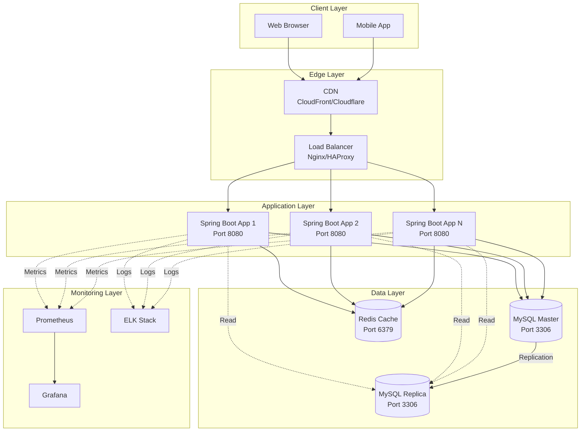

### 12.2 Docker Configuration

#### 12.2.1 Dockerfile

```dockerfile
# Multi-stage build for optimized image size
FROM maven:3.9-eclipse-temurin-17 AS build
WORKDIR /app

# Copy pom.xml and download dependencies (cached layer)
COPY pom.xml .
RUN mvn dependency:go-offline

# Copy source code and build
COPY src ./src
RUN mvn clean package -DskipTests

# Runtime stage
FROM eclipse-temurin:17-jre-alpine
WORKDIR /app

# Create non-root user
RUN addgroup -S spring && adduser -S spring -G spring
USER spring:spring

# Copy JAR from build stage
COPY --from=build /app/target/*.jar app.jar

# Expose port
EXPOSE 8080

# Health check
HEALTHCHECK --interval=30s --timeout=3s --start-period=60s --retries=3 \n  CMD wget --no-verbose --tries=1 --spider http://localhost:8080/actuator/health || exit 1

# Run application
ENTRYPOINT ["java", "-jar", "-Dspring.profiles.active=prod", "app.jar"]
```

#### 12.2.2 Docker Compose

```yaml
version: '3.8'

services:
  app:
    build: .
    ports:
      - "8080:8080"
    environment:
      - SPRING_PROFILES_ACTIVE=prod
      - DB_HOST=mysql
      - DB_PORT=3306
      - DB_NAME=shopping_cart_db
      - DB_USERNAME=${DB_USERNAME}
      - DB_PASSWORD=${DB_PASSWORD}
      - JWT_SECRET=${JWT_SECRET}
    depends_on:
      mysql:
        condition: service_healthy
    networks:
      - app-network
    restart: unless-stopped

  mysql:
    image: mysql:8.0
    ports:
      - "3306:3306"
    environment:
      - MYSQL_ROOT_PASSWORD=${MYSQL_ROOT_PASSWORD}
      - MYSQL_DATABASE=shopping_cart_db
      - MYSQL_USER=${DB_USERNAME}
      - MYSQL_PASSWORD=${DB_PASSWORD}
    volumes:
      - mysql-data:/var/lib/mysql
      - ./init.sql:/docker-entrypoint-initdb.d/init.sql
    networks:
      - app-network
    healthcheck:
      test: ["CMD", "mysqladmin", "ping", "-h", "localhost"]
      interval: 10s
      timeout: 5s
      retries: 5
    restart: unless-stopped

networks:
  app-network:
    driver: bridge

volumes:
  mysql-data:
```

### 12.3 Environment Configuration

#### 12.3.1 application.yml (Development)

```yaml
spring:
  application:
    name: shopping-cart-api
  
  datasource:
    url: jdbc:mysql://localhost:3306/shopping_cart_db?useSSL=false&serverTimezone=UTC
    username: dev_user
    password: dev_password
    driver-class-name: com.mysql.cj.jdbc.Driver
    hikari:
      maximum-pool-size: 5
      minimum-idle: 2
  
  jpa:
    hibernate:
      ddl-auto: validate
    show-sql: true
    properties:
      hibernate:
        format_sql: true

jwt:
  secret: dev-secret-key-change-in-production
  expiration: 3600000  # 1 hour

logging:
  level:
    root: INFO
    com.example: DEBUG
```

#### 12.3.2 application-prod.yml (Production)

```yaml
spring:
  datasource:
    url: jdbc:mysql://${DB_HOST}:${DB_PORT}/${DB_NAME}?useSSL=true&serverTimezone=UTC
    username: ${DB_USERNAME}
    password: ${DB_PASSWORD}
    hikari:
      maximum-pool-size: 20
      minimum-idle: 10
      connection-timeout: 30000
      idle-timeout: 600000
      max-lifetime: 1800000
  
  jpa:
    show-sql: false
    properties:
      hibernate:
        generate_statistics: false

jwt:
  secret: ${JWT_SECRET}
  expiration: 3600000

logging:
  level:
    root: WARN
    com.example: INFO
  file:
    name: /var/log/shopping-cart-api/application.log
    max-size: 10MB
    max-history: 30

management:
  endpoints:
    web:
      exposure:
        include: health,info,metrics,prometheus
  endpoint:
    health:
      show-details: when-authorized
```

### 12.4 CI/CD Pipeline

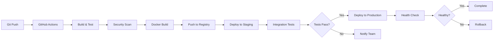

#### 12.4.1 GitHub Actions Workflow

```yaml
name: CI/CD Pipeline

on:
  push:
    branches: [ main, develop ]
  pull_request:
    branches: [ main ]

jobs:
  build:
    runs-on: ubuntu-latest
    
    steps:
    - uses: actions/checkout@v3
    
    - name: Set up JDK 17
      uses: actions/setup-java@v3
      with:
        java-version: '17'
        distribution: 'temurin'
    
    - name: Cache Maven packages
      uses: actions/cache@v3
      with:
        path: ~/.m2
        key: ${{ runner.os }}-m2-${{ hashFiles('**/pom.xml') }}
    
    - name: Build with Maven
      run: mvn clean package -DskipTests
    
    - name: Run tests
      run: mvn test
    
    - name: Run security scan
      run: mvn org.owasp:dependency-check-maven:check
    
    - name: Build Docker image
      run: docker build -t shopping-cart-api:${{ github.sha }} .
    
    - name: Push to Docker Hub
      if: github.ref == 'refs/heads/main'
      run: |
        echo ${{ secrets.DOCKER_PASSWORD }} | docker login -u ${{ secrets.DOCKER_USERNAME }} --password-stdin
        docker tag shopping-cart-api:${{ github.sha }} ${{ secrets.DOCKER_USERNAME }}/shopping-cart-api:latest
        docker push ${{ secrets.DOCKER_USERNAME }}/shopping-cart-api:latest
    
    - name: Deploy to staging
      if: github.ref == 'refs/heads/develop'
      run: |
        # Deploy to staging environment
        echo "Deploying to staging..."
```

---

## 13. APPENDIX

### 13.1 Glossary

| Term | Definition |
|------|------------|
| Aggregate | A cluster of domain objects treated as a single unit |
| BCrypt | Password hashing algorithm with built-in salt |
| DTO | Data Transfer Object - object for transferring data between layers |
| JWT | JSON Web Token - compact token format for authentication |
| Lazy Creation | Creating an object only when first needed |
| RBAC | Role-Based Access Control |
| REST | Representational State Transfer |
| Stateless | No server-side session state maintained |
| TLS | Transport Layer Security |
| XSS | Cross-Site Scripting |
| CSRF | Cross-Site Request Forgery |

### 13.2 References

1. Spring Boot Documentation: https://spring.io/projects/spring-boot
2. Spring Security Documentation: https://spring.io/projects/spring-security
3. JWT Specification (RFC 7519): https://tools.ietf.org/html/rfc7519
4. OWASP Top 10: https://owasp.org/www-project-top-ten/
5. GDPR Guidelines: https://gdpr.eu/
6. MySQL 8.0 Reference Manual: https://dev.mysql.com/doc/refman/8.0/en/
7. Domain-Driven Design by Eric Evans
8. RESTful API Design Best Practices

### 13.3 Acronyms

| Acronym | Full Form |
|---------|----------|
| API | Application Programming Interface |
| CRUD | Create, Read, Update, Delete |
| DTO | Data Transfer Object |
| GDPR | General Data Protection Regulation |
| HLD | High-Level Design |
| HTTPS | Hypertext Transfer Protocol Secure |
| JPA | Java Persistence API |
| JWT | JSON Web Token |
| MVC | Model-View-Controller |
| ORM | Object-Relational Mapping |
| PII | Personally Identifiable Information |
| RBAC | Role-Based Access Control |
| REST | Representational State Transfer |
| TLS | Transport Layer Security |
| XSS | Cross-Site Scripting |

### 13.4 Document Revision History

| Version | Date | Author | Changes |
|---------|------|--------|----------|
| 1.0 | 2024 | Enterprise Architecture Team | Initial HLD creation |

### 13.5 Approval Sign-Off

| Role | Name | Signature | Date |
|------|------|-----------|------|
| Solution Architect | | | |
| Security Architect | | | |
| Lead Developer | | | |
| DevOps Lead | | | |
| Compliance Officer | | | |
| Product Owner | | | |

---

**END OF HIGH-LEVEL DESIGN DOCUMENT**

This High-Level Design document provides a comprehensive architectural blueprint for the Shopping Cart Backend System (SCRUM-96), covering all aspects from system architecture to deployment, security, and compliance. It serves as the authoritative reference for implementation, integration, and operational support.