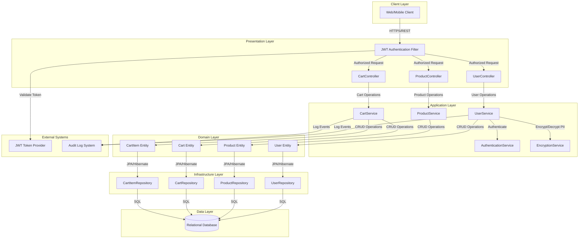
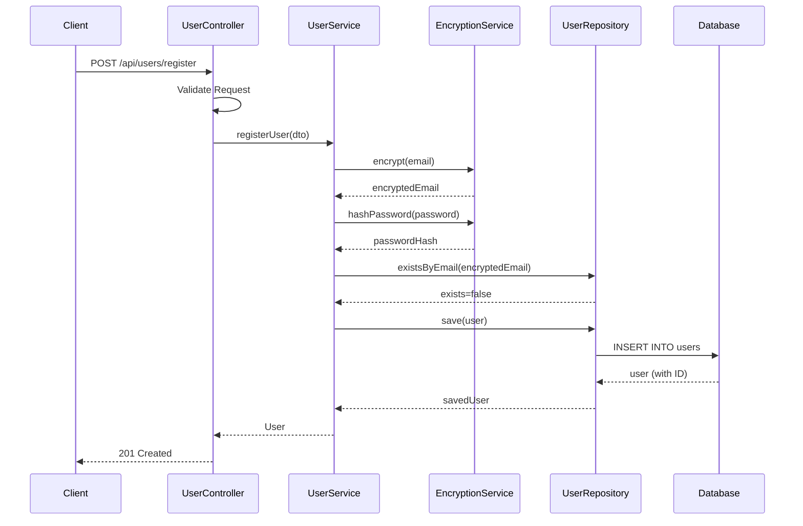
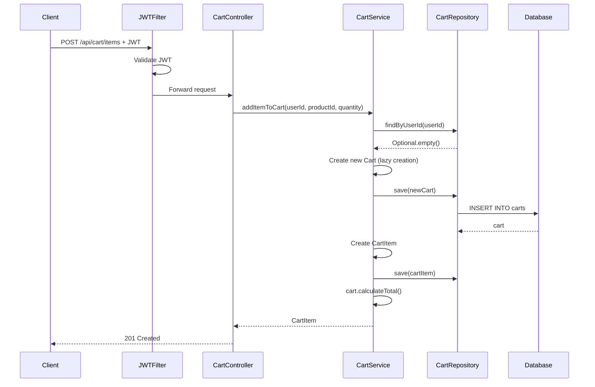

# High-Level Design (HLD)
## Shopping Cart Backend System

**Document Version:** 1.0  
**Date:** 2024  
**Project:** SCRUM-96 - Shopping Cart Backend System  
**Status:** Draft  
**Classification:** Internal  

---

## Document Control

| Version | Date | Author | Changes |
|---------|------|--------|----------|
| 1.0 | 2024 | Enterprise Architecture Team | Initial HLD |

---

## Table of Contents

1. [Executive Summary](#1-executive-summary)
2. [Architecture Overview](#2-architecture-overview)
3. [Architecture Diagram](#3-architecture-diagram)
4. [Component Descriptions](#4-component-descriptions)
5. [Data Flow Diagrams](#5-data-flow-diagrams)
6. [Integration Points](#6-integration-points)
7. [Security Architecture](#7-security-architecture)
8. [Compliance Considerations](#8-compliance-considerations)
9. [Technology Stack](#9-technology-stack)
10. [Deployment Architecture](#10-deployment-architecture)
11. [Scalability and Performance](#11-scalability-and-performance)
12. [Error Handling and Resilience](#12-error-handling-and-resilience)
13. [Appendices](#13-appendices)

---

## 1. EXECUTIVE SUMMARY

### 1.1 Purpose

This High-Level Design document describes the architecture for the Shopping Cart Backend System, a Spring Boot MVC-based microservice that enables authenticated users to manage shopping carts in an e-commerce platform. The system provides RESTful APIs for user registration, authentication, product browsing, and cart management operations.

### 1.2 Scope

**In Scope:**
- User registration and authentication (JWT-based)
- Product catalog browsing
- Shopping cart management (add, update, remove items)
- Cart lifecycle management (lazy creation, auto-cleanup)
- PII data protection (email encryption)
- Role-Based Access Control (RBAC)
- Audit trail for compliance

**Out of Scope:**
- Checkout and payment processing
- Inventory management and locking
- Order fulfillment
- Administrative user management
- Password change functionality
- Product catalog administration

### 1.3 Key Architectural Decisions

| Decision | Rationale |
|----------|-----------|  
| Spring Boot MVC Architecture | Industry-standard framework with robust ecosystem, excellent for RESTful services |
| Layered Architecture Pattern | Clear separation of concerns, maintainability, testability |
| JWT Stateless Authentication | Scalability, no server-side session management, microservice-friendly |
| Lazy Cart Creation | Resource optimization, improved user experience |
| Email Encryption at Rest | PII protection, regulatory compliance |
| Auto-cleanup of Empty Carts | Database optimization, resource management |

---

## 2. ARCHITECTURE OVERVIEW

The Shopping Cart Backend System follows a **Layered Architecture** pattern combined with **Domain-Driven Design (DDD)** principles, organized into three bounded contexts:

1. **User Management Context** - User registration, authentication, and profile management
2. **Product Catalog Context** - Product information and browsing
3. **Shopping Cart Context** - Cart lifecycle and cart item operations

### Layer Responsibilities

**Presentation Layer (REST Controllers):**
- Expose RESTful APIs
- Request validation and sanitization
- HTTP-to-domain model transformation
- JWT token validation

**Application Layer (Service Layer):**
- Business logic orchestration
- Transaction management
- Cross-cutting concerns (logging, monitoring)
- Business rule enforcement

**Domain Layer (Entities):**
- Core business entities and value objects
- Domain logic and invariants
- Entity relationships and lifecycle

**Infrastructure Layer (Repositories, Database):**
- Data persistence
- Database access via JPA/Hibernate
- External service integration

---

## 3. ARCHITECTURE DIAGRAM

### System Architecture Diagram



---

## 4. COMPONENT DESCRIPTIONS

### 4.1 Presentation Layer Components

#### UserController
- **Endpoints:** `/api/users/register`, `/api/users/login`, `/api/users/logout`, `/api/users/profile`
- **Responsibilities:** User registration, authentication, profile management
- **Key Features:** Request validation, JWT token generation, cart cleanup on logout

#### ProductController
- **Endpoints:** `/api/products`, `/api/products/{id}`, `/api/products/search`
- **Responsibilities:** Product catalog browsing
- **Key Features:** Pagination, search, public access

#### CartController
- **Endpoints:** `/api/cart`, `/api/cart/items`, `/api/cart/items/{itemId}`
- **Responsibilities:** Shopping cart management
- **Key Features:** Lazy cart creation, RBAC enforcement, optimistic locking

### 4.2 Application Layer Components

#### UserService
- **Methods:** `registerUser()`, `authenticateUser()`, `logoutUser()`, `getUserProfile()`
- **Business Rules:** Email uniqueness, password strength, email encryption, cart cleanup

#### CartService
- **Methods:** `getOrCreateCart()`, `addItemToCart()`, `updateCartItemQuantity()`, `removeCartItem()`, `clearCart()`
- **Business Rules:** Lazy cart creation, auto-delete empty carts, quantity validation, duplicate product handling

#### AuthenticationService
- **Methods:** `generateJwtToken()`, `validateJwtToken()`, `getUserFromToken()`
- **Business Rules:** JWT token generation/validation, stateless authentication

### 4.3 Domain Layer Entities

#### User Entity
- **Attributes:** id, email (encrypted), passwordHash, role, timestamps
- **Relationships:** One-to-One with Cart (optional)
- **Invariants:** Email uniqueness, encrypted storage

#### Cart Entity
- **Attributes:** id, userId, items, totalAmount, version (optimistic locking)
- **Relationships:** One-to-One with User, One-to-Many with CartItem
- **Business Methods:** `calculateTotal()`, `isEmpty()`

#### CartItem Entity
- **Attributes:** id, cartId, productId, quantity, priceAtAddition, subtotal
- **Relationships:** Many-to-One with Cart and Product
- **Business Methods:** `updateQuantity()`, `calculateSubtotal()`

---

## 5. DATA FLOW DIAGRAMS

### 5.1 User Registration Flow



### 5.2 Add Item to Cart Flow



---

## 6. INTEGRATION POINTS

### 6.1 Database Integration
- **Technology:** JPA/Hibernate with Spring Data JPA
- **Database:** PostgreSQL (production), H2 (development)
- **Connection Pool:** HikariCP (max 20 connections)
- **Security:** SSL/TLS encryption, credentials in environment variables

### 6.2 JWT Token Provider
- **Library:** jjwt (Java JWT)
- **Algorithm:** HMAC SHA-256
- **Token Expiration:** 24 hours
- **Security:** 256-bit secret key, HTTPS-only transmission

### 6.3 Encryption Service
- **Algorithm:** AES-256-GCM for PII data
- **Key Management:** External KMS with rotation support
- **Password Hashing:** BCrypt with work factor 12

### 6.4 Audit Log Integration
- **Events:** User registration, login/logout, cart operations
- **Format:** Structured JSON logs
- **Implementation:** Spring AOP for cross-cutting concerns
- **Storage:** Centralized logging system (ELK, Splunk)

---

## 7. SECURITY ARCHITECTURE

### 7.1 Authentication
- **Method:** JWT-based stateless authentication
- **Token Structure:** Subject (userId), email, role, expiration
- **Password Security:** BCrypt hashing with work factor 12
- **Password Policy:** Min 8 chars, uppercase, lowercase, digit, special character

### 7.2 Authorization
- **Model:** Role-Based Access Control (RBAC)
- **Roles:** CUSTOMER, ADMIN (future)
- **Enforcement:** Method-level security with @PreAuthorize
- **Resource-Level:** Users can only access their own resources

### 7.3 Data Protection
- **PII Encryption:** AES-256-GCM for email addresses
- **Data in Transit:** TLS 1.2+ for all communications
- **Data at Rest:** Database-level encryption (TDE)
- **Key Management:** External KMS with 90-day rotation

### 7.4 Security Controls
- **Input Validation:** Bean Validation (JSR-380)
- **SQL Injection Prevention:** Parameterized queries via JPA
- **XSS Prevention:** Output encoding, Content Security Policy
- **Security Headers:** X-Content-Type-Options, X-Frame-Options, HSTS
- **Rate Limiting:** 100 requests/minute per IP
- **Audit Logging:** All security events logged

---

## 8. COMPLIANCE CONSIDERATIONS

### 8.1 Regulatory Framework
- **GDPR:** EU data protection regulation
- **CCPA:** California privacy rights
- **SOC 2 Type II:** Security and confidentiality controls

### 8.2 PII Handling
- **PII Data:** Email addresses (encrypted at rest)
- **Access Control:** Role-based, all access logged
- **Data Minimization:** Only necessary PII collected
- **Retention:** Account lifetime + 30 days

### 8.3 Data Subject Rights
- **Right to Access:** API endpoint for data export (JSON format)
- **Right to Erasure:** Account deletion with cascade to cart data
- **Right to Rectification:** Profile update endpoints
- **Right to Data Portability:** Machine-readable data export

### 8.4 Audit Trail
- **Events Logged:** User operations, cart operations, security events
- **Retention:** 7 years for compliance
- **Integrity:** Cryptographic hash chain to prevent tampering
- **Access:** Read-only for auditors

---

## 9. TECHNOLOGY STACK

| Layer | Technology | Version | Purpose |
|-------|------------|---------|----------|
| Framework | Spring Boot | 3.2.x | Application framework |
| Language | Java | 17 LTS | Programming language |
| Web | Spring MVC | 6.x | REST API |
| Security | Spring Security | 6.x | Authentication/Authorization |
| JWT | jjwt | 0.12.x | Token generation/validation |
| ORM | Hibernate | 6.x | Object-relational mapping |
| Data Access | Spring Data JPA | 3.x | Repository abstraction |
| Database (Prod) | PostgreSQL | 15.x | Relational database |
| Database (Dev) | H2 | 2.x | In-memory database |
| Validation | Hibernate Validator | 8.x | Bean validation |
| Testing | JUnit 5 | 5.10.x | Unit testing |
| Build Tool | Maven | 3.9.x | Build and dependency management |
| Monitoring | Spring Actuator | 3.x | Application monitoring |

---

## 10. DEPLOYMENT ARCHITECTURE

### 10.1 Containerized Deployment
- **Container Technology:** Docker
- **Orchestration:** Kubernetes or AWS ECS Fargate
- **Load Balancer:** Application Load Balancer (ALB)
- **Auto-Scaling:** Based on CPU/memory utilization

### 10.2 AWS Deployment Architecture
- **Compute:** ECS Fargate (serverless containers)
- **Database:** RDS PostgreSQL (Multi-AZ)
- **Secrets:** AWS Secrets Manager
- **Monitoring:** CloudWatch
- **CDN:** CloudFront
- **DNS:** Route 53

### 10.3 Environment Configuration
- **Development:** H2 in-memory database, debug logging
- **Staging:** PostgreSQL, info logging
- **Production:** PostgreSQL Multi-AZ, warn logging, encrypted secrets

### 10.4 CI/CD Pipeline
- **Source Control:** GitHub
- **CI/CD:** GitHub Actions
- **Build:** Maven
- **Tests:** Unit, integration, security scans
- **Deployment:** Automated to ECS/Kubernetes

---

## 11. SCALABILITY AND PERFORMANCE

### 11.1 Horizontal Scaling
- **Application:** Stateless design enables horizontal scaling
- **Auto-Scaling:** 2-20 instances based on CPU/memory
- **Load Balancing:** ALB distributes traffic
- **Session Management:** Stateless (JWT-based)

### 11.2 Performance Optimization
- **Database Indexing:** Indexes on email, userId, cartId, productId
- **Connection Pooling:** HikariCP (5-20 connections)
- **Caching:** Caffeine cache for products (10-minute TTL)
- **Pagination:** Page size 20, database-level pagination
- **Lazy Loading:** JPA lazy loading for associations

### 11.3 Performance Targets
- **Response Time (p95):** < 200ms
- **Throughput:** 5,000 requests/second
- **Availability:** 99.9% uptime SLA
- **Concurrent Users:** 10,000

### 11.4 Database Scaling
- **Read Replicas:** For read-heavy operations
- **Vertical Scaling:** Increase instance size for write operations
- **Connection Pooling:** Optimize database connections

---

## 12. ERROR HANDLING AND RESILIENCE

### 12.1 Exception Handling
- **Global Exception Handler:** @RestControllerAdvice
- **Exception Hierarchy:** Custom exceptions with error codes
- **Error Response Format:** Standardized JSON with timestamp, status, error code, message
- **Logging:** All exceptions logged with correlation IDs

### 12.2 Resilience Patterns
- **Circuit Breaker:** Prevent cascading failures (Resilience4j)
- **Retry Pattern:** Automatic retry with exponential backoff
- **Timeout Pattern:** 5-second timeout for operations
- **Bulkhead Pattern:** Thread pool isolation

### 12.3 Transaction Management
- **Isolation Level:** READ_COMMITTED (default)
- **Propagation:** REQUIRED for write operations
- **Optimistic Locking:** Version field on Cart entity
- **Rollback:** Automatic rollback on exceptions

### 12.4 Health Checks
- **Liveness Probe:** `/actuator/health/liveness`
- **Readiness Probe:** `/actuator/health/readiness`
- **Custom Indicators:** Database, disk space
- **Monitoring:** CloudWatch, Prometheus, Grafana

---

## 13. APPENDICES

### 13.1 API Endpoints Reference

**User Management:**
- POST `/api/users/register` - Register new user
- POST `/api/users/login` - Authenticate user
- POST `/api/users/logout` - Logout user
- GET `/api/users/profile` - Get user profile

**Product Catalog:**
- GET `/api/products` - List all products (paginated)
- GET `/api/products/{id}` - Get product details
- GET `/api/products/search` - Search products

**Shopping Cart:**
- GET `/api/cart` - Get current user's cart
- POST `/api/cart/items` - Add item to cart
- PUT `/api/cart/items/{itemId}` - Update cart item quantity
- DELETE `/api/cart/items/{itemId}` - Remove item from cart
- DELETE `/api/cart` - Clear entire cart

### 13.2 Database Schema

```sql
CREATE TABLE users (
    id BIGSERIAL PRIMARY KEY,
    email VARCHAR(255) NOT NULL UNIQUE,
    password_hash VARCHAR(255) NOT NULL,
    role VARCHAR(50) NOT NULL,
    created_at TIMESTAMP NOT NULL DEFAULT CURRENT_TIMESTAMP,
    updated_at TIMESTAMP NOT NULL DEFAULT CURRENT_TIMESTAMP
);

CREATE TABLE products (
    id BIGSERIAL PRIMARY KEY,
    name VARCHAR(255) NOT NULL,
    description TEXT,
    price DECIMAL(10,2) NOT NULL,
    stock_quantity INTEGER NOT NULL DEFAULT 0,
    category VARCHAR(100),
    created_at TIMESTAMP NOT NULL DEFAULT CURRENT_TIMESTAMP,
    updated_at TIMESTAMP NOT NULL DEFAULT CURRENT_TIMESTAMP
);

CREATE TABLE carts (
    id BIGSERIAL PRIMARY KEY,
    user_id BIGINT NOT NULL UNIQUE,
    total_amount DECIMAL(10,2) NOT NULL DEFAULT 0,
    version INTEGER NOT NULL DEFAULT 0,
    created_at TIMESTAMP NOT NULL DEFAULT CURRENT_TIMESTAMP,
    updated_at TIMESTAMP NOT NULL DEFAULT CURRENT_TIMESTAMP,
    FOREIGN KEY (user_id) REFERENCES users(id) ON DELETE CASCADE
);

CREATE TABLE cart_items (
    id BIGSERIAL PRIMARY KEY,
    cart_id BIGINT NOT NULL,
    product_id BIGINT NOT NULL,
    quantity INTEGER NOT NULL,
    price_at_addition DECIMAL(10,2) NOT NULL,
    subtotal DECIMAL(10,2) NOT NULL,
    created_at TIMESTAMP NOT NULL DEFAULT CURRENT_TIMESTAMP,
    updated_at TIMESTAMP NOT NULL DEFAULT CURRENT_TIMESTAMP,
    FOREIGN KEY (cart_id) REFERENCES carts(id) ON DELETE CASCADE,
    FOREIGN KEY (product_id) REFERENCES products(id),
    UNIQUE (cart_id, product_id)
);
```

---

**End of Document**