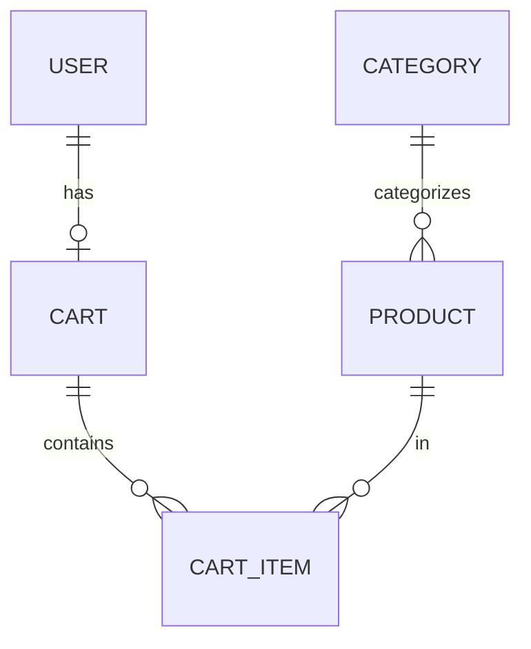

# Knowledge Transfer Document
## E-Commerce Shopping Cart System Backend

### Document Information
- **Version**: 1.0.0
- **Last Updated**: 2025-02-05
- **Prepared By**: Shopping Cart Development Team
- **Purpose**: Comprehensive knowledge transfer for maintenance and enhancement

---

## 1. System Overview

### 1.1 Architecture

The system follows a layered architecture pattern:

```
┌─────────────────────────────────────────┐
│         Presentation Layer              │
│  (REST Controllers + DTOs)              │
├─────────────────────────────────────────┤
│         Business Logic Layer            │
│  (Services + Business Rules)            │
├─────────────────────────────────────────┤
│         Data Access Layer               │
│  (Repositories + JPA Entities)          │
├─────────────────────────────────────────┤
│         Database Layer                  │
│  (PostgreSQL)                           │
└─────────────────────────────────────────┘
```

### 1.2 Technology Stack

| Component | Technology | Version | Purpose |
|-----------|-----------|---------|----------|
| Framework | Spring Boot | 3.2.0 | Application framework |
| Language | Java | 17 | Programming language |
| Database | PostgreSQL | 15+ | Data persistence |
| ORM | Hibernate/JPA | 6.x | Object-relational mapping |
| Security | Spring Security | 6.x | Authentication & authorization |
| Migration | Flyway | 10.x | Database version control |
| Build | Maven | 3.8+ | Dependency management |
| Auth | JWT | 0.12.3 | Token-based authentication |

### 1.3 Key Design Decisions

1. **Stateless Authentication**: JWT tokens for scalability
2. **Lazy Cart Creation**: Carts created only when needed
3. **Automatic Cleanup**: Empty carts deleted automatically
4. **Soft Deletes**: Data marked inactive instead of physical deletion
5. **Audit Trails**: Automatic timestamp tracking for all entities

---

## 2. Project Structure

```
api-springboot/
├── src/
│   ├── main/
│   │   ├── java/com/ecommerce/
│   │   │   ├── config/              # Configuration classes
│   │   │   │   ├── SecurityConfig.java
│   │   │   │   └── WebConfig.java
│   │   │   ├── controller/          # REST endpoints
│   │   │   │   ├── AuthController.java
│   │   │   │   ├── CartController.java
│   │   │   │   ├── CategoryController.java
│   │   │   │   └── ProductController.java
│   │   │   ├── dto/                 # Data Transfer Objects
│   │   │   ├── entity/              # JPA Entities
│   │   │   │   ├── User.java
│   │   │   │   ├── Category.java
│   │   │   │   ├── Product.java
│   │   │   │   ├── Cart.java
│   │   │   │   └── CartItem.java
│   │   │   ├── exception/           # Custom exceptions
│   │   │   ├── repository/          # Data access layer
│   │   │   ├── security/            # Security components
│   │   │   │   ├── JwtTokenProvider.java
│   │   │   │   ├── JwtAuthenticationFilter.java
│   │   │   │   ├── CustomUserDetailsService.java
│   │   │   │   └── UserPrincipal.java
│   │   │   ├── service/             # Business logic
│   │   │   │   ├── UserService.java
│   │   │   │   ├── CategoryService.java
│   │   │   │   ├── ProductService.java
│   │   │   │   └── CartService.java
│   │   │   └── ShoppingCartApplication.java
│   │   └── resources/
│   │       ├── application.yml      # Main configuration
│   │       ├── application-dev.yml  # Dev configuration
│   │       ├── application-prod.yml # Prod configuration
│   │       └── db/migration/        # Flyway migrations
│   └── test/                        # Test classes
├── docs/                            # Documentation
├── pom.xml                          # Maven configuration
└── README.md                        # Project documentation
```

---

## 3. Core Components

### 3.1 Entity Relationships



### 3.2 Key Business Logic

#### Cart Management

**Lazy Cart Creation**:
```java
// Cart is created only when first item is added
public CartDTO addItemToCart(Long userId, AddToCartRequest request) {
    Cart cart = cartRepository.findByUserUserId(userId)
        .orElseGet(() -> createNewCart(userId));
    // ... add item logic
}
```

**Automatic Deletion**:
```java
// Empty cart deleted when last item removed
if (cart.isEmpty()) {
    cartRepository.delete(cart);
    return emptyCartDTO;
}
```

**Logout Cleanup**:
```java
// Empty cart deleted on logout
public void logout(Long userId) {
    cartService.cleanupEmptyCart(userId);
    SecurityContextHolder.clearContext();
}
```

#### Stock Validation

```java
private void validateStock(Product product, int requestedQuantity) {
    if (product.getStockQuantity() < requestedQuantity) {
        throw new InsufficientStockException(...);
    }
}
```

#### Case-Insensitive Search

```java
@Query("SELECT p FROM Product p WHERE LOWER(p.productName) " +
       "LIKE LOWER(CONCAT('%', :searchTerm, '%')) AND p.isActive = true")
Page<Product> searchByProductName(@Param("searchTerm") String searchTerm, 
                                   Pageable pageable);
```

### 3.3 Security Implementation

#### JWT Token Flow

1. User logs in with credentials
2. System validates credentials
3. JWT token generated and returned
4. Client includes token in subsequent requests
5. Filter validates token and sets authentication

```java
// Token generation
public String generateToken(Authentication authentication) {
    UserPrincipal userPrincipal = (UserPrincipal) authentication.getPrincipal();
    Date expiryDate = new Date(now.getTime() + jwtExpirationMs);
    
    return Jwts.builder()
        .subject(Long.toString(userPrincipal.getUserId()))
        .issuedAt(now)
        .expiration(expiryDate)
        .signWith(key)
        .compact();
}
```

#### Password Security

- BCrypt hashing with strength 10
- Password requirements enforced via validation
- No plain text passwords stored

---

## 4. Database Schema

### 4.1 Tables Overview

| Table | Purpose | Key Columns |
|-------|---------|-------------|
| users | User accounts | user_id, username, email, password_hash |
| categories | Product categories | category_id, category_name |
| products | Product catalog | product_id, product_name, price, stock_quantity |
| carts | Shopping carts | cart_id, user_id, total_amount, total_items |
| cart_items | Cart contents | cart_item_id, cart_id, product_id, quantity |

### 4.2 Important Constraints

1. **Unique Constraints**:
   - users: username, email
   - categories: category_name
   - products: sku
   - carts: user_id
   - cart_items: (cart_id, product_id)

2. **Foreign Keys**:
   - All with appropriate CASCADE rules
   - products.category_id → categories (ON DELETE SET NULL)
   - carts.user_id → users (ON DELETE CASCADE)
   - cart_items.cart_id → carts (ON DELETE CASCADE)
   - cart_items.product_id → products (ON DELETE CASCADE)

3. **Check Constraints**:
   - price >= 0
   - stock_quantity >= 0
   - quantity > 0

### 4.3 Indexes

All foreign keys and frequently queried columns are indexed:
- User: email, username
- Product: name, category_id, sku
- Cart: user_id, status
- CartItem: cart_id, product_id

---

## 5. API Endpoints Reference

### 5.1 Authentication

| Endpoint | Method | Auth | Description |
|----------|--------|------|-------------|
| /api/auth/register | POST | No | Register new user |
| /api/auth/login | POST | No | Login and get JWT |
| /api/auth/logout | POST | Yes | Logout and cleanup |
| /api/auth/me | GET | Yes | Get current user |

### 5.2 Products

| Endpoint | Method | Auth | Description |
|----------|--------|------|-------------|
| /api/products | GET | No | List all products (paginated) |
| /api/products/{id} | GET | No | Get product by ID |
| /api/products/search | GET | No | Search products (case-insensitive) |
| /api/products/category/{id} | GET | No | Get products by category |
| /api/products | POST | Admin | Create product |
| /api/products/{id} | PUT | Admin | Update product |
| /api/products/{id} | DELETE | Admin | Delete product (soft) |

### 5.3 Cart

| Endpoint | Method | Auth | Description |
|----------|--------|------|-------------|
| /api/cart | GET | Yes | Get user's cart |
| /api/cart/items | POST | Yes | Add item to cart |
| /api/cart/items/{id} | PUT | Yes | Update item quantity |
| /api/cart/items/{id} | DELETE | Yes | Remove item |
| /api/cart | DELETE | Yes | Clear cart |

---

## 6. Configuration Management

### 6.1 Environment Profiles

**Development (dev)**:
- Detailed logging
- SQL logging enabled
- Local database

**Production (prod)**:
- Minimal logging
- Environment variables for secrets
- Production database

### 6.2 Key Configuration Properties

```yaml
# Database
spring.datasource.url
spring.datasource.username
spring.datasource.password

# JWT
app.jwt.secret
app.jwt.expiration-ms

# Hibernate
spring.jpa.hibernate.ddl-auto: validate
spring.jpa.show-sql: false

# Flyway
spring.flyway.enabled: true
spring.flyway.baseline-on-migrate: true
```

---

## 7. Common Maintenance Tasks

### 7.1 Adding a New Entity

1. Create entity class in `entity/` package
2. Create repository interface in `repository/`
3. Create service class in `service/`
4. Create DTOs in `dto/`
5. Create controller in `controller/`
6. Add migration script in `db/migration/`
7. Update ER diagram
8. Add tests

### 7.2 Adding a New API Endpoint

1. Add method to appropriate controller
2. Add validation annotations to DTO
3. Implement business logic in service
4. Add security annotations if needed
5. Update API documentation
6. Add integration tests

### 7.3 Database Migration

```bash
# Create new migration
# File: V004__description.sql

# Test migration
mvn flyway:migrate

# Rollback (if needed)
mvn flyway:clean  # CAUTION: Deletes all data!
```

### 7.4 Updating Dependencies

```bash
# Check for updates
mvn versions:display-dependency-updates

# Update specific dependency
mvn versions:use-latest-versions -Dincludes=groupId:artifactId

# Test after update
mvn clean test
```

---

## 8. Troubleshooting Guide

### 8.1 Common Issues

**Issue**: Database connection fails
- Check PostgreSQL is running
- Verify credentials in application.yml
- Check network connectivity

**Issue**: JWT token invalid
- Verify token hasn't expired
- Check JWT secret is correct
- Ensure token format: "Bearer <token>"

**Issue**: Cart not created
- Verify user is authenticated
- Check product exists and is active
- Review application logs

### 8.2 Debugging Tips

1. **Enable Debug Logging**:
   ```yaml
   logging:
     level:
       com.ecommerce: DEBUG
   ```

2. **Check SQL Queries**:
   ```yaml
   spring:
     jpa:
       show-sql: true
       properties:
         hibernate:
           format_sql: true
   ```

3. **Monitor Database**:
   ```sql
   SELECT * FROM pg_stat_activity WHERE datname = 'ecommerce_db';
   ```

---

## 9. Testing Strategy

### 9.1 Test Categories

1. **Unit Tests**: Service layer business logic
2. **Integration Tests**: Repository and database operations
3. **API Tests**: Controller endpoints
4. **Security Tests**: Authentication and authorization

### 9.2 Running Tests

```bash
# All tests
mvn test

# Specific test class
mvn test -Dtest=CartServiceTest

# With coverage
mvn test jacoco:report
```

---

## 10. Deployment Checklist

### 10.1 Pre-Deployment

- [ ] All tests passing
- [ ] Code reviewed
- [ ] Database migrations tested
- [ ] Configuration updated for environment
- [ ] Secrets secured (JWT secret, DB password)
- [ ] Backup current database
- [ ] Document changes

### 10.2 Deployment Steps

1. Build application: `mvn clean package -DskipTests`
2. Stop current application
3. Backup database
4. Deploy new JAR
5. Run migrations (automatic on startup)
6. Start application
7. Verify health check
8. Monitor logs for errors
9. Test critical endpoints

### 10.3 Post-Deployment

- [ ] Verify application is running
- [ ] Check logs for errors
- [ ] Test authentication
- [ ] Test cart operations
- [ ] Monitor performance
- [ ] Update documentation

---

## 11. Performance Optimization

### 11.1 Database Optimization

1. **Indexing**: All foreign keys and search columns indexed
2. **Query Optimization**: Use pagination for large result sets
3. **Connection Pooling**: HikariCP with optimized settings
4. **Lazy Loading**: Relationships loaded only when needed

### 11.2 Application Optimization

1. **Caching**: Consider Redis for frequently accessed data
2. **Async Processing**: Use @Async for non-blocking operations
3. **Batch Operations**: Use batch inserts/updates
4. **Resource Management**: Proper connection and transaction management

---

## 12. Security Best Practices

1. **Never commit secrets** to version control
2. **Use environment variables** for sensitive data
3. **Rotate JWT secret** regularly
4. **Implement rate limiting** on authentication endpoints
5. **Enable HTTPS** in production
6. **Regular security audits** and dependency updates
7. **Input validation** on all endpoints
8. **SQL injection prevention** via parameterized queries

---

## 13. Monitoring and Logging

### 13.1 Application Metrics

- Response times
- Error rates
- Active connections
- Memory usage
- CPU usage

### 13.2 Database Metrics

- Query performance
- Connection pool usage
- Table sizes
- Index usage

### 13.3 Log Locations

- Application: `logs/spring-boot-application.log`
- PostgreSQL: `/var/log/postgresql/`

---

## 14. Future Enhancements

### 14.1 Planned Features

1. Order management and checkout
2. Payment gateway integration
3. Email notifications
4. Product reviews and ratings
5. Wishlist functionality
6. Admin dashboard
7. Analytics and reporting

### 14.2 Technical Improvements

1. Redis caching layer
2. Elasticsearch for advanced search
3. Microservices architecture
4. Event-driven architecture
5. GraphQL API
6. Real-time notifications (WebSocket)

---

## 15. Contact and Support

### 15.1 Team Contacts

- **Development Team**: dev-team@example.com
- **DevOps**: devops@example.com
- **Support**: support@example.com

### 15.2 Resources

- **Repository**: https://github.com/NavneetBN47/ecommerce
- **Documentation**: /docs folder
- **Issue Tracker**: GitHub Issues
- **Wiki**: GitHub Wiki

---

## 16. Appendix

### 16.1 Useful Commands

```bash
# Build
mvn clean install

# Run
mvn spring-boot:run

# Test
mvn test

# Package
mvn clean package

# Database backup
pg_dump -U postgres ecommerce_db > backup.sql

# Database restore
psql -U postgres ecommerce_db < backup.sql
```

### 16.2 Environment Variables

```bash
export DATABASE_URL=jdbc:postgresql://localhost:5432/ecommerce_db
export DATABASE_USERNAME=postgres
export DATABASE_PASSWORD=your_password
export JWT_SECRET=your_secret_key
export SPRING_PROFILES_ACTIVE=prod
```

---

**Document Version**: 1.0.0  
**Last Updated**: 2025-02-05  
**Next Review**: 2025-03-05