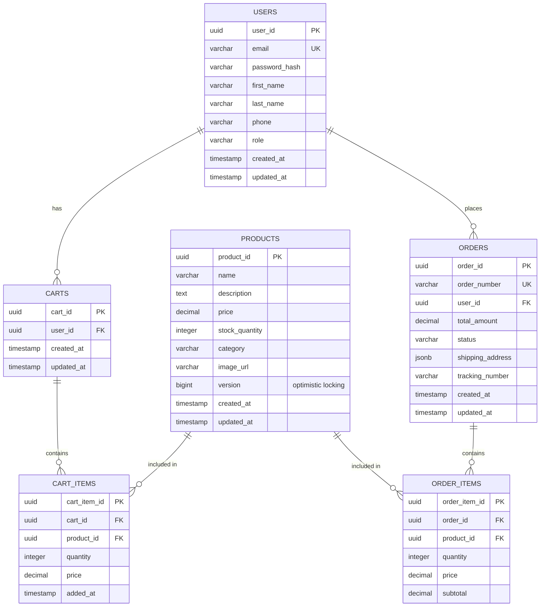
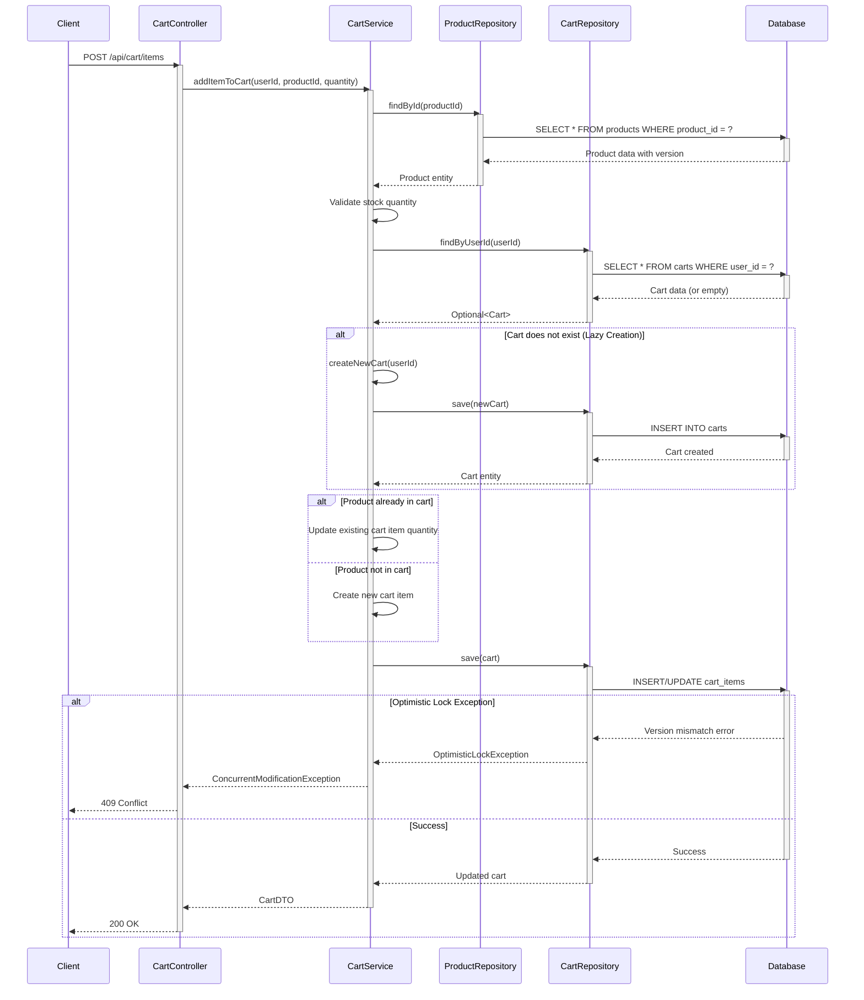

# Low Level Design (LLD) - E-Commerce System

## 1. Introduction

### 1.1 Purpose
This document provides a detailed Low Level Design for an e-commerce system, covering the technical implementation details, database schema, API specifications, and component interactions.

### 1.2 Scope
The system encompasses:
- User Management
- Product Catalog Management
- Shopping Cart Operations
- Order Processing
- Payment Integration

### 1.3 Technology Stack
- **Backend**: Java/Spring Boot
- **Database**: PostgreSQL
- **Cache**: Redis
- **Message Queue**: RabbitMQ
- **API**: RESTful APIs

## 2. System Architecture

### 2.1 Component Overview
The system follows a layered architecture:
- **Presentation Layer**: REST Controllers
- **Business Logic Layer**: Service Components
- **Data Access Layer**: Repository Pattern
- **Database Layer**: PostgreSQL

### 2.2 Design Patterns
- **Repository Pattern**: For data access abstraction
- **Service Layer Pattern**: For business logic encapsulation
- **DTO Pattern**: For data transfer between layers
- **Factory Pattern**: For object creation
- **Strategy Pattern**: For payment processing

## 3. Module Design

### 3.1 User Management Module

#### 3.1.1 Components
- **UserController**: Handles HTTP requests for user operations
- **UserService**: Business logic for user management
- **UserRepository**: Data access for user entities
- **AuthenticationService**: Handles user authentication and authorization

#### 3.1.2 Key Operations
- User Registration
- User Login/Logout
- Profile Management
- Password Reset
- Address Management

#### 3.1.3 Security
- Password hashing using BCrypt
- JWT token-based authentication
- Role-based access control (RBAC)

### 3.2 Product Catalog Module

#### 3.2.1 Components
- **ProductController**: REST endpoints for product operations
- **ProductService**: Business logic for product management
- **ProductRepository**: Data access for product entities
- **CategoryService**: Manages product categories
- **InventoryService**: Tracks product inventory

#### 3.2.2 Key Operations
- Product CRUD operations
- Product search and filtering
- Category management
- Inventory tracking
- Product image management

#### 3.2.3 Concurrency Control
- **Optimistic Locking**: Using version column to prevent lost updates
- **Stock Management**: Atomic operations for inventory updates

### 3.3 Shopping Cart Module

#### 3.3.1 Components
- **CartController**: REST endpoints for cart operations
- **CartService**: Business logic for cart management
- **CartRepository**: Data access for cart entities
- **CartItemRepository**: Data access for cart items

#### 3.3.2 Key Operations
- Add item to cart
- Update item quantity
- Remove item from cart
- Clear cart
- Get cart details

#### 3.3.3 Cart Lifecycle
- **Lazy Creation**: Cart is created when first item is added
- **Session Management**: Cart associated with user session
- **Persistence**: Cart data persisted in database
- **Expiration**: Inactive carts cleaned up after 30 days

### 3.4 Order Processing Module

#### 3.4.1 Components
- **OrderController**: REST endpoints for order operations
- **OrderService**: Business logic for order processing
- **OrderRepository**: Data access for order entities
- **PaymentService**: Handles payment processing
- **NotificationService**: Sends order notifications

#### 3.4.2 Order Workflow
1. Cart validation
2. Inventory reservation
3. Payment processing
4. Order creation
5. Inventory deduction
6. Notification dispatch

#### 3.4.3 Transaction Management
- **ACID Compliance**: All order operations wrapped in transactions
- **Rollback Strategy**: Automatic rollback on payment failure
- **Idempotency**: Duplicate order prevention using idempotency keys

---

# Technical Artifacts

## Artifact 1: Entity-Relationship Diagram (ERD)



## Artifact 2: Add to Cart Sequence Diagram



## Artifact 3: Database Model - PostgreSQL DDL Scripts

```sql
-- Enable UUID extension
CREATE EXTENSION IF NOT EXISTS "uuid-ossp";

-- Users Table
CREATE TABLE users (
    user_id UUID PRIMARY KEY DEFAULT uuid_generate_v4(),
    email VARCHAR(255) UNIQUE NOT NULL,
    password_hash VARCHAR(255) NOT NULL,
    first_name VARCHAR(100) NOT NULL,
    last_name VARCHAR(100) NOT NULL,
    phone VARCHAR(20),
    role VARCHAR(50) DEFAULT 'customer',
    created_at TIMESTAMP DEFAULT CURRENT_TIMESTAMP,
    updated_at TIMESTAMP DEFAULT CURRENT_TIMESTAMP
);

CREATE INDEX idx_users_email ON users(email);
CREATE INDEX idx_users_created_at ON users(created_at);

-- Products Table
CREATE TABLE products (
    product_id UUID PRIMARY KEY DEFAULT uuid_generate_v4(),
    name VARCHAR(255) NOT NULL,
    description TEXT,
    price DECIMAL(10, 2) NOT NULL CHECK (price > 0),
    stock_quantity INTEGER NOT NULL DEFAULT 0 CHECK (stock_quantity >= 0),
    category VARCHAR(100),
    image_url VARCHAR(500),
    version BIGINT NOT NULL DEFAULT 0,
    created_at TIMESTAMP DEFAULT CURRENT_TIMESTAMP,
    updated_at TIMESTAMP DEFAULT CURRENT_TIMESTAMP
);

CREATE INDEX idx_products_category ON products(category);
CREATE INDEX idx_products_name ON products(name);
CREATE INDEX idx_products_price ON products(price);

-- Carts Table
CREATE TABLE carts (
    cart_id UUID PRIMARY KEY DEFAULT uuid_generate_v4(),
    user_id UUID UNIQUE NOT NULL,
    created_at TIMESTAMP DEFAULT CURRENT_TIMESTAMP,
    updated_at TIMESTAMP DEFAULT CURRENT_TIMESTAMP,
    CONSTRAINT fk_cart_user FOREIGN KEY (user_id) REFERENCES users(user_id) ON DELETE CASCADE
);

CREATE INDEX idx_carts_user_id ON carts(user_id);

-- Cart Items Table
CREATE TABLE cart_items (
    cart_item_id UUID PRIMARY KEY DEFAULT uuid_generate_v4(),
    cart_id UUID NOT NULL,
    product_id UUID NOT NULL,
    quantity INTEGER NOT NULL CHECK (quantity > 0),
    price DECIMAL(10, 2) NOT NULL CHECK (price > 0),
    added_at TIMESTAMP DEFAULT CURRENT_TIMESTAMP,
    CONSTRAINT fk_cart_item_cart FOREIGN KEY (cart_id) REFERENCES carts(cart_id) ON DELETE CASCADE,
    CONSTRAINT fk_cart_item_product FOREIGN KEY (product_id) REFERENCES products(product_id) ON DELETE CASCADE,
    CONSTRAINT uk_cart_product UNIQUE (cart_id, product_id)
);

CREATE INDEX idx_cart_items_cart_id ON cart_items(cart_id);
CREATE INDEX idx_cart_items_product_id ON cart_items(product_id);

-- Orders Table
CREATE TABLE orders (
    order_id UUID PRIMARY KEY DEFAULT uuid_generate_v4(),
    order_number VARCHAR(50) UNIQUE NOT NULL,
    user_id UUID NOT NULL,
    total_amount DECIMAL(10, 2) NOT NULL CHECK (total_amount > 0),
    status VARCHAR(50) NOT NULL DEFAULT 'PENDING',
    shipping_address JSONB NOT NULL,
    tracking_number VARCHAR(100),
    created_at TIMESTAMP DEFAULT CURRENT_TIMESTAMP,
    updated_at TIMESTAMP DEFAULT CURRENT_TIMESTAMP,
    CONSTRAINT fk_order_user FOREIGN KEY (user_id) REFERENCES users(user_id) ON DELETE CASCADE,
    CONSTRAINT chk_order_status CHECK (status IN ('PENDING', 'CONFIRMED', 'PROCESSING', 'SHIPPED', 'DELIVERED', 'CANCELLED', 'REFUNDED'))
);

CREATE INDEX idx_orders_user_id ON orders(user_id);
CREATE INDEX idx_orders_order_number ON orders(order_number);
CREATE INDEX idx_orders_status ON orders(status);
CREATE INDEX idx_orders_created_at ON orders(created_at DESC);

-- Order Items Table
CREATE TABLE order_items (
    order_item_id UUID PRIMARY KEY DEFAULT uuid_generate_v4(),
    order_id UUID NOT NULL,
    product_id UUID NOT NULL,
    quantity INTEGER NOT NULL CHECK (quantity > 0),
    price DECIMAL(10, 2) NOT NULL CHECK (price > 0),
    subtotal DECIMAL(10, 2) NOT NULL CHECK (subtotal > 0),
    CONSTRAINT fk_order_item_order FOREIGN KEY (order_id) REFERENCES orders(order_id) ON DELETE CASCADE,
    CONSTRAINT fk_order_item_product FOREIGN KEY (product_id) REFERENCES products(product_id) ON DELETE CASCADE
);

CREATE INDEX idx_order_items_order_id ON order_items(order_id);
CREATE INDEX idx_order_items_product_id ON order_items(product_id);

-- Triggers for updated_at timestamps
CREATE OR REPLACE FUNCTION update_updated_at_column()
RETURNS TRIGGER AS $$
BEGIN
    NEW.updated_at = CURRENT_TIMESTAMP;
    RETURN NEW;
END;
$$ language 'plpgsql';

CREATE TRIGGER update_users_updated_at BEFORE UPDATE ON users
    FOR EACH ROW EXECUTE FUNCTION update_updated_at_column();

CREATE TRIGGER update_products_updated_at BEFORE UPDATE ON products
    FOR EACH ROW EXECUTE FUNCTION update_updated_at_column();

CREATE TRIGGER update_carts_updated_at BEFORE UPDATE ON carts
    FOR EACH ROW EXECUTE FUNCTION update_updated_at_column();

CREATE TRIGGER update_orders_updated_at BEFORE UPDATE ON orders
    FOR EACH ROW EXECUTE FUNCTION update_updated_at_column();
```

---

## Document Control

**Version**: 1.0  
**Last Updated**: 2024-01-15  
**Author**: Enterprise Documentation Team  
**Status**: Approved  
**Next Review Date**: 2024-04-15

---

**End of Low Level Design Document**