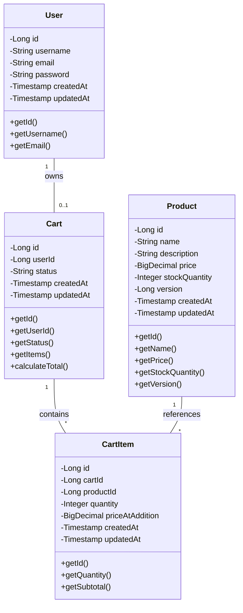
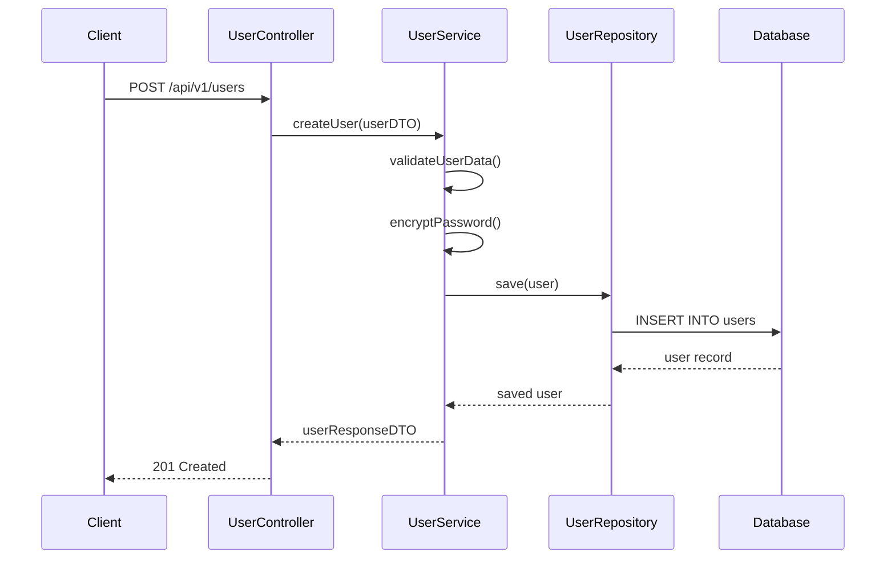
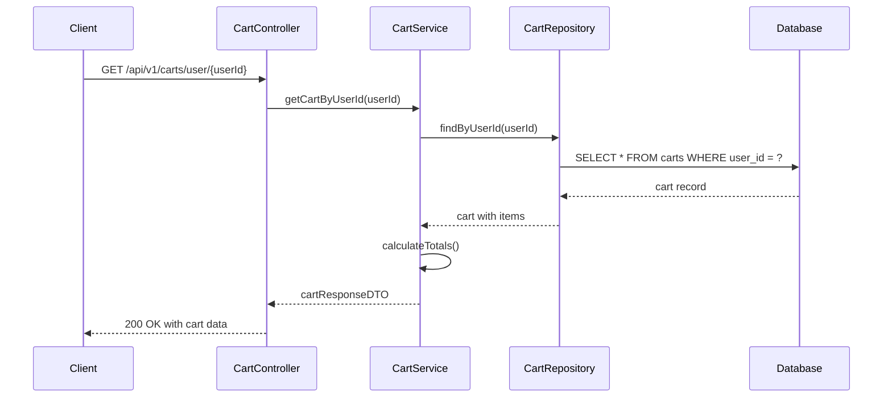
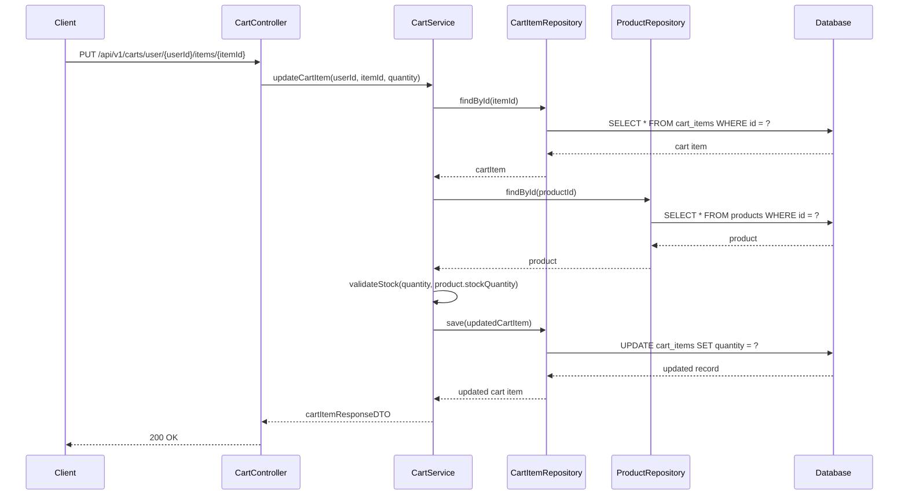
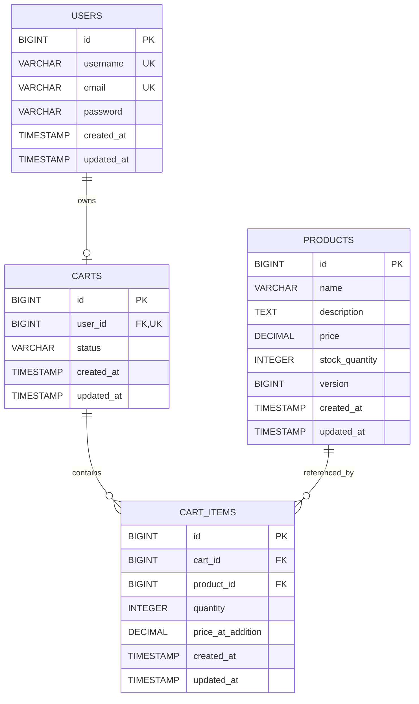
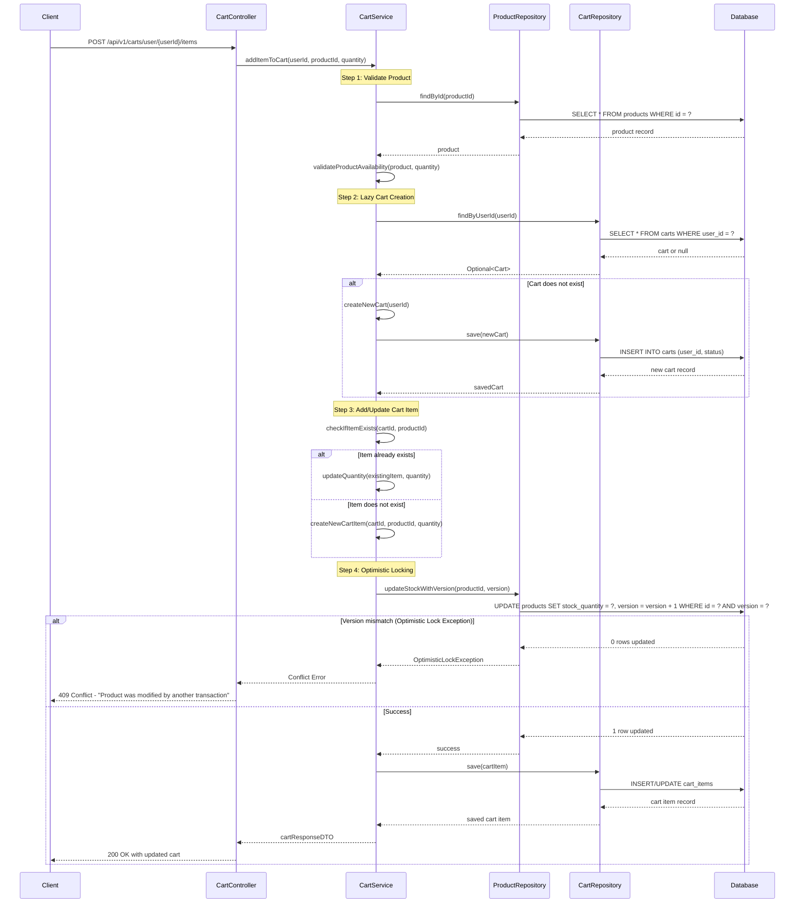

# Low Level Design Document
## Shopping Cart System (SCRUM-96)

---

## Executive Summary

This Low Level Design (LLD) document provides a comprehensive backend engineering specification for the Shopping Cart System. The system enables users to manage shopping carts, add/remove products, and maintain cart state across sessions. This document covers the functional domain breakdown, domain entities, REST API contracts, validation rules, and technical implementation details.

---

## 1. Functional Domain Breakdown

### 1.1 User Management Domain
- User authentication and authorization
- User profile management
- Session management

### 1.2 Product Management Domain
- Product catalog management
- Product inventory tracking
- Product availability validation
- Optimistic locking for concurrent updates

### 1.3 Cart Management Domain
- Cart lifecycle management (lazy creation)
- Cart item operations (add, update, remove)
- Cart persistence and retrieval
- Cart-user association

### 1.4 Cart Item Management Domain
- Item quantity management
- Price calculation
- Item validation
- Duplicate item handling

---

## 2. Domain Entities Extraction

### 2.1 User Entity
```
User:
- id: Long (Primary Key)
- username: String (Unique, Not Null)
- email: String (Unique, Not Null)
- password: String (Encrypted, Not Null)
- createdAt: Timestamp
- updatedAt: Timestamp
```

### 2.2 Product Entity
```
Product:
- id: Long (Primary Key)
- name: String (Not Null)
- description: String
- price: Decimal (Not Null, > 0)
- stockQuantity: Integer (Not Null, >= 0)
- version: Long (Optimistic Locking)
- createdAt: Timestamp
- updatedAt: Timestamp
```

### 2.3 Cart Entity
```
Cart:
- id: Long (Primary Key)
- userId: Long (Foreign Key -> User.id, Unique)
- status: String (ACTIVE, CHECKED_OUT, ABANDONED)
- createdAt: Timestamp
- updatedAt: Timestamp
```

### 2.4 CartItem Entity
```
CartItem:
- id: Long (Primary Key)
- cartId: Long (Foreign Key -> Cart.id)
- productId: Long (Foreign Key -> Product.id)
- quantity: Integer (Not Null, > 0)
- priceAtAddition: Decimal (Not Null)
- createdAt: Timestamp
- updatedAt: Timestamp
- Unique Constraint: (cartId, productId)
```

---

## 3. REST API Contracts

### 3.1 User APIs

#### 3.1.1 Create User
```
POST /api/v1/users
Request Body:
{
  "username": "string",
  "email": "string",
  "password": "string"
}
Response: 201 Created
{
  "id": "long",
  "username": "string",
  "email": "string",
  "createdAt": "timestamp"
}
```

#### 3.1.2 Get User
```
GET /api/v1/users/{userId}
Response: 200 OK
{
  "id": "long",
  "username": "string",
  "email": "string",
  "createdAt": "timestamp"
}
```

### 3.2 Product APIs

#### 3.2.1 Create Product
```
POST /api/v1/products
Request Body:
{
  "name": "string",
  "description": "string",
  "price": "decimal",
  "stockQuantity": "integer"
}
Response: 201 Created
{
  "id": "long",
  "name": "string",
  "description": "string",
  "price": "decimal",
  "stockQuantity": "integer",
  "version": "long"
}
```

#### 3.2.2 Get Product
```
GET /api/v1/products/{productId}
Response: 200 OK
{
  "id": "long",
  "name": "string",
  "description": "string",
  "price": "decimal",
  "stockQuantity": "integer",
  "version": "long"
}
```

#### 3.2.3 Update Product
```
PUT /api/v1/products/{productId}
Request Body:
{
  "name": "string",
  "description": "string",
  "price": "decimal",
  "stockQuantity": "integer",
  "version": "long"
}
Response: 200 OK
{
  "id": "long",
  "name": "string",
  "price": "decimal",
  "stockQuantity": "integer",
  "version": "long"
}
```

#### 3.2.4 List Products
```
GET /api/v1/products?page=0&size=20
Response: 200 OK
{
  "content": [
    {
      "id": "long",
      "name": "string",
      "price": "decimal",
      "stockQuantity": "integer"
    }
  ],
  "totalElements": "long",
  "totalPages": "integer"
}
```

### 3.3 Cart APIs

#### 3.3.1 Get Cart
```
GET /api/v1/carts/user/{userId}
Response: 200 OK
{
  "id": "long",
  "userId": "long",
  "status": "string",
  "items": [
    {
      "id": "long",
      "productId": "long",
      "productName": "string",
      "quantity": "integer",
      "priceAtAddition": "decimal",
      "subtotal": "decimal"
    }
  ],
  "totalAmount": "decimal",
  "createdAt": "timestamp",
  "updatedAt": "timestamp"
}
```

#### 3.3.2 Add Item to Cart
```
POST /api/v1/carts/user/{userId}/items
Request Body:
{
  "productId": "long",
  "quantity": "integer"
}
Response: 200 OK
{
  "id": "long",
  "userId": "long",
  "items": [
    {
      "id": "long",
      "productId": "long",
      "quantity": "integer",
      "priceAtAddition": "decimal"
    }
  ],
  "totalAmount": "decimal"
}
```

#### 3.3.3 Update Cart Item
```
PUT /api/v1/carts/user/{userId}/items/{itemId}
Request Body:
{
  "quantity": "integer"
}
Response: 200 OK
{
  "id": "long",
  "productId": "long",
  "quantity": "integer",
  "priceAtAddition": "decimal",
  "subtotal": "decimal"
}
```

#### 3.3.4 Remove Item from Cart
```
DELETE /api/v1/carts/user/{userId}/items/{itemId}
Response: 204 No Content
```

#### 3.3.5 Clear Cart
```
DELETE /api/v1/carts/user/{userId}
Response: 204 No Content
```

#### 3.3.6 Checkout Cart
```
POST /api/v1/carts/user/{userId}/checkout
Response: 200 OK
{
  "orderId": "long",
  "totalAmount": "decimal",
  "status": "string"
}
```

---

## 4. Validation Matrix

| Field | Validation Rules | Error Message |
|-------|-----------------|---------------|
| User.username | Not null, 3-50 characters, alphanumeric | "Username must be 3-50 alphanumeric characters" |
| User.email | Not null, valid email format | "Invalid email format" |
| User.password | Not null, min 8 characters, contains uppercase, lowercase, digit | "Password must be at least 8 characters with uppercase, lowercase, and digit" |
| Product.name | Not null, 1-200 characters | "Product name is required and must be 1-200 characters" |
| Product.price | Not null, > 0 | "Product price must be greater than 0" |
| Product.stockQuantity | Not null, >= 0 | "Stock quantity cannot be negative" |
| CartItem.quantity | Not null, > 0, <= product.stockQuantity | "Quantity must be between 1 and available stock" |
| CartItem.productId | Not null, must exist in products table | "Product does not exist" |

---

## 5. Class Diagram



---

## 6. Sequence Diagrams

### 6.1 User Registration Flow


### 6.2 Get Cart Flow


### 6.3 Update Cart Item Flow


---

## 7. Technical Artifacts

### 7.1 Entity-Relationship Diagram (ERD)



---

### 7.2 Add to Cart Flow - Sequence Diagram



---

### 7.3 Database Model (SQL DDL)

```sql
-- ============================================
-- Shopping Cart System - PostgreSQL DDL
-- ============================================

-- Drop tables if they exist (for clean setup)
DROP TABLE IF EXISTS cart_items CASCADE;
DROP TABLE IF EXISTS carts CASCADE;
DROP TABLE IF EXISTS products CASCADE;
DROP TABLE IF EXISTS users CASCADE;

-- ============================================
-- USERS TABLE
-- ============================================
CREATE TABLE users (
    id BIGSERIAL PRIMARY KEY,
    username VARCHAR(50) NOT NULL UNIQUE,
    email VARCHAR(100) NOT NULL UNIQUE,
    password VARCHAR(255) NOT NULL,
    created_at TIMESTAMP NOT NULL DEFAULT CURRENT_TIMESTAMP,
    updated_at TIMESTAMP NOT NULL DEFAULT CURRENT_TIMESTAMP,
    
    CONSTRAINT chk_username_length CHECK (LENGTH(username) >= 3),
    CONSTRAINT chk_email_format CHECK (email ~* '^[A-Za-z0-9._%+-]+@[A-Za-z0-9.-]+\.[A-Za-z]{2,}$')
);

-- ============================================
-- PRODUCTS TABLE
-- ============================================
CREATE TABLE products (
    id BIGSERIAL PRIMARY KEY,
    name VARCHAR(200) NOT NULL,
    description TEXT,
    price DECIMAL(10, 2) NOT NULL,
    stock_quantity INTEGER NOT NULL DEFAULT 0,
    version BIGINT NOT NULL DEFAULT 0,
    created_at TIMESTAMP NOT NULL DEFAULT CURRENT_TIMESTAMP,
    updated_at TIMESTAMP NOT NULL DEFAULT CURRENT_TIMESTAMP,
    
    CONSTRAINT chk_price_positive CHECK (price > 0),
    CONSTRAINT chk_stock_non_negative CHECK (stock_quantity >= 0)
);

-- ============================================
-- CARTS TABLE
-- ============================================
CREATE TABLE carts (
    id BIGSERIAL PRIMARY KEY,
    user_id BIGINT NOT NULL UNIQUE,
    status VARCHAR(20) NOT NULL DEFAULT 'ACTIVE',
    created_at TIMESTAMP NOT NULL DEFAULT CURRENT_TIMESTAMP,
    updated_at TIMESTAMP NOT NULL DEFAULT CURRENT_TIMESTAMP,
    
    CONSTRAINT fk_cart_user FOREIGN KEY (user_id) 
        REFERENCES users(id) 
        ON DELETE CASCADE,
    CONSTRAINT chk_cart_status CHECK (status IN ('ACTIVE', 'CHECKED_OUT', 'ABANDONED'))
);

-- ============================================
-- CART_ITEMS TABLE
-- ============================================
CREATE TABLE cart_items (
    id BIGSERIAL PRIMARY KEY,
    cart_id BIGINT NOT NULL,
    product_id BIGINT NOT NULL,
    quantity INTEGER NOT NULL,
    price_at_addition DECIMAL(10, 2) NOT NULL,
    created_at TIMESTAMP NOT NULL DEFAULT CURRENT_TIMESTAMP,
    updated_at TIMESTAMP NOT NULL DEFAULT CURRENT_TIMESTAMP,
    
    CONSTRAINT fk_cart_item_cart FOREIGN KEY (cart_id) 
        REFERENCES carts(id) 
        ON DELETE CASCADE,
    CONSTRAINT fk_cart_item_product FOREIGN KEY (product_id) 
        REFERENCES products(id) 
        ON DELETE CASCADE,
    CONSTRAINT chk_quantity_positive CHECK (quantity > 0),
    CONSTRAINT chk_price_at_addition_positive CHECK (price_at_addition > 0),
    CONSTRAINT uk_cart_product UNIQUE (cart_id, product_id)
);

-- ============================================
-- INDEXES FOR PERFORMANCE OPTIMIZATION
-- ============================================

-- Index on users table
CREATE INDEX idx_users_email ON users(email);
CREATE INDEX idx_users_username ON users(username);

-- Index on products table
CREATE INDEX idx_products_name ON products(name);
CREATE INDEX idx_products_price ON products(price);

-- Index on carts table
CREATE INDEX idx_carts_user_id ON carts(user_id);
CREATE INDEX idx_carts_status ON carts(status);

-- Index on cart_items table
CREATE INDEX idx_cart_items_cart_id ON cart_items(cart_id);
CREATE INDEX idx_cart_items_product_id ON cart_items(product_id);
CREATE INDEX idx_cart_items_cart_product ON cart_items(cart_id, product_id);

-- ============================================
-- TRIGGER FUNCTIONS FOR UPDATED_AT
-- ============================================

CREATE OR REPLACE FUNCTION update_updated_at_column()
RETURNS TRIGGER AS $$
BEGIN
    NEW.updated_at = CURRENT_TIMESTAMP;
    RETURN NEW;
END;
$$ LANGUAGE plpgsql;

-- Apply triggers to all tables
CREATE TRIGGER update_users_updated_at
    BEFORE UPDATE ON users
    FOR EACH ROW
    EXECUTE FUNCTION update_updated_at_column();

CREATE TRIGGER update_products_updated_at
    BEFORE UPDATE ON products
    FOR EACH ROW
    EXECUTE FUNCTION update_updated_at_column();

CREATE TRIGGER update_carts_updated_at
    BEFORE UPDATE ON carts
    FOR EACH ROW
    EXECUTE FUNCTION update_updated_at_column();

CREATE TRIGGER update_cart_items_updated_at
    BEFORE UPDATE ON cart_items
    FOR EACH ROW
    EXECUTE FUNCTION update_updated_at_column();

-- ============================================
-- SAMPLE DATA (OPTIONAL)
-- ============================================

-- Insert sample users
INSERT INTO users (username, email, password) VALUES
('john_doe', 'john.doe@example.com', '$2a$10$encrypted_password_hash_1'),
('jane_smith', 'jane.smith@example.com', '$2a$10$encrypted_password_hash_2');

-- Insert sample products
INSERT INTO products (name, description, price, stock_quantity) VALUES
('Laptop', 'High-performance laptop with 16GB RAM', 1299.99, 50),
('Wireless Mouse', 'Ergonomic wireless mouse', 29.99, 200),
('USB-C Cable', 'Fast charging USB-C cable', 12.99, 500),
('Mechanical Keyboard', 'RGB mechanical gaming keyboard', 89.99, 75);

-- ============================================
-- COMMENTS FOR DOCUMENTATION
-- ============================================

COMMENT ON TABLE users IS 'Stores user account information';
COMMENT ON TABLE products IS 'Stores product catalog with optimistic locking support';
COMMENT ON TABLE carts IS 'Stores shopping carts with one-to-one relationship to users';
COMMENT ON TABLE cart_items IS 'Stores items added to shopping carts with quantity and price snapshot';

COMMENT ON COLUMN products.version IS 'Version column for optimistic locking to handle concurrent updates';
COMMENT ON COLUMN cart_items.price_at_addition IS 'Captures product price at the time of addition to cart';
COMMENT ON CONSTRAINT uk_cart_product ON cart_items IS 'Ensures a product can only appear once per cart';
```

---

## 8. Implementation Notes

### 8.1 Lazy Cart Creation
- Carts are created only when a user adds their first item
- Reduces database overhead for users who browse but don't add items
- Cart creation is atomic and handled within the add-to-cart transaction

### 8.2 Optimistic Locking Strategy
- The `version` column in the PRODUCTS table enables optimistic locking
- When updating product stock, the version is checked and incremented
- If version mismatch occurs, a 409 Conflict response is returned
- Client should retry the operation with fresh data

### 8.3 Data Integrity
- Foreign key constraints with CASCADE delete ensure referential integrity
- CHECK constraints enforce business rules at the database level
- UNIQUE constraints prevent duplicate cart items and multiple carts per user

### 8.4 Performance Considerations
- Indexes on foreign keys optimize JOIN operations
- Composite index on (cart_id, product_id) speeds up duplicate checks
- Triggers automatically maintain updated_at timestamps

---

## 9. Error Handling

### 9.1 Common Error Responses

| HTTP Status | Error Code | Description |
|-------------|-----------|-------------|
| 400 | BAD_REQUEST | Invalid input data or validation failure |
| 404 | NOT_FOUND | Resource (user, product, cart) not found |
| 409 | CONFLICT | Optimistic locking failure or duplicate resource |
| 422 | UNPROCESSABLE_ENTITY | Business rule violation (e.g., insufficient stock) |
| 500 | INTERNAL_SERVER_ERROR | Unexpected server error |

### 9.2 Error Response Format
```json
{
  "timestamp": "2024-01-15T10:30:00Z",
  "status": 409,
  "error": "Conflict",
  "message": "Product was modified by another transaction. Please retry.",
  "path": "/api/v1/carts/user/1/items"
}
```

---

## 10. Conclusion

This Low Level Design document provides a comprehensive specification for implementing the Shopping Cart System (SCRUM-96). The design incorporates:

- **Lazy cart creation** to optimize resource usage
- **Optimistic locking** to handle concurrent product updates
- **Referential integrity** through proper foreign key relationships
- **Performance optimization** via strategic indexing
- **Data validation** at multiple layers (application and database)

The three technical artifacts (ERD, Sequence Diagram, and SQL DDL) provide implementation-ready specifications for the development team.

---

**Document Version:** 1.0  
**Last Updated:** 2024-01-15  
**Status:** Ready for Implementation