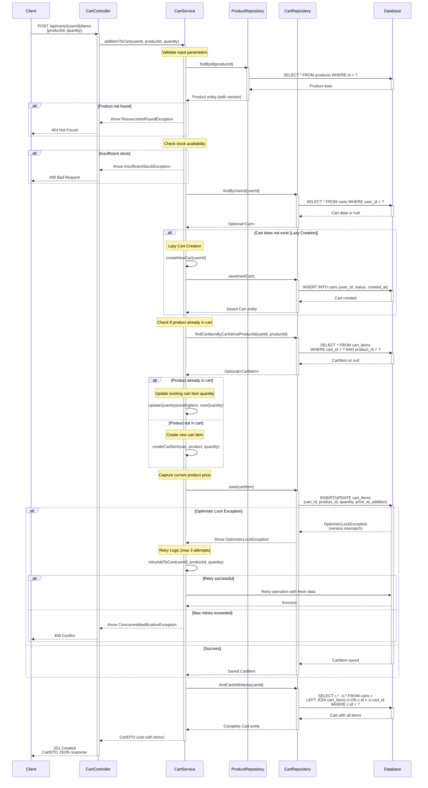

# Low Level Design Document
## SCRUM-96: Implement Core Shopping Cart Backend Services Using Spring Boot MVC

### Document Control
- **Version**: 1.0
- **Date**: 2024
- **Status**: Enhanced with Technical Artifacts

---

## 1. Executive Summary

This document provides a comprehensive Low Level Design (LLD) for implementing core shopping cart backend services using Spring Boot MVC architecture. The system enables users to manage shopping carts with full CRUD operations, product management, and cart item manipulation.

### 1.1 Purpose
Design and implement a robust, scalable shopping cart backend service that handles user cart operations, product inventory management, and cart item lifecycle management.

### 1.2 Scope
- User management and authentication context
- Product catalog management
- Shopping cart creation and management
- Cart item operations (add, update, remove)
- Optimistic locking for concurrent cart operations

---

## 2. Requirements Analysis

### 2.1 Functional Requirements
- **FR-1**: Users can create and manage shopping carts
- **FR-2**: Users can add products to their cart
- **FR-3**: Users can update quantities of cart items
- **FR-4**: Users can remove items from their cart
- **FR-5**: Users can view their cart contents
- **FR-6**: System prevents concurrent modification conflicts using optimistic locking
- **FR-7**: System validates product availability before cart operations
- **FR-8**: Lazy cart creation - carts are created only when needed

### 2.2 Non-Functional Requirements
- **NFR-1**: Response time < 200ms for cart operations
- **NFR-2**: Support for concurrent users with data consistency
- **NFR-3**: RESTful API design following industry standards
- **NFR-4**: Comprehensive error handling and validation
- **NFR-5**: Database integrity through constraints and cascading rules

---

## 3. Domain Model Specification

### 3.1 Entity: User
Represents a system user who can own shopping carts.

**Attributes:**
- `id` (Long): Primary key, auto-generated
- `username` (String): Unique username, not null
- `email` (String): User email address, not null
- `createdAt` (Timestamp): Account creation timestamp
- `updatedAt` (Timestamp): Last update timestamp

### 3.2 Entity: Product
Represents products available in the catalog.

**Attributes:**
- `id` (Long): Primary key, auto-generated
- `name` (String): Product name, not null
- `description` (String): Product description
- `price` (BigDecimal): Product price, not null, must be > 0
- `stockQuantity` (Integer): Available stock, not null, must be >= 0
- `version` (Long): Optimistic locking version field
- `createdAt` (Timestamp): Product creation timestamp
- `updatedAt` (Timestamp): Last update timestamp

### 3.3 Entity: Cart
Represents a user's shopping cart.

**Attributes:**
- `id` (Long): Primary key, auto-generated
- `userId` (Long): Foreign key to User, not null, unique
- `status` (String): Cart status (ACTIVE, CHECKED_OUT, ABANDONED)
- `createdAt` (Timestamp): Cart creation timestamp
- `updatedAt` (Timestamp): Last update timestamp

**Business Rules:**
- One cart per user (one-to-one relationship)
- Lazy creation: Cart is created when first item is added
- Cascade delete: When user is deleted, cart is deleted

### 3.4 Entity: CartItem
Represents individual items within a cart.

**Attributes:**
- `id` (Long): Primary key, auto-generated
- `cartId` (Long): Foreign key to Cart, not null
- `productId` (Long): Foreign key to Product, not null
- `quantity` (Integer): Item quantity, not null, must be > 0
- `priceAtAddition` (BigDecimal): Price when added to cart
- `createdAt` (Timestamp): Item addition timestamp
- `updatedAt` (Timestamp): Last update timestamp

**Business Rules:**
- Unique constraint on (cartId, productId) - one product per cart
- Cascade delete: When cart is deleted, all items are deleted
- Quantity must be positive

---

## 4. REST API Contracts

### 4.1 Cart Management APIs

#### 4.1.1 Get User Cart
```
GET /api/carts/user/{userId}
```
**Response**: 200 OK
```json
{
  "id": 1,
  "userId": 123,
  "status": "ACTIVE",
  "items": [
    {
      "id": 1,
      "productId": 456,
      "productName": "Product A",
      "quantity": 2,
      "priceAtAddition": 29.99,
      "subtotal": 59.98
    }
  ],
  "totalAmount": 59.98,
  "createdAt": "2024-01-15T10:30:00Z",
  "updatedAt": "2024-01-15T11:00:00Z"
}
```

#### 4.1.2 Add Item to Cart
```
POST /api/carts/{cartId}/items
```
**Request Body**:
```json
{
  "productId": 456,
  "quantity": 2
}
```
**Response**: 201 Created
```json
{
  "id": 1,
  "cartId": 1,
  "productId": 456,
  "quantity": 2,
  "priceAtAddition": 29.99
}
```

#### 4.1.3 Update Cart Item Quantity
```
PUT /api/carts/{cartId}/items/{itemId}
```
**Request Body**:
```json
{
  "quantity": 5
}
```
**Response**: 200 OK

#### 4.1.4 Remove Item from Cart
```
DELETE /api/carts/{cartId}/items/{itemId}
```
**Response**: 204 No Content

#### 4.1.5 Clear Cart
```
DELETE /api/carts/{cartId}/items
```
**Response**: 204 No Content

### 4.2 Product APIs

#### 4.2.1 Get Product by ID
```
GET /api/products/{productId}
```
**Response**: 200 OK
```json
{
  "id": 456,
  "name": "Product A",
  "description": "High quality product",
  "price": 29.99,
  "stockQuantity": 100,
  "version": 1
}
```

---

## 5. Component Architecture

### 5.1 Layer Structure

**Controller Layer** (`@RestController`)
- `CartController`: Handles HTTP requests for cart operations
- `ProductController`: Handles HTTP requests for product operations

**Service Layer** (`@Service`)
- `CartService`: Business logic for cart management
- `ProductService`: Business logic for product management
- Implements lazy cart creation
- Handles optimistic locking exceptions

**Repository Layer** (`@Repository`)
- `CartRepository`: Data access for Cart entity
- `CartItemRepository`: Data access for CartItem entity
- `ProductRepository`: Data access for Product entity
- `UserRepository`: Data access for User entity

**Model Layer** (`@Entity`)
- JPA entities with proper relationships and constraints

---

## 6. Business Logic Specifications

### 6.1 Lazy Cart Creation Flow
1. User attempts to add first item to cart
2. System checks if cart exists for user
3. If no cart exists, create new cart with ACTIVE status
4. Add item to cart
5. Return cart with items

### 6.2 Add to Cart Flow
1. Validate product exists and has sufficient stock
2. Check if cart exists for user (lazy create if needed)
3. Check if product already in cart
   - If yes: Update quantity (add to existing)
   - If no: Create new cart item
4. Capture current product price
5. Handle optimistic locking conflicts
6. Return updated cart

### 6.3 Optimistic Locking Strategy
- Product entity includes `@Version` field
- On concurrent updates, `OptimisticLockException` is thrown
- Service layer catches exception and retries operation
- Maximum 3 retry attempts with exponential backoff

---

## 7. Error Handling

### 7.1 Exception Types
- `ResourceNotFoundException`: Entity not found (404)
- `InvalidQuantityException`: Invalid quantity value (400)
- `InsufficientStockException`: Not enough stock (400)
- `OptimisticLockException`: Concurrent modification (409)
- `ValidationException`: Input validation failure (400)

### 7.2 Error Response Format
```json
{
  "timestamp": "2024-01-15T10:30:00Z",
  "status": 400,
  "error": "Bad Request",
  "message": "Quantity must be greater than 0",
  "path": "/api/carts/1/items"
}
```

---

## 8. Data Validation Rules

### 8.1 Cart Item Validation
- Quantity must be > 0
- Product must exist
- Product must have sufficient stock
- Cart must belong to the requesting user

### 8.2 Product Validation
- Price must be > 0
- Stock quantity must be >= 0
- Name must not be empty

---

## 9. Security Considerations

### 9.1 Authorization
- Users can only access their own carts
- Cart operations require authenticated user context
- User ID validation on all cart operations

### 9.2 Data Integrity
- Foreign key constraints enforce referential integrity
- Unique constraints prevent duplicate cart items
- Check constraints validate business rules at database level

---

## 10. Performance Considerations

### 10.1 Database Indexing
- Index on `carts.user_id` for fast cart lookup
- Index on `cart_items.cart_id` for efficient item retrieval
- Index on `cart_items.product_id` for product reference lookups

### 10.2 Query Optimization
- Use JOIN FETCH for cart with items to avoid N+1 queries
- Implement pagination for large result sets
- Use database-level constraints for validation

---

# Technical Artifacts

## Artifact 1: Entity-Relationship Diagram (ERD)

The following Mermaid ERD illustrates the database schema with all entities, their attributes, primary keys (PK), foreign keys (FK), and relationships:

```mermaid
erDiagram
    USERS ||--o| CARTS : "owns"
    CARTS ||--o{ CART_ITEMS : "contains"
    PRODUCTS ||--o{ CART_ITEMS : "referenced_by"
    
    USERS {
        BIGINT id PK "Auto-generated primary key"
        VARCHAR username "Unique username, NOT NULL"
        VARCHAR email "User email, NOT NULL"
        TIMESTAMP created_at "Account creation timestamp"
        TIMESTAMP updated_at "Last update timestamp"
    }
    
    PRODUCTS {
        BIGINT id PK "Auto-generated primary key"
        VARCHAR name "Product name, NOT NULL"
        TEXT description "Product description"
        DECIMAL price "Product price, NOT NULL, > 0"
        INTEGER stock_quantity "Available stock, NOT NULL, >= 0"
        BIGINT version "Optimistic locking version"
        TIMESTAMP created_at "Product creation timestamp"
        TIMESTAMP updated_at "Last update timestamp"
    }
    
    CARTS {
        BIGINT id PK "Auto-generated primary key"
        BIGINT user_id FK "Foreign key to USERS, NOT NULL, UNIQUE"
        VARCHAR status "Cart status: ACTIVE, CHECKED_OUT, ABANDONED"
        TIMESTAMP created_at "Cart creation timestamp"
        TIMESTAMP updated_at "Last update timestamp"
    }
    
    CART_ITEMS {
        BIGINT id PK "Auto-generated primary key"
        BIGINT cart_id FK "Foreign key to CARTS, NOT NULL"
        BIGINT product_id FK "Foreign key to PRODUCTS, NOT NULL"
        INTEGER quantity "Item quantity, NOT NULL, > 0"
        DECIMAL price_at_addition "Price when added to cart"
        TIMESTAMP created_at "Item addition timestamp"
        TIMESTAMP updated_at "Last update timestamp"
    }
```



---

## Artifact 2: Add to Cart Sequence Diagram

The following Mermaid sequence diagram illustrates the complete 'Add to Cart' flow, including lazy cart creation and optimistic locking exception handling:



---

## Artifact 3: Database Model (PostgreSQL DDL)

The following PostgreSQL DDL scripts define the complete database schema with all constraints, indexes, and relationships:

```sql
-- ============================================================================
-- Database Schema for Shopping Cart Backend System
-- SCRUM-96: Implement Core Shopping Cart Backend Services
-- Database: PostgreSQL 12+
-- ============================================================================

-- Drop existing tables (in reverse order of dependencies)
DROP TABLE IF EXISTS cart_items CASCADE;
DROP TABLE IF EXISTS carts CASCADE;
DROP TABLE IF EXISTS products CASCADE;
DROP TABLE IF EXISTS users CASCADE;

-- ============================================================================
-- Table: USERS
-- Description: Stores user account information
-- ============================================================================
CREATE TABLE users (
    id BIGSERIAL PRIMARY KEY,
    username VARCHAR(100) NOT NULL UNIQUE,
    email VARCHAR(255) NOT NULL UNIQUE,
    created_at TIMESTAMP NOT NULL DEFAULT CURRENT_TIMESTAMP,
    updated_at TIMESTAMP NOT NULL DEFAULT CURRENT_TIMESTAMP,
    
    -- Constraints
    CONSTRAINT chk_username_not_empty CHECK (LENGTH(TRIM(username)) > 0),
    CONSTRAINT chk_email_format CHECK (email ~* '^[A-Za-z0-9._%+-]+@[A-Za-z0-9.-]+\.[A-Za-z]{2,}$')
);

-- Indexes for USERS table
CREATE INDEX idx_users_username ON users(username);
CREATE INDEX idx_users_email ON users(email);

-- Comments for USERS table
COMMENT ON TABLE users IS 'Stores user account information for the shopping cart system';
COMMENT ON COLUMN users.id IS 'Primary key, auto-generated user identifier';
COMMENT ON COLUMN users.username IS 'Unique username for user authentication';
COMMENT ON COLUMN users.email IS 'User email address, must be unique';

-- ============================================================================
-- Table: PRODUCTS
-- Description: Stores product catalog information with optimistic locking
-- ============================================================================
CREATE TABLE products (
    id BIGSERIAL PRIMARY KEY,
    name VARCHAR(255) NOT NULL,
    description TEXT,
    price DECIMAL(10, 2) NOT NULL,
    stock_quantity INTEGER NOT NULL DEFAULT 0,
    version BIGINT NOT NULL DEFAULT 0,
    created_at TIMESTAMP NOT NULL DEFAULT CURRENT_TIMESTAMP,
    updated_at TIMESTAMP NOT NULL DEFAULT CURRENT_TIMESTAMP,
    
    -- Constraints
    CONSTRAINT chk_product_name_not_empty CHECK (LENGTH(TRIM(name)) > 0),
    CONSTRAINT chk_price_positive CHECK (price > 0),
    CONSTRAINT chk_stock_non_negative CHECK (stock_quantity >= 0)
);

-- Indexes for PRODUCTS table
CREATE INDEX idx_products_name ON products(name);
CREATE INDEX idx_products_price ON products(price);

-- Comments for PRODUCTS table
COMMENT ON TABLE products IS 'Stores product catalog with pricing and inventory information';
COMMENT ON COLUMN products.id IS 'Primary key, auto-generated product identifier';
COMMENT ON COLUMN products.version IS 'Optimistic locking version field to prevent concurrent modification conflicts';
COMMENT ON COLUMN products.price IS 'Product price, must be greater than 0';
COMMENT ON COLUMN products.stock_quantity IS 'Available inventory quantity, must be non-negative';

-- ============================================================================
-- Table: CARTS
-- Description: Stores shopping cart information (one cart per user)
-- ============================================================================
CREATE TABLE carts (
    id BIGSERIAL PRIMARY KEY,
    user_id BIGINT NOT NULL UNIQUE,
    status VARCHAR(20) NOT NULL DEFAULT 'ACTIVE',
    created_at TIMESTAMP NOT NULL DEFAULT CURRENT_TIMESTAMP,
    updated_at TIMESTAMP NOT NULL DEFAULT CURRENT_TIMESTAMP,
    
    -- Foreign Key Constraints
    CONSTRAINT fk_carts_user_id 
        FOREIGN KEY (user_id) 
        REFERENCES users(id) 
        ON DELETE CASCADE 
        ON UPDATE CASCADE,
    
    -- Check Constraints
    CONSTRAINT chk_cart_status CHECK (status IN ('ACTIVE', 'CHECKED_OUT', 'ABANDONED'))
);

-- Indexes for CARTS table
CREATE INDEX idx_carts_user_id ON carts(user_id);
CREATE INDEX idx_carts_status ON carts(status);
CREATE INDEX idx_carts_created_at ON carts(created_at);

-- Comments for CARTS table
COMMENT ON TABLE carts IS 'Stores shopping cart information with one-to-one relationship to users';
COMMENT ON COLUMN carts.id IS 'Primary key, auto-generated cart identifier';
COMMENT ON COLUMN carts.user_id IS 'Foreign key to users table, unique constraint ensures one cart per user';
COMMENT ON COLUMN carts.status IS 'Cart status: ACTIVE, CHECKED_OUT, or ABANDONED';
COMMENT ON CONSTRAINT fk_carts_user_id ON carts IS 'Cascade delete: when user is deleted, cart is automatically deleted';

-- ============================================================================
-- Table: CART_ITEMS
-- Description: Stores individual items within shopping carts
-- ============================================================================
CREATE TABLE cart_items (
    id BIGSERIAL PRIMARY KEY,
    cart_id BIGINT NOT NULL,
    product_id BIGINT NOT NULL,
    quantity INTEGER NOT NULL,
    price_at_addition DECIMAL(10, 2) NOT NULL,
    created_at TIMESTAMP NOT NULL DEFAULT CURRENT_TIMESTAMP,
    updated_at TIMESTAMP NOT NULL DEFAULT CURRENT_TIMESTAMP,
    
    -- Foreign Key Constraints
    CONSTRAINT fk_cart_items_cart_id 
        FOREIGN KEY (cart_id) 
        REFERENCES carts(id) 
        ON DELETE CASCADE 
        ON UPDATE CASCADE,
    
    CONSTRAINT fk_cart_items_product_id 
        FOREIGN KEY (product_id) 
        REFERENCES products(id) 
        ON DELETE RESTRICT 
        ON UPDATE CASCADE,
    
    -- Unique Constraint (one product per cart)
    CONSTRAINT uq_cart_items_cart_product UNIQUE (cart_id, product_id),
    
    -- Check Constraints
    CONSTRAINT chk_quantity_positive CHECK (quantity > 0),
    CONSTRAINT chk_price_at_addition_positive CHECK (price_at_addition > 0)
);

-- Indexes for CART_ITEMS table
CREATE INDEX idx_cart_items_cart_id ON cart_items(cart_id);
CREATE INDEX idx_cart_items_product_id ON cart_items(product_id);
CREATE INDEX idx_cart_items_cart_product ON cart_items(cart_id, product_id);

-- Comments for CART_ITEMS table
COMMENT ON TABLE cart_items IS 'Stores individual items within shopping carts with quantity and pricing information';
COMMENT ON COLUMN cart_items.id IS 'Primary key, auto-generated cart item identifier';
COMMENT ON COLUMN cart_items.cart_id IS 'Foreign key to carts table';
COMMENT ON COLUMN cart_items.product_id IS 'Foreign key to products table';
COMMENT ON COLUMN cart_items.quantity IS 'Item quantity, must be greater than 0';
COMMENT ON COLUMN cart_items.price_at_addition IS 'Product price at the time of addition to cart (for price history)';
COMMENT ON CONSTRAINT fk_cart_items_cart_id ON cart_items IS 'Cascade delete: when cart is deleted, all items are automatically deleted';
COMMENT ON CONSTRAINT fk_cart_items_product_id ON cart_items IS 'Restrict delete: products cannot be deleted if referenced in cart items';
COMMENT ON CONSTRAINT uq_cart_items_cart_product ON cart_items IS 'Ensures one entry per product in each cart';

-- ============================================================================
-- Triggers for automatic timestamp updates
-- ============================================================================

-- Function to update the updated_at timestamp
CREATE OR REPLACE FUNCTION update_updated_at_column()
RETURNS TRIGGER AS $$
BEGIN
    NEW.updated_at = CURRENT_TIMESTAMP;
    RETURN NEW;
END;
$$ LANGUAGE plpgsql;

-- Trigger for USERS table
CREATE TRIGGER trg_users_updated_at
    BEFORE UPDATE ON users
    FOR EACH ROW
    EXECUTE FUNCTION update_updated_at_column();

-- Trigger for PRODUCTS table
CREATE TRIGGER trg_products_updated_at
    BEFORE UPDATE ON products
    FOR EACH ROW
    EXECUTE FUNCTION update_updated_at_column();

-- Trigger for CARTS table
CREATE TRIGGER trg_carts_updated_at
    BEFORE UPDATE ON carts
    FOR EACH ROW
    EXECUTE FUNCTION update_updated_at_column();

-- Trigger for CART_ITEMS table
CREATE TRIGGER trg_cart_items_updated_at
    BEFORE UPDATE ON cart_items
    FOR EACH ROW
    EXECUTE FUNCTION update_updated_at_column();

-- ============================================================================
-- Sample Data (Optional - for testing purposes)
-- ============================================================================

-- Insert sample users
INSERT INTO users (username, email) VALUES
    ('john_doe', 'john.doe@example.com'),
    ('jane_smith', 'jane.smith@example.com'),
    ('bob_wilson', 'bob.wilson@example.com');

-- Insert sample products
INSERT INTO products (name, description, price, stock_quantity) VALUES
    ('Laptop Pro 15', 'High-performance laptop with 15-inch display', 1299.99, 50),
    ('Wireless Mouse', 'Ergonomic wireless mouse with precision tracking', 29.99, 200),
    ('USB-C Hub', '7-in-1 USB-C hub with multiple ports', 49.99, 150),
    ('Mechanical Keyboard', 'RGB mechanical keyboard with cherry switches', 149.99, 75),
    ('Monitor 27"', '4K UHD monitor with HDR support', 399.99, 30);

-- ============================================================================
-- Verification Queries
-- ============================================================================

-- Verify table creation
SELECT table_name 
FROM information_schema.tables 
WHERE table_schema = 'public' 
ORDER BY table_name;

-- Verify constraints
SELECT
    tc.table_name,
    tc.constraint_name,
    tc.constraint_type
FROM information_schema.table_constraints tc
WHERE tc.table_schema = 'public'
ORDER BY tc.table_name, tc.constraint_type;

-- Verify indexes
SELECT
    tablename,
    indexname,
    indexdef
FROM pg_indexes
WHERE schemaname = 'public'
ORDER BY tablename, indexname;

-- ============================================================================
-- End of DDL Script
-- ============================================================================
```

---

## Document Revision History

| Version | Date | Author | Changes |
|---------|------|--------|---------|
| 1.0 | 2024 | Backend Engineering Team | Initial LLD with technical artifacts |

---

**End of Low Level Design Document**