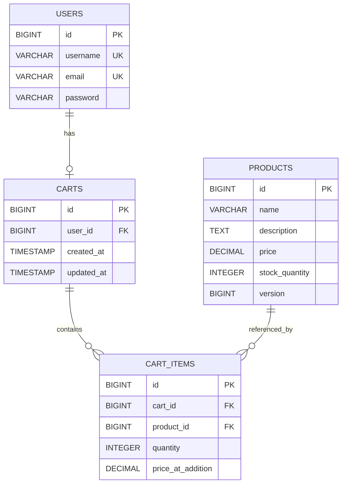
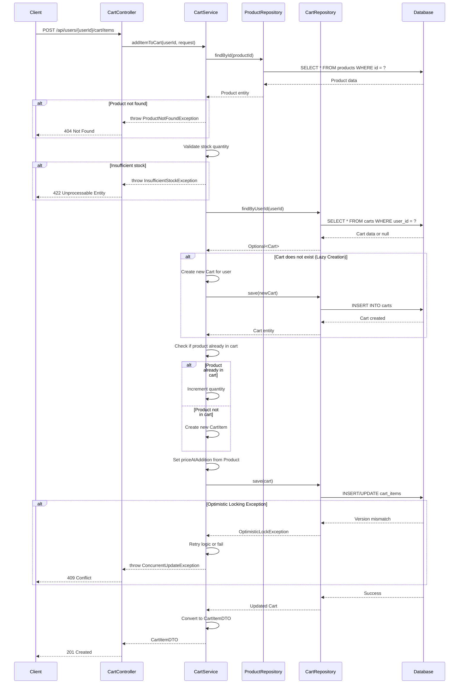

# Low Level Design: Shopping Cart System

## Executive Summary

This document provides a comprehensive backend engineering specification for a shopping cart system using Spring Boot MVC. The system enables users to manage products in their shopping carts with full CRUD operations, user management, and product catalog functionality.

## System Architecture

### Technology Stack
- **Framework**: Spring Boot 3.x
- **Architecture**: MVC (Model-View-Controller)
- **Database**: PostgreSQL
- **ORM**: Spring Data JPA / Hibernate
- **API Style**: RESTful
- **Build Tool**: Maven/Gradle

## Domain Entity Models

### 1. User Entity

```java
@Entity
@Table(name = "users")
public class User {
    @Id
    @GeneratedValue(strategy = GenerationType.IDENTITY)
    private Long id;
    
    @Column(nullable = false, unique = true)
    private String username;
    
    @Column(nullable = false, unique = true)
    private String email;
    
    @Column(nullable = false)
    private String password;
    
    @OneToOne(mappedBy = "user", cascade = CascadeType.ALL)
    private Cart cart;
    
    // Getters, setters, constructors
}
```

### 2. Product Entity

```java
@Entity
@Table(name = "products")
public class Product {
    @Id
    @GeneratedValue(strategy = GenerationType.IDENTITY)
    private Long id;
    
    @Column(nullable = false)
    private String name;
    
    @Column(length = 1000)
    private String description;
    
    @Column(nullable = false)
    private BigDecimal price;
    
    @Column(nullable = false)
    private Integer stockQuantity;
    
    @Version
    private Long version; // For optimistic locking
    
    // Getters, setters, constructors
}
```

### 3. Cart Entity

```java
@Entity
@Table(name = "carts")
public class Cart {
    @Id
    @GeneratedValue(strategy = GenerationType.IDENTITY)
    private Long id;
    
    @OneToOne
    @JoinColumn(name = "user_id", nullable = false, unique = true)
    private User user;
    
    @OneToMany(mappedBy = "cart", cascade = CascadeType.ALL, orphanRemoval = true)
    private List<CartItem> items = new ArrayList<>();
    
    @Column(nullable = false)
    private LocalDateTime createdAt;
    
    @Column(nullable = false)
    private LocalDateTime updatedAt;
    
    // Getters, setters, constructors
}
```

### 4. CartItem Entity

```java
@Entity
@Table(name = "cart_items")
public class CartItem {
    @Id
    @GeneratedValue(strategy = GenerationType.IDENTITY)
    private Long id;
    
    @ManyToOne
    @JoinColumn(name = "cart_id", nullable = false)
    private Cart cart;
    
    @ManyToOne
    @JoinColumn(name = "product_id", nullable = false)
    private Product product;
    
    @Column(nullable = false)
    private Integer quantity;
    
    @Column(nullable = false)
    private BigDecimal priceAtAddition;
    
    // Getters, setters, constructors
}
```

## REST API Contracts

### User Management APIs

#### 1. Create User
```
POST /api/users
Content-Type: application/json

Request Body:
{
    "username": "string",
    "email": "string",
    "password": "string"
}

Response: 201 Created
{
    "id": "long",
    "username": "string",
    "email": "string",
    "createdAt": "timestamp"
}
```

#### 2. Get User by ID
```
GET /api/users/{userId}

Response: 200 OK
{
    "id": "long",
    "username": "string",
    "email": "string",
    "createdAt": "timestamp"
}
```

#### 3. Update User
```
PUT /api/users/{userId}
Content-Type: application/json

Request Body:
{
    "username": "string",
    "email": "string"
}

Response: 200 OK
{
    "id": "long",
    "username": "string",
    "email": "string",
    "updatedAt": "timestamp"
}
```

#### 4. Delete User
```
DELETE /api/users/{userId}

Response: 204 No Content
```

### Product Catalog APIs

#### 5. Create Product
```
POST /api/products
Content-Type: application/json

Request Body:
{
    "name": "string",
    "description": "string",
    "price": "decimal",
    "stockQuantity": "integer"
}

Response: 201 Created
{
    "id": "long",
    "name": "string",
    "description": "string",
    "price": "decimal",
    "stockQuantity": "integer",
    "version": "long"
}
```

#### 6. Get All Products
```
GET /api/products?page={page}&size={size}

Response: 200 OK
{
    "content": [
        {
            "id": "long",
            "name": "string",
            "description": "string",
            "price": "decimal",
            "stockQuantity": "integer"
        }
    ],
    "totalPages": "integer",
    "totalElements": "long",
    "size": "integer",
    "number": "integer"
}
```

#### 7. Get Product by ID
```
GET /api/products/{productId}

Response: 200 OK
{
    "id": "long",
    "name": "string",
    "description": "string",
    "price": "decimal",
    "stockQuantity": "integer",
    "version": "long"
}
```

#### 8. Update Product
```
PUT /api/products/{productId}
Content-Type: application/json

Request Body:
{
    "name": "string",
    "description": "string",
    "price": "decimal",
    "stockQuantity": "integer",
    "version": "long"
}

Response: 200 OK
{
    "id": "long",
    "name": "string",
    "description": "string",
    "price": "decimal",
    "stockQuantity": "integer",
    "version": "long"
}
```

#### 9. Delete Product
```
DELETE /api/products/{productId}

Response: 204 No Content
```

### Cart Management APIs

#### 10. Get User Cart
```
GET /api/users/{userId}/cart

Response: 200 OK
{
    "id": "long",
    "userId": "long",
    "items": [
        {
            "id": "long",
            "productId": "long",
            "productName": "string",
            "quantity": "integer",
            "priceAtAddition": "decimal",
            "subtotal": "decimal"
        }
    ],
    "totalAmount": "decimal",
    "createdAt": "timestamp",
    "updatedAt": "timestamp"
}
```

#### 11. Add Item to Cart
```
POST /api/users/{userId}/cart/items
Content-Type: application/json

Request Body:
{
    "productId": "long",
    "quantity": "integer"
}

Response: 201 Created
{
    "id": "long",
    "productId": "long",
    "productName": "string",
    "quantity": "integer",
    "priceAtAddition": "decimal",
    "subtotal": "decimal"
}
```

#### 12. Update Cart Item Quantity
```
PUT /api/users/{userId}/cart/items/{itemId}
Content-Type: application/json

Request Body:
{
    "quantity": "integer"
}

Response: 200 OK
{
    "id": "long",
    "productId": "long",
    "productName": "string",
    "quantity": "integer",
    "priceAtAddition": "decimal",
    "subtotal": "decimal"
}
```

#### 13. Remove Item from Cart
```
DELETE /api/users/{userId}/cart/items/{itemId}

Response: 204 No Content
```

## Technical Artifacts

### 1. Entity-Relationship Diagram (ERD)



### 2. Add to Cart Sequence Diagram



### 3. Database Model (SQL DDL)

```sql
-- Shopping Cart System - PostgreSQL Database Schema

-- Drop tables if they exist
DROP TABLE IF EXISTS cart_items CASCADE;
DROP TABLE IF EXISTS carts CASCADE;
DROP TABLE IF EXISTS products CASCADE;
DROP TABLE IF EXISTS users CASCADE;

-- USERS Table
CREATE TABLE users (
    id BIGSERIAL PRIMARY KEY,
    username VARCHAR(50) NOT NULL UNIQUE,
    email VARCHAR(100) NOT NULL UNIQUE,
    password VARCHAR(255) NOT NULL,
    created_at TIMESTAMP NOT NULL DEFAULT CURRENT_TIMESTAMP,
    updated_at TIMESTAMP NOT NULL DEFAULT CURRENT_TIMESTAMP,
    
    CONSTRAINT chk_username_length CHECK (LENGTH(username) >= 3)
);

-- PRODUCTS Table
CREATE TABLE products (
    id BIGSERIAL PRIMARY KEY,
    name VARCHAR(200) NOT NULL,
    description TEXT,
    price DECIMAL(10, 2) NOT NULL,
    stock_quantity INTEGER NOT NULL,
    version BIGINT NOT NULL DEFAULT 0,
    created_at TIMESTAMP NOT NULL DEFAULT CURRENT_TIMESTAMP,
    updated_at TIMESTAMP NOT NULL DEFAULT CURRENT_TIMESTAMP,
    
    CONSTRAINT chk_price_positive CHECK (price > 0),
    CONSTRAINT chk_stock_non_negative CHECK (stock_quantity >= 0)
);

-- CARTS Table
CREATE TABLE carts (
    id BIGSERIAL PRIMARY KEY,
    user_id BIGINT NOT NULL UNIQUE,
    created_at TIMESTAMP NOT NULL DEFAULT CURRENT_TIMESTAMP,
    updated_at TIMESTAMP NOT NULL DEFAULT CURRENT_TIMESTAMP,
    
    CONSTRAINT fk_cart_user FOREIGN KEY (user_id) 
        REFERENCES users(id) 
        ON DELETE CASCADE
);

-- CART_ITEMS Table
CREATE TABLE cart_items (
    id BIGSERIAL PRIMARY KEY,
    cart_id BIGINT NOT NULL,
    product_id BIGINT NOT NULL,
    quantity INTEGER NOT NULL,
    price_at_addition DECIMAL(10, 2) NOT NULL,
    created_at TIMESTAMP NOT NULL DEFAULT CURRENT_TIMESTAMP,
    updated_at TIMESTAMP NOT NULL DEFAULT CURRENT_TIMESTAMP,
    
    CONSTRAINT fk_cart_item_cart FOREIGN KEY (cart_id) 
        REFERENCES carts(id) 
        ON DELETE CASCADE,
    CONSTRAINT fk_cart_item_product FOREIGN KEY (product_id) 
        REFERENCES products(id) 
        ON DELETE CASCADE,
    CONSTRAINT chk_quantity_positive CHECK (quantity > 0),
    CONSTRAINT uk_cart_product UNIQUE (cart_id, product_id)
);

-- Indexes for Performance
CREATE INDEX idx_users_username ON users(username);
CREATE INDEX idx_users_email ON users(email);
CREATE INDEX idx_carts_user_id ON carts(user_id);
CREATE INDEX idx_cart_items_cart_id ON cart_items(cart_id);
CREATE INDEX idx_cart_items_product_id ON cart_items(product_id);
```