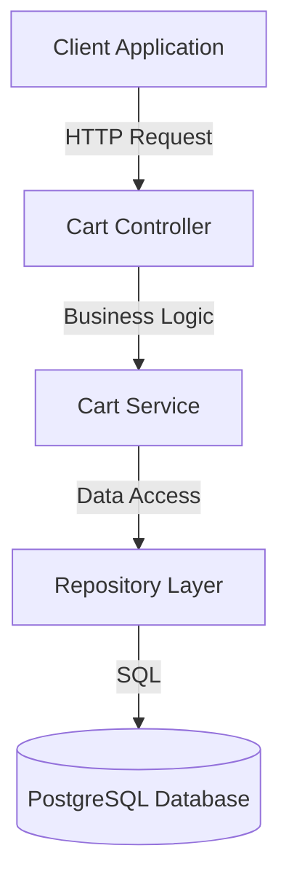
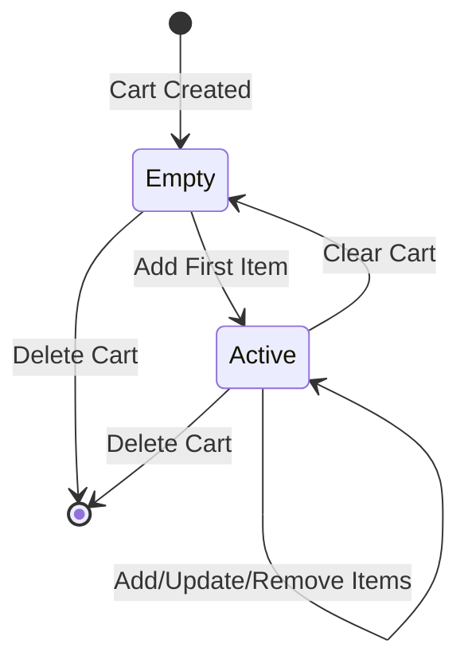
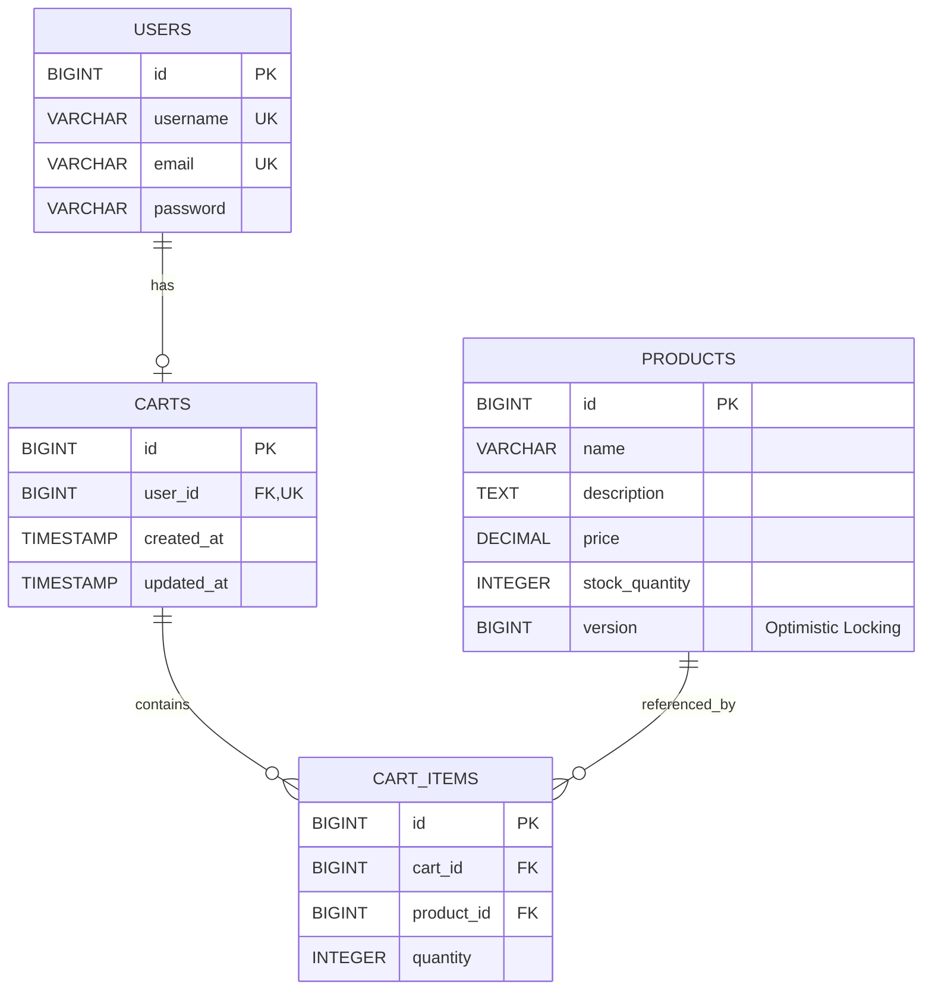
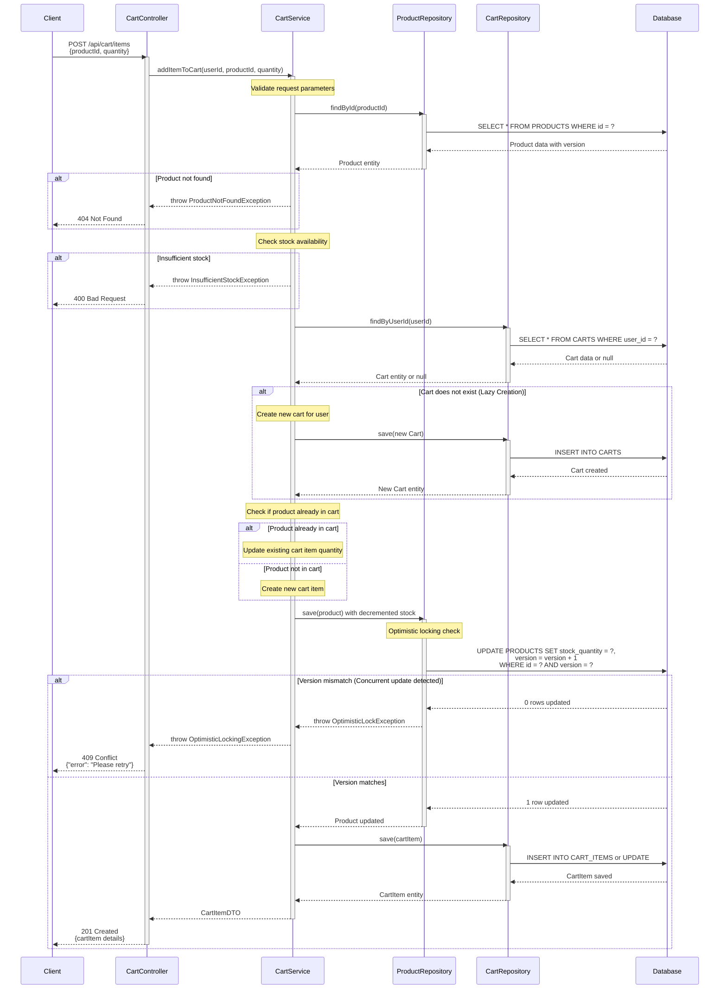

# Low Level Design (LLD) - Shopping Cart System

## Executive Summary

This document provides a comprehensive Low Level Design for a Shopping Cart System built using Spring Boot MVC architecture. The system enables users to manage shopping carts with product selection, quantity management, and cart operations.

## Functional Domain Breakdown

### 1. User Management Domain
- User registration and authentication
- User profile management
- User session handling

### 2. Product Management Domain
- Product catalog browsing
- Product details retrieval
- Product inventory management
- Optimistic locking for concurrent updates

### 3. Cart Management Domain
- Cart creation (lazy initialization)
- Add products to cart
- Update product quantities
- Remove products from cart
- View cart contents
- Clear cart

## Entity Specifications

### User Entity
```java
@Entity
@Table(name = "USERS")
public class User {
    @Id
    @GeneratedValue(strategy = GenerationType.IDENTITY)
    private Long id;
    
    @Column(nullable = false, unique = true)
    private String username;
    
    @Column(nullable = false, unique = true)
    private String email;
    
    @Column(nullable = false)
    private String password;
    
    @OneToOne(mappedBy = "user", cascade = CascadeType.ALL)
    private Cart cart;
    
    // Getters, setters, constructors
}
```

### Product Entity
```java
@Entity
@Table(name = "PRODUCTS")
public class Product {
    @Id
    @GeneratedValue(strategy = GenerationType.IDENTITY)
    private Long id;
    
    @Column(nullable = false)
    private String name;
    
    @Column(length = 1000)
    private String description;
    
    @Column(nullable = false)
    private BigDecimal price;
    
    @Column(nullable = false)
    private Integer stockQuantity;
    
    @Version
    private Long version; // For optimistic locking
    
    // Getters, setters, constructors
}
```

### Cart Entity
```java
@Entity
@Table(name = "CARTS")
public class Cart {
    @Id
    @GeneratedValue(strategy = GenerationType.IDENTITY)
    private Long id;
    
    @OneToOne
    @JoinColumn(name = "user_id", nullable = false, unique = true)
    private User user;
    
    @OneToMany(mappedBy = "cart", cascade = CascadeType.ALL, orphanRemoval = true)
    private List<CartItem> items = new ArrayList<>();
    
    @Column(nullable = false)
    private LocalDateTime createdAt;
    
    @Column(nullable = false)
    private LocalDateTime updatedAt;
    
    // Getters, setters, constructors
}
```

### CartItem Entity
```java
@Entity
@Table(name = "CART_ITEMS")
public class CartItem {
    @Id
    @GeneratedValue(strategy = GenerationType.IDENTITY)
    private Long id;
    
    @ManyToOne
    @JoinColumn(name = "cart_id", nullable = false)
    private Cart cart;
    
    @ManyToOne
    @JoinColumn(name = "product_id", nullable = false)
    private Product product;
    
    @Column(nullable = false)
    private Integer quantity;
    
    // Getters, setters, constructors
}
```

## REST API Contracts

### Cart Controller Endpoints

#### 1. Get Cart
```
GET /api/cart
Headers: Authorization: Bearer {token}

Response 200 OK:
{
    "id": 1,
    "userId": 123,
    "items": [
        {
            "id": 1,
            "productId": 456,
            "productName": "Product A",
            "price": 29.99,
            "quantity": 2,
            "subtotal": 59.98
        }
    ],
    "totalAmount": 59.98,
    "createdAt": "2024-01-15T10:30:00",
    "updatedAt": "2024-01-15T11:45:00"
}
```

#### 2. Add Item to Cart
```
POST /api/cart/items
Headers: Authorization: Bearer {token}
Content-Type: application/json

Request Body:
{
    "productId": 456,
    "quantity": 2
}

Response 201 Created:
{
    "id": 1,
    "productId": 456,
    "productName": "Product A",
    "price": 29.99,
    "quantity": 2,
    "subtotal": 59.98
}

Response 400 Bad Request:
{
    "error": "Insufficient stock",
    "message": "Only 1 items available in stock"
}

Response 409 Conflict:
{
    "error": "Optimistic locking failure",
    "message": "Product was updated by another transaction. Please retry."
}
```

#### 3. Update Cart Item Quantity
```
PUT /api/cart/items/{itemId}
Headers: Authorization: Bearer {token}
Content-Type: application/json

Request Body:
{
    "quantity": 3
}

Response 200 OK:
{
    "id": 1,
    "productId": 456,
    "productName": "Product A",
    "price": 29.99,
    "quantity": 3,
    "subtotal": 89.97
}
```

#### 4. Remove Item from Cart
```
DELETE /api/cart/items/{itemId}
Headers: Authorization: Bearer {token}

Response 204 No Content
```

#### 5. Clear Cart
```
DELETE /api/cart
Headers: Authorization: Bearer {token}

Response 204 No Content
```

## Validation Matrix

| Field | Validation Rules | Error Message |
|-------|-----------------|---------------|
| productId | Not null, Must exist in database | "Product not found" |
| quantity | Not null, Min: 1, Max: 999 | "Quantity must be between 1 and 999" |
| stockQuantity | Must be >= requested quantity | "Insufficient stock available" |
| price | Not null, Min: 0.01 | "Price must be greater than 0" |
| username | Not null, Length: 3-50, Unique | "Username must be 3-50 characters and unique" |
| email | Not null, Valid email format, Unique | "Valid email required and must be unique" |

## Service Layer Architecture

### CartService
```java
@Service
@Transactional
public class CartService {
    
    @Autowired
    private CartRepository cartRepository;
    
    @Autowired
    private ProductRepository productRepository;
    
    @Autowired
    private CartItemRepository cartItemRepository;
    
    public CartDTO getOrCreateCart(Long userId) {
        // Lazy cart creation logic
    }
    
    public CartItemDTO addItemToCart(Long userId, Long productId, Integer quantity) {
        // Add item with optimistic locking handling
    }
    
    public CartItemDTO updateCartItemQuantity(Long userId, Long itemId, Integer quantity) {
        // Update quantity logic
    }
    
    public void removeCartItem(Long userId, Long itemId) {
        // Remove item logic
    }
    
    public void clearCart(Long userId) {
        // Clear cart logic
    }
}
```

## Exception Handling Strategy

### Custom Exceptions
```java
public class ProductNotFoundException extends RuntimeException {}
public class InsufficientStockException extends RuntimeException {}
public class CartItemNotFoundException extends RuntimeException {}
public class OptimisticLockingException extends RuntimeException {}
```

### Global Exception Handler
```java
@RestControllerAdvice
public class GlobalExceptionHandler {
    
    @ExceptionHandler(ProductNotFoundException.class)
    public ResponseEntity<ErrorResponse> handleProductNotFound(ProductNotFoundException ex) {
        return ResponseEntity.status(HttpStatus.NOT_FOUND)
            .body(new ErrorResponse("Product not found", ex.getMessage()));
    }
    
    @ExceptionHandler(InsufficientStockException.class)
    public ResponseEntity<ErrorResponse> handleInsufficientStock(InsufficientStockException ex) {
        return ResponseEntity.status(HttpStatus.BAD_REQUEST)
            .body(new ErrorResponse("Insufficient stock", ex.getMessage()));
    }
    
    @ExceptionHandler(OptimisticLockException.class)
    public ResponseEntity<ErrorResponse> handleOptimisticLocking(OptimisticLockException ex) {
        return ResponseEntity.status(HttpStatus.CONFLICT)
            .body(new ErrorResponse("Optimistic locking failure", 
                "Product was updated by another transaction. Please retry."));
    }
}
```

## Existing Diagrams

### Component Architecture


### Cart State Machine


---

## ENHANCED TECHNICAL ARTIFACTS

### 1. Entity-Relationship Diagram (ERD)



**ERD Notes:**
- **USERS to CARTS**: One-to-One relationship (one user has at most one cart)
- **CARTS to CART_ITEMS**: One-to-Many relationship (one cart contains multiple items)
- **PRODUCTS to CART_ITEMS**: One-to-Many relationship (one product can be in multiple carts)
- **version column in PRODUCTS**: Used for optimistic locking to handle concurrent updates
- **Primary Keys (PK)**: Auto-generated identity columns
- **Foreign Keys (FK)**: Enforce referential integrity
- **Unique Keys (UK)**: Ensure data uniqueness (username, email, user_id in carts)

---

### 2. Add to Cart - Sequence Diagram



**Sequence Diagram Notes:**
- **Lazy Cart Creation**: Cart is created only when the first item is added
- **Optimistic Locking**: The version column in PRODUCTS table prevents lost updates in concurrent scenarios
- **Stock Validation**: Ensures sufficient inventory before adding to cart
- **Error Handling**: Multiple error scenarios handled with appropriate HTTP status codes
- **Transaction Boundary**: The entire operation is wrapped in a transaction (managed by @Transactional)

---

### 3. PostgreSQL DDL Scripts

```sql
-- ============================================
-- Shopping Cart System - Database Schema
-- Database: PostgreSQL 12+
-- ============================================

-- Drop tables if they exist (for clean setup)
DROP TABLE IF EXISTS CART_ITEMS CASCADE;
DROP TABLE IF EXISTS CARTS CASCADE;
DROP TABLE IF EXISTS PRODUCTS CASCADE;
DROP TABLE IF EXISTS USERS CASCADE;

-- ============================================
-- Table: USERS
-- Description: Stores user account information
-- ============================================
CREATE TABLE USERS (
    id BIGSERIAL PRIMARY KEY,
    username VARCHAR(50) NOT NULL UNIQUE,
    email VARCHAR(100) NOT NULL UNIQUE,
    password VARCHAR(255) NOT NULL,
    created_at TIMESTAMP NOT NULL DEFAULT CURRENT_TIMESTAMP,
    updated_at TIMESTAMP NOT NULL DEFAULT CURRENT_TIMESTAMP,
    
    CONSTRAINT chk_username_length CHECK (LENGTH(username) >= 3),
    CONSTRAINT chk_email_format CHECK (email ~* '^[A-Za-z0-9._%+-]+@[A-Za-z0-9.-]+\.[A-Za-z]{2,}$')
);

COMMENT ON TABLE USERS IS 'User accounts for the shopping cart system';
COMMENT ON COLUMN USERS.version IS 'Optimistic locking version field';

-- ============================================
-- Table: PRODUCTS
-- Description: Product catalog with inventory
-- ============================================
CREATE TABLE PRODUCTS (
    id BIGSERIAL PRIMARY KEY,
    name VARCHAR(255) NOT NULL,
    description TEXT,
    price DECIMAL(10, 2) NOT NULL,
    stock_quantity INTEGER NOT NULL DEFAULT 0,
    version BIGINT NOT NULL DEFAULT 0,
    created_at TIMESTAMP NOT NULL DEFAULT CURRENT_TIMESTAMP,
    updated_at TIMESTAMP NOT NULL DEFAULT CURRENT_TIMESTAMP,
    
    CONSTRAINT chk_price_positive CHECK (price > 0),
    CONSTRAINT chk_stock_non_negative CHECK (stock_quantity >= 0)
);

COMMENT ON TABLE PRODUCTS IS 'Product catalog with inventory management';
COMMENT ON COLUMN PRODUCTS.version IS 'Version field for optimistic locking to handle concurrent updates';
COMMENT ON COLUMN PRODUCTS.stock_quantity IS 'Available inventory quantity';

-- ============================================
-- Table: CARTS
-- Description: Shopping carts for users
-- ============================================
CREATE TABLE CARTS (
    id BIGSERIAL PRIMARY KEY,
    user_id BIGINT NOT NULL UNIQUE,
    created_at TIMESTAMP NOT NULL DEFAULT CURRENT_TIMESTAMP,
    updated_at TIMESTAMP NOT NULL DEFAULT CURRENT_TIMESTAMP,
    
    CONSTRAINT fk_cart_user FOREIGN KEY (user_id) 
        REFERENCES USERS(id) 
        ON DELETE CASCADE
        ON UPDATE CASCADE
);

COMMENT ON TABLE CARTS IS 'Shopping carts associated with users (one cart per user)';
COMMENT ON COLUMN CARTS.user_id IS 'Foreign key to USERS table with unique constraint (one-to-one relationship)';

-- ============================================
-- Table: CART_ITEMS
-- Description: Items within shopping carts
-- ============================================
CREATE TABLE CART_ITEMS (
    id BIGSERIAL PRIMARY KEY,
    cart_id BIGINT NOT NULL,
    product_id BIGINT NOT NULL,
    quantity INTEGER NOT NULL,
    added_at TIMESTAMP NOT NULL DEFAULT CURRENT_TIMESTAMP,
    
    CONSTRAINT fk_cartitem_cart FOREIGN KEY (cart_id) 
        REFERENCES CARTS(id) 
        ON DELETE CASCADE
        ON UPDATE CASCADE,
    
    CONSTRAINT fk_cartitem_product FOREIGN KEY (product_id) 
        REFERENCES PRODUCTS(id) 
        ON DELETE CASCADE
        ON UPDATE CASCADE,
    
    CONSTRAINT chk_quantity_positive CHECK (quantity > 0),
    CONSTRAINT uk_cart_product UNIQUE (cart_id, product_id)
);

COMMENT ON TABLE CART_ITEMS IS 'Line items in shopping carts linking carts to products';
COMMENT ON COLUMN CART_ITEMS.quantity IS 'Quantity of the product in the cart (must be greater than 0)';
COMMENT ON CONSTRAINT uk_cart_product ON CART_ITEMS IS 'Ensures a product appears only once per cart';

-- ============================================
-- INDEXES for Performance Optimization
-- ============================================

-- Index on USERS table
CREATE INDEX idx_users_email ON USERS(email);
CREATE INDEX idx_users_username ON USERS(username);

COMMENT ON INDEX idx_users_email IS 'Index for fast email lookup during authentication';
COMMENT ON INDEX idx_users_username IS 'Index for fast username lookup';

-- Index on PRODUCTS table
CREATE INDEX idx_products_name ON PRODUCTS(name);
CREATE INDEX idx_products_price ON PRODUCTS(price);

COMMENT ON INDEX idx_products_name IS 'Index for product search by name';
COMMENT ON INDEX idx_products_price IS 'Index for price-based filtering and sorting';

-- Index on CARTS table
CREATE INDEX idx_carts_user_id ON CARTS(user_id);

COMMENT ON INDEX idx_carts_user_id IS 'Index for fast cart lookup by user (frequently accessed FK)';

-- Indexes on CART_ITEMS table
CREATE INDEX idx_cartitems_cart_id ON CART_ITEMS(cart_id);
CREATE INDEX idx_cartitems_product_id ON CART_ITEMS(product_id);

COMMENT ON INDEX idx_cartitems_cart_id IS 'Index for fast retrieval of all items in a cart (frequently accessed FK)';
COMMENT ON INDEX idx_cartitems_product_id IS 'Index for fast lookup of carts containing a specific product (frequently accessed FK)';

-- ============================================
-- TRIGGERS for automatic timestamp updates
-- ============================================

-- Function to update the updated_at timestamp
CREATE OR REPLACE FUNCTION update_updated_at_column()
RETURNS TRIGGER AS $$
BEGIN
    NEW.updated_at = CURRENT_TIMESTAMP;
    RETURN NEW;
END;
$$ LANGUAGE plpgsql;

-- Trigger for USERS table
CREATE TRIGGER trg_users_updated_at
    BEFORE UPDATE ON USERS
    FOR EACH ROW
    EXECUTE FUNCTION update_updated_at_column();

-- Trigger for PRODUCTS table
CREATE TRIGGER trg_products_updated_at
    BEFORE UPDATE ON PRODUCTS
    FOR EACH ROW
    EXECUTE FUNCTION update_updated_at_column();

-- Trigger for CARTS table
CREATE TRIGGER trg_carts_updated_at
    BEFORE UPDATE ON CARTS
    FOR EACH ROW
    EXECUTE FUNCTION update_updated_at_column();

-- ============================================
-- SAMPLE DATA (Optional - for testing)
-- ============================================

-- Insert sample users
INSERT INTO USERS (username, email, password) VALUES
('john_doe', 'john.doe@example.com', '$2a$10$encrypted_password_hash_1'),
('jane_smith', 'jane.smith@example.com', '$2a$10$encrypted_password_hash_2'),
('bob_wilson', 'bob.wilson@example.com', '$2a$10$encrypted_password_hash_3');

-- Insert sample products
INSERT INTO PRODUCTS (name, description, price, stock_quantity) VALUES
('Laptop Pro 15', 'High-performance laptop with 16GB RAM', 1299.99, 50),
('Wireless Mouse', 'Ergonomic wireless mouse with USB receiver', 29.99, 200),
('USB-C Hub', '7-in-1 USB-C hub with HDMI and card reader', 49.99, 150),
('Mechanical Keyboard', 'RGB mechanical keyboard with blue switches', 89.99, 75),
('Monitor 27"', '4K UHD monitor with HDR support', 399.99, 30);

-- Insert sample carts (lazy creation would normally handle this)
INSERT INTO CARTS (user_id) VALUES
(1),
(2);

-- Insert sample cart items
INSERT INTO CART_ITEMS (cart_id, product_id, quantity) VALUES
(1, 1, 1),  -- John's cart: 1 Laptop
(1, 2, 2),  -- John's cart: 2 Wireless Mice
(2, 3, 1),  -- Jane's cart: 1 USB-C Hub
(2, 4, 1);  -- Jane's cart: 1 Mechanical Keyboard

-- ============================================
-- VERIFICATION QUERIES
-- ============================================

-- Verify table creation
SELECT table_name 
FROM information_schema.tables 
WHERE table_schema = 'public' 
AND table_type = 'BASE TABLE'
ORDER BY table_name;

-- Verify foreign key constraints
SELECT
    tc.table_name,
    tc.constraint_name,
    tc.constraint_type,
    kcu.column_name,
    ccu.table_name AS foreign_table_name,
    ccu.column_name AS foreign_column_name
FROM information_schema.table_constraints AS tc
JOIN information_schema.key_column_usage AS kcu
    ON tc.constraint_name = kcu.constraint_name
    AND tc.table_schema = kcu.table_schema
JOIN information_schema.constraint_column_usage AS ccu
    ON ccu.constraint_name = tc.constraint_name
    AND ccu.table_schema = tc.table_schema
WHERE tc.constraint_type = 'FOREIGN KEY'
ORDER BY tc.table_name, tc.constraint_name;

-- Verify indexes
SELECT
    tablename,
    indexname,
    indexdef
FROM pg_indexes
WHERE schemaname = 'public'
ORDER BY tablename, indexname;

-- ============================================
-- END OF DDL SCRIPT
-- ============================================
```

**DDL Script Highlights:**

1. **Table Constraints:**
   - `NOT NULL` constraints on critical fields (username, email, price, quantity)
   - `UNIQUE` constraints on username, email, and user_id in CARTS
   - `CHECK` constraints for data validation:
     - Quantities must be > 0
     - Prices must be > 0
     - Stock quantities must be >= 0
     - Username length >= 3
     - Email format validation

2. **Foreign Key Relationships:**
   - `ON DELETE CASCADE`: When a parent record is deleted, child records are automatically deleted
   - `ON UPDATE CASCADE`: When a parent key is updated, child foreign keys are automatically updated
   - Applied to:
     - CARTS.user_id → USERS.id
     - CART_ITEMS.cart_id → CARTS.id
     - CART_ITEMS.product_id → PRODUCTS.id

3. **Indexes for Performance:**
   - Indexes on frequently accessed foreign keys:
     - `idx_carts_user_id` on CARTS(user_id)
     - `idx_cartitems_cart_id` on CART_ITEMS(cart_id)
     - `idx_cartitems_product_id` on CART_ITEMS(product_id)
   - Additional indexes for search and filtering:
     - `idx_users_email` and `idx_users_username` for authentication
     - `idx_products_name` and `idx_products_price` for product queries

4. **Optimistic Locking:**
   - `version` column in PRODUCTS table (BIGINT, default 0)
   - Automatically incremented on each update
   - Used by JPA/Hibernate to detect concurrent modifications

5. **Automatic Timestamp Management:**
   - Triggers to automatically update `updated_at` columns
   - `created_at` defaults to CURRENT_TIMESTAMP

6. **Data Integrity:**
   - Unique constraint on (cart_id, product_id) in CART_ITEMS prevents duplicate products in same cart
   - Cascading deletes maintain referential integrity

---

## End of Enhanced Low Level Design Document

**Document Version:** 2.0  
**Last Updated:** 2024  
**Status:** Enhanced with Technical Artifacts