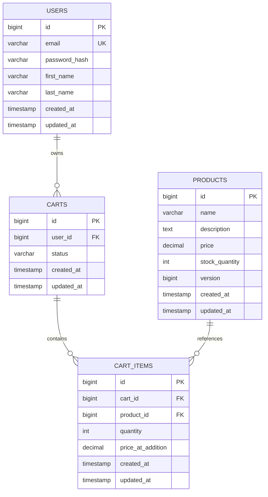
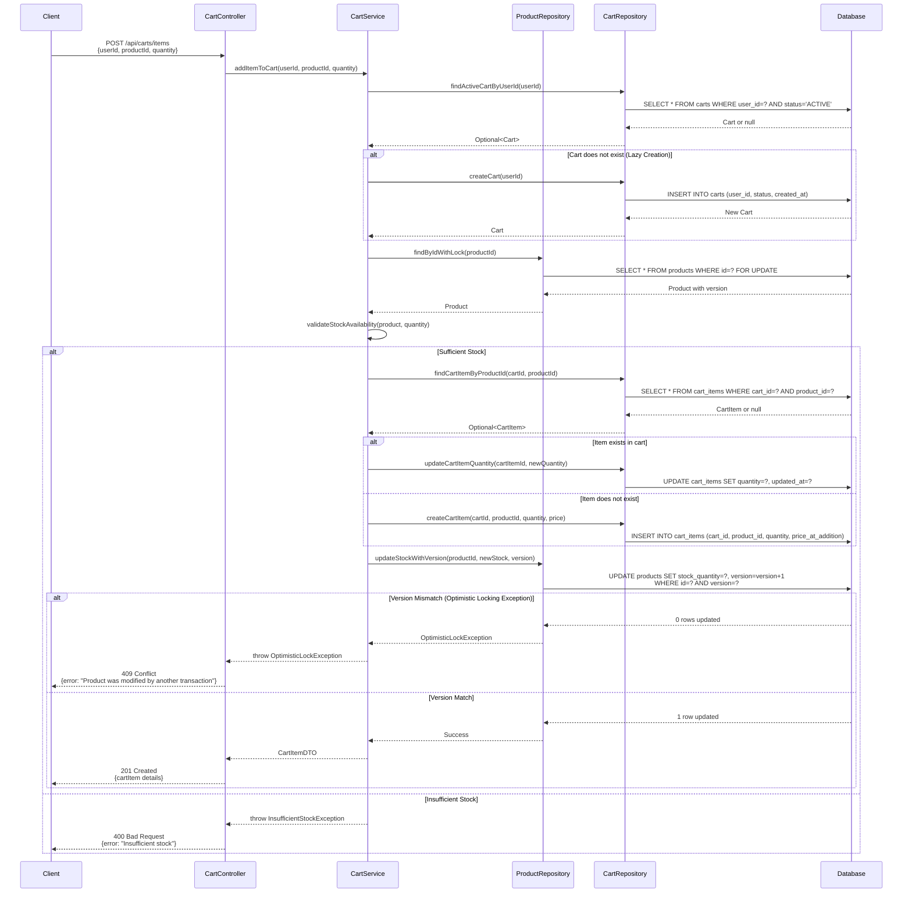

# COMPREHENSIVE BACKEND ENGINEERING SPECIFICATION PACKAGE
## Shopping Cart Backend Services - SCRUM-96

---

## EXECUTIVE SUMMARY

### Project Overview
This specification package provides a complete, production-ready blueprint for implementing core shopping cart backend services using Java Spring Boot MVC architecture. The system encompasses user management, product catalog search, and shopping cart operations with strict business rules and database-first validation.

### Key Highlights
- **Architecture**: Spring Boot MVC (Controller → Service → Repository)
- **Scope**: 3 functional domains, 11 REST APIs, 4 core entities
- **Validation Rules**: 15+ business rules with database-level enforcement
- **Cart Lifecycle**: Lazy creation, auto-deletion, session-independent
- **Authentication**: Stateless at database level

### Critical Business Rules
1. **Cart Lifecycle**: Carts are created lazily (on first add), auto-deleted when empty, and purged on logout
2. **Data Integrity**: Username uniqueness, foreign key constraints, quantity > 0 enforcement
3. **Session Independence**: No cart persistence across logout/login cycles
4. **Scope Boundaries**: Explicitly excludes checkout, payments, inventory locking, admin features, and user roles

## 8. Entity-Relationship Diagram

The following ERD illustrates the relationships between the core entities in the Shopping Cart Backend Services system:



## 9. Add to Cart Sequence Diagram



## 10. Database Model (SQL DDL)

```sql
-- ============================================
-- Shopping Cart Backend Services - Database Schema
-- Database: PostgreSQL 14+
-- ============================================

-- Drop tables if they exist (for clean setup)
DROP TABLE IF EXISTS cart_items CASCADE;
DROP TABLE IF EXISTS carts CASCADE;
DROP TABLE IF EXISTS products CASCADE;
DROP TABLE IF EXISTS users CASCADE;

-- ============================================
-- USERS Table
-- ============================================
CREATE TABLE users (
    id BIGSERIAL PRIMARY KEY,
    email VARCHAR(255) NOT NULL UNIQUE,
    password_hash VARCHAR(255) NOT NULL,
    first_name VARCHAR(100) NOT NULL,
    last_name VARCHAR(100) NOT NULL,
    created_at TIMESTAMP NOT NULL DEFAULT CURRENT_TIMESTAMP,
    updated_at TIMESTAMP NOT NULL DEFAULT CURRENT_TIMESTAMP,
    
    CONSTRAINT users_email_check CHECK (email ~* '^[A-Za-z0-9._%+-]+@[A-Za-z0-9.-]+\.[A-Z|a-z]{2,}$')
);

-- ============================================
-- PRODUCTS Table
-- ============================================
CREATE TABLE products (
    id BIGSERIAL PRIMARY KEY,
    name VARCHAR(255) NOT NULL,
    description TEXT,
    price DECIMAL(10, 2) NOT NULL,
    stock_quantity INTEGER NOT NULL DEFAULT 0,
    version BIGINT NOT NULL DEFAULT 0,
    created_at TIMESTAMP NOT NULL DEFAULT CURRENT_TIMESTAMP,
    updated_at TIMESTAMP NOT NULL DEFAULT CURRENT_TIMESTAMP,
    
    CONSTRAINT products_price_check CHECK (price >= 0),
    CONSTRAINT products_stock_check CHECK (stock_quantity >= 0)
);

-- ============================================
-- CARTS Table
-- ============================================
CREATE TABLE carts (
    id BIGSERIAL PRIMARY KEY,
    user_id BIGINT NOT NULL,
    status VARCHAR(20) NOT NULL DEFAULT 'ACTIVE',
    created_at TIMESTAMP NOT NULL DEFAULT CURRENT_TIMESTAMP,
    updated_at TIMESTAMP NOT NULL DEFAULT CURRENT_TIMESTAMP,
    
    CONSTRAINT carts_user_fk FOREIGN KEY (user_id) 
        REFERENCES users(id) ON DELETE CASCADE,
    CONSTRAINT carts_status_check CHECK (status IN ('ACTIVE', 'CHECKED_OUT', 'ABANDONED'))
);

-- ============================================
-- CART_ITEMS Table
-- ============================================
CREATE TABLE cart_items (
    id BIGSERIAL PRIMARY KEY,
    cart_id BIGINT NOT NULL,
    product_id BIGINT NOT NULL,
    quantity INTEGER NOT NULL,
    price_at_addition DECIMAL(10, 2) NOT NULL,
    created_at TIMESTAMP NOT NULL DEFAULT CURRENT_TIMESTAMP,
    updated_at TIMESTAMP NOT NULL DEFAULT CURRENT_TIMESTAMP,
    
    CONSTRAINT cart_items_cart_fk FOREIGN KEY (cart_id) 
        REFERENCES carts(id) ON DELETE CASCADE,
    CONSTRAINT cart_items_product_fk FOREIGN KEY (product_id) 
        REFERENCES products(id) ON DELETE CASCADE,
    CONSTRAINT cart_items_quantity_check CHECK (quantity > 0),
    CONSTRAINT cart_items_price_check CHECK (price_at_addition >= 0),
    CONSTRAINT cart_items_unique_product UNIQUE (cart_id, product_id)
);

-- ============================================
-- Indexes for Performance Optimization
-- ============================================

-- Users table indexes
CREATE INDEX idx_users_email ON users(email);

-- Products table indexes
CREATE INDEX idx_products_name ON products(name);
CREATE INDEX idx_products_stock ON products(stock_quantity);

-- Carts table indexes
CREATE INDEX idx_carts_user_id ON carts(user_id);
CREATE INDEX idx_carts_status ON carts(status);
CREATE INDEX idx_carts_user_status ON carts(user_id, status);

-- Cart Items table indexes
CREATE INDEX idx_cart_items_cart_id ON cart_items(cart_id);
CREATE INDEX idx_cart_items_product_id ON cart_items(product_id);
CREATE INDEX idx_cart_items_cart_product ON cart_items(cart_id, product_id);

-- ============================================
-- Triggers for Updated_At Timestamp
-- ============================================

-- Function to update updated_at timestamp
CREATE OR REPLACE FUNCTION update_updated_at_column()
RETURNS TRIGGER AS $$
BEGIN
    NEW.updated_at = CURRENT_TIMESTAMP;
    RETURN NEW;
END;
$$ LANGUAGE plpgsql;

-- Apply trigger to all tables
CREATE TRIGGER update_users_updated_at
    BEFORE UPDATE ON users
    FOR EACH ROW
    EXECUTE FUNCTION update_updated_at_column();

CREATE TRIGGER update_products_updated_at
    BEFORE UPDATE ON products
    FOR EACH ROW
    EXECUTE FUNCTION update_updated_at_column();

CREATE TRIGGER update_carts_updated_at
    BEFORE UPDATE ON carts
    FOR EACH ROW
    EXECUTE FUNCTION update_updated_at_column();

CREATE TRIGGER update_cart_items_updated_at
    BEFORE UPDATE ON cart_items
    FOR EACH ROW
    EXECUTE FUNCTION update_updated_at_column();

-- ============================================
-- Sample Data (Optional - for testing)
-- ============================================

-- Insert sample users
INSERT INTO users (email, password_hash, first_name, last_name) VALUES
('john.doe@example.com', '$2a$10$abcdefghijklmnopqrstuv', 'John', 'Doe'),
('jane.smith@example.com', '$2a$10$wxyzabcdefghijklmnopqr', 'Jane', 'Smith');

-- Insert sample products
INSERT INTO products (name, description, price, stock_quantity) VALUES
('Laptop', 'High-performance laptop with 16GB RAM', 1299.99, 50),
('Wireless Mouse', 'Ergonomic wireless mouse', 29.99, 200),
('USB-C Cable', 'Premium USB-C charging cable', 19.99, 500),
('Mechanical Keyboard', 'RGB mechanical gaming keyboard', 149.99, 75);

-- ============================================
-- Comments for Documentation
-- ============================================

COMMENT ON TABLE users IS 'Stores user account information';
COMMENT ON TABLE products IS 'Stores product catalog with stock and pricing';
COMMENT ON TABLE carts IS 'Stores shopping cart instances for users';
COMMENT ON TABLE cart_items IS 'Stores individual items within shopping carts';

COMMENT ON COLUMN products.version IS 'Optimistic locking version for concurrent update control';
COMMENT ON COLUMN cart_items.price_at_addition IS 'Captures product price at the time of adding to cart';
```