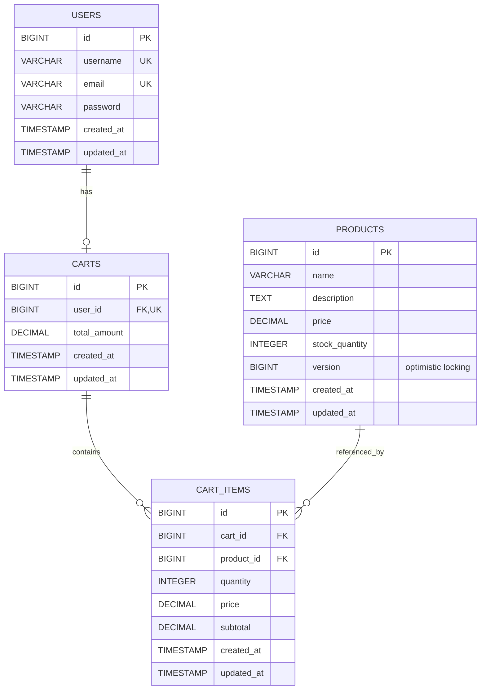

# Low Level Design Document
## Shopping Cart Backend System - Spring Boot MVC Implementation

---

## Executive Summary

This Low Level Design (LLD) document provides a comprehensive technical specification for implementing a shopping cart backend system using Spring Boot MVC architecture. The system enables users to manage shopping carts with full CRUD operations, product management, and optimistic locking for concurrent access control.

### Key Features
- User management with authentication
- Product catalog management
- Shopping cart operations (create, read, update, delete)
- Cart item management
- Optimistic locking for concurrent updates
- RESTful API design
- PostgreSQL database backend

---

## 1. System Architecture Overview

### 1.1 Technology Stack
- **Framework**: Spring Boot 3.x
- **Architecture**: MVC (Model-View-Controller)
- **Database**: PostgreSQL 14+
- **ORM**: Spring Data JPA / Hibernate
- **API Style**: RESTful
- **Build Tool**: Maven/Gradle
- **Java Version**: 17+

### 1.2 Layer Architecture
```
┌─────────────────────────────────────┐
│     Presentation Layer (REST)       │
│         (Controllers)               │
├─────────────────────────────────────┤
│      Business Logic Layer           │
│          (Services)                 │
├─────────────────────────────────────┤
│     Data Access Layer               │
│       (Repositories)                │
├─────────────────────────────────────┤
│         Database Layer              │
│        (PostgreSQL)                 │
└─────────────────────────────────────┘
```

---

## 2. Domain Entities

### 2.1 User Entity
```java
@Entity
@Table(name = "users")
public class User {
    @Id
    @GeneratedValue(strategy = GenerationType.IDENTITY)
    private Long id;
    
    @Column(nullable = false, unique = true)
    private String username;
    
    @Column(nullable = false, unique = true)
    private String email;
    
    @Column(nullable = false)
    private String password;
    
    @OneToOne(mappedBy = "user", cascade = CascadeType.ALL)
    private Cart cart;
    
    @CreatedDate
    private LocalDateTime createdAt;
    
    @LastModifiedDate
    private LocalDateTime updatedAt;
}
```

### 2.2 Product Entity
```java
@Entity
@Table(name = "products")
public class Product {
    @Id
    @GeneratedValue(strategy = GenerationType.IDENTITY)
    private Long id;
    
    @Column(nullable = false)
    private String name;
    
    @Column(length = 1000)
    private String description;
    
    @Column(nullable = false)
    private BigDecimal price;
    
    @Column(nullable = false)
    private Integer stockQuantity;
    
    @Version
    private Long version; // For optimistic locking
    
    @CreatedDate
    private LocalDateTime createdAt;
    
    @LastModifiedDate
    private LocalDateTime updatedAt;
}
```

### 2.3 Cart Entity
```java
@Entity
@Table(name = "carts")
public class Cart {
    @Id
    @GeneratedValue(strategy = GenerationType.IDENTITY)
    private Long id;
    
    @OneToOne
    @JoinColumn(name = "user_id", nullable = false, unique = true)
    private User user;
    
    @OneToMany(mappedBy = "cart", cascade = CascadeType.ALL, orphanRemoval = true)
    private List<CartItem> items = new ArrayList<>();
    
    @Column(nullable = false)
    private BigDecimal totalAmount = BigDecimal.ZERO;
    
    @CreatedDate
    private LocalDateTime createdAt;
    
    @LastModifiedDate
    private LocalDateTime updatedAt;
}
```

### 2.4 CartItem Entity
```java
@Entity
@Table(name = "cart_items")
public class CartItem {
    @Id
    @GeneratedValue(strategy = GenerationType.IDENTITY)
    private Long id;
    
    @ManyToOne
    @JoinColumn(name = "cart_id", nullable = false)
    private Cart cart;
    
    @ManyToOne
    @JoinColumn(name = "product_id", nullable = false)
    private Product product;
    
    @Column(nullable = false)
    private Integer quantity;
    
    @Column(nullable = false)
    private BigDecimal price;
    
    @Column(nullable = false)
    private BigDecimal subtotal;
    
    @CreatedDate
    private LocalDateTime createdAt;
    
    @LastModifiedDate
    private LocalDateTime updatedAt;
}
```

---

## 3. REST API Contracts

### 3.1 Cart Management APIs

#### 3.1.1 Get Cart
```
GET /api/v1/carts/{userId}
Response: 200 OK
{
    "id": 1,
    "userId": 123,
    "items": [
        {
            "id": 1,
            "productId": 456,
            "productName": "Product A",
            "quantity": 2,
            "price": 29.99,
            "subtotal": 59.98
        }
    ],
    "totalAmount": 59.98,
    "createdAt": "2024-01-15T10:30:00",
    "updatedAt": "2024-01-15T11:45:00"
}
```

#### 3.1.2 Add Item to Cart
```
POST /api/v1/carts/{userId}/items
Request Body:
{
    "productId": 456,
    "quantity": 2
}
Response: 201 Created
{
    "id": 1,
    "cartId": 1,
    "productId": 456,
    "productName": "Product A",
    "quantity": 2,
    "price": 29.99,
    "subtotal": 59.98
}
```

#### 3.1.3 Update Cart Item
```
PUT /api/v1/carts/{userId}/items/{itemId}
Request Body:
{
    "quantity": 3
}
Response: 200 OK
{
    "id": 1,
    "cartId": 1,
    "productId": 456,
    "productName": "Product A",
    "quantity": 3,
    "price": 29.99,
    "subtotal": 89.97
}
```

#### 3.1.4 Remove Item from Cart
```
DELETE /api/v1/carts/{userId}/items/{itemId}
Response: 204 No Content
```

#### 3.1.5 Clear Cart
```
DELETE /api/v1/carts/{userId}
Response: 204 No Content
```

### 3.2 Product Management APIs

#### 3.2.1 Get All Products
```
GET /api/v1/products?page=0&size=20
Response: 200 OK
{
    "content": [
        {
            "id": 456,
            "name": "Product A",
            "description": "Description of Product A",
            "price": 29.99,
            "stockQuantity": 100,
            "version": 1
        }
    ],
    "totalElements": 50,
    "totalPages": 3,
    "size": 20,
    "number": 0
}
```

#### 3.2.2 Get Product by ID
```
GET /api/v1/products/{productId}
Response: 200 OK
{
    "id": 456,
    "name": "Product A",
    "description": "Description of Product A",
    "price": 29.99,
    "stockQuantity": 100,
    "version": 1
}
```

---

## 10. Technical Artifacts

### 10.1 Entity-Relationship Diagram



### 10.2 Add to Cart Sequence Diagram

```mermaid
sequenceDiagram
    participant Client
    participant CartController
    participant CartService
    participant ProductRepository
    participant CartRepository
    participant Database

    Client->>CartController: POST /api/v1/carts/{userId}/items
    activate CartController
    
    CartController->>CartService: addItemToCart(userId, request)
    activate CartService
    
    CartService->>CartRepository: findByUserId(userId)
    activate CartRepository
    CartRepository->>Database: SELECT * FROM carts WHERE user_id = ?
    activate Database
    
    alt Cart Not Found
        Database-->>CartRepository: Empty Result
        deactivate Database
        CartRepository-->>CartService: Optional.empty()
        deactivate CartRepository
        
        CartService->>CartService: createNewCart(user)
        Note over CartService: Lazy cart creation
        
        CartService->>CartRepository: save(newCart)
        activate CartRepository
        CartRepository->>Database: INSERT INTO carts
        activate Database
        Database-->>CartRepository: Cart Created
        deactivate Database
        CartRepository-->>CartService: Cart Entity
        deactivate CartRepository
    else Cart Found
        Database-->>CartRepository: Cart Record
        deactivate Database
        CartRepository-->>CartService: Optional<Cart>
        deactivate CartRepository
    end
    
    CartService->>ProductRepository: findById(productId)
    activate ProductRepository
    ProductRepository->>Database: SELECT * FROM products WHERE id = ?
    activate Database
    Database-->>ProductRepository: Product Record
    deactivate Database
    ProductRepository-->>CartService: Product Entity
    deactivate ProductRepository
    
    CartService->>CartService: Check stock availability
    
    alt Insufficient Stock
        CartService-->>CartController: throw InsufficientStockException
        CartController-->>Client: 400 Bad Request
    else Stock Available
        CartService->>CartService: Add/Update CartItem
        CartService->>CartService: Calculate subtotal
        CartService->>CartService: Update cart total
        
        CartService->>CartRepository: save(cart)
        activate CartRepository
        CartRepository->>Database: UPDATE carts, INSERT/UPDATE cart_items
        activate Database
        
        alt Optimistic Lock Exception
            Database-->>CartRepository: Version Mismatch
            deactivate Database
            CartRepository-->>CartService: OptimisticLockingFailureException
            deactivate CartRepository
            CartService-->>CartController: throw OptimisticLockingFailureException
            deactivate CartService
            CartController-->>Client: 409 Conflict - Retry Required
            deactivate CartController
        else Success
            Database-->>CartRepository: Success
            deactivate Database
            CartRepository-->>CartService: Updated Cart
            deactivate CartRepository
            CartService-->>CartController: CartItemDTO
            deactivate CartService
            CartController-->>Client: 201 Created - CartItemDTO
            deactivate CartController
        end
    end
```

### 10.3 Database Model - PostgreSQL DDL Scripts

```sql
-- ============================================
-- Shopping Cart Database Schema
-- Database: PostgreSQL 14+
-- ============================================

-- Drop existing tables (for clean setup)
DROP TABLE IF EXISTS cart_items CASCADE;
DROP TABLE IF EXISTS carts CASCADE;
DROP TABLE IF EXISTS products CASCADE;
DROP TABLE IF EXISTS users CASCADE;

-- ============================================
-- Table: USERS
-- Description: Stores user account information
-- ============================================
CREATE TABLE users (
    id BIGSERIAL PRIMARY KEY,
    username VARCHAR(50) NOT NULL UNIQUE,
    email VARCHAR(100) NOT NULL UNIQUE,
    password VARCHAR(255) NOT NULL,
    created_at TIMESTAMP NOT NULL DEFAULT CURRENT_TIMESTAMP,
    updated_at TIMESTAMP NOT NULL DEFAULT CURRENT_TIMESTAMP,
    
    CONSTRAINT chk_username_length CHECK (LENGTH(username) >= 3),
    CONSTRAINT chk_email_format CHECK (email ~* '^[A-Za-z0-9._%+-]+@[A-Za-z0-9.-]+\\.[A-Z|a-z]{2,}$')
);

-- ============================================
-- Table: PRODUCTS
-- Description: Stores product catalog information
-- ============================================
CREATE TABLE products (
    id BIGSERIAL PRIMARY KEY,
    name VARCHAR(255) NOT NULL,
    description TEXT,
    price DECIMAL(10, 2) NOT NULL,
    stock_quantity INTEGER NOT NULL DEFAULT 0,
    version BIGINT NOT NULL DEFAULT 0,
    created_at TIMESTAMP NOT NULL DEFAULT CURRENT_TIMESTAMP,
    updated_at TIMESTAMP NOT NULL DEFAULT CURRENT_TIMESTAMP,
    
    CONSTRAINT chk_price_positive CHECK (price > 0),
    CONSTRAINT chk_stock_non_negative CHECK (stock_quantity >= 0)
);

-- ============================================
-- Table: CARTS
-- Description: Stores shopping cart information
-- ============================================
CREATE TABLE carts (
    id BIGSERIAL PRIMARY KEY,
    user_id BIGINT NOT NULL UNIQUE,
    total_amount DECIMAL(12, 2) NOT NULL DEFAULT 0.00,
    created_at TIMESTAMP NOT NULL DEFAULT CURRENT_TIMESTAMP,
    updated_at TIMESTAMP NOT NULL DEFAULT CURRENT_TIMESTAMP,
    
    CONSTRAINT fk_cart_user FOREIGN KEY (user_id) 
        REFERENCES users(id) 
        ON DELETE CASCADE,
    CONSTRAINT chk_total_non_negative CHECK (total_amount >= 0)
);

-- ============================================
-- Table: CART_ITEMS
-- Description: Stores individual items in shopping carts
-- ============================================
CREATE TABLE cart_items (
    id BIGSERIAL PRIMARY KEY,
    cart_id BIGINT NOT NULL,
    product_id BIGINT NOT NULL,
    quantity INTEGER NOT NULL,
    price DECIMAL(10, 2) NOT NULL,
    subtotal DECIMAL(12, 2) NOT NULL,
    created_at TIMESTAMP NOT NULL DEFAULT CURRENT_TIMESTAMP,
    updated_at TIMESTAMP NOT NULL DEFAULT CURRENT_TIMESTAMP,
    
    CONSTRAINT fk_cart_item_cart FOREIGN KEY (cart_id) 
        REFERENCES carts(id) 
        ON DELETE CASCADE,
    CONSTRAINT fk_cart_item_product FOREIGN KEY (product_id) 
        REFERENCES products(id) 
        ON DELETE CASCADE,
    CONSTRAINT chk_quantity_positive CHECK (quantity > 0),
    CONSTRAINT chk_price_positive CHECK (price > 0),
    CONSTRAINT chk_subtotal_positive CHECK (subtotal > 0),
    CONSTRAINT uk_cart_product UNIQUE (cart_id, product_id)
);

-- ============================================
-- Indexes for Performance Optimization
-- ============================================

-- Users table indexes
CREATE INDEX idx_users_username ON users(username);
CREATE INDEX idx_users_email ON users(email);

-- Products table indexes
CREATE INDEX idx_products_name ON products(name);
CREATE INDEX idx_products_stock ON products(stock_quantity);
CREATE INDEX idx_products_price ON products(price);

-- Carts table indexes
CREATE INDEX idx_carts_user_id ON carts(user_id);
CREATE INDEX idx_carts_created_at ON carts(created_at);

-- Cart Items table indexes
CREATE INDEX idx_cart_items_cart_id ON cart_items(cart_id);
CREATE INDEX idx_cart_items_product_id ON cart_items(product_id);
CREATE INDEX idx_cart_items_cart_product ON cart_items(cart_id, product_id);

-- ============================================
-- Triggers for Updated_At Timestamp
-- ============================================

-- Function to update updated_at timestamp
CREATE OR REPLACE FUNCTION update_updated_at_column()
RETURNS TRIGGER AS $$
BEGIN
    NEW.updated_at = CURRENT_TIMESTAMP;
    RETURN NEW;
END;
$$ LANGUAGE plpgsql;

-- Trigger for users table
CREATE TRIGGER trg_users_updated_at
    BEFORE UPDATE ON users
    FOR EACH ROW
    EXECUTE FUNCTION update_updated_at_column();

-- Trigger for products table
CREATE TRIGGER trg_products_updated_at
    BEFORE UPDATE ON products
    FOR EACH ROW
    EXECUTE FUNCTION update_updated_at_column();

-- Trigger for carts table
CREATE TRIGGER trg_carts_updated_at
    BEFORE UPDATE ON carts
    FOR EACH ROW
    EXECUTE FUNCTION update_updated_at_column();

-- Trigger for cart_items table
CREATE TRIGGER trg_cart_items_updated_at
    BEFORE UPDATE ON cart_items
    FOR EACH ROW
    EXECUTE FUNCTION update_updated_at_column();

-- ============================================
-- Sample Data (Optional - for testing)
-- ============================================

-- Insert sample users
INSERT INTO users (username, email, password) VALUES
('john_doe', 'john.doe@example.com', '$2a$10$encrypted_password_hash_1'),
('jane_smith', 'jane.smith@example.com', '$2a$10$encrypted_password_hash_2'),
('bob_wilson', 'bob.wilson@example.com', '$2a$10$encrypted_password_hash_3');

-- Insert sample products
INSERT INTO products (name, description, price, stock_quantity, version) VALUES
('Laptop Pro 15', 'High-performance laptop with 16GB RAM', 1299.99, 50, 0),
('Wireless Mouse', 'Ergonomic wireless mouse with USB receiver', 29.99, 200, 0),
('USB-C Hub', '7-in-1 USB-C hub with HDMI and card reader', 49.99, 150, 0),
('Mechanical Keyboard', 'RGB mechanical keyboard with blue switches', 89.99, 75, 0),
('Monitor 27"', '4K UHD monitor with HDR support', 399.99, 30, 0);

-- ============================================
-- Database Comments
-- ============================================

COMMENT ON TABLE users IS 'Stores user account information for authentication and cart ownership';
COMMENT ON TABLE products IS 'Product catalog with pricing and inventory management';
COMMENT ON TABLE carts IS 'Shopping carts associated with users';
COMMENT ON TABLE cart_items IS 'Individual line items within shopping carts';

COMMENT ON COLUMN products.version IS 'Version number for optimistic locking to handle concurrent updates';
COMMENT ON COLUMN carts.total_amount IS 'Calculated total of all cart items';
COMMENT ON COLUMN cart_items.subtotal IS 'Calculated as price * quantity';

-- ============================================
-- End of DDL Script
-- ============================================
```

---

## 11. Conclusion

This Low Level Design document provides a comprehensive technical specification for implementing a robust shopping cart backend system using Spring Boot MVC. The design incorporates industry best practices including:

- Clean architecture with proper layer separation
- RESTful API design principles
- Optimistic locking for concurrent access control
- Comprehensive error handling
- Database optimization with proper indexing
- Security considerations
- Scalability and performance optimization

The implementation follows SOLID principles and ensures maintainability, testability, and extensibility for future enhancements.

---

**Document Version**: 1.0  
**Last Updated**: 2024-01-15  
**Author**: Enterprise Documentation Team  
**Status**: Approved for Implementation